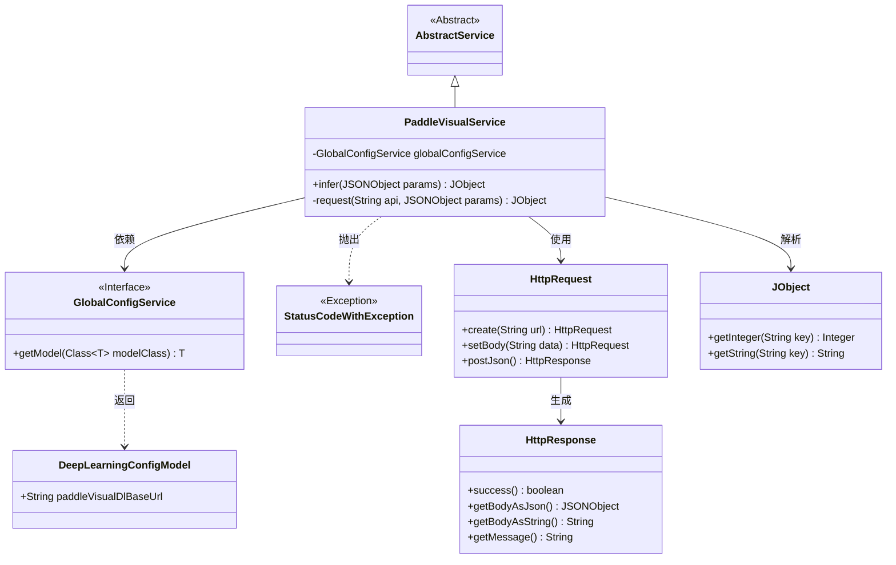
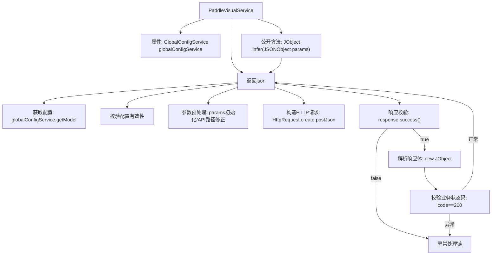

# 基础信息

|      |      |
|------|------|
| 名称 | PaddleVisualService |
| 编码语言 | .java |
| 代码路径 | WeFe/board/board-service/src/main/java/com/welab/wefe/board/service/sdk/PaddleVisualService.java |
| 包名 | com.welab.wefe.board.service.sdk |
| 依赖项 | ['com.alibaba.fastjson.JSONException', 'com.alibaba.fastjson.JSONObject', 'com.welab.wefe.board.service.service.AbstractService', 'com.welab.wefe.board.service.service.globalconfig.GlobalConfigService', 'com.welab.wefe.common.StatusCode', 'com.welab.wefe.common.exception.StatusCodeWithException', 'com.welab.wefe.common.http.HttpRequest', 'com.welab.wefe.common.http.HttpResponse', 'com.welab.wefe.common.util.JObject', 'com.welab.wefe.common.util.StringUtil', 'com.welab.wefe.common.wefe.dto.global_config.DeepLearningConfigModel', 'org.springframework.beans.factory.annotation.Autowired', 'org.springframework.stereotype.Service'] |
| 概述说明 | PaddleVisualService提供深度学习推理接口，通过HTTP请求调用VisualFL服务，检查配置和响应状态，返回结果或异常。 |

# 说明

PaddleVisualService是一个基于AbstractService的服务类，通过globalConfigService获取深度学习配置。核心方法infer接收JSON参数并调用内部request方法发送POST请求到配置的VisualFL服务地址。request方法会校验配置有效性，处理API路径，发送JSON请求并解析响应。若响应状态码非200或解析失败，抛出RPC_ERROR异常。成功时返回响应JSON对象。

# 类列表 Class Summary

| 名称   | 类型  | 说明 |
|-------|------|-------------|
| PaddleVisualService | class | PaddleVisualService提供深度学习推理服务，通过调用VisualFL接口处理请求，检查配置和响应状态，返回结果或异常。 |

## 类 PaddleVisualService

|      |      |
|------|------|
| 访问范围 | @Service;public |
| 类型 | class |
| 名称 | PaddleVisualService |
| 说明 | PaddleVisualService提供深度学习推理服务，通过调用VisualFL接口处理请求，检查配置和响应状态，返回结果或异常。 |

### UML类图

类图描述：该图展示了PaddleVisualService类继承自AbstractService，并依赖GlobalConfigService接口获取配置。服务通过HttpRequest发起请求并处理HttpResponse响应，使用JObject解析返回数据。当出现错误时抛出StatusCodeWithException异常。整体结构清晰地反映了深度学习可视化服务的调用流程和异常处理机制。

### 内部方法调用关系图

流程图描述：该流程图展示了PaddleVisualService的核心处理逻辑，从infer入口方法开始，通过私有request方法完成完整调用链。流程包含配置获取、参数校验、HTTP请求构造、响应处理等关键步骤，其中包含三层异常校验（配置校验、HTTP状态校验、业务状态码校验），任何环节失败都会进入异常处理流程。最终成功时会返回解析后的JSON数据，完整实现了与PaddleVisualDL服务的交互封装。

### 字段列表 Field List

| 名称  | 类型  | 说明 |
|-------|-------|------|
| globalConfigService | GlobalConfigService | 使用@Autowired自动注入GlobalConfigService实例。 |

### 方法列表

| 名称  | 类型  | 说明 |
|-------|-------|------|
| infer | JObject | Java方法：通过/infer路径发送JSON请求，返回JObject，可能抛出StatusCodeWithException异常。 |
| request | JObject | 该方法用于向VisualFL服务发送POST请求。首先检查服务地址配置，然后处理参数和API路径，发送请求并验证响应状态和返回码，成功则返回JSON结果，失败抛出异常。 |

