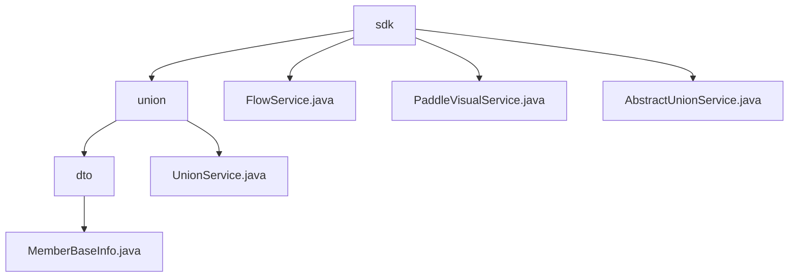

# 基础信息

|      |      |
|------|------|
| 名称 | sdk |
| 编码语言 | .java |
| 代码路径 | WeFe/board/board-service/src/main/java/com/welab/wefe/board/service/sdk |
| 包名 | docs.board.board-service.src.main.java.com.welab.wefe.board.service.sdk |
| 概述说明 | 管理成员基础信息与联盟数据服务，包含MemberBaseInfo数据结构和UnionService服务类。支持成员状态管理、数据资源共享、权限检查及异步缓存。依赖Java库及缓存框架。 |

# 说明

## 概述  
该模块是面向联盟协作的数据服务中枢，核心职责包括成员生命周期管理（如状态标记/实名认证）和跨机构数据资源共享（类似数据中台模式）。关键服务类UnionService和FlowService分别处理联盟API集成与流程控制，均继承自抽象服务基类。数据结构涵盖MemberBaseInfo（成员ID/状态标记）和CA证书（序列号/PEM格式），采用混合交互模式：同步权限校验与异步缓存更新（例如ExpiringMap缓存）。外部依赖包括Java基础库、HTTP客户端及可能的VisualFL深度学习服务。

## 主要业务场景  
典型应用包含三类场景：1)成员状态管理（例如通过hidden标记控制可见性），2)联盟数据操作（如异步更新TableDataSet或获取CA证书），3)服务健康监测（例如FlowService的alive检测）。交互采用分层模式：基础服务（如PaddleVisualService）处理原始请求，上层服务（如UnionService）实现业务逻辑链，类似网关代理模式。完整功能链体现在全流程权限校验与错误处理，例如文件上传时自动验证签名。集成案例覆盖多元数据类型（ImageDataSet/JObject）和跨协议通信（HTTP/RPC）。

### 包内部结构视图

该流程图展示了WeFe项目中board-service模块下sdk目录的层级结构。根节点sdk包含union子目录和三个服务类文件，union目录下又包含dto子目录和UnionService服务类，而dto目录则包含MemberBaseInfo数据传输对象文件。整体结构清晰地呈现了服务模块中SDK组件的组织方式。

# 文件列表

| 名称   | 类型  | 说明 |
|-------|------|-------------|
| [FlowService.java](FlowService.md) | file | FlowService提供检查服务可用性和存活状态的方法，通过内网地址调用API并处理响应，若配置缺失或请求失败则抛出异常。 |
| [PaddleVisualService.java](PaddleVisualService.md) | file | PaddleVisualService提供深度学习推理接口，通过HTTP请求调用VisualFL服务，检查配置和响应状态，返回结果或异常。 |
| [AbstractUnionService.java](AbstractUnionService.md) | file | AbstractUnionService是一个抽象类，提供成员信息管理功能，包括初始化系统、上传信息、重置公钥、分页查询等。使用缓存优化查询性能，支持RSA签名和文件上传，通过HTTP请求与Union API交互。 |
| [union](union/_module.md) | package | MemberBaseInfo类存储成员ID、姓名、隐藏、失联、冻结状态。UnionService类提供成员映射、数据资源操作和CA证书查询功能，支持多种数据类型和异步处理。 |

