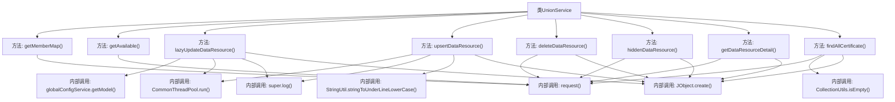

# 基础信息

|      |      |
|------|------|
| 名称 | UnionService |
| 编码语言 | .java |
| 代码路径 | WeFe/board/board-service/src/main/java/com/welab/wefe/board/service/sdk/union/UnionService.java |
| 包名 | com.welab.wefe.board.service.sdk.union |
| 依赖项 | ['com.alibaba.fastjson.JSONArray', 'com.alibaba.fastjson.JSONObject', 'com.welab.wefe.board.service.cache.CaCertificateCache', 'com.welab.wefe.board.service.database.entity.data_resource.DataResourceMysqlModel', 'com.welab.wefe.board.service.dto.entity.data_resource.output.BloomFilterOutputModel', 'com.welab.wefe.board.service.dto.entity.data_resource.output.ImageDataSetOutputModel', 'com.welab.wefe.board.service.dto.entity.data_resource.output.TableDataSetOutputModel', 'com.welab.wefe.board.service.sdk.AbstractUnionService', 'com.welab.wefe.board.service.sdk.union.dto.MemberBaseInfo', 'com.welab.wefe.common.CommonThreadPool', 'com.welab.wefe.common.exception.StatusCodeWithException', 'com.welab.wefe.common.util.JObject', 'com.welab.wefe.common.util.StringUtil', 'com.welab.wefe.common.wefe.checkpoint.dto.ServiceAvailableCheckOutput', 'com.welab.wefe.common.wefe.dto.global_config.MemberInfoModel', 'com.welab.wefe.common.wefe.enums.DataResourcePublicLevel', 'com.welab.wefe.common.wefe.enums.DataResourceType', 'org.apache.commons.collections4.CollectionUtils', 'org.springframework.stereotype.Service', 'java.util.ArrayList', 'java.util.LinkedHashMap', 'java.util.List'] |
| 概述说明 | UnionService提供成员信息获取、服务可用性检查、数据资源延迟更新、增删改查及证书查询功能。支持缓存和异步处理，包含权限校验和错误处理。 |

# 说明

UnionService类继承自AbstractUnionService，提供多种与成员和数据资源相关的服务功能。主要方法包括获取成员映射信息、检查服务可用性、延迟更新数据资源、增删改查数据资源、获取数据资源详情以及查询所有CA证书。其中数据资源操作涉及权限检查、异步处理和缓存机制，支持多种数据类型如ImageDataSet、TableDataSet和BloomFilter。CA证书查询功能可获取序列号、主题名称和证书内容等信息。

# 类列表 Class Summary

| 名称   | 类型  | 说明 |
|-------|------|-------------|
| UnionService | class | UnionService提供成员信息获取、服务可用性检查、数据资源延迟更新、增删改查及证书查询功能。包含缓存机制和权限校验。 |


## 类 UnionService

|      |      |
|------|------|
| 访问范围 | @Service;public |
| 类型 | class |
| 名称 | UnionService |
| 说明 | UnionService提供成员信息获取、服务可用性检查、数据资源延迟更新、增删改查及证书查询功能。包含缓存机制和权限校验。 |


### UML类图

```mermaid
classDiagram
    class AbstractUnionService {
        <<abstract>>
        +log(StatusCodeWithException e) void
    }

    class UnionService {
        -CACHE_MAP : Map~String, Object~
        +getMemberMap() LinkedHashMap~String, MemberBaseInfo~
        +getAvailable() ServiceAvailableCheckOutput
        +lazyUpdateDataResource(DataResourceMysqlModel model) void
        +upsertDataResource(DataResourceMysqlModel model) void
        +deleteDataResource(DataResourceMysqlModel model) void
        +hiddenDataResource(DataResourceMysqlModel model) void
        +getDataResourceDetail~OUT~(String dataResourceId, Class~OUT~ outputClass) OUT
        +getDataResourceDetail~OUT~(String dataResourceId, DataResourceType dataResourceType, Class~OUT~ outputClass) OUT
        +findAllCertificate() List~CaCertificateCache.CaCertificate~
    }

    class MemberBaseInfo {
        // 成员基础信息类
    }

    class ServiceAvailableCheckOutput {
        // 服务可用性检查输出类
    }

    class DataResourceMysqlModel {
        -id : String
        -publicLevel : DataResourcePublicLevel
        -dataResourceType : DataResourceType
        +getId() String
        +getPublicLevel() DataResourcePublicLevel
        +getDataResourceType() DataResourceType
    }

    class MemberInfoModel {
        -memberAllowPublicDataSet : Boolean
        -memberHidden : Boolean
        +getMemberAllowPublicDataSet() Boolean
        +getMemberHidden() Boolean
    }

    class DataResourcePublicLevel {
        <<enumeration>>
        OnlyMyself
        // 其他枚举值...
    }

    class DataResourceType {
        <<enumeration>>
        ImageDataSet
        TableDataSet
        BloomFilter
        // 其他枚举值...
    }

    class JObject {
        +create() JObject
        +create(Object obj) JObject
        +append(String key, Object value) JObject
        +put(String key, Object value) JObject
        +getStringByPath(String path) String
    }

    class CommonThreadPool {
        <<utility>>
        +run(Runnable task) void
    }

    class CaCertificateCache {
        class CaCertificate {
            -id : String
            -name : String
            -content : String
            +setId(String id) void
            +setName(String name) void
            +setContent(String content) void
        }
    }

    UnionService --|> AbstractUnionService : 继承
    UnionService --> MemberBaseInfo : 使用
    UnionService --> ServiceAvailableCheckOutput : 使用
    UnionService --> DataResourceMysqlModel : 使用
    UnionService --> MemberInfoModel : 使用
    UnionService --> DataResourcePublicLevel : 使用
    UnionService --> DataResourceType : 使用
    UnionService --> JObject : 使用
    UnionService --> CommonThreadPool : 使用
    UnionService --> CaCertificateCache : 使用
```

这段代码展示了一个名为UnionService的服务类，它继承自AbstractUnionService，提供了多种与成员管理、数据资源操作相关的功能。该类主要处理成员信息获取、服务可用性检查、数据资源的增删改查等操作，使用了线程池异步处理耗时任务，并通过缓存机制优化性能。代码中涉及多个模型类和枚举类型，如MemberBaseInfo、DataResourceMysqlModel等，展现了复杂的业务逻辑处理能力。


### 内部方法调用关系图



这段代码是UnionService类的实现，主要提供成员信息获取、服务可用性检查、数据资源操作和证书查询等功能。通过流程图可以看到，该类包含8个主要方法，核心逻辑都依赖于request()方法进行远程调用，并涉及线程池异步处理、全局配置获取、异常日志记录等辅助操作。数据资源相关方法会构造JObject参数对象，部分方法实现了缓存机制和类型转换功能。整体设计采用服务层模式，继承自AbstractUnionService基类。

### 字段列表 Field List

| 名称  | 类型  | 说明 |
|-------|-------|------|

### 方法列表

| 名称  | 类型  | 说明 |
|-------|-------|------|
| lazyUpdateDataResource | void | 方法懒更新数据资源，检查成员权限后异步调用更新接口。若成员无权限或隐藏则直接返回。更新时传递模型参数及ID，异常记录日志。 |
| getMemberMap | LinkedHashMap<String, MemberBaseInfo> | 获取成员映射表：通过请求接口获取成员数据，解析为JSON并转换为LinkedHashMap，键为成员ID，值为MemberBaseInfo对象。异常时抛出StatusCodeWithException。 |
| getDataResourceDetail | OUT | 方法通过缓存获取数据资源详情，若无缓存则请求接口，处理返回数据后存入缓存并返回指定类型对象。参数包括资源ID、类型和输出类，可能抛出异常。 |
| getDataResourceDetail | OUT | 该方法根据输出类类型确定数据资源类型，并调用内部方法获取资源详情。支持图像数据集、表格数据集和布隆过滤器三种类型。 |
| getAvailable | ServiceAvailableCheckOutput | 检查服务可用性，返回JSON结果并转换为指定类对象。若失败抛出异常。 |
| hiddenDataResource | void | 隐藏数据资源方法：接收DataResourceMysqlModel对象，构建包含data_resource_id的JSON参数，调用data_resource/hidden接口。可能抛出StatusCodeWithException异常。 |
| deleteDataResource | void | 删除数据资源方法，接收DataResourceMysqlModel参数，构造包含资源ID的请求参数，调用删除接口。异常时抛出StatusCodeWithException。 |
| findAllCertificate | List<CaCertificateCache.CaCertificate> | 该方法查询所有CA证书，解析返回数据并构建证书列表返回。若数据为空则返回空列表。 |
| upsertDataResource | void | 方法upsertDataResource处理数据资源更新插入。检查全局配置，若禁止公开则终止。异步处理：私有数据调用hiddenDataResource移除，否则提交数据到指定接口。异常记录日志。 |


