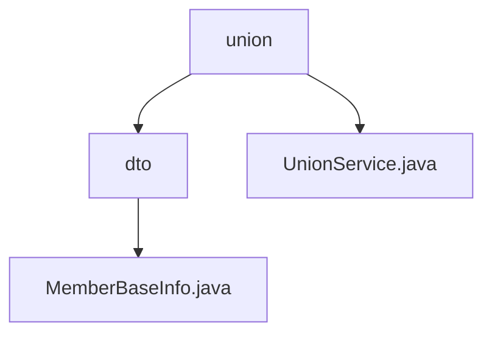

# 基础信息

|      |      |
|------|------|
| 名称 | union |
| 编码语言 | .java |
| 代码路径 | WeFe/board/board-service/src/main/java/com/welab/wefe/board/service/sdk/union |
| 包名 | docs.board.board-service.src.main.java.com.welab.wefe.board.service.sdk.union |
| 概述说明 | MemberBaseInfo类存储成员ID、姓名、隐藏、失联、冻结状态。UnionService类提供成员映射、数据资源操作和CA证书查询功能，支持多种数据类型和异步处理。 |

# 说明

## 概述  
该模块核心职责是管理成员基础信息与提供联盟数据服务，包含MemberBaseInfo数据结构和UnionService服务类。MemberBaseInfo类公开存储成员ID、姓名及状态标记（如隐藏/失联），类似简易DTO模式。UnionService继承AbstractUnionService，提供成员映射查询、数据资源CRUD及CA证书管理功能，采用权限检查与异步缓存机制，支持ImageDataSet等多元数据类型。关键数据结构包括MemberBaseInfo和CA证书（含序列号/主题名称）。外部依赖涉及Java基础库及可能的缓存框架。

## 主要业务场景  
典型场景包括成员状态管理（例如通过hidden标记控制可见性）和联盟数据资源共享（例如异步更新TableDataSet）。服务交互采用混合模式：同步查询成员映射，异步处理资源变更，类似事件总线模式。功能完整性体现在全链路数据操作，例如增删改查资源时自动触发权限校验。集成案例涵盖CA证书获取（返回PEM格式内容）及多类型数据资源检索，适用于跨机构数据协作场景。

### 包内部结构视图

该流程图展示了WeFe项目中board-service模块下union包的层级结构。顶层是union目录，包含UnionService.java文件和dto子目录。dto目录下包含MemberBaseInfo.java文件。整个结构清晰地反映了Java包的组织方式，其中服务类与数据传输对象被合理分层。

# 文件列表

| 名称   | 类型  | 说明 |
|-------|------|-------------|
| [UnionService.java](UnionService.md) | file | UnionService提供成员信息获取、服务可用性检查、数据资源延迟更新、增删改查及证书查询功能。支持缓存和异步处理，包含权限校验和错误处理。 |
| [dto](dto/_module.md) | package | MemberBaseInfo类包含成员ID、姓名及三个状态标识：隐藏、失联和冻结。 |

