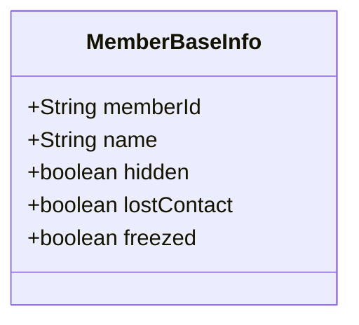
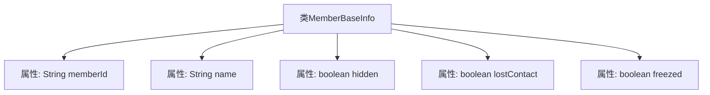

# 基础信息

|      |      |
|------|------|
| 名称 | MemberBaseInfo |
| 编码语言 | .java |
| 代码路径 | WeFe/board/board-service/src/main/java/com/welab/wefe/board/service/sdk/union/dto/MemberBaseInfo.java |
| 包名 | com.welab.wefe.board.service.sdk.union.dto |
| 依赖项 | [] |
| 概述说明 | MemberBaseInfo类包含成员ID、姓名及三个状态标识：隐藏、失联和冻结。 |

# 说明

该内容定义了一个名为MemberBaseInfo的公开类，用于存储成员基本信息。类中包含五个成员变量：memberId（字符串类型，表示成员ID）、name（字符串类型，表示成员姓名）、hidden（布尔类型，表示是否隐藏）、lostContact（布尔类型，表示是否失联）、freezed（布尔类型，表示是否冻结）。这些变量均为公开可访问，未进行封装。

# 类列表 Class Summary

| 名称   | 类型  | 说明 |
|-------|------|-------------|
| MemberBaseInfo | class | 成员基础信息类，包含成员ID、姓名及隐藏、失联、冻结三个状态标识。 |

## 类 MemberBaseInfo

|      |      |
|------|------|
| 访问范围 | public |
| 类型 | class |
| 名称 | MemberBaseInfo |
| 说明 | 成员基础信息类，包含成员ID、姓名及隐藏、失联、冻结三个状态标识。 |

### UML类图

这段代码定义了一个名为`MemberBaseInfo`的类，用于存储成员的基本信息。该类包含五个公有字段：`memberId`（成员ID）、`name`（姓名）、`hidden`（是否隐藏）、`lostContact`（是否失联）和`freezed`（是否冻结）。这些字段均为公开属性，可直接访问和修改。该类没有定义任何方法，仅作为数据载体使用，适用于需要存储和传递成员基础信息的场景。

### 内部方法调用关系图

该流程图展示了MemberBaseInfo类的结构，包含5个公开属性：memberId（字符串类型）、name（字符串类型）、hidden（布尔类型）、lostContact（布尔类型）和freezed（布尔类型）。每个属性通过箭头与类名连接，表示它们属于MemberBaseInfo类的成员变量。这是一个简单的数据载体类，用于存储成员基本信息，没有包含任何方法。

### 字段列表 Field List

| 名称  | 类型  | 说明 |
|-------|-------|------|
| name | String | 声明一个公共字符串变量name。 |
| hidden | boolean | 布尔类型变量hidden，表示是否隐藏。 |
| memberId | String | 定义公共字符串类型成员变量memberId。 |
| freezed | boolean | 变量freezed是布尔类型，表示冻结状态。 |
| lostContact | boolean | 布尔变量lostContact表示是否失去联系。 |

### 方法列表

| 名称  | 类型  | 说明 |
|-------|-------|------|

