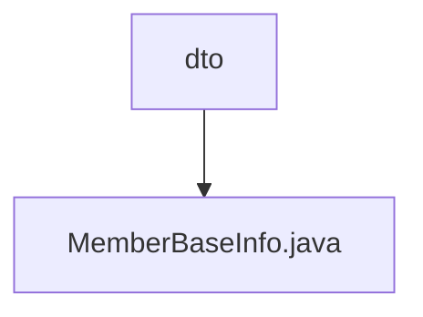

# 基础信息

|      |      |
|------|------|
| 名称 | dto |
| 编码语言 | .java |
| 代码路径 | WeFe/board/board-service/src/main/java/com/welab/wefe/board/service/sdk/union/dto |
| 包名 | docs.board.board-service.src.main.java.com.welab.wefe.board.service.sdk.union.dto |
| 概述说明 | MemberBaseInfo类包含成员ID、姓名及三个状态标识：隐藏、失联和冻结。 |

# 说明

该内容定义了一个名为MemberBaseInfo的公开类，用于存储成员基本信息。类中包含五个成员变量：memberId（字符串类型，表示成员ID）、name（字符串类型，表示成员姓名）、hidden（布尔类型，表示是否隐藏）、lostContact（布尔类型，表示是否失联）、freezed（布尔类型，表示是否冻结）。这些变量均为公开可访问，未进行封装。

### 包内部结构视图

该流程图展示了路径2的层级关系，根节点为"dto"目录，其下包含一个Java文件"MemberBaseInfo.java"。整个结构简洁明了，反映了DTO层中成员基础信息类的存储位置，符合Java项目标准目录结构规范。

# 文件列表

| 名称   | 类型  | 说明 |
|-------|------|-------------|
| [MemberBaseInfo.java](MemberBaseInfo.md) | file | MemberBaseInfo类包含成员ID、姓名及三个状态标识：隐藏、失联和冻结。 |

