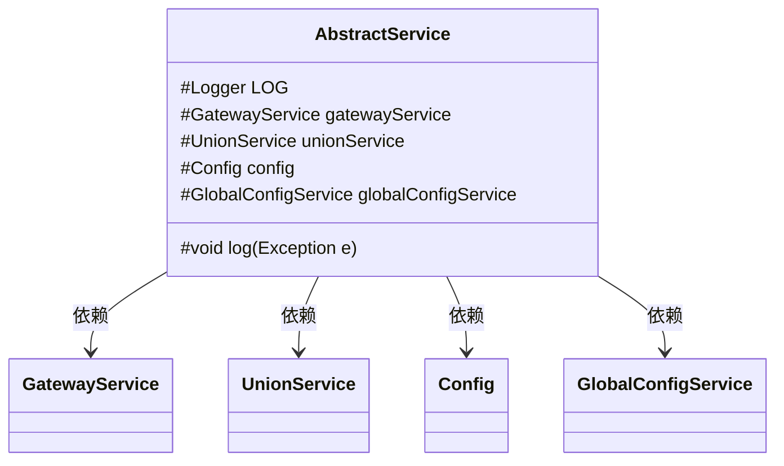
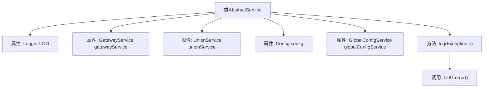

# 基础信息

|      |      |
|------|------|
| 名称 | AbstractService |
| 编码语言 | .java |
| 代码路径 | WeFe/board/board-service/src/main/java/com/welab/wefe/board/service/service/AbstractService.java |
| 包名 | com.welab.wefe.board.service.service |
| 依赖项 | ['com.welab.wefe.board.service.constant.Config', 'com.welab.wefe.board.service.sdk.union.UnionService', 'com.welab.wefe.board.service.service.globalconfig.GlobalConfigService', 'org.slf4j.Logger', 'org.slf4j.LoggerFactory', 'org.springframework.beans.factory.annotation.Autowired'] |
| 概述说明 | 抽象服务类包含日志工具和四个自动注入的服务组件，提供异常日志记录方法。 |

# 说明

这是一个名为AbstractService的抽象服务类，包含日志记录和依赖注入功能。类中定义了一个受保护的Logger对象用于日志记录，并自动注入了四个服务类：GatewayService、UnionService、Config和GlobalConfigService。此外还提供了一个受保护的log方法，用于记录异常信息，包括异常类型、消息和完整堆栈跟踪。该类作为基础类，为其他服务类提供通用功能支持。

# 类列表 Class Summary

| 名称   | 类型  | 说明 |
|-------|------|-------------|
| AbstractService | class | 抽象服务类，含日志记录器和自动注入的网关、联合、配置及全局配置服务，提供异常日志方法。 |

## 类 AbstractService

|      |      |
|------|------|
| 访问范围 | public |
| 类型 | class |
| 名称 | AbstractService |
| 说明 | 抽象服务类，含日志记录器和自动注入的网关、联合、配置及全局配置服务，提供异常日志方法。 |

### UML类图

该代码展示了一个抽象服务类AbstractService，它包含多个被自动装配的依赖组件（GatewayService、UnionService、Config和GlobalConfigService）以及一个受保护的日志记录方法。类图中清晰地表示了这些依赖关系，其中AbstractService作为基础类，通过Spring的依赖注入机制使用其他服务类和配置类。log方法提供了统一的异常日志记录功能，使用protected修饰符表明其设计意图是为子类提供共享功能。

### 内部方法调用关系图

该流程图展示了AbstractService类的结构和关键方法调用关系。类包含5个核心属性：日志记录器LOG和4个自动注入的服务组件，以及一个异常日志记录方法log()。log方法通过LOG.error()实现异常信息的记录，其中包含异常类型和消息的拼接输出。所有属性均受protected修饰符保护，体现了面向继承的设计思想，便于子类复用基础功能。

### 字段列表 Field List

| 名称  | 类型  | 说明 |
|-------|-------|------|
| config | Config | 自动注入配置对象实例。 |
| unionService | UnionService | 自动注入UnionService服务实例。 |
| globalConfigService | GlobalConfigService | 自动注入全局配置服务实例。 |
| gatewayService | GatewayService | 自动注入GatewayService实例。 |
| LOG = LoggerFactory.getLogger(this.getClass()) | Logger | 类中定义了一个受保护的final日志对象LOG，用于记录当前类的日志信息。 |

### 方法列表

| 名称  | 类型  | 说明 |
|-------|-------|------|
| log | void | Java方法log捕获异常并记录错误日志，包含异常类名和消息。 |

