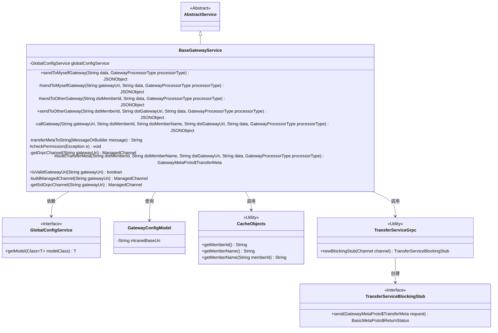
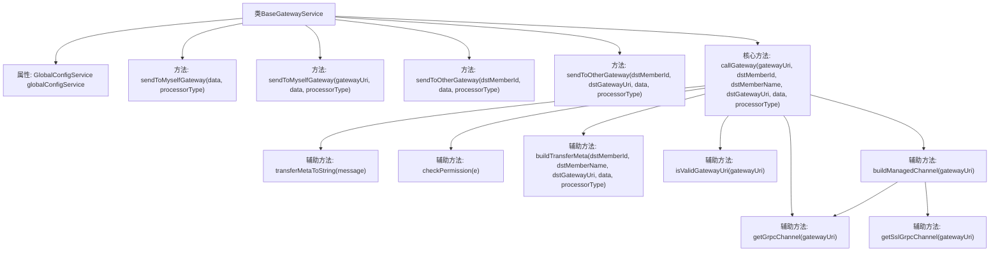

# 基础信息

|      |      |
|------|------|
| 名称 | BaseGatewayService |
| 编码语言 | .java |
| 代码路径 | WeFe/board/board-service/src/main/java/com/welab/wefe/board/service/service/BaseGatewayService.java |
| 包名 | com.welab.wefe.board.service.service |
| 依赖项 | ['com.alibaba.fastjson.JSON', 'com.alibaba.fastjson.JSONObject', 'com.google.protobuf.MessageOrBuilder', 'com.google.protobuf.util.JsonFormat', 'com.welab.wefe.board.service.cache.CaCertificateCache', 'com.welab.wefe.board.service.proto.TransferServiceGrpc', 'com.welab.wefe.board.service.proto.meta.basic.BasicMetaProto', 'com.welab.wefe.board.service.proto.meta.basic.GatewayMetaProto', 'com.welab.wefe.board.service.service.globalconfig.GlobalConfigService', 'com.welab.wefe.board.service.util.TlsUtil', 'com.welab.wefe.common.StatusCode', 'com.welab.wefe.common.exception.StatusCodeWithException', 'com.welab.wefe.common.util.StringUtil', 'com.welab.wefe.common.wefe.dto.global_config.GatewayConfigModel', 'com.welab.wefe.common.wefe.enums.GatewayProcessorType', 'io.grpc.ManagedChannel', 'io.grpc.ManagedChannelBuilder', 'io.grpc.netty.GrpcSslContexts', 'io.grpc.netty.NegotiationType', 'io.grpc.netty.NettyChannelBuilder', 'io.netty.handler.ssl.SslContextBuilder', 'io.netty.handler.ssl.util.InsecureTrustManagerFactory', 'org.apache.commons.lang3.math.NumberUtils', 'org.springframework.beans.factory.annotation.Autowired', 'java.security.cert.X509Certificate', 'java.util.UUID', 'java.util.concurrent.TimeUnit'] |
| 概述说明 | BaseGatewayService类提供网关消息发送功能，支持向自身或对方网关发送消息，处理权限验证、异常处理和GRPC通信。包含地址校验、元数据构建和SSL通道创建等方法。 |

# 说明

BaseGatewayService是一个继承自AbstractService的网关服务类，主要用于通过gRPC协议向自身或其他成员的网关服务发送消息。该类包含多个方法，如sendToMyselfGateway用于向自身网关发送消息，sendToOtherGateway用于向其他成员网关发送消息。核心方法callGateway负责实际的消息发送逻辑，包括构建传输元数据、建立gRPC连接、处理响应和异常。此外，还提供了权限检查、网关地址格式验证、SSL通道构建等功能。全局配置服务GlobalConfigService用于获取网关地址等配置信息。

# 类列表 Class Summary

| 名称   | 类型  | 说明 |
|-------|------|-------------|
| BaseGatewayService | class | BaseGatewayService类提供网关消息发送功能，支持向自身或对方网关发送数据，包含地址校验、权限检查及GRPC通信实现。 |

## 类 BaseGatewayService

|      |      |
|------|------|
| 访问范围 | public |
| 类型 | class |
| 名称 | BaseGatewayService |
| 说明 | BaseGatewayService类提供网关消息发送功能，支持向自身或对方网关发送数据，包含地址校验、权限检查及GRPC通信实现。 |

### UML类图

这段代码展示了一个网关服务类`BaseGatewayService`，它继承自`AbstractService`，主要功能是通过gRPC协议与网关服务进行通信。类中包含多个消息发送方法，支持向自身网关和其他成员网关发送消息，并处理各种异常情况如权限验证、地址格式校验等。通过`GlobalConfigService`获取网关配置，使用`CacheObjects`获取成员信息，最终通过gRPC客户端`TransferServiceGrpc`实现消息传输。类设计体现了清晰的层级结构和职责分离，核心逻辑集中在`callGateway`私有方法中实现。

### 内部方法调用关系图

这段代码实现了一个网关服务通信框架，主要功能包括向自身或第三方网关发送消息、构建传输元数据、处理gRPC通信以及权限验证等。流程图展示了类结构和核心方法调用关系，其中callGateway作为核心方法集成了参数校验、gRPC通道管理、异常处理和日志记录等功能，其他方法如sendToMyselfGateway和sendToOtherGateway都是其上层封装。辅助方法包括元数据转换、URI验证、通道构建等，共同支撑网关通信的全流程处理。

### 字段列表 Field List

| 名称  | 类型  | 说明 |
|-------|-------|------|
| globalConfigService | GlobalConfigService | 使用@Autowired自动注入GlobalConfigService实例。 |

### 方法列表

| 名称  | 类型  | 说明 |
|-------|-------|------|
| sendToMyselfGateway | JSONObject | 方法sendToMyselfGateway通过gatewayUri或配置发送数据到网关，调用callGateway处理请求。参数包括URI、成员ID、名称、数据和处理器类型。 |
| checkPermission | void | 检查权限异常并抛出对应错误：连接不可用提示检查网关；IP限制提示添加白名单；签名失败提示检查密钥。 |
| sendToMyselfGateway | JSONObject | Java方法：发送数据到自身网关，参数包括数据和处理器类型，可空，可能抛出异常。 |
| getGrpcChannel | ManagedChannel | 获取gRPC通道方法：检查网关地址非空且格式正确，否则抛异常；创建并返回最大消息2GB的明文传输通道。 |
| sendToOtherGateway | JSONObject | 方法sendToOtherGateway通过callGateway向指定网关发送数据，参数包括目标成员ID、网关URI、数据和处理器类型，返回JSONObject。可能抛出StatusCodeWithException异常。 |
| transferMetaToString | String | 将MessageOrBuilder对象转为JSON字符串，异常时记录日志并返回null。 |
| callGateway | JSONObject | 调用网关服务方法，验证地址并构建传输元数据，通过gRPC发送请求，处理成功或异常结果，记录日志并关闭连接。 |
| sendToOtherGateway | JSONObject | 方法sendToOtherGateway通过intranetBaseUri向目标成员dstMemberId发送数据data，并指定处理器类型processorType，返回JSONObject结果。异常时抛出StatusCodeWithException。 |
| buildTransferMeta | GatewayMetaProto.TransferMeta | 构建传输元数据方法：接收目标成员ID、名称、URI、数据和处理器类型，生成包含目标成员信息、内容、会话ID和处理器的传输元数据对象。 |
| isValidGatewayUri | boolean | 检查网关URI有效性：非空且格式为"字符串:数字"。 |
| buildManagedChannel | ManagedChannel | 构建ManagedChannel方法，校验网关地址格式，无效则抛异常，有效则返回普通gRPC通道。 |
| getSslGrpcChannel | ManagedChannel | 创建SSL加密的gRPC通道，支持自定义证书或默认信任管理器，设置目标URI、TLS协商类型、授权覆盖及最大消息大小。 |

