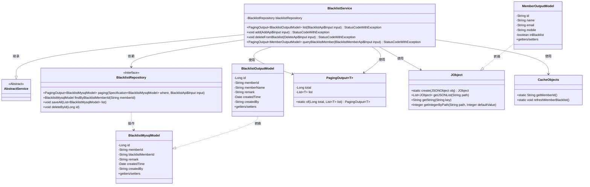
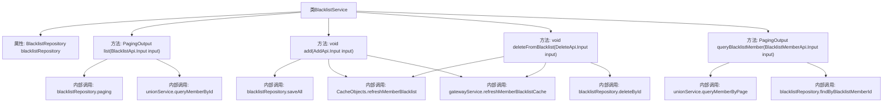
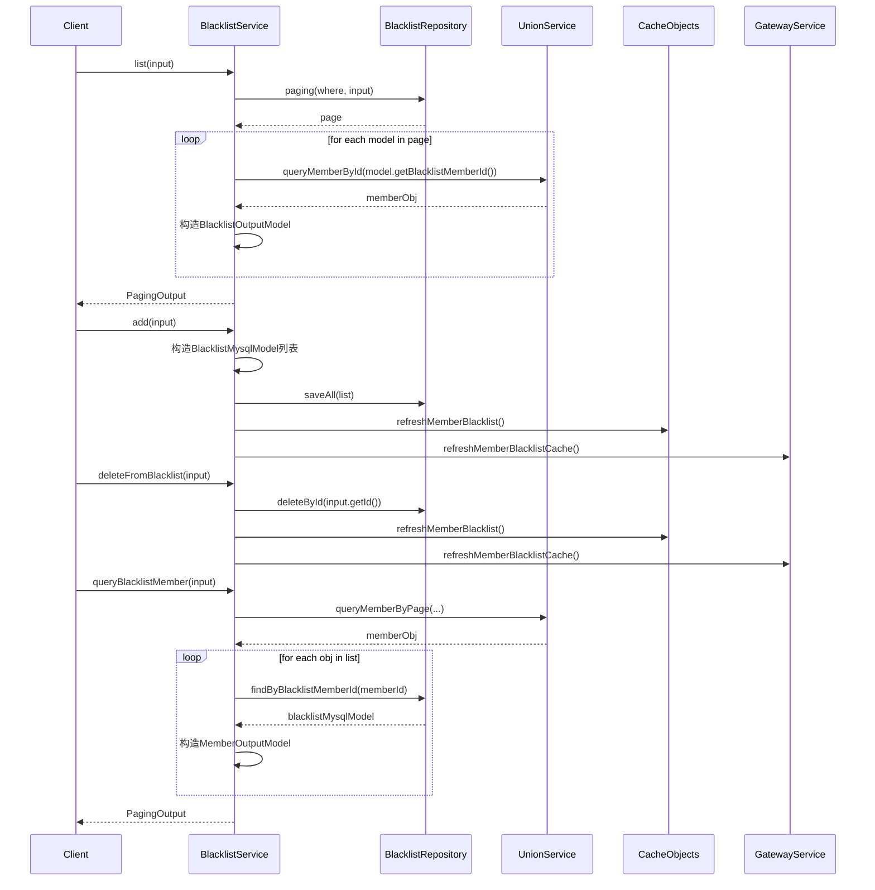

# 基础信息

|      |      |
|------|------|
| 名称 | BlacklistService |
| 编码语言 | .java |
| 代码路径 | WeFe/board/board-service/src/main/java/com/welab/wefe/board/service/service/BlacklistService.java |
| 包名 | com.welab.wefe.board.service.service |
| 依赖项 | ['com.alibaba.fastjson.JSONObject', 'com.welab.wefe.board.service.api.blacklist.AddApi', 'com.welab.wefe.board.service.api.blacklist.BlacklistApi', 'com.welab.wefe.board.service.api.blacklist.BlacklistMemberApi', 'com.welab.wefe.board.service.api.blacklist.DeleteApi', 'com.welab.wefe.board.service.database.entity.BlacklistMysqlModel', 'com.welab.wefe.board.service.database.repository.BlacklistRepository', 'com.welab.wefe.board.service.dto.base.PagingOutput', 'com.welab.wefe.board.service.dto.entity.BlacklistOutputModel', 'com.welab.wefe.board.service.dto.entity.MemberOutputModel', 'com.welab.wefe.common.data.mysql.Where', 'com.welab.wefe.common.exception.StatusCodeWithException', 'com.welab.wefe.common.util.JObject', 'com.welab.wefe.common.web.util.CurrentAccountUtil', 'org.springframework.beans.factory.annotation.Autowired', 'org.springframework.data.jpa.domain.Specification', 'org.springframework.stereotype.Service', 'java.util.ArrayList', 'java.util.Date', 'java.util.List'] |
| 概述说明 | BlacklistService提供黑名单管理功能，包括分页查询黑名单、添加成员到黑名单、从黑名单删除成员及查询黑名单成员信息。操作后更新缓存并通知网关刷新。 |

# 说明

BlacklistService是一个处理黑名单相关操作的服务类，继承自AbstractService。主要功能包括：1. 分页查询黑名单列表，将成员信息与黑名单记录关联后返回；2. 添加黑名单，支持批量添加成员并更新缓存；3. 从黑名单中删除指定记录并更新缓存；4. 查询黑名单成员信息，返回包含成员基本信息和是否在黑名单中的状态。服务通过blacklistRepository操作数据库，并与unionService、gatewayService交互获取成员数据和更新缓存。所有操作都会维护缓存一致性，确保数据实时性。

# 类列表 Class Summary

| 名称   | 类型  | 说明 |
|-------|------|-------------|
| BlacklistService | class | BlacklistService提供黑名单管理功能，包括分页查询、添加、删除成员及查询黑名单成员信息，操作后更新缓存并通知网关。 |

## 类 BlacklistService

|      |      |
|------|------|
| 访问范围 | @Service;public |
| 类型 | class |
| 名称 | BlacklistService |
| 说明 | BlacklistService提供黑名单管理功能，包括分页查询、添加、删除成员及查询黑名单成员信息，操作后更新缓存并通知网关。 |

### UML类图

该类图展示了黑名单管理系统的核心结构，其中BlacklistService作为主服务类，继承自AbstractService，通过BlacklistRepository操作数据库实体BlacklistMysqlModel，并生成BlacklistOutputModel和MemberOutputModel两种输出模型。系统使用JObject处理JSON数据，通过CacheObjects管理缓存，整体实现了黑名单的增删改查、分页查询和缓存同步功能，涉及6个核心类和2个泛型类，体现了分层设计和数据转换逻辑。

### 内部方法调用关系图

这段代码实现了一个黑名单管理系统，主要包含四个核心功能：查询黑名单列表、添加黑名单成员、从黑名单中删除成员以及查询黑名单成员信息。服务层通过调用仓储层(BlacklistRepository)进行数据持久化操作，同时依赖UnionService获取成员信息，并通过CacheObjects和GatewayService维护缓存一致性。每个操作都遵循清晰的流程：参数验证→数据处理→持久化操作→缓存更新→返回结果，体现了完整的事务边界和清晰的职责划分。

### 字段列表 Field List

| 名称  | 类型  | 说明 |
|-------|-------|------|
| blacklistRepository | BlacklistRepository | 使用@Autowired自动注入BlacklistRepository实例。 |

### 方法列表

| 名称  | 类型  | 说明 |
|-------|-------|------|
| queryBlacklistMember | PagingOutput<MemberOutputModel> | 查询黑名单成员信息，根据输入参数分页获取成员数据，检查是否在黑名单中，返回分页结果。 |
| add | void | 方法`add`接收输入参数`input`，检查其中的`memberIds`不为空时，为每个ID创建黑名单模型并设置属性，最后批量保存到数据库，刷新缓存并通知网关更新。 |
| deleteFromBlacklist | void | 从黑名单删除指定ID，刷新本地缓存并通知网关更新缓存。 |
| list | PagingOutput<BlacklistOutputModel> | 该方法查询黑名单列表，通过分页获取数据并转换为输出模型，包含成员信息和备注等字段。返回分页结果。 |

