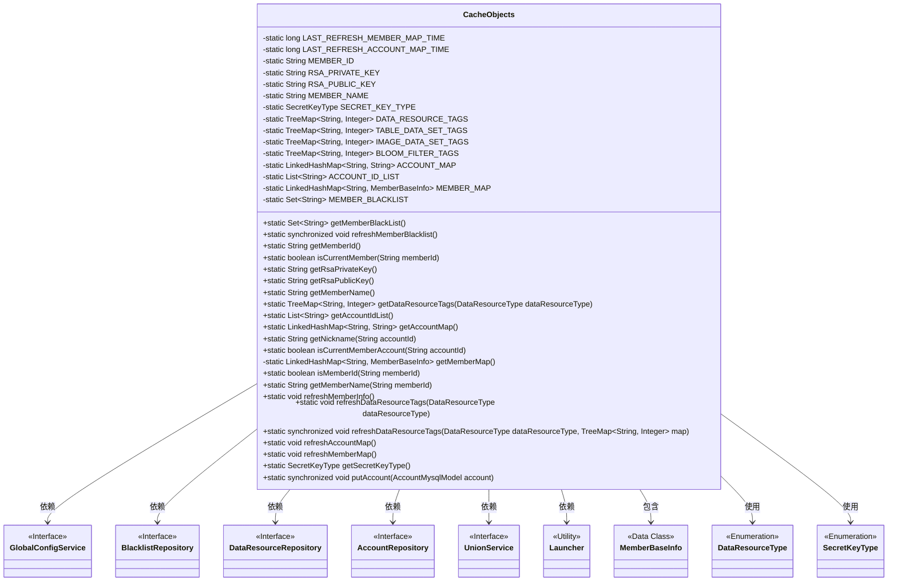
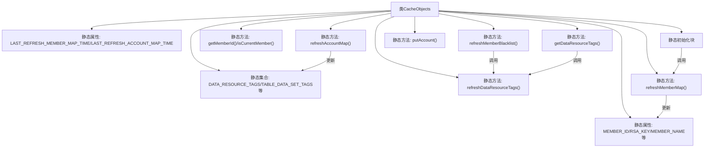

# 基础信息

|      |      |
|------|------|
| 名称 | CacheObjects |
| 编码语言 | .java |
| 代码路径 | WeFe/board/board-service/src/main/java/com/welab/wefe/board/service/service/CacheObjects.java |
| 包名 | com.welab.wefe.board.service.service |
| 依赖项 | ['com.welab.wefe.board.service.database.entity.AccountMysqlModel', 'com.welab.wefe.board.service.database.repository.AccountRepository', 'com.welab.wefe.board.service.database.repository.BlacklistRepository', 'com.welab.wefe.board.service.database.repository.data_resource.DataResourceRepository', 'com.welab.wefe.board.service.sdk.union.UnionService', 'com.welab.wefe.board.service.sdk.union.dto.MemberBaseInfo', 'com.welab.wefe.board.service.service.globalconfig.GlobalConfigService', 'com.welab.wefe.common.Convert', 'com.welab.wefe.common.constant.SecretKeyType', 'com.welab.wefe.common.exception.StatusCodeWithException', 'com.welab.wefe.common.util.StringUtil', 'com.welab.wefe.common.web.Launcher', 'com.welab.wefe.common.wefe.dto.global_config.MemberInfoModel', 'com.welab.wefe.common.wefe.enums.DataResourceType', 'org.springframework.data.domain.Sort', 'java.util'] |
| 概述说明 | CacheObjects类管理缓存数据，包括成员信息、账户映射、数据资源标签和黑名单。提供刷新和获取方法，确保数据一致性。关键功能包括成员验证、标签统计和账户管理。 |

# 说明

CacheObjects类是一个用于缓存各类数据的工具类，包含静态成员变量和方法。主要缓存了成员信息（如ID、RSA密钥、名称）、数据资源标签（按类型分类统计）、账户映射（ID与昵称）、成员映射（ID与基本信息）和黑名单。提供了刷新这些缓存数据的方法，如refreshMemberInfo、refreshDataResourceTags、refreshAccountMap和refreshMemberMap。还包括一些辅助方法，如判断是否为当前成员、获取昵称、检查是否为成员ID等。通过同步方法和时间戳控制避免高频刷新。

# 类列表 Class Summary

| 名称   | 类型  | 说明 |
|-------|------|-------------|
| CacheObjects | class | CacheObjects类管理缓存数据，包括成员信息、账户映射、数据资源标签和黑名单。提供刷新和获取方法，确保数据一致性和线程安全。 |

## 类 CacheObjects

|      |      |
|------|------|
| 访问范围 | public |
| 类型 | class |
| 名称 | CacheObjects |
| 说明 | CacheObjects类管理缓存数据，包括成员信息、账户映射、数据资源标签和黑名单。提供刷新和获取方法，确保数据一致性和线程安全。 |

### UML类图

类图描述：该图展示了一个缓存管理类CacheObjects，它通过静态变量存储各类缓存数据（如成员信息、账户映射、黑名单等），并提供同步刷新方法。类与多个Repository接口（BlacklistRepository、DataResourceRepository等）存在依赖关系，通过Launcher工具类获取Bean实例。枚举类型DataResourceType和SecretKeyType被用于方法参数和返回类型。整体设计采用单例模式管理全局缓存数据。

### 内部方法调用关系图

该流程图展示了CacheObjects类的核心结构和调用关系。类包含多个静态属性和集合用于缓存数据，通过静态方法实现数据刷新和访问控制。关键方法包括刷新黑名单(refreshMemberBlacklist)、获取数据资源标签(getDataResourceTags)、刷新账户映射(refreshAccountMap)等，这些方法之间存在调用依赖关系。静态初始化块在类加载时自动执行成员信息刷新，各刷新方法通过时间戳控制调用频率以避免性能问题。整体设计采用单例模式管理全局缓存数据。

### 字段列表 Field List

| 名称  | 类型  | 说明 |
|-------|-------|------|
| MEMBER_MAP = new LinkedHashMap<>() | LinkedHashMap<String, MemberBaseInfo> | 定义静态成员变量MEMBER_MAP，类型为LinkedHashMap，键为String，值为MemberBaseInfo。 |
| RSA_PRIVATE_KEY | String | 定义私有静态字符串变量RSA_PRIVATE_KEY。 |
| SECRET_KEY_TYPE = null | SecretKeyType | 静态私有密钥类型变量SECRET_KEY_TYPE初始化为空。 |
| LAST_REFRESH_MEMBER_MAP_TIME = 0 | long | 静态变量记录最后刷新成员映射表的时间戳，初始值为0。 |
| DATA_RESOURCE_TAGS = new TreeMap<>() | TreeMap<String, Integer> | 定义静态常量DATA_RESOURCE_TAGS，类型为TreeMap，键为String，值为Integer。 |
| MEMBER_NAME | String | 私有静态字符串变量MEMBER_NAME |
| LAST_REFRESH_ACCOUNT_MAP_TIME = 0 | long | 静态长整型变量，记录上次刷新账户映射表的时间戳，初始值为0。 |
| IMAGE_DATA_SET_TAGS = new TreeMap<>() | TreeMap<String, Integer> | 定义静态不可变的TreeMap变量IMAGE_DATA_SET_TAGS，键为字符串，值为整数。 |
| BLOOM_FILTER_TAGS = new TreeMap<>() | TreeMap<String, Integer> | 定义静态常量BLOOM_FILTER_TAGS，类型为TreeMap，键为字符串，值为整数。 |
| ACCOUNT_MAP = new LinkedHashMap<>() | LinkedHashMap<String, String> | 定义静态常量ACCOUNT_MAP，类型为有序哈希表，键值均为字符串。 |
| ACCOUNT_ID_LIST = new ArrayList<>() | List<String> | 声明一个私有静态不可变的字符串列表变量ACCOUNT_ID_LIST，初始化为空ArrayList。 |
| MEMBER_ID | String | 私有静态字符串变量MEMBER_ID，用于存储成员ID。 |
| MEMBER_BLACKLIST = new HashSet<>() | Set<String> | 声明一个私有静态不可变的字符串集合MEMBER_BLACKLIST，初始化为空HashSet。 |
| RSA_PUBLIC_KEY | String | 私有静态字符串变量RSA公钥。 |
| TABLE_DATA_SET_TAGS = new TreeMap<>() | TreeMap<String, Integer> | 定义静态不可变的TreeMap变量TABLE_DATA_SET_TAGS，键为String类型，值为Integer类型。 |

### 方法列表

| 名称  | 类型  | 说明 |
|-------|-------|------|
| getMemberName | String | 根据会员ID获取会员名称，若ID为空或会员不存在返回null；若缓存未命中则刷新缓存再次查询。异常时也返回null。 |
| refreshMemberMap | void | 静态方法refreshMemberMap用于刷新成员映射表，限制1分钟内重复刷新，通过UnionService获取最新数据并更新缓存。 |
| getAccountIdList | List<String> | 静态方法getAccountIdList返回ACCOUNT_ID_LIST，若为空则调用refreshAccountMap更新后返回。 |
| isCurrentMemberAccount | boolean | 检查当前账户ID是否在账户列表中。 |
| getRsaPublicKey | String | 获取RSA公钥的静态方法，直接返回预定义的常量RSA_PUBLIC_KEY。 |
| getRsaPrivateKey | String | 获取RSA私钥的静态方法。 |
| isCurrentMember | boolean | 静态方法isCurrentMember检查传入的memberId是否与当前成员ID相同，返回布尔值。 |
| refreshDataResourceTags | void | 该方法用于刷新数据资源标签，首先获取指定类型的标签映射，然后调用刷新方法更新标签。 |
| isMemberId | boolean | 检查memberId是否存在于成员映射中，存在返回true，异常返回false。 |
| refreshMemberInfo | void | 静态方法refreshMemberInfo从GlobalConfigService获取MemberInfoModel，更新成员ID、RSA公私钥、成员名和密钥类型等全局变量。若模型为空则直接返回。 |
| getAccountMap | LinkedHashMap<String, String> | 这是一个Java方法，用于获取账户映射表。若表为空则刷新数据，最后返回该映射表。 |
| getMemberMap | LinkedHashMap<String, MemberBaseInfo> | 获取成员映射表，若为空则刷新后返回。 |
| getMemberName | String | 静态方法返回成员变量MEMBER_NAME的值。 |
| refreshDataResourceTags | void | 静态同步方法refreshDataResourceTags根据类型查询数据库标签，统计各标签对应数据集数量并更新到map中。 |
| getMemberId | String | 获取成员ID的静态方法，直接返回常量MEMBER_ID。 |
| getNickname | String | 静态方法getNickname根据accountId获取昵称：若accountId为空返回null；否则从AccountMap查找，若不存在则调用getMemberName获取。 |
| refreshAccountMap | void | 刷新账户映射表，若10秒内已刷新则跳过。更新最后刷新时间，从数据库获取账户列表并按昵称排序。清空旧数据后，重新填充账户ID与昵称的映射表及ID列表。 |
| getDataResourceTags | TreeMap<String, Integer> | 静态方法根据数据类型返回对应标签映射，若为空则返回默认标签，空时刷新数据后返回。 |
| refreshMemberBlacklist | void | 同步静态方法refreshMemberBlacklist用于刷新成员黑名单，先清空现有列表，再从数据库加载所有黑名单成员ID并存入静态变量MEMBER_BLACKLIST。 |
| getSecretKeyType | SecretKeyType | 该方法返回密钥类型，若未设置则默认返回rsa类型。 |
| putAccount | void | 静态同步方法putAccount接收AccountMysqlModel对象，非空时将其ID和昵称存入ACCOUNT_MAP，并将ID加入ACCOUNT_ID_LIST。 |
| getMemberBlackList | Set<String> | 获取成员黑名单。若为空则刷新，返回黑名单集合。 |

