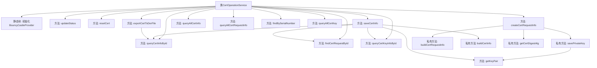
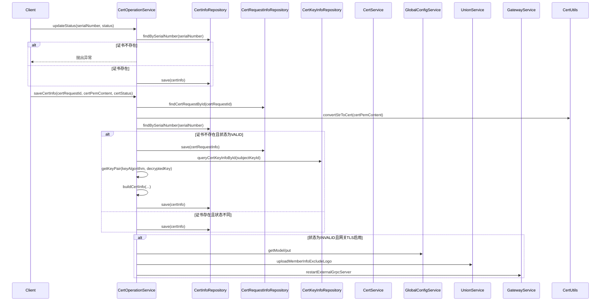

# 基础信息

|      |      |
|------|------|
| 名称 | CertOperationService |
| 编码语言 | .java |
| 代码路径 | WeFe/board/board-service/src/main/java/com/welab/wefe/board/service/service/CertOperationService.java |
| 包名 | com.welab.wefe.board.service.service |
| 依赖项 | ['com.webank.cert.toolkit.enums.CertDigestAlgEnums', 'com.webank.cert.toolkit.enums.CertStatusEnums', 'com.webank.cert.toolkit.enums.KeyAlgorithmEnums', 'com.webank.cert.toolkit.model.X500NameInfo', 'com.webank.cert.toolkit.service.CertService', 'com.webank.cert.toolkit.utils.CertUtils', 'com.webank.cert.toolkit.utils.KeyUtils', 'com.welab.wefe.board.service.database.entity.cert.CertInfoMysqlModel', 'com.welab.wefe.board.service.database.entity.cert.CertKeyInfoMysqlModel', 'com.welab.wefe.board.service.database.entity.cert.CertRequestInfoMysqlModel', 'com.welab.wefe.board.service.database.repository.CertInfoRepository', 'com.welab.wefe.board.service.database.repository.CertKeyInfoRepository', 'com.welab.wefe.board.service.database.repository.CertRequestInfoRepository', 'com.welab.wefe.board.service.sdk.union.UnionService', 'com.welab.wefe.board.service.service.globalconfig.GlobalConfigService', 'com.welab.wefe.common.StatusCode', 'com.welab.wefe.common.exception.StatusCodeWithException', 'com.welab.wefe.common.util.AESUtil', 'com.welab.wefe.common.web.util.CurrentAccountUtil', 'com.welab.wefe.common.wefe.dto.global_config.MemberInfoModel', 'org.apache.commons.lang3.StringUtils', 'org.bouncycastle.jce.provider.BouncyCastleProvider', 'org.bouncycastle.pkcs.PKCS10CertificationRequest', 'org.slf4j.Logger', 'org.slf4j.LoggerFactory', 'org.springframework.beans.factory.annotation.Autowired', 'org.springframework.stereotype.Service', 'java.math.BigInteger', 'java.security.KeyPair', 'java.security.PublicKey', 'java.security.Security', 'java.security.cert.CertificateException', 'java.security.cert.X509Certificate', 'java.util.Date', 'java.util.List'] |
| 概述说明 | CertOperationService类提供证书管理功能，包括更新状态、保存证书信息、导出证书、查询证书和私钥、创建证书请求等操作。 |

# 说明

CertOperationService是一个处理证书操作的Spring服务类，包含证书状态更新、证书信息保存、证书导出、证书请求创建等功能。它依赖多个Repository和Service进行数据操作，如CertInfoRepository、CertRequestInfoRepository等。主要方法包括updateStatus更新证书状态，saveCertInfo保存证书信息，exportCertToDerFile导出证书文件，createCertRequestInfo创建证书请求等。服务初始化时检查并添加BouncyCastle安全提供者。处理过程中涉及证书状态验证、公私钥生成、证书内容转换等操作，并处理异常情况。

# 类列表 Class Summary

| 名称   | 类型  | 说明 |
|-------|------|-------------|
| CertOperationService | class | CertOperationService是一个证书操作服务类，提供证书状态更新、证书信息保存、证书导出、证书请求创建等功能，涉及证书、密钥和请求信息的CRUD操作，支持RSA和ECDSA等算法。 |

## 类 CertOperationService

|      |      |
|------|------|
| 访问范围 | @Service;public |
| 类型 | class |
| 名称 | CertOperationService |
| 说明 | CertOperationService是一个证书操作服务类，提供证书状态更新、证书信息保存、证书导出、证书请求创建等功能，涉及证书、密钥和请求信息的CRUD操作，支持RSA和ECDSA等算法。 |

### UML类图

```mermaid
classDiagram
    class CertOperationService {
        -LOG: Logger
        -certInfoRepository: CertInfoRepository
        -certRequestInfoRepository: CertRequestInfoRepository
        -certKeyInfoRepository: CertKeyInfoRepository
        -certService: CertService
        -globalConfigService: GlobalConfigService
        -gatewayService: GatewayService
        -unionService: UnionService
        +updateStatus(String serialNumber, String status) void
        +resetCert() void
        +saveCertInfo(String certRequestId, String certPemContent, String certStatus) void
        +exportCertToDerFile(String certId, String filePath) void
        +queryCertInfoById(String id) CertInfoMysqlModel
        +queryAllCertInfo() List~CertInfoMysqlModel~
        +findCertRequestById(String id) CertRequestInfoMysqlModel
        +queryAllCertRequestInfo() List~CertRequestInfoMysqlModel~
        +findBySerialNumber(String serialNumber) CertInfoMysqlModel
        +queryCertKeyInfoById(String id) CertKeyInfoMysqlModel
        +queryAllCertKey() List~CertKeyInfoMysqlModel~
        +createCertRequestInfo(String commonName, String organizationName, String organizationUnitName) CertRequestInfoMysqlModel
        -savePrivateKey(String memberId, String pemPrivateKey, String priAlg) CertKeyInfoMysqlModel
        -buildCertRequestInfo(String csrStr, String subjectKeyId, String commonName, String organizationName, String memberId, boolean issue) CertRequestInfoMysqlModel
        -buildCertInfo(String certificatePemStr, String subjectCommonName, String subjectOrgName, PublicKey publicKey, String memberId, BigInteger serialNumber, String csrId, String certStatus) CertInfoMysqlModel
        -getCertDigestAlg(KeyAlgorithmEnums keyAlgorithm) CertDigestAlgEnums
        +getKeyPair(KeyAlgorithmEnums keyAlgorithm, String pemPrivateKey) KeyPair
    }

    class CertInfoMysqlModel {
        <<Entity>>
    }

    class CertRequestInfoMysqlModel {
        <<Entity>>
    }

    class CertKeyInfoMysqlModel {
        <<Entity>>
    }

    class CertService {
        <<Service>>
        +createCertRequest(X500NameInfo subject, PublicKey publicKey, PrivateKey privateKey, String algorithmName) PKCS10CertificationRequest
    }

    class GlobalConfigService {
        <<Service>>
        +getModel(Class~T~ clazz) T
        +put(Object model) void
    }

    class GatewayService {
        <<Service>>
        +restartExternalGrpcServer() void
    }

    class UnionService {
        <<Service>>
        +uploadMemberInfoExcludeLogo(MemberInfoModel model) void
    }

    class CertUtils {
        <<Utility>>
        +convertStrToCert(String certPemContent) X509Certificate
        +writeCrt(X509Certificate certificate, String filePath) void
        +readPEMAsString(Object obj) String
    }

    class KeyUtils {
        <<Utility>>
        +generateKeyPair() KeyPair
        +getECKeyPair(String pemPrivateKey) KeyPair
        +getRSAKeyPair(String pemPrivateKey) KeyPair
    }

    class AESUtil {
        <<Utility>>
        +encrypt(String data, String key) String
        +decrypt(String encryptedData, String key) String
    }

    class CacheObjects {
        <<Utility>>
        +getMemberId() String
        +refreshMemberInfo() void
    }

    CertOperationService --> CertInfoRepository : 依赖
    CertOperationService --> CertRequestInfoRepository : 依赖
    CertOperationService --> CertKeyInfoRepository : 依赖
    CertOperationService --> CertService : 依赖
    CertOperationService --> GlobalConfigService : 依赖
    CertOperationService --> GatewayService : 依赖
    CertOperationService --> UnionService : 依赖
    CertOperationService --> CertUtils : 依赖
    CertOperationService --> KeyUtils : 依赖
    CertOperationService --> AESUtil : 依赖
    CertOperationService --> CacheObjects : 依赖
    CertService --> KeyUtils : 依赖
    CertService --> CertUtils : 依赖
```

该代码实现了一个证书操作服务类CertOperationService，主要功能包括证书状态更新、证书信息保存、证书导出、证书请求创建等。它依赖多个仓储接口（如CertInfoRepository）和服务类（如CertService），通过静态工具类（如CertUtils、KeyUtils）完成证书转换、密钥生成等操作。类图展示了核心业务实体（如CertInfoMysqlModel）与各服务组件的交互关系，体现了证书管理系统的分层架构设计。

### 内部方法调用关系图

该流程图展示了CertOperationService类的主要结构和方法调用关系，包含证书状态更新、保存证书信息、导出证书等核心功能。时序图则详细描述了updateStatus和saveCertInfo两个关键方法的执行流程，涉及多个仓储服务和工具类的交互。类通过自动装配的仓储服务完成数据持久化，并处理证书状态变更时的业务逻辑，包括网关服务重启等边缘情况。

### 字段列表 Field List

| 名称  | 类型  | 说明 |
|-------|-------|------|
| globalConfigService | GlobalConfigService | 自动注入全局配置服务实例。 |
| gatewayService | GatewayService | 使用@Autowired自动注入GatewayService实例。 |
| LOG = LoggerFactory.getLogger(CertOperationService.class) | Logger | CertOperationService类中定义了一个受保护的静态final日志对象LOG，用于记录日志。 |
| certInfoRepository | CertInfoRepository | 自动注入CertInfoRepository实例。 |
| unionService | UnionService | 自动注入UnionService服务实例。 |
| certService | CertService | 自动注入CertService实例。 |
| certKeyInfoRepository | CertKeyInfoRepository | 自动注入CertKeyInfoRepository实例。 |
| certRequestInfoRepository | CertRequestInfoRepository | 自动注入证书请求信息存储库实例。 |

### 方法列表

| 名称  | 类型  | 说明 |
|-------|-------|------|
| createCertRequestInfo | CertRequestInfoMysqlModel | 创建证书请求信息，生成RSA公私钥，保存私钥并生成证书请求，返回请求信息模型。 |
| findBySerialNumber | CertInfoMysqlModel | 该方法通过序列号查询证书信息，调用certInfoRepository的findOne方法返回CertInfoMysqlModel对象。 |
| saveCertInfo | void | 方法保存证书信息，处理状态更新和密钥对操作，若状态无效则禁用网关TLS并重启服务。异常时抛出状态码错误。 |
| queryAllCertKey | List<CertKeyInfoMysqlModel> | 查询所有证书密钥信息，返回列表形式。 |
| exportCertToDerFile | void | 该方法根据证书ID导出DER格式证书文件。若证书存在且内容非空，将其写入指定路径；否则抛出数据不存在异常。 |
| resetCert | void | 重置证书状态为无效。 |
| queryCertInfoById | CertInfoMysqlModel | 通过ID查询证书信息，返回CertInfoMysqlModel对象。调用certInfoRepository的findOne方法，参数为字段名、ID和模型类。 |
| updateStatus | void | 更新证书状态方法：根据序列号查找证书，不存在则抛异常；存在则更新状态、修改人和时间，并保存。 |
| queryAllCertInfo | List<CertInfoMysqlModel> | 查询所有证书信息，返回证书信息列表。 |
| savePrivateKey | CertKeyInfoMysqlModel | 方法保存私钥到数据库，检查memberId非空并验证RSA密钥对，加密后存储并返回模型对象。 |
| buildCertRequestInfo | CertRequestInfoMysqlModel | 构建证书请求信息模型，包含成员ID、主题密钥ID、通用名、组织名、CSR内容、签发标志和创建时间。 |
| buildCertInfo | CertInfoMysqlModel | 构建证书信息模型，包含成员ID、主题名称、组织、创建时间、公钥、证书内容、序列号、CSR ID和状态。 |
| getCertDigestAlg | CertDigestAlgEnums | 方法getCertDigestAlg根据输入的密钥算法返回对应的证书摘要算法。若输入为空或不支持，抛出异常提示密钥算法不支持。 |
| getKeyPair | KeyPair | 方法根据密钥算法类型（ECDSA/SM2或RSA）从PEM格式私钥生成密钥对，不支持时抛出异常。 |
| queryCertKeyInfoById | CertKeyInfoMysqlModel | 查询指定ID的证书密钥信息，返回对应的数据库模型对象。 |
| queryAllCertRequestInfo | List<CertRequestInfoMysqlModel> | 该方法查询并返回所有证书请求信息，调用`certRequestInfoRepository`的`findAll`方法获取数据列表。 |
| findCertRequestById | CertRequestInfoMysqlModel | 该方法通过ID查询证书请求信息，调用仓库方法返回对应数据模型对象。 |

