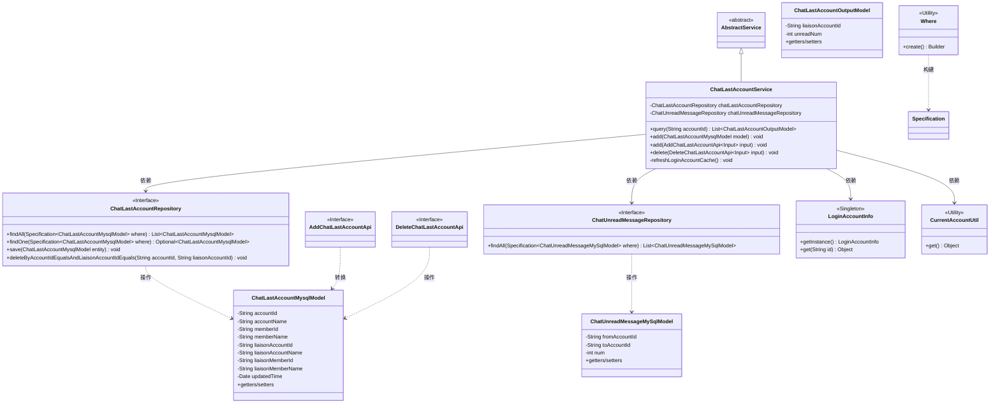
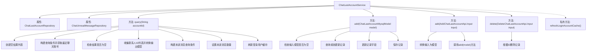
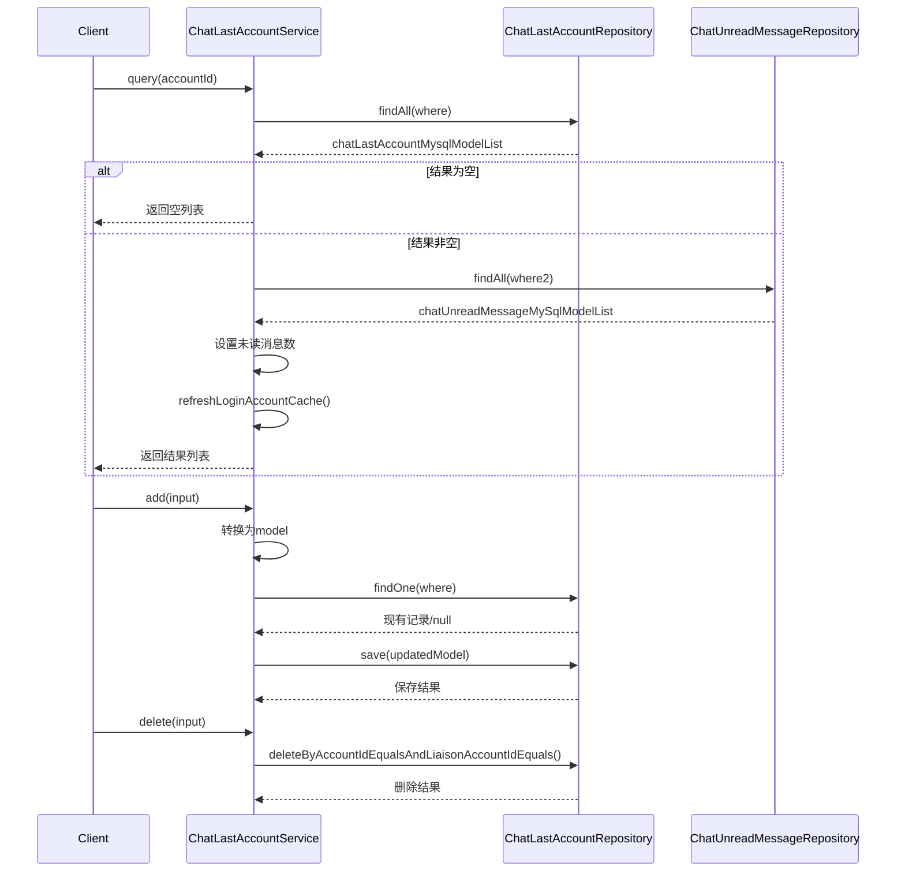

# 基础信息

|      |      |
|------|------|
| 名称 | ChatLastAccountService |
| 编码语言 | .java |
| 代码路径 | WeFe/board/board-service/src/main/java/com/welab/wefe/board/service/service/ChatLastAccountService.java |
| 包名 | com.welab.wefe.board.service.service |
| 依赖项 | ['com.welab.wefe.board.service.api.chat.AddChatLastAccountApi', 'com.welab.wefe.board.service.api.chat.DeleteChatLastAccountApi', 'com.welab.wefe.board.service.base.LoginAccountInfo', 'com.welab.wefe.board.service.database.entity.chat.ChatLastAccountMysqlModel', 'com.welab.wefe.board.service.database.entity.chat.ChatUnreadMessageMySqlModel', 'com.welab.wefe.board.service.database.repository.ChatLastAccountRepository', 'com.welab.wefe.board.service.database.repository.ChatUnreadMessageRepository', 'com.welab.wefe.board.service.dto.entity.ChatLastAccountOutputModel', 'com.welab.wefe.common.data.mysql.Where', 'com.welab.wefe.common.data.mysql.enums.OrderBy', 'com.welab.wefe.common.web.util.CurrentAccountUtil', 'org.apache.commons.collections4.CollectionUtils', 'org.springframework.beans.BeanUtils', 'org.springframework.beans.factory.annotation.Autowired', 'org.springframework.data.jpa.domain.Specification', 'org.springframework.stereotype.Service', 'org.springframework.transaction.annotation.Transactional', 'java.util.ArrayList', 'java.util.Date', 'java.util.List'] |
| 概述说明 | ChatLastAccountService提供查询、添加和删除最近聊天账号功能，并关联未读消息数。查询时按更新时间排序，添加时更新或新建记录，删除时根据账号ID和联系人ID操作。包含刷新登录用户缓存逻辑。 |

# 说明

ChatLastAccountService是一个服务类，用于管理最近聊天账户记录。主要功能包括查询最近聊天账户列表，根据主账户ID获取所有最近聊天账户信息，并统计每个联系人的未读消息数量。提供添加最近聊天账户记录的方法，支持通过模型对象或输入参数添加，更新现有记录或创建新记录。包含删除功能，根据账户ID和联系人账户ID删除记录。每次查询后会刷新当前登录用户缓存以防止过期。通过自动注入的仓库类与数据库交互，处理ChatLastAccount和ChatUnreadMessage相关数据。

# 类列表 Class Summary

| 名称   | 类型  | 说明 |
|-------|------|-------------|
| ChatLastAccountService | class | ChatLastAccountService提供最近聊天账户查询、添加和删除功能，支持查询未读消息数并刷新用户缓存。 |

## 类 ChatLastAccountService

|      |      |
|------|------|
| 访问范围 | @Service;public |
| 类型 | class |
| 名称 | ChatLastAccountService |
| 说明 | ChatLastAccountService提供最近聊天账户查询、添加和删除功能，支持查询未读消息数并刷新用户缓存。 |

### UML类图

该代码实现了一个聊天最近联系人服务，主要功能包括查询最近聊天账户列表、添加/删除最近聊天记录，并维护未读消息计数。类图展示了核心服务类与多个Repository、Model类及工具类的交互关系，其中ChatLastAccountService继承自AbstractService，通过两个JPA Repository操作数据库，并依赖工具类进行账户信息管理。系统采用分层设计，模型类与接口分离，符合Spring服务层的典型架构模式。

### 内部方法调用关系图

这段代码实现了一个聊天系统最近联系人服务，主要功能包括：查询最近聊天账号列表（包含未读消息数）、添加/更新最近聊天记录、删除最近聊天记录。服务通过两个Repository与数据库交互，使用Specification构建查询条件，并在查询操作后自动刷新登录用户缓存。核心方法query实现了复杂的数据聚合逻辑，先获取最近联系人列表，再查询对应的未读消息数并合并返回。

### 字段列表 Field List

| 名称  | 类型  | 说明 |
|-------|-------|------|
| chatUnreadMessageRepository | ChatUnreadMessageRepository | 使用@Autowired自动注入ChatUnreadMessageRepository实例。 |
| chatLastAccountRepository | ChatLastAccountRepository | 自动注入ChatLastAccountRepository实例。 |

### 方法列表

| 名称  | 类型  | 说明 |
|-------|-------|------|
| add | void | 方法`add`用于添加或更新聊天账户模型。若模型为空则返回。根据账户ID和联络账户ID查询现有记录，不存在则新建。更新记录的时间、账户名、成员名等信息后保存。 |
| query | List<ChatLastAccountOutputModel> | 该方法查询指定账号的最近聊天记录及未读消息数，返回包含联络账号ID和未读数的列表，最后刷新登录用户缓存。 |
| add | void | 该方法接收输入参数，创建模型对象并设置各项属性，最后调用add方法保存模型。属性包括账户和成员ID及名称，以及联络人相关信息。 |
| delete | void | 该方法使用事务注解确保异常时回滚，通过仓库删除指定账户ID和联络账户ID匹配的聊天记录。 |
| refreshLoginAccountCache | void | 刷新登录账户缓存：通过当前账户ID获取并更新账户信息实例。 |

