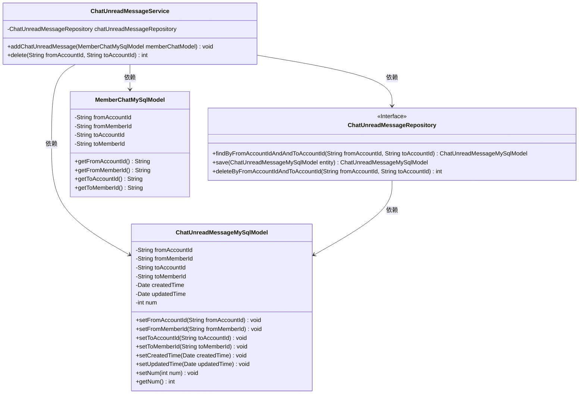
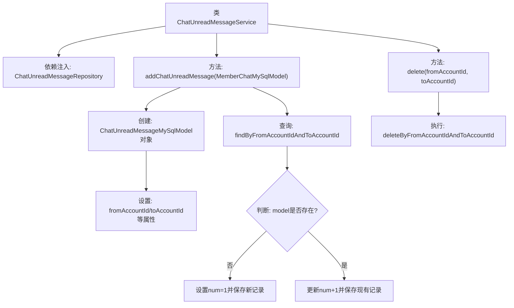

# 基础信息

|      |      |
|------|------|
| 名称 | ChatUnreadMessageService |
| 编码语言 | .java |
| 代码路径 | WeFe/board/board-service/src/main/java/com/welab/wefe/board/service/service/ChatUnreadMessageService.java |
| 包名 | com.welab.wefe.board.service.service |
| 依赖项 | ['com.welab.wefe.board.service.database.entity.chat.ChatUnreadMessageMySqlModel', 'com.welab.wefe.board.service.database.entity.chat.MemberChatMySqlModel', 'com.welab.wefe.board.service.database.repository.ChatUnreadMessageRepository', 'org.springframework.beans.factory.annotation.Autowired', 'org.springframework.stereotype.Service', 'java.util.Date'] |
| 概述说明 | ChatUnreadMessageService服务类，通过chatUnreadMessageRepository操作未读消息数据。addChatUnreadMessage方法新增或累加未读消息数，delete方法删除指定发送接收账号的未读消息记录。 |

# 说明

这是一个名为ChatUnreadMessageService的Spring服务类，主要用于管理聊天未读消息。它通过ChatUnreadMessageRepository与数据库交互。主要功能包括：1. 增加未读消息计数，若记录不存在则创建新记录并设为1，否则将现有记录的计数加1；2. 删除指定发送方和接收方账户ID之间的未读消息记录，返回删除的记录数。该类处理了消息发送方和接收方的账户ID、成员ID以及创建更新时间等信息。

# 类列表 Class Summary

| 名称   | 类型  | 说明 |
|-------|------|-------------|
| ChatUnreadMessageService | class | ChatUnreadMessageService类提供未读消息管理功能，包含新增未读消息计数和删除记录方法，使用Repository操作数据库。 |

## 类 ChatUnreadMessageService

|      |      |
|------|------|
| 访问范围 | @Service;public |
| 类型 | class |
| 名称 | ChatUnreadMessageService |
| 说明 | ChatUnreadMessageService类提供未读消息管理功能，包含新增未读消息计数和删除记录方法，使用Repository操作数据库。 |

### UML类图

这段代码展示了一个处理未读消息的服务类ChatUnreadMessageService，它通过ChatUnreadMessageRepository接口与数据库交互。主要功能包括增加未读消息计数（当消息不存在时创建新记录，存在时更新计数）和删除指定发送方/接收方的未读记录。类图中清晰地展示了服务类与数据模型（MemberChatMySqlModel和ChatUnreadMessageMySqlModel）及仓储接口之间的依赖关系，体现了典型的Spring服务层架构模式。

### 内部方法调用关系图

该流程图展示了ChatUnreadMessageService类的核心逻辑，主要包含两个功能：增加未读消息计数(addChatUnreadMessage)和删除未读消息记录(delete)。在增加消息计数时，会先创建新模型对象并设置基础属性，然后查询是否已存在记录，不存在则创建新记录(num=1)，存在则递增计数(num+1)。删除功能直接调用仓库层的删除方法。整个流程清晰展现了服务层与仓库层的交互逻辑。

### 字段列表 Field List

| 名称  | 类型  | 说明 |
|-------|-------|------|
| chatUnreadMessageRepository | ChatUnreadMessageRepository | 使用@Autowired自动注入ChatUnreadMessageRepository实例。 |

### 方法列表

| 名称  | 类型  | 说明 |
|-------|-------|------|
| addChatUnreadMessage | void | 方法用于添加未读消息记录。若记录不存在则创建新记录并设未读数为1；若存在则未读数加1。更新或保存至数据库。 |
| delete | int | 删除指定发送方和接收方的未读聊天消息，返回删除数量。 |

