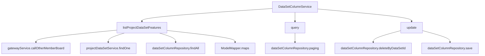
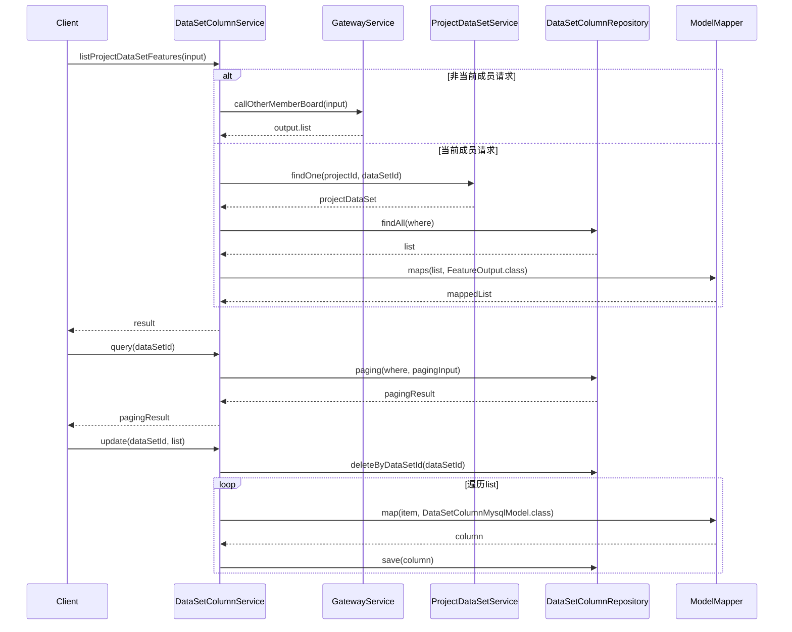

# 基础信息

|      |      |
|------|------|
| 名称 | DataSetColumnService |
| 编码语言 | .java |
| 代码路径 | WeFe/board/board-service/src/main/java/com/welab/wefe/board/service/service/DataSetColumnService.java |
| 包名 | com.welab.wefe.board.service.service |
| 依赖项 | ['com.welab.wefe.board.service.api.project.dataset.GetFeaturesApi', 'com.welab.wefe.board.service.database.entity.data_set.DataSetColumnMysqlModel', 'com.welab.wefe.board.service.database.entity.job.ProjectDataSetMySqlModel', 'com.welab.wefe.board.service.database.repository.DataSetColumnRepository', 'com.welab.wefe.board.service.dto.base.PagingInput', 'com.welab.wefe.board.service.dto.base.PagingOutput', 'com.welab.wefe.board.service.dto.entity.data_set.DataSetColumnInputModel', 'com.welab.wefe.board.service.dto.entity.data_set.DataSetColumnOutputModel', 'com.welab.wefe.board.service.dto.vo.FeatureOutput', 'com.welab.wefe.common.data.mysql.Where', 'com.welab.wefe.common.data.mysql.enums.OrderBy', 'com.welab.wefe.common.exception.StatusCodeWithException', 'com.welab.wefe.common.web.util.ModelMapper', 'com.welab.wefe.common.wefe.enums.AuditStatus', 'org.springframework.beans.factory.annotation.Autowired', 'org.springframework.data.jpa.domain.Specification', 'org.springframework.stereotype.Service', 'java.util.List'] |
| 概述说明 | DataSetColumnService提供数据集特征列表查询、分页查询和更新功能。通过gateway调用其他成员特征列表，检查数据集状态后返回特征数据。支持按数据集ID分页查询字段，并允许更新数据集字段信息。 |

# 说明

DataSetColumnService是一个服务类，用于管理数据集列的相关操作。主要功能包括：获取项目中数据集的特征列表，通过gateway调用其他成员的特征数据；查询数据集列信息，支持分页查询；更新数据集列，先删除原有列再保存新列数据。该类依赖DataSetColumnRepository和ProjectDataSetService进行数据操作，并处理成员ID校验及数据集审核状态检查。

# 类列表 Class Summary

| 名称   | 类型  | 说明 |
|-------|------|-------------|
| DataSetColumnService | class | DataSetColumnService提供数据集特征列表查询、分页查询和更新功能。通过gateway调用其他成员特征列表，支持按数据集ID查询和更新列信息，确保数据一致性和排序。 |


## 类 DataSetColumnService

|      |      |
|------|------|
| 访问范围 | @Service;public |
| 类型 | class |
| 名称 | DataSetColumnService |
| 说明 | DataSetColumnService提供数据集特征列表查询、分页查询和更新功能。通过gateway调用其他成员特征列表，支持按数据集ID查询和更新列信息，确保数据一致性和排序。 |


### UML类图

```mermaid
classDiagram
    class DataSetColumnService {
        -DataSetColumnRepository dataSetColumnRepository
        -ProjectDataSetService projectDataSetService
        +listProjectDataSetFeatures(GetFeaturesApi$Input input) List~FeatureOutput~
        +query(String dataSetId) PagingOutput~DataSetColumnOutputModel~
        +update(String dataSetId, List~DataSetColumnInputModel~ list) void
    }

    class AbstractService {
        <<abstract>>
    }

    class DataSetColumnRepository {
        <<Interface>>
        +findAll(Specification~DataSetColumnMysqlModel~ where) List~DataSetColumnMysqlModel~
        +paging(Specification~DataSetColumnMysqlModel~ where, PagingInput paging, Class~R~ clazz) PagingOutput~R~
        +deleteByDataSetId(String dataSetId) void
        +save(DataSetColumnMysqlModel column) void
    }

    class ProjectDataSetService {
        +findOne(String projectId, String dataSetId) ProjectDataSetMySqlModel
    }

    class GetFeaturesApi {
        class Input {
            +String memberId
            +String projectId
            +String dataSetId
        }
        class Output {
            +List~FeatureOutput~ list
        }
    }

    class FeatureOutput {
        // 特征输出模型
    }

    class DataSetColumnMysqlModel {
        +String dataSetId
        +int index
        // 其他字段...
    }

    class DataSetColumnOutputModel {
        // 数据集列输出模型
    }

    class DataSetColumnInputModel {
        // 数据集列输入模型
    }

    class Where {
        +create() WhereBuilder
    }

    class ModelMapper {
        <<static>>
        +maps(List~S~ source, Class~D~ destinationClass) List~D~
        +map(S source, Class~D~ destinationClass) D
    }

    DataSetColumnService --> DataSetColumnRepository : 依赖
    DataSetColumnService --> ProjectDataSetService : 依赖
    DataSetColumnService --> GetFeaturesApi : 依赖
    DataSetColumnService --> ModelMapper : 依赖
    DataSetColumnService --> Where : 依赖
    DataSetColumnService --|> AbstractService : 继承
    DataSetColumnRepository ..> DataSetColumnMysqlModel : 操作
    ProjectDataSetService ..> ProjectDataSetMySqlModel : 操作
    GetFeaturesApi ..> FeatureOutput : 包含
```

该图展示了DataSetColumnService类及其相关依赖关系。DataSetColumnService继承自AbstractService，依赖DataSetColumnRepository和ProjectDataSetService进行数据操作，使用ModelMapper进行模型转换，Where构建查询条件。GetFeaturesApi包含输入输出模型，FeatureOutput表示特征数据，DataSetColumnMysqlModel/InputModel/OutputModel分别处理列数据存储和传输。整体结构清晰展示了服务层的数据处理和业务逻辑关系。


### 内部方法调用关系图





流程图描述：该流程图展示了DataSetColumnService类的三个核心方法调用关系。listProjectDataSetFeatures方法通过条件分支处理不同成员的数据请求，可能调用网关服务或本地数据库查询；query方法直接分页查询数据集列信息；update方法先清空旧数据再批量保存新数据。时序图则详细描述了每个方法内部的服务间交互时序和数据流转过程。

### 字段列表 Field List

| 名称  | 类型  | 说明 |
|-------|-------|------|
| projectDataSetService | ProjectDataSetService | 使用@Autowired自动注入ProjectDataSetService实例。 |
| dataSetColumnRepository | DataSetColumnRepository | 使用@Autowired自动注入DataSetColumnRepository实例。 |

### 方法列表

| 名称  | 类型  | 说明 |
|-------|-------|------|
| query | PagingOutput<DataSetColumnOutputModel> | 该方法根据数据集ID查询字段列，使用分页方式返回结果，默认每页10000条数据，按索引升序排列。 |
| listProjectDataSetFeatures | List<FeatureOutput> | 该方法根据输入参数获取项目数据集特征列表。若请求其他成员数据，通过网关调用；否则查询本地数据库，返回符合条件的特征列表。 |
| update | void | 该方法用于更新数据集列：先删除指定数据集的所有列，然后保存新列数据，包括数据集ID和索引。 |


