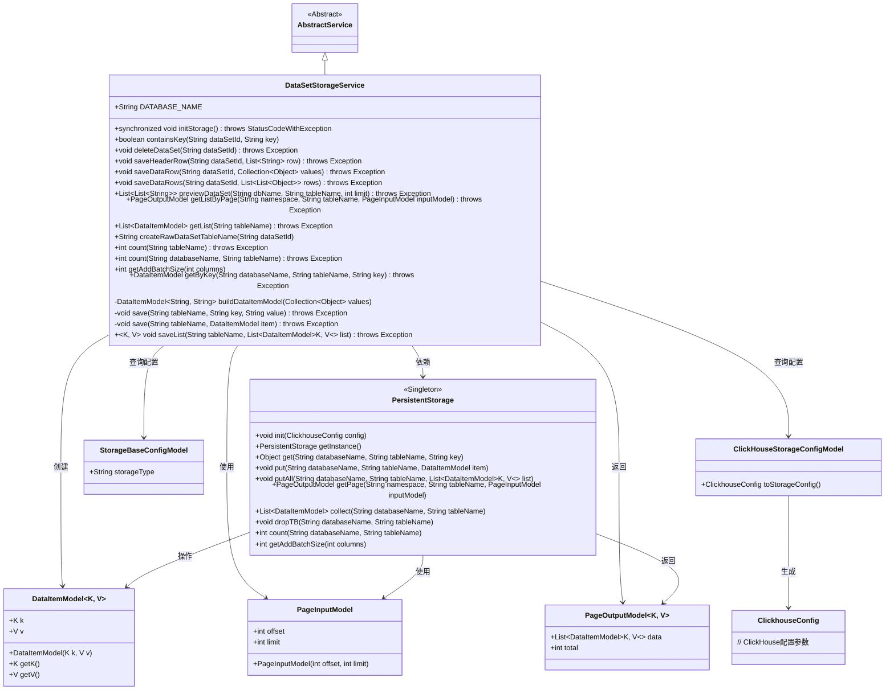
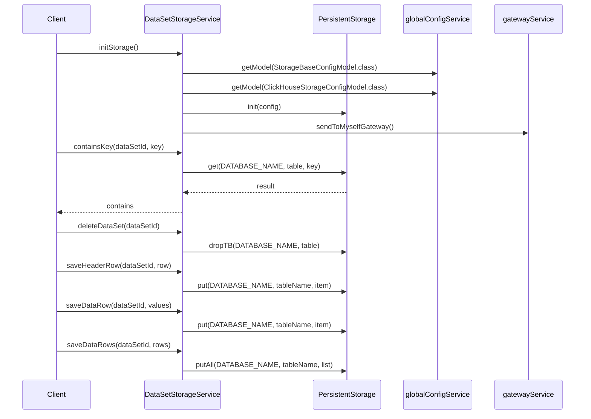

# 基础信息

|      |      |
|------|------|
| 名称 | DataSetStorageService |
| 编码语言 | .java |
| 代码路径 | WeFe/board/board-service/src/main/java/com/welab/wefe/board/service/service/DataSetStorageService.java |
| 包名 | com.welab.wefe.board.service.service |
| 依赖项 | ['com.alibaba.fastjson.JSON', 'com.welab.wefe.common.data.storage.common.Constant', 'com.welab.wefe.common.data.storage.model.DataItemModel', 'com.welab.wefe.common.data.storage.model.PageInputModel', 'com.welab.wefe.common.data.storage.model.PageOutputModel', 'com.welab.wefe.common.data.storage.service.persistent.PersistentStorage', 'com.welab.wefe.common.exception.StatusCodeWithException', 'com.welab.wefe.common.util.StringUtil', 'com.welab.wefe.common.wefe.dto.global_config.storage.ClickHouseStorageConfigModel', 'com.welab.wefe.common.wefe.dto.global_config.storage.StorageBaseConfigModel', 'com.welab.wefe.common.wefe.dto.storage.ClickhouseConfig', 'com.welab.wefe.common.wefe.enums.GatewayProcessorType', 'org.springframework.stereotype.Service', 'java.util.ArrayList', 'java.util.Collection', 'java.util.List', 'java.util.stream.Collectors'] |
| 概述说明 | DataSetStorageService提供数据集存储管理功能，包括初始化存储、检查键存在、删除数据集、保存和读取数据行、分页查询及数据预览等操作，支持ClickHouse存储类型。 |

# 说明

DataSetStorageService是一个用于数据集存储管理的服务类，继承自AbstractService。它提供了初始化存储、检查键是否存在、删除数据集、保存数据集头和行数据、预览数据集、分页读取数据、获取记录数等功能。服务支持多种存储类型，如ClickHouse，并通过PersistentStorage进行底层操作。方法包括同步初始化存储、键值查询、批量数据保存、分页获取数据等，同时处理数据转换和表名生成。

# 类列表 Class Summary

| 名称   | 类型  | 说明 |
|-------|------|-------------|
| DataSetStorageService | class | DataSetStorageService提供数据集存储管理功能，包括初始化存储、检查键存在、删除数据集、保存数据行及元信息、分页查询、计数等操作，支持ClickHouse存储类型。 |

## 类 DataSetStorageService

|      |      |
|------|------|
| 访问范围 | @Service;public |
| 类型 | class |
| 名称 | DataSetStorageService |
| 说明 | DataSetStorageService提供数据集存储管理功能，包括初始化存储、检查键存在、删除数据集、保存数据行及元信息、分页查询、计数等操作，支持ClickHouse存储类型。 |

### UML类图

这段代码展示了一个数据集存储服务`DataSetStorageService`，它继承自`AbstractService`，主要负责数据集的存储、查询、删除等操作。该类通过`PersistentStorage`单例与底层存储系统交互，支持ClickHouse等存储类型。核心功能包括初始化存储、保存数据集头信息/数据行、分页查询、数据集预览等。类图中清晰地展示了与配置模型(`StorageBaseConfigModel`/`ClickHouseStorageConfigModel`)、数据模型(`DataItemModel`)和分页模型(`PageInputModel`/`PageOutputModel`)的关联关系，体现了完整的数据存储处理流程。

### 内部方法调用关系图

```mermaid
graph TD
    A["类DataSetStorageService"]
    B["常量: DATABASE_NAME"]
    C["方法: initStorage()"]
    D["方法: containsKey()"]
    E["方法: deleteDataSet()"]
    F["方法: saveHeaderRow()"]
    G["方法: saveDataRow()"]
    H["方法: saveDataRows()"]
    I["方法: buildDataItemModel()"]
    J["方法: previewDataSet()"]
    K["方法: save()"]
    L["方法: saveList()"]
    M["方法: getListByPage()"]
    N["方法: getList()"]
    O["方法: createRawDataSetTableName()"]
    P["方法: count()"]
    Q["方法: getAddBatchSize()"]
    R["方法: getByKey()"]
    S["调用: PersistentStorage.getInstance()"]

    A --> B
    A --> C
    A --> D
    A --> E
    A --> F
    A --> G
    A --> H
    A --> I
    A --> J
    A --> K
    A --> L
    A --> M
    A --> N
    A --> O
    A --> P
    A --> Q
    A --> R
    D --> S
    E --> S
    F --> S
    G --> S
    H --> S
    J --> S
    K --> S
    L --> S
    M --> S
    N --> S
    P --> S
    Q --> S
    R --> S
```

这段代码实现了一个数据集存储服务，主要功能包括初始化存储、检查键是否存在、删除数据集、保存数据头和行数据、预览数据集等。核心逻辑围绕PersistentStorage类展开，通过调用其方法实现数据持久化操作。流程图中展示了类结构和方法调用关系，时序图则详细描述了关键方法的执行顺序和组件交互过程。该服务支持多种存储类型（如ClickHouse），并通过gatewayService实现通知机制。

### 字段列表 Field List

| 名称  | 类型  | 说明 |
|-------|-------|------|
| DATABASE_NAME = Constant.DBName.WEFE_DATA | String | 静态常量DATABASE_NAME，值为WEFE_DATA，引用自Constant.DBName。 |

### 方法列表

| 名称  | 类型  | 说明 |
|-------|-------|------|
| saveDataRow | void | 保存数据集行数据到指定表，参数为数据集ID和值集合，可能抛出异常。 |
| initStorage | void | 同步方法initStorage根据配置初始化存储，若类型为CLICKHOUSE则加载配置并初始化持久存储，完成后通知gateway刷新。 |
| getListByPage | PageOutputModel | 该方法通过传入命名空间、表名和分页参数，调用持久化存储实例获取分页数据并返回。异常时抛出Exception。 |
| buildDataItemModel | DataItemModel<String, String> | 构建DataItemModel方法，遍历集合，首元素为key，其余元素拼接为逗号分隔字符串返回。 |
| saveHeaderRow | void | 方法saveHeaderRow处理数据集表头行：提取首个元素作为sid，其余为header。将sid和header转为JSON字符串后，保存到以数据集ID命名的.meta表中。 |
| save | void | 该方法用于将数据项保存到指定数据库表中，调用持久化存储接口实现存储操作。 |
| containsKey | boolean | 检查指定数据集表中是否存在某键。若存在返回true，否则false。异常时记录错误并返回false。 |
| previewDataSet | List<List<String>> | 该方法从指定数据库表中获取分页数据，将每行数据的键和逗号分隔的值转为字符串列表，返回包含所有行的列表集合。 |
| getList | List<DataItemModel> | 该方法通过PersistentStorage获取指定表的数据列表，返回DataItemModel集合，可能抛出异常。 |
| createRawDataSetTableName | String | 该方法生成数据集表名，格式为"data_set_"加数据集ID。 |
| count | int | 该方法用于统计指定数据库表的数据行数，调用持久化存储实例的count方法实现，需传入数据库名和表名参数，可能抛出异常。 |
| save | void | 保存数据到持久存储：指定数据库名、表名及键值对。异常时抛出。 |
| saveList | void | Java方法saveList：将DataItemModel列表存入指定数据库表，使用泛型K,V，可能抛出异常。 |
| saveDataRows | void | 方法saveDataRows接收数据集ID和行数据列表，将每行数据转换为DataItemModel对象后，保存到指定数据表。 |
| deleteDataSet | void | 删除指定数据集，通过生成表名并调用持久存储接口删除对应数据库表。 |
| count | int | 该方法通过PersistentStorage实例统计指定数据库表的数据条目数，参数为数据库名和表名，可能抛出异常。 |
| getAddBatchSize | int | 该方法返回指定列数对应的批量添加大小，通过调用PersistentStorage单例的getAddBatchSize方法实现。 |
| getByKey | DataItemModel | 根据数据库名、表名和键值获取数据项，异常时抛出错误。 |

