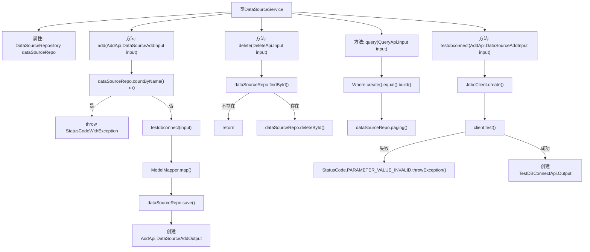

# 基础信息

|      |      |
|------|------|
| 名称 | DataSourceService |
| 编码语言 | .java |
| 代码路径 | WeFe/board/board-service/src/main/java/com/welab/wefe/board/service/service/DataSourceService.java |
| 包名 | com.welab.wefe.board.service.service |
| 依赖项 | ['com.welab.wefe.board.service.api.datasource.AddApi', 'com.welab.wefe.board.service.api.datasource.DeleteApi', 'com.welab.wefe.board.service.api.datasource.QueryApi', 'com.welab.wefe.board.service.api.datasource.TestDBConnectApi', 'com.welab.wefe.board.service.database.entity.DataSourceMysqlModel', 'com.welab.wefe.board.service.database.repository.DataSourceRepository', 'com.welab.wefe.board.service.dto.base.PagingOutput', 'com.welab.wefe.common.StatusCode', 'com.welab.wefe.common.data.mysql.Where', 'com.welab.wefe.common.exception.StatusCodeWithException', 'com.welab.wefe.common.jdbc.JdbcClient', 'com.welab.wefe.common.web.util.CurrentAccountUtil', 'com.welab.wefe.common.web.util.ModelMapper', 'org.springframework.beans.factory.annotation.Autowired', 'org.springframework.data.jpa.domain.Specification', 'org.springframework.stereotype.Service'] |
| 概述说明 | DataSourceService提供数据源管理功能，包括添加（校验名称唯一性、测试连接）、删除和分页查询数据源，以及测试数据库连接。 |

# 说明

DataSourceService是一个服务类，提供数据源管理功能。主要方法包括：添加数据源时检查名称是否重复并测试连接有效性，保存数据源信息；删除指定ID的数据源；分页查询数据源；测试数据库连接是否可用。添加和测试连接时会验证参数有效性，操作失败抛出异常。数据存储使用DataSourceRepository，模型为DataSourceMysqlModel。

# 类列表 Class Summary

| 名称   | 类型  | 说明 |
|-------|------|-------------|
| DataSourceService | class | DataSourceService提供数据源管理功能，包括添加（校验名称唯一性及连接测试）、删除和分页查询数据源，以及测试数据库连接。 |


## 类 DataSourceService

|      |      |
|------|------|
| 访问范围 | @Service;public |
| 类型 | class |
| 名称 | DataSourceService |
| 说明 | DataSourceService提供数据源管理功能，包括添加（校验名称唯一性及连接测试）、删除和分页查询数据源，以及测试数据库连接。 |


### UML类图

```mermaid
classDiagram
    class AbstractService {
        <<Abstract>>
    }

    class DataSourceService {
        -DataSourceRepository dataSourceRepo
        +add(AddApi.DataSourceAddInput input) AddApi.DataSourceAddOutput
        +delete(DeleteApi.Input input) void
        +query(QueryApi.Input input) PagingOutput~QueryApi.Output~
        +testdbconnect(AddApi.DataSourceAddInput input) TestDBConnectApi.Output
    }

    class DataSourceRepository {
        <<Interface>>
        +countByName(String name) long
        +save(DataSourceMysqlModel model) void
        +deleteById(Long id) void
        +findById(Long id) Optional~DataSourceMysqlModel~
        +paging(Specification~DataSourceMysqlModel~ where, QueryApi.Input input, Class~QueryApi.Output~ clazz) PagingOutput~QueryApi.Output~
    }

    class DataSourceMysqlModel {
        -Long id
        -String name
        -String createdBy
        +setCreatedBy(Long id) void
        +getId() Long
    }

    class JdbcClient {
        <<Static>>
        +create(String databaseType, String host, int port, String userName, String password, String databaseName) JdbcClient
        +test() String
    }

    class StatusCodeWithException {
        +StatusCodeWithException(StatusCode code, String message)
    }

    class AddApi {
        class DataSourceAddInput {
            -String name
            -String databaseType
            -String host
            -int port
            -String userName
            -String password
            -String databaseName
        }
        class DataSourceAddOutput {
            -Long id
            +setId(Long id) void
        }
    }

    class DeleteApi {
        class Input {
            -Long id
        }
    }

    class QueryApi {
        class Input {
            -String name
        }
        class Output {
        }
    }

    class TestDBConnectApi {
        class Output {
            -boolean result
            +setResult(boolean result) void
        }
    }

    AbstractService <|-- DataSourceService
    DataSourceService --> DataSourceRepository : 依赖
    DataSourceService --> JdbcClient : 依赖
    DataSourceService --> StatusCodeWithException : 依赖
    DataSourceService --> AddApi.DataSourceAddInput : 使用
    DataSourceService --> AddApi.DataSourceAddOutput : 使用
    DataSourceService --> DeleteApi.Input : 使用
    DataSourceService --> QueryApi.Input : 使用
    DataSourceService --> QueryApi.Output : 使用
    DataSourceService --> TestDBConnectApi.Output : 使用
    DataSourceRepository --> DataSourceMysqlModel : 操作
```

这段代码描述了一个数据源服务类(DataSourceService)，它继承自抽象服务类(AbstractService)，主要提供数据源的增删改查功能。类图中展示了DataSourceService与多个类的交互关系，包括数据访问接口DataSourceRepository、数据库连接测试类JdbcClient、异常类StatusCodeWithException，以及多个API输入输出数据传输对象。服务类通过依赖注入使用数据访问接口来操作数据源模型，同时提供了测试数据库连接的功能。整个设计采用了分层架构，服务层负责业务逻辑，数据访问层负责持久化操作。


### 内部方法调用关系图



这段代码是DataSourceService的实现，主要包含数据源的增删改查和连接测试功能。流程图展示了类结构和主要方法调用关系，包括数据源名称检查、数据库连接测试、模型映射保存等核心流程，以及删除和查询的分支处理。每个方法都通过箭头清晰地展示了其内部调用步骤和异常处理路径。

### 字段列表 Field List

| 名称  | 类型  | 说明 |
|-------|-------|------|
| dataSourceRepo | DataSourceRepository | 自动注入数据源仓库实例。 |

### 方法列表

| 名称  | 类型  | 说明 |
|-------|-------|------|
| testdbconnect | TestDBConnectApi.Output | 测试数据库连接方法，接收输入参数创建JDBC客户端并测试连接，失败抛出异常，成功返回结果。 |
| delete | void | 该方法根据输入ID从数据库查找数据，若存在则删除对应记录。 |
| add | AddApi.DataSourceAddOutput | 方法`add`接收输入参数`input`，检查数据源名称是否已存在，测试数据库连接，映射并保存模型，返回包含ID的输出。若名称重复或连接失败则抛出异常。 |
| query | PagingOutput<QueryApi.Output> | 该方法根据输入参数查询数据源，返回分页结果。使用条件构建器创建查询条件，匹配名称字段，调用仓库的分页方法获取输出。 |


