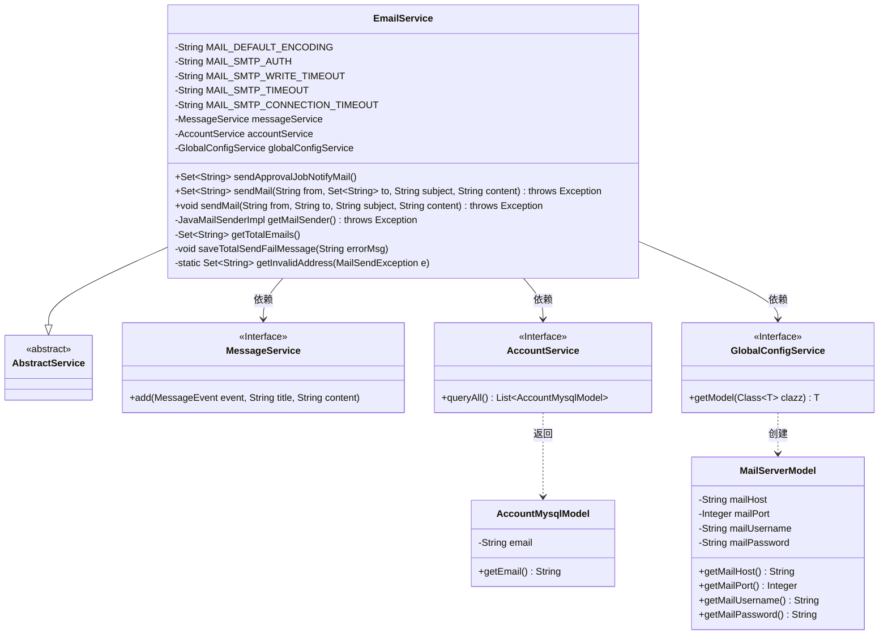
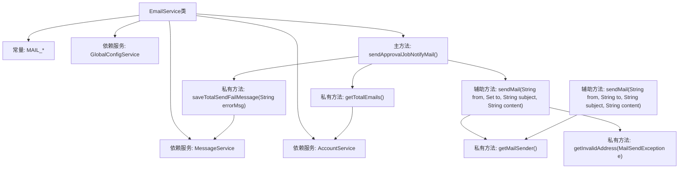

# 基础信息

|      |      |
|------|------|
| 名称 | EmailService |
| 编码语言 | .java |
| 代码路径 | WeFe/board/board-service/src/main/java/com/welab/wefe/board/service/service/EmailService.java |
| 包名 | com.welab.wefe.board.service.service |
| 依赖项 | ['com.welab.wefe.board.service.database.entity.AccountMysqlModel', 'com.welab.wefe.board.service.service.account.AccountService', 'com.welab.wefe.board.service.service.globalconfig.GlobalConfigService', 'com.welab.wefe.common.util.StringUtil', 'com.welab.wefe.common.wefe.dto.global_config.MailServerModel', 'com.welab.wefe.common.wefe.enums.MessageEvent', 'org.apache.commons.collections4.CollectionUtils', 'org.springframework.beans.factory.annotation.Autowired', 'org.springframework.mail.MailSendException', 'org.springframework.mail.javamail.JavaMailSenderImpl', 'org.springframework.mail.javamail.MimeMessageHelper', 'org.springframework.stereotype.Service', 'javax.mail.Address', 'javax.mail.SendFailedException', 'javax.mail.internet.MimeMessage', 'java.util.HashSet', 'java.util.List', 'java.util.Properties', 'java.util.Set'] |
| 概述说明 | EmailService类提供邮件发送功能，支持批量发送审批通知邮件，处理无效地址重试，并记录发送失败信息。依赖全局配置获取SMTP参数，包含超时和编码设置。 |

# 说明

EmailService是一个用于发送邮件的服务类，继承自AbstractService。它包含多个邮件发送相关的方法和配置参数，如编码、SMTP超时设置等。主要功能包括发送审批任务通知邮件、处理发送失败情况、过滤无效收件人地址以及重新发送邮件。服务依赖于MessageService、AccountService和GlobalConfigService来获取收件人列表和邮件服务器配置。发送邮件时，会检查服务器配置是否完整，并处理可能出现的异常，如无效地址或发送失败。失败时会记录错误信息并返回失败地址列表。

# 类列表 Class Summary

| 名称   | 类型  | 说明 |
|-------|------|-------------|
| EmailService | class | EmailService提供邮件发送功能，支持批量发送审批通知邮件，自动过滤无效地址并重试，包含邮件服务器配置和错误处理。 |

## 类 EmailService

|      |      |
|------|------|
| 访问范围 | @Service;public |
| 类型 | class |
| 名称 | EmailService |
| 说明 | EmailService提供邮件发送功能，支持批量发送审批通知邮件，自动过滤无效地址并重试，包含邮件服务器配置和错误处理。 |

### UML类图

这段代码展示了一个邮件服务类`EmailService`，它继承自`AbstractService`，并依赖三个服务接口：`MessageService`、`AccountService`和`GlobalConfigService`。主要功能包括发送审批任务通知邮件、处理邮件发送失败情况、获取邮件服务器配置等。类图中清晰地展示了类之间的继承和依赖关系，以及各个类的成员变量和方法。`EmailService`通过`GlobalConfigService`获取`MailServerModel`配置信息，通过`AccountService`获取`AccountMysqlModel`中的邮箱地址列表，并通过`MessageService`记录发送失败的消息。

### 内部方法调用关系图

这段代码是邮件服务实现类，主要功能包括发送审批任务通知邮件和通用邮件发送功能。流程图展示了核心方法调用关系：主方法sendApprovalJobNotifyMail()通过调用getTotalEmails()获取收件人列表，使用sendMail()方法发送邮件，遇到异常时调用saveTotalSendFailMessage()记录错误。邮件发送核心逻辑依赖getMailSender()创建邮件发送器，并处理无效地址等异常情况。整个过程体现了邮件发送的完整流程和异常处理机制。

### 字段列表 Field List

| 名称  | 类型  | 说明 |
|-------|-------|------|
| globalConfigService | GlobalConfigService | 代码片段使用@Autowired注解自动注入GlobalConfigService实例。 |
| MAIL_DEFAULT_ENCODING = "UTF-8" | String | 定义常量字符串MAIL_DEFAULT_ENCODING，值为UTF-8，表示邮件默认编码格式。 |
| accountService | AccountService | 使用@Autowired自动注入AccountService实例。 |
| MAIL_SMTP_CONNECTION_TIMEOUT = "30000" | String | 定义邮件SMTP连接超时时间为30000毫秒。 |
| MAIL_SMTP_AUTH = "true" | String | 代码定义了一个静态常量字符串MAIL_SMTP_AUTH，值为"true"，用于SMTP认证配置。 |
| MAIL_SMTP_WRITE_TIMEOUT = "30000" | String | 定义邮件SMTP写超时时间为30000毫秒的静态常量。 |
| messageService | MessageService | 自动注入MessageService实例。 |
| MAIL_SMTP_TIMEOUT = "30000" | String | 代码定义了一个私有静态常量字符串MAIL_SMTP_TIMEOUT，值为"30000"，表示SMTP邮件发送超时时间为30秒。 |

### 方法列表

| 名称  | 类型  | 说明 |
|-------|-------|------|
| getMailSender | JavaMailSenderImpl | 获取邮件发送器实例，检查服务器配置必填项，设置SMTP参数并返回JavaMailSenderImpl对象。 |
| sendApprovalJobNotifyMail | Set<String> | 方法发送审批任务邮件，处理失败情况：检查收件人列表，发送失败时过滤无效地址重发，记录错误信息。 |
| getTotalEmails | Set<String> | 该方法查询所有账户的邮箱，过滤空值后存入Set返回。 |
| saveTotalSendFailMessage | void | 方法saveTotalSendFailMessage记录审批任务邮件发送失败信息，调用messageService.add存储事件类型、标题和错误消息。 |
| sendMail | void | 该方法用于发送邮件，包含发件人、收件人、主题和内容参数，使用JavaMailSender发送邮件，捕获并记录异常后重新抛出。 |
| sendMail | Set<String> | Java邮件发送方法：使用JavaMailSender发送带附件的邮件，处理无效地址异常并返回无效地址集合，其他异常直接抛出。成功返回空集合。 |
| getInvalidAddress | Set<String> | 该方法从邮件发送异常中提取无效地址，遍历失败消息中的异常，若为SendFailedException则收集无效地址到集合并返回。 |

