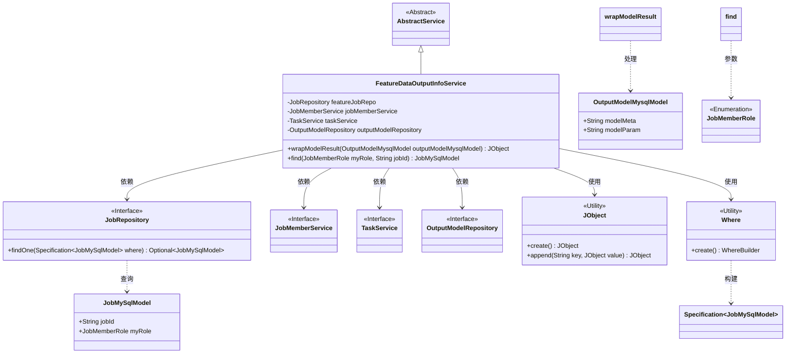
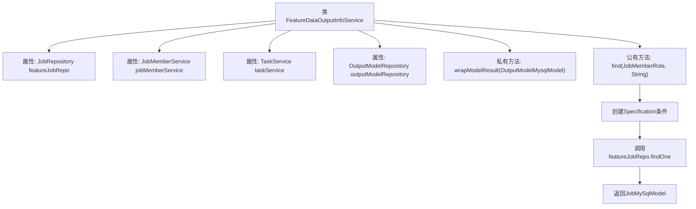

# 基础信息

|      |      |
|------|------|
| 名称 | FeatureDataOutputInfoService |
| 编码语言 | .java |
| 代码路径 | WeFe/board/board-service/src/main/java/com/welab/wefe/board/service/service/FeatureDataOutputInfoService.java |
| 包名 | com.welab.wefe.board.service.service |
| 依赖项 | ['com.welab.wefe.board.service.database.entity.OutputModelMysqlModel', 'com.welab.wefe.board.service.database.entity.job.JobMySqlModel', 'com.welab.wefe.board.service.database.repository.JobRepository', 'com.welab.wefe.board.service.database.repository.OutputModelRepository', 'com.welab.wefe.common.data.mysql.Where', 'com.welab.wefe.common.util.JObject', 'com.welab.wefe.common.wefe.enums.JobMemberRole', 'org.springframework.beans.factory.annotation.Autowired', 'org.springframework.data.jpa.domain.Specification', 'org.springframework.stereotype.Service'] |
| 概述说明 | FeatureDataOutputInfoService类继承AbstractService，包含任务查询和结果封装功能。通过JobRepository等依赖实现任务模糊匹配，wrapModelResult方法封装模型元数据和参数。 |

# 说明

该代码定义了一个名为FeatureDataOutputInfoService的Spring服务类，继承自AbstractService。它注入了四个依赖项：JobRepository、JobMemberService、TaskService和OutputModelRepository。类中包含两个主要方法：wrapModelResult用于将OutputModelMysqlModel对象封装为JObject格式；find方法通过任务ID和角色进行模糊匹配查询JobMySqlModel记录，使用Specification构建查询条件并从featureJobRepo获取结果。整个类主要处理特征数据输出相关的业务逻辑。

# 类列表 Class Summary

| 名称   | 类型  | 说明 |
|-------|------|-------------|
| FeatureDataOutputInfoService | class | FeatureDataOutputInfoService服务类，包含包装模型结果和基于任务ID及名称模糊匹配任务记录的功能。依赖JobRepository等组件，提供数据操作支持。 |

## 类 FeatureDataOutputInfoService

|      |      |
|------|------|
| 访问范围 | @Service;public |
| 类型 | class |
| 名称 | FeatureDataOutputInfoService |
| 说明 | FeatureDataOutputInfoService服务类，包含包装模型结果和基于任务ID及名称模糊匹配任务记录的功能。依赖JobRepository等组件，提供数据操作支持。 |

### UML类图

该类图展示了FeatureDataOutputInfoService的核心结构及其依赖关系。作为AbstractService的子类，它通过四个接口（JobRepository、JobMemberService、TaskService、OutputModelRepository）实现数据访问，并依赖JObject和Where工具类进行数据处理。主要方法wrapModelResult用于封装模型结果，find方法通过条件查询获取任务记录。枚举类型JobMemberRole和实体类JobMySqlModel、OutputModelMysqlModel共同构成了业务模型基础。

### 内部方法调用关系图

这段代码展示了一个Spring服务类FeatureDataOutputInfoService，它继承自AbstractService并包含四个自动注入的依赖项。主要功能包括：1) wrapModelResult私有方法用于封装输出模型的元数据和参数到JObject；2) find公有方法通过任务ID和成员角色进行模糊匹配查询，使用Specification构建查询条件并通过repository获取数据。流程图清晰展示了类结构、属性依赖和方法调用关系，特别是find方法的查询流程从条件构建到结果返回的完整过程。

### 字段列表 Field List

| 名称  | 类型  | 说明 |
|-------|-------|------|
| jobMemberService | JobMemberService | 使用@Autowired自动注入JobMemberService实例。 |
| taskService | TaskService | 自动注入TaskService实例。 |
| outputModelRepository | OutputModelRepository | 使用@Autowired自动注入OutputModelRepository实例。 |
| featureJobRepo | JobRepository | 使用@Autowired自动注入JobRepository实例featureJobRepo。 |

### 方法列表

| 名称  | 类型  | 说明 |
|-------|-------|------|
| wrapModelResult | JObject | 将OutputModelMysqlModel对象转换为包含model_meta和model_param的JObject，若输入为空则返回空对象。 |
| find | JobMySqlModel | 该方法根据角色和任务ID查询数据库，返回匹配的JobMySqlModel对象。使用Specification构建查询条件，若未找到则返回null。 |

