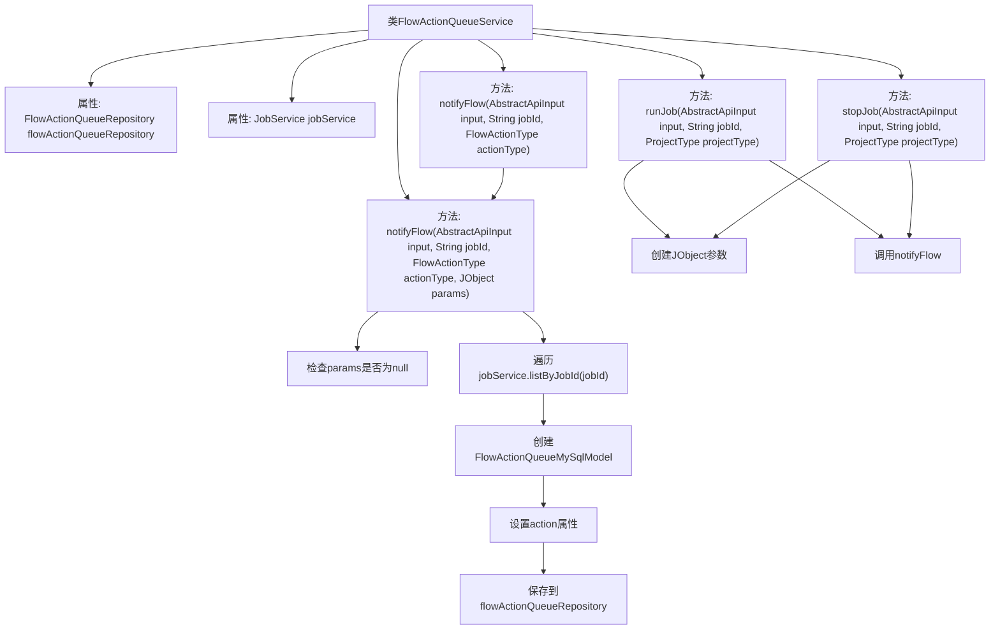

# 基础信息

|      |      |
|------|------|
| 名称 | FlowActionQueueService |
| 编码语言 | .java |
| 代码路径 | WeFe/board/board-service/src/main/java/com/welab/wefe/board/service/service/FlowActionQueueService.java |
| 包名 | com.welab.wefe.board.service.service |
| 依赖项 | ['com.welab.wefe.board.service.database.entity.flow.FlowActionQueueMySqlModel', 'com.welab.wefe.board.service.database.entity.job.JobMySqlModel', 'com.welab.wefe.board.service.database.repository.FlowActionQueueRepository', 'com.welab.wefe.common.util.JObject', 'com.welab.wefe.common.web.dto.AbstractApiInput', 'com.welab.wefe.common.wefe.enums.FlowActionType', 'com.welab.wefe.common.wefe.enums.ProducerType', 'com.welab.wefe.common.wefe.enums.ProjectType', 'org.springframework.beans.factory.annotation.Autowired', 'org.springframework.stereotype.Service'] |
| 概述说明 | FlowActionQueueService提供运行和停止任务功能，根据项目类型设置参数，并通过notifyFlow方法将操作消息发送至流服务。 |

# 说明

FlowActionQueueService是一个服务类，继承自AbstractService。它通过FlowActionQueueRepository和JobService进行依赖注入。主要功能包括运行和停止任务，并通过notifyFlow方法向流服务发送操作消息。runJob和stopJob方法根据项目类型设置参数，并调用notifyFlow。notifyFlow方法处理输入参数，创建FlowActionQueueMySqlModel对象，设置操作类型、生产者类型、优先级和参数，最后保存到数据库。参数中包含任务ID和目标角色信息。

# 类列表 Class Summary

| 名称   | 类型  | 说明 |
|-------|------|-------------|
| FlowActionQueueService | class | FlowActionQueueService处理任务运行和停止操作，根据项目类型设置参数，并通过notifyFlow方法向流服务发送动作消息，保存到队列中。 |


## 类 FlowActionQueueService

|      |      |
|------|------|
| 访问范围 | @Service;public |
| 类型 | class |
| 名称 | FlowActionQueueService |
| 说明 | FlowActionQueueService处理任务运行和停止操作，根据项目类型设置参数，并通过notifyFlow方法向流服务发送动作消息，保存到队列中。 |


### UML类图

```mermaid
classDiagram
    class AbstractService {
        <<Abstract>>
    }

    class FlowActionQueueService {
        -FlowActionQueueRepository flowActionQueueRepository
        -JobService jobService
        +runJob(AbstractApiInput input, String jobId, ProjectType projectType) void
        +stopJob(AbstractApiInput input, String jobId, ProjectType projectType) void
        +notifyFlow(AbstractApiInput input, String jobId, FlowActionType actionType) void
        +notifyFlow(AbstractApiInput input, String jobId, FlowActionType actionType, JObject params) void
    }

    class FlowActionQueueRepository {
        <<Interface>>
        +save(FlowActionQueueMySqlModel action) void
    }

    class JobService {
        <<Interface>>
        +listByJobId(String jobId) List~JobMySqlModel~
    }

    class AbstractApiInput {
        <<Abstract>>
        +fromGateway() boolean
    }

    class FlowActionQueueMySqlModel {
        -FlowActionType action
        -ProducerType producer
        -int priority
        -String params
        +setAction(FlowActionType action) void
        +setProducer(ProducerType producer) void
        +setPriority(int priority) void
        +setParams(String params) void
    }

    class JobMySqlModel {
        -String jobId
        -RoleType myRole
        +getJobId() String
        +getMyRole() RoleType
    }

    class JObject {
        +create(String key, Object value) JObject
        +put(String key, Object value) JObject
        +toStringWithNull() String
    }

    enum ProjectType {
        DeepLearning
    }

    enum FlowActionType {
        run_job
        stop_job
    }

    enum ProducerType {
        gateway
        board
    }

    enum RoleType {
        <<Enumeration>>
    }

    AbstractService <|-- FlowActionQueueService
    FlowActionQueueService --> FlowActionQueueRepository : 依赖
    FlowActionQueueService --> JobService : 依赖
    FlowActionQueueService --> AbstractApiInput : 依赖
    FlowActionQueueService --> JObject : 依赖
    JobService --> JobMySqlModel : 依赖
    FlowActionQueueRepository --> FlowActionQueueMySqlModel : 依赖
    JobMySqlModel --> RoleType : 依赖
```

该代码实现了一个流程动作队列服务，主要功能包括启动作业、停止作业和通知流程服务。类图展示了核心类及其关系：FlowActionQueueService继承自AbstractService，依赖JobService和FlowActionQueueRepository来处理作业和动作队列，使用JObject构建参数，通过枚举类型区分不同项目类型、动作类型和生产者类型。服务通过抽象输入参数和模型对象进行数据交互，实现了流程动作的创建和持久化。


### 内部方法调用关系图



这段代码是FlowActionQueueService类的实现，主要用于处理流程动作队列的相关操作。它包含两个主要方法runJob和stopJob，这两个方法都会根据项目类型创建不同的JObject参数，并调用notifyFlow方法。notifyFlow方法有两个重载版本，核心逻辑在带参数的版本中，它会遍历指定jobId的所有任务，为每个任务创建FlowActionQueueMySqlModel对象，设置相关属性后保存到数据库。整个过程实现了将流程动作消息发送到流服务的功能。

### 字段列表 Field List

| 名称  | 类型  | 说明 |
|-------|-------|------|
| flowActionQueueRepository | FlowActionQueueRepository | 自动注入FlowActionQueueRepository实例。 |
| jobService | JobService | 自动注入JobService实例。 |

### 方法列表

| 名称  | 类型  | 说明 |
|-------|-------|------|
| stopJob | void | 该方法根据项目类型停止指定任务。若为DeepLearning类型，设置参数为visualfl，否则为null，然后通知流程停止任务。 |
| runJob | void | 方法runJob根据项目类型设置参数，若为DeepLearning则创建包含"type":"visualfl"的JObject，否则为null，随后调用notifyFlow通知流程执行任务。 |
| notifyFlow | void | 方法notifyFlow接收输入参数input、jobId和actionType，调用重载方法并传递null作为第四个参数。 |
| notifyFlow | void | 方法notifyFlow接收输入参数、任务ID、动作类型和参数，若参数为空则初始化。遍历任务列表，创建流程动作队列对象，设置动作类型、生产者、优先级和参数（包含任务ID和目标角色），最后保存动作队列。 |


