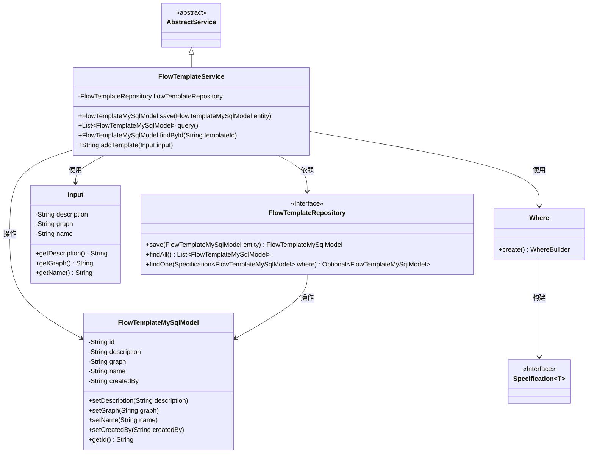
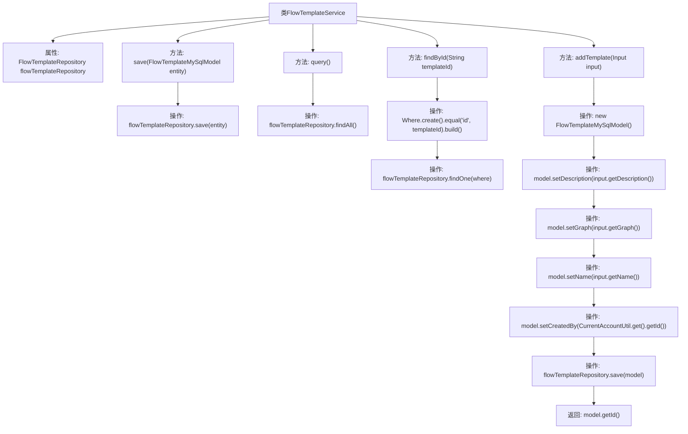

# 基础信息

|      |      |
|------|------|
| 名称 | FlowTemplateService |
| 编码语言 | .java |
| 代码路径 | WeFe/board/board-service/src/main/java/com/welab/wefe/board/service/service/FlowTemplateService.java |
| 包名 | com.welab.wefe.board.service.service |
| 依赖项 | ['com.welab.wefe.board.service.api.project.flow.SaveFlowTemplateApi.Input', 'com.welab.wefe.board.service.database.entity.flow.FlowTemplateMySqlModel', 'com.welab.wefe.board.service.database.repository.FlowTemplateRepository', 'com.welab.wefe.common.data.mysql.Where', 'com.welab.wefe.common.web.util.CurrentAccountUtil', 'org.springframework.beans.factory.annotation.Autowired', 'org.springframework.data.jpa.domain.Specification', 'org.springframework.stereotype.Service', 'java.util.List'] |
| 概述说明 | FlowTemplateService提供流程模板的增删改查功能，包括保存、查询、按ID查找及添加模板，使用FlowTemplateRepository操作数据库。 |

# 说明

FlowTemplateService是一个Spring服务类，继承自AbstractService。它通过FlowTemplateRepository进行数据库操作，提供保存、查询和按ID查找FlowTemplateMySqlModel的功能。具体方法包括：save用于保存实体，query返回所有记录，findById通过ID精确查询。addTemplate方法接收Input对象，构建FlowTemplateMySqlModel并设置描述、流程图、名称和创建者信息后保存，返回生成的ID。

# 类列表 Class Summary

| 名称   | 类型  | 说明 |
|-------|------|-------------|
| FlowTemplateService | class | FlowTemplateService提供流程模板的增查功能，包括保存、查询全部、按ID查找及新增模板，使用Repository操作数据库。 |

## 类 FlowTemplateService

|      |      |
|------|------|
| 访问范围 | @Service;public |
| 类型 | class |
| 名称 | FlowTemplateService |
| 说明 | FlowTemplateService提供流程模板的增查功能，包括保存、查询全部、按ID查找及新增模板，使用Repository操作数据库。 |

### UML类图

该类图展示了FlowTemplateService作为核心服务类，继承自AbstractService，通过FlowTemplateRepository接口操作FlowTemplateMySqlModel实体。服务类包含CRUD方法，其中addTemplate方法接收Input参数创建新模板，findById使用Where构建Specification进行查询。整体结构体现了Spring服务层典型的数据访问模式，包含实体操作、条件查询和依赖注入关系。

### 内部方法调用关系图

该流程图展示了FlowTemplateService类的结构和方法调用关系。类包含四个主要方法：save()用于保存实体，query()查询所有记录，findById()通过ID查找记录，addTemplate()创建新模板。其中addTemplate()方法流程最复杂，涉及模型创建、属性设置、保存操作和返回ID。所有方法都通过flowTemplateRepository与数据库交互，体现了典型的Spring服务层设计模式。

### 字段列表 Field List

| 名称  | 类型  | 说明 |
|-------|-------|------|
| flowTemplateRepository | FlowTemplateRepository | 自动注入流程模板仓库实例。 |

### 方法列表

| 名称  | 类型  | 说明 |
|-------|-------|------|
| addTemplate | String | 该方法接收输入参数，创建流程模板模型并设置描述、图表、名称和创建者，保存后返回模板ID。 |
| query | List<FlowTemplateMySqlModel> | 查询并返回所有流程模板数据列表。 |
| save | FlowTemplateMySqlModel | 保存FlowTemplateMySqlModel实体到数据库，返回保存后的实体。 |
| findById | FlowTemplateMySqlModel | 该方法通过模板ID查询FlowTemplateMySqlModel数据。使用Where条件构建器创建查询条件，匹配id字段与传入参数templateId相等，最后调用repository的findOne方法获取结果，若无结果则返回null。 |

