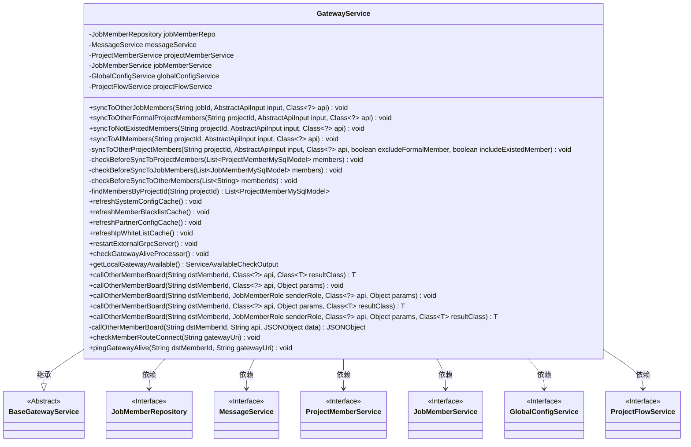

# 基础信息

|      |      |
|------|------|
| 名称 | GatewayService |
| 编码语言 | .java |
| 代码路径 | WeFe/board/board-service/src/main/java/com/welab/wefe/board/service/service/GatewayService.java |
| 包名 | com.welab.wefe.board.service.service |
| 依赖项 | ['com.alibaba.fastjson.JSONObject', 'com.welab.wefe.board.service.api.project.flow', 'com.welab.wefe.board.service.api.project.node.UpdateApi', 'com.welab.wefe.board.service.api.project.project.AddApi', 'com.welab.wefe.board.service.api.service.AliveApi', 'com.welab.wefe.board.service.database.entity.job.JobMemberMySqlModel', 'com.welab.wefe.board.service.database.entity.job.ProjectFlowMySqlModel', 'com.welab.wefe.board.service.database.entity.job.ProjectMemberMySqlModel', 'com.welab.wefe.board.service.database.repository.JobMemberRepository', 'com.welab.wefe.board.service.exception.MemberGatewayException', 'com.welab.wefe.board.service.service.globalconfig.GlobalConfigService', 'com.welab.wefe.common.StatusCode', 'com.welab.wefe.common.exception.StatusCodeWithException', 'com.welab.wefe.common.util.JObject', 'com.welab.wefe.common.util.StringUtil', 'com.welab.wefe.common.web.api.base.Api', 'com.welab.wefe.common.web.dto.AbstractApiInput', 'com.welab.wefe.common.web.dto.ApiResult', 'com.welab.wefe.common.wefe.checkpoint.dto.ServiceAvailableCheckOutput', 'com.welab.wefe.common.wefe.dto.global_config.GatewayConfigModel', 'com.welab.wefe.common.wefe.enums.AuditStatus', 'com.welab.wefe.common.wefe.enums.FederatedLearningType', 'com.welab.wefe.common.wefe.enums.GatewayProcessorType', 'com.welab.wefe.common.wefe.enums.JobMemberRole', 'net.jodah.expiringmap.ExpiringMap', 'org.apache.commons.lang.StringUtils', 'org.springframework.beans.factory.annotation.Autowired', 'org.springframework.stereotype.Service', 'java.util.List', 'java.util.concurrent.TimeUnit', 'java.util.stream.Collectors'] |
| 概述说明 | GatewayService类提供消息同步功能，支持向项目成员或任务成员广播消息，包含黑名单检查、通信状态验证及多种缓存刷新操作。 |

# 说明

GatewayService是一个基于Spring的服务类，继承自BaseGatewayService，主要用于处理消息同步和网关通信。它通过多个自动装配的依赖项（如JobMemberRepository、MessageService等）实现功能。核心功能包括向任务成员和项目成员同步消息，支持不同过滤条件（如排除非正式成员或已退出成员）。在同步前会进行黑名单检查和通信状态验证，确保消息可靠传递。此外，还提供网关缓存更新（如系统配置、黑名单等）、网关存活检查、路由连接测试等功能。通过callOtherMemberBoard方法实现与其他成员网关的通信，支持多种API调用和结果处理。

# 类列表 Class Summary

| 名称   | 类型  | 说明 |
|-------|------|-------------|
| GatewayService | class | GatewayService类提供消息同步功能，支持向项目成员广播消息，检查成员状态，并管理网关缓存更新。包含黑名单检查、通信状态验证及多种同步策略。 |

## 类 GatewayService

|      |      |
|------|------|
| 访问范围 | @Service;public |
| 类型 | class |
| 名称 | GatewayService |
| 说明 | GatewayService类提供消息同步功能，支持向项目成员广播消息，检查成员状态，并管理网关缓存更新。包含黑名单检查、通信状态验证及多种同步策略。 |

### UML类图

这段代码展示了一个网关服务类`GatewayService`，它继承自`BaseGatewayService`，并依赖多个服务接口如`JobMemberRepository`、`MessageService`等。主要功能包括向项目成员同步消息、检查成员状态、刷新缓存配置以及与其他成员的网关进行通信。类中包含了多个公有和私有方法，用于处理不同类型的消息同步和网关操作，体现了复杂的业务逻辑和严格的成员状态检查机制。

### 内部方法调用关系图

```mermaid
graph TD
    A[GatewayService]
    B["属性: JobMemberRepository jobMemberRepo"]
    C["属性: MessageService messageService"]
    D["属性: ProjectMemberService projectMemberService"]
    E["属性: JobMemberService jobMemberService"]
    F["属性: GlobalConfigService globalConfigService"]
    G["属性: ProjectFlowService projectFlowService"]
    H["方法: syncToOtherJobMembers"]
    I["方法: syncToOtherProjectMembers"]
    J["方法: checkBeforeSyncToProjectMembers"]
    K["方法: checkBeforeSyncToJobMembers"]
    L["方法: checkBeforeSyncToOtherMembers"]
    M["方法: findMembersByProjectId"]
    N["方法: callOtherMemberBoard"]
    O["方法: refreshSystemConfigCache"]
    P["方法: refreshMemberBlacklistCache"]
    Q["方法: refreshPartnerConfigCache"]
    R["方法: refreshIpWhiteListCache"]
    S["方法: restartExternalGrpcServer"]
    T["方法: checkGatewayAliveProcessor"]
    U["方法: getLocalGatewayAvailable"]
    V["方法: checkMemberRouteConnect"]
    W["方法: pingGatewayAlive"]

    A --> B
    A --> C
    A --> D
    A --> E
    A --> F
    A --> G
    A --> H
    A --> I
    I --> J
    I --> K
    J --> L
    K --> L
    I --> M
    I --> N
    A --> O
    A --> P
    A --> Q
    A --> R
    A --> S
    A --> T
    A --> U
    A --> V
    A --> W
```

这段代码展示了一个GatewayService类，它继承自BaseGatewayService，主要用于处理消息同步和网关通信。类中包含多个属性注入和方法定义，核心功能包括：向项目成员同步消息、检查成员状态、调用其他成员板、刷新各种缓存配置以及检查网关连通性等。方法之间存在多层调用关系，如syncToOtherProjectMembers会调用checkBeforeSyncToProjectMembers和findMembersByProjectId等方法，最终通过callOtherMemberBoard完成消息传递。整个类设计用于处理分布式环境下的消息广播和网关通信，具有完善的异常处理和状态检查机制。

### 字段列表 Field List

| 名称  | 类型  | 说明 |
|-------|-------|------|
| jobMemberRepo | JobMemberRepository | 自动注入JobMemberRepository实例到jobMemberRepo变量。 |
| projectMemberService | ProjectMemberService | 自动注入ProjectMemberService实例。 |
| jobMemberService | JobMemberService | 自动注入JobMemberService服务实例。 |
| projectFlowService | ProjectFlowService | 使用@Autowired自动注入ProjectFlowService实例。 |
| globalConfigService | GlobalConfigService | 使用@Autowired自动注入GlobalConfigService实例。 |
| messageService | MessageService | 自动注入消息服务实例。 |
| CACHE_MAP = ExpiringMap.builder().expiration(60, TimeUnit.SECONDS).maxSize(500).build() | ExpiringMap<String, Object> | 定义了一个受保护的静态最终缓存映射CACHE_MAP，使用ExpiringMap构建，设置60秒过期时间，最大容量500。 |

### 方法列表

| 名称  | 类型  | 说明 |
|-------|-------|------|
| syncToOtherJobMembers | void | 该方法用于同步任务信息给其他成员。若请求来自网关或当前用户不在任务中则直接返回。否则检查成员列表，遍历调用其他成员的接口进行信息同步，跳过自身。 |
| restartExternalGrpcServer | void | 方法restartExternalGrpcServer通过sendToMyselfGateway发送空消息和重启指令，可能抛出StatusCodeWithException异常。 |
| syncToOtherProjectMembers | void | 该方法用于同步项目成员操作：检查请求来源，过滤非成员或特定角色，处理流程相关操作，跳过特定条件成员后调用成员接口。 |
| refreshMemberBlacklistCache | void | 刷新成员黑名单缓存方法，通过网关发送请求处理，可能抛出异常。 |
| syncToNotExistedMembers | void | 同步数据到不存在的项目成员，调用syncToOtherProjectMembers方法，传入项目ID、输入参数、API类及两个false标志，可能抛出StatusCodeWithException异常。 |
| syncToOtherFormalProjectMembers | void | 同步项目成员信息到其他正式项目成员，调用内部方法处理同步逻辑，可能抛出异常。 |
| refreshIpWhiteListCache | void | 该方法用于刷新IP白名单缓存，通过向自身网关发送空消息并指定处理器类型来实现。若失败则抛出异常。 |
| checkBeforeSyncToOtherMembers | void | 方法检查成员列表有效性：剔除自身并去重，检查黑名单成员和通信状态，避免广播失败。 |
| syncToAllMembers | void | 同步项目数据给所有成员，调用syncToOtherProjectMembers方法，传入项目ID、输入参数和API类，不跳过自己且包含所有成员。 |
| callOtherMemberBoard | void | 调用其他成员板的公共方法，参数包括目标成员ID、发送者角色、API类和参数，可能抛出状态码异常。 |
| refreshSystemConfigCache | void | 该方法用于刷新系统配置缓存，通过网关发送请求给自身处理，可能抛出StatusCodeWithException异常。 |
| checkBeforeSyncToJobMembers | void | 该方法检查成员列表中的成员ID，并调用另一个方法进行同步前的验证。 |
| callOtherMemberBoard | T | 调用其他成员板的通用方法，传入目标成员ID、API类、参数和返回类型，可能抛出StatusCodeWithException异常。 |
| callOtherMemberBoard | void | Java方法：调用其他成员板，参数包括目标成员ID、API类和参数对象，可能抛出StatusCodeWithException异常。 |
| findMembersByProjectId | List<ProjectMemberMySqlModel> | 该方法通过项目ID查找成员列表，过滤掉发起人作为提供者的重复记录，避免多次通知发起人。返回处理后的成员列表。 |
| checkBeforeSyncToProjectMembers | void | 该方法检查项目成员列表，提取成员ID后调用另一个方法进行同步前验证。 |
| callOtherMemberBoard | T | 该方法通过网关调用其他成员接口，发送请求参数并处理返回结果。检查API结果是否成功，失败则抛出异常。成功时根据返回类型转换数据，支持JObject或指定类。 |
| callOtherMemberBoard | JSONObject | 私有方法callOtherMemberBoard通过POST请求调用其他成员板的API，发送JSON数据并返回结果。参数包括目标成员ID、API地址和数据。异常可能抛出StatusCodeWithException。 |
| checkMemberRouteConnect | void | 检查成员路由连接，若网关URI为空则使用内网基础URI，构造请求实体并发送至自身网关处理。 |
| pingGatewayAlive | void | 方法pingGatewayAlive向目标网关发送存活检测，参数为目标成员ID和网关URI，异常可能抛出StatusCodeWithException。 |
| refreshPartnerConfigCache | void | 该方法用于刷新合作伙伴配置缓存，通过网关发送请求给自身处理。 |
| callOtherMemberBoard | T | 这是一个Java方法，用于调用其他成员板的API，接收目标成员ID、API类和返回类型，可能抛出异常。 |
| getLocalGatewayAvailable | ServiceAvailableCheckOutput | 该方法通过本地网关发送请求，检查服务可用性，并返回结果对象。 |
| checkGatewayAliveProcessor | void | 方法检查网关存活，发送空消息至自身网关，处理器类型为gatewayAliveProcessor，可能抛出StatusCodeWithException异常。 |

