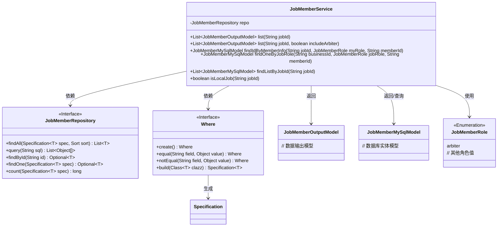
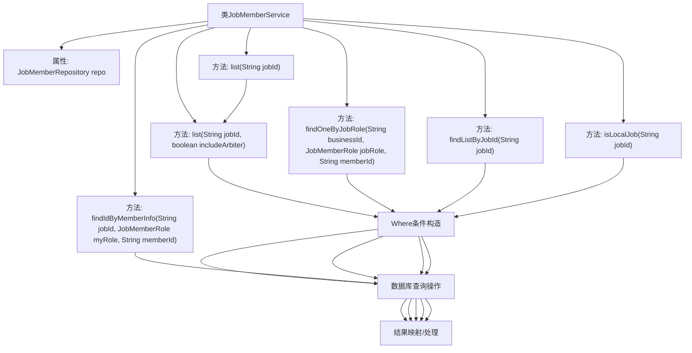
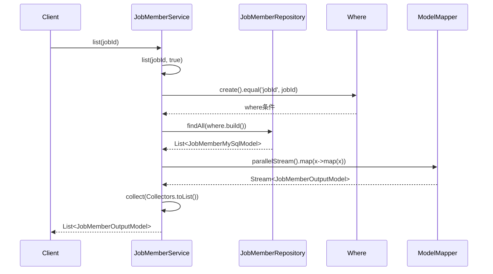

# 基础信息

|      |      |
|------|------|
| 名称 | JobMemberService |
| 编码语言 | .java |
| 代码路径 | WeFe/board/board-service/src/main/java/com/welab/wefe/board/service/service/JobMemberService.java |
| 包名 | com.welab.wefe.board.service.service |
| 依赖项 | ['com.alibaba.fastjson.JSONArray', 'com.welab.wefe.board.service.database.entity.job.JobMemberMySqlModel', 'com.welab.wefe.board.service.database.repository.JobMemberRepository', 'com.welab.wefe.board.service.dto.entity.job.JobMemberOutputModel', 'com.welab.wefe.common.data.mysql.Where', 'com.welab.wefe.common.web.util.ModelMapper', 'com.welab.wefe.common.wefe.enums.JobMemberRole', 'org.springframework.beans.factory.annotation.Autowired', 'org.springframework.data.domain.Sort', 'org.springframework.data.jpa.domain.Specification', 'org.springframework.stereotype.Service', 'java.util.List', 'java.util.stream.Collectors'] |
| 概述说明 | JobMemberService提供任务成员查询功能，包括按任务ID获取成员列表、排除仲裁者、条件组合查询及本地任务判断。 |

# 说明

JobMemberService是一个服务类，提供与任务成员相关的操作。主要功能包括：获取任务成员列表，支持按角色过滤；通过任务ID、成员角色和成员ID查询单个成员；根据任务ID查询成员列表；检查任务是否为本地任务。方法使用Where条件构建查询，并通过Repository执行数据库操作。部分方法涉及并行流处理和模型映射转换。

# 类列表 Class Summary

| 名称   | 类型  | 说明 |
|-------|------|-------------|
| JobMemberService | class | JobMemberService提供作业成员管理功能，包括查询成员列表、按条件查找成员、检查本地作业等。支持按角色、ID等条件筛选，使用并行流处理数据转换。 |

## 类 JobMemberService

|      |      |
|------|------|
| 访问范围 | @Service;public |
| 类型 | class |
| 名称 | JobMemberService |
| 说明 | JobMemberService提供作业成员管理功能，包括查询成员列表、按条件查找成员、检查本地作业等。支持按角色、ID等条件筛选，使用并行流处理数据转换。 |

### UML类图

该代码展示了一个作业成员服务类(JobMemberService)，主要提供作业成员相关的数据库操作功能。类图清晰地呈现了服务类与仓库接口(JobMemberRepository)、条件构造器(Where)、数据模型(JobMemberOutputModel/JobMemberMySqlModel)以及枚举类型(JobMemberRole)之间的关系。服务类通过仓库接口进行数据访问，使用Where构建查询条件，处理两种不同的数据模型，并利用枚举类型区分成员角色。其中包含列表查询、条件查询、本地作业判断等多种业务方法，体现了完整的成员管理功能。

### 内部方法调用关系图

这段代码是JobMemberService服务类，主要处理与工作成员相关的业务逻辑。它提供了多种查询方法，包括获取成员列表、根据条件查询单个成员、查询成员列表以及判断是否为本地工作等。核心流程是通过Where类构建查询条件，然后调用Repository进行数据库操作，最后对结果进行映射或处理。特别注意包含并行流处理和条件过滤等高级特性，体现了对性能和数据完整性的考虑。

### 字段列表 Field List

| 名称  | 类型  | 说明 |
|-------|-------|------|
| repo | JobMemberRepository | 自动注入JobMemberRepository实例到repo变量。 |

### 方法列表

| 名称  | 类型  | 说明 |
|-------|-------|------|
| list | List<JobMemberOutputModel> | 方法根据jobId查询任务成员列表，可选是否包含仲裁者，结果按角色排序并映射为输出模型。 |
| findOneByJobRole | JobMemberMySqlModel | 方法根据业务ID、职位角色和成员ID查询JobMemberMySqlModel记录，返回匹配结果或null。 |
| findIdByMemberInfo | JobMemberMySqlModel | 方法通过SQL查询根据jobId、角色和memberId查找job_member表的id，若存在则返回对应实体，否则返回null。 |
| list | List<JobMemberOutputModel> | 这是一个Java方法，根据jobId列出JobMemberOutputModel对象列表，默认包含所有成员。 |
| findListByJobId | List<JobMemberMySqlModel> | 根据jobId查询JobMemberMySqlModel列表，使用equal条件构建查询并返回结果。 |
| isLocalJob | boolean | 检查任务是否为本地任务：通过jobId和当前用户ID查询数据库，排除仲裁者角色，若记录数大于1则返回true。 |

