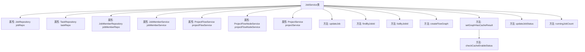
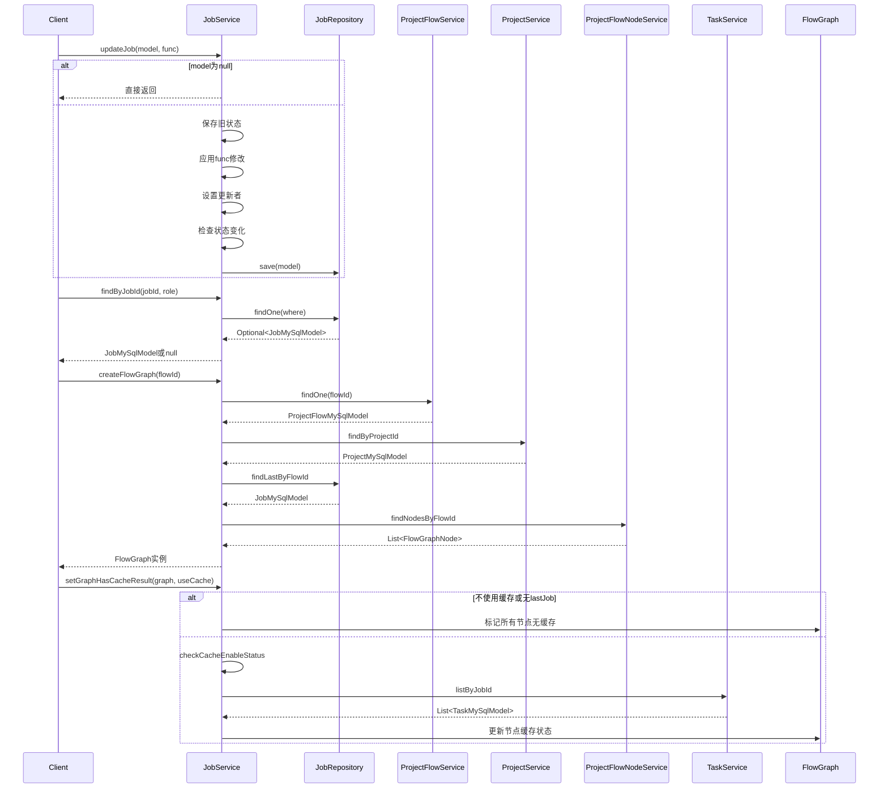

# 基础信息

|      |      |
|------|------|
| 名称 | JobService |
| 编码语言 | .java |
| 代码路径 | WeFe/board/board-service/src/main/java/com/welab/wefe/board/service/service/JobService.java |
| 包名 | com.welab.wefe.board.service.service |
| 依赖项 | ['com.welab.wefe.board.service.api.project.job.UpdateJobStatusApi', 'com.welab.wefe.board.service.database.entity.job.JobMySqlModel', 'com.welab.wefe.board.service.database.entity.job.ProjectFlowMySqlModel', 'com.welab.wefe.board.service.database.entity.job.ProjectMySqlModel', 'com.welab.wefe.board.service.database.entity.job.TaskMySqlModel', 'com.welab.wefe.board.service.database.repository.JobMemberRepository', 'com.welab.wefe.board.service.database.repository.JobRepository', 'com.welab.wefe.board.service.database.repository.TaskRepository', 'com.welab.wefe.board.service.model.FlowGraph', 'com.welab.wefe.board.service.model.FlowGraphNode', 'com.welab.wefe.common.data.mysql.Where', 'com.welab.wefe.common.exception.StatusCodeWithException', 'com.welab.wefe.common.web.util.CurrentAccountUtil', 'com.welab.wefe.common.wefe.enums.JobMemberRole', 'com.welab.wefe.common.wefe.enums.JobStatus', 'com.welab.wefe.common.wefe.enums.TaskStatus', 'org.springframework.beans.factory.annotation.Autowired', 'org.springframework.data.jpa.domain.Specification', 'org.springframework.stereotype.Service', 'java.util', 'java.util.function.Function', 'java.util.stream.Collectors'] |
| 概述说明 | JobService类提供任务管理功能，包括更新任务状态、按ID查询任务、创建流程图及设置缓存结果。依赖多个Repository和服务类，支持任务状态变更、缓存检查及运行中任务计数。 |

# 说明

JobService是一个服务类，继承自AbstractService，用于管理任务相关操作。它通过多个Repository和Service进行数据交互，包括JobRepository、TaskRepository等。主要功能包括更新任务状态、根据角色和任务ID查询任务、创建流程图表实例、设置图表节点缓存结果、检查缓存可用性以及更新任务状态。此外，还提供了查询未结束任务数量的方法。该类处理任务状态变更、缓存管理和任务查询等核心业务逻辑。

# 类列表 Class Summary

| 名称   | 类型  | 说明 |
|-------|------|-------------|
| JobService | class | JobService类提供任务管理功能，包括更新任务状态、查询任务、创建流程图及设置缓存结果。支持多角色查询，处理任务状态变更及缓存逻辑，确保任务流程正确执行。 |


## 类 JobService

|      |      |
|------|------|
| 访问范围 | @Service;public |
| 类型 | class |
| 名称 | JobService |
| 说明 | JobService类提供任务管理功能，包括更新任务状态、查询任务、创建流程图及设置缓存结果。支持多角色查询，处理任务状态变更及缓存逻辑，确保任务流程正确执行。 |


### UML类图

```mermaid
classDiagram
    class AbstractService {
        <<abstract>>
    }

    class JobService {
        -JobRepository jobRepo
        -TaskRepository taskRepo
        -JobMemberRepository jobMemberRepo
        -JobMemberService jobMemberService
        -ProjectFlowService projectFlowService
        -ProjectFlowNodeService projectFlowNodeService
        -ProjectService projectService
        -TaskService taskService
        +updateJob(JobMySqlModel model, Function~JobMySqlModel, JobMySqlModel~ func) void
        +findByJobId(String jobId, JobMemberRole role) JobMySqlModel
        +listByJobId(String jobId) List~JobMySqlModel~
        +createFlowGraph(String flowId) FlowGraph
        +setGraphHasCacheResult(FlowGraph graph, boolean useCache) void
        +updateJobStatus(UpdateJobStatusApi$Input input) void
        +runningJobCount() int
        -checkCacheEnableStatus(FlowGraph graph, JobMySqlModel lastJob) void
    }

    class JobRepository {
        <<Interface>>
        +save(JobMySqlModel model) JobMySqlModel
        +findOne(Specification~JobMySqlModel~ where) Optional~JobMySqlModel~
        +findAll(Specification~JobMySqlModel~ where) List~JobMySqlModel~
        +findLastByFlowId(String flowId, String role) JobMySqlModel
        +runningJobCount() int
    }

    class TaskRepository {
        <<Interface>>
    }

    class JobMemberRepository {
        <<Interface>>
    }

    class JobMemberService {
        <<Interface>>
    }

    class ProjectFlowService {
        <<Interface>>
        +findOne(String flowId) ProjectFlowMySqlModel
    }

    class ProjectFlowNodeService {
        <<Interface>>
        +findNodesByFlowId(String flowId) List~ProjectFlowNodeMySqlModel~
    }

    class ProjectService {
        <<Interface>>
        +findByProjectId(String projectId) ProjectMySqlModel
    }

    class TaskService {
        <<Interface>>
        +listByJobId(String jobId, JobMemberRole role) List~TaskMySqlModel~
    }

    class FlowGraph {
        +FlowGraph(String federatedLearningType, JobMySqlModel lastJob, List~ProjectFlowNodeMySqlModel~ nodes)
        +getAllJobSteps() List~FlowGraphNode~
        +getLastJob() JobMySqlModel
    }

    class FlowGraphNode {
        +getNodeId() String
        +getParamsVersion() long
        +getDeep() int
        +getChildren() List~FlowGraphNode~
        +setHasCacheResult(boolean hasCache) void
        +getHasCacheResult() boolean
    }

    class JobMySqlModel {
        +getStatus() JobStatus
        +getUpdatedBy() String
        +getStatusUpdatedTime() Date
        +getJobId() String
        +getMyRole() JobMemberRole
        +getCreatedTime() Date
        +setStatus(JobStatus status) void
        +setMessage(String message) void
        +setUpdatedBy(String updatedBy) void
        +setStatusUpdatedTime(Date date) void
    }

    class ProjectFlowMySqlModel {
        +getProjectId() String
        +getFlowId() String
        +getFederatedLearningType() String
    }

    class ProjectMySqlModel {
        +getMyRole() JobMemberRole
    }

    class TaskMySqlModel {
        +getFlowNodeId() String
        +getStatus() TaskStatus
    }

    class UpdateJobStatusApi$Input {
        +getId() String
        +getJobStatus() JobStatus
        +getMessage() String
    }

    AbstractService <|-- JobService
    JobService --> JobRepository : 依赖
    JobService --> TaskRepository : 依赖
    JobService --> JobMemberRepository : 依赖
    JobService --> JobMemberService : 依赖
    JobService --> ProjectFlowService : 依赖
    JobService --> ProjectFlowNodeService : 依赖
    JobService --> ProjectService : 依赖
    JobService --> TaskService : 依赖
    JobService --> FlowGraph : 创建
    JobService --> JobMySqlModel : 操作
    JobService --> UpdateJobStatusApi$Input : 处理输入
    FlowGraph --> FlowGraphNode : 包含
    FlowGraph --> JobMySqlModel : 引用
    ProjectFlowService --> ProjectFlowMySqlModel : 返回
    ProjectService --> ProjectMySqlModel : 返回
    TaskService --> TaskMySqlModel : 返回
    ProjectFlowNodeService --> ProjectFlowNodeMySqlModel : 返回
```

这段类图展示了JobService及其相关依赖的完整结构。JobService继承自AbstractService，主要处理任务状态更新、流程图的创建和缓存管理等功能。它依赖多个Repository和Service接口，包括JobRepository、TaskService等，并与JobMySqlModel、FlowGraph等核心数据模型交互。类图清晰地呈现了各组件间的层级关系和依赖方向，体现了该服务在任务管理系统中承担的核心职责和复杂交互逻辑。


### 内部方法调用关系图





这段代码是JobService类的实现，主要处理与任务(Job)相关的业务逻辑。它继承了AbstractService，通过多个Repository和Service协作完成功能。核心方法包括更新任务信息、按条件查询任务、创建流程图、设置缓存状态等。类中使用了大量Spring依赖注入，与数据库和外部服务交互频繁。特别值得注意的是处理流程图缓存状态的复杂逻辑，涉及多层级节点遍历和状态验证。整体设计体现了分层架构思想，业务逻辑集中在Service层实现。

### 字段列表 Field List

| 名称  | 类型  | 说明 |
|-------|-------|------|
| taskService | TaskService | 自动注入TaskService实例。 |
| taskRepo | TaskRepository | 自动注入TaskRepository实例taskRepo。 |
| jobMemberService | JobMemberService | 使用@Autowired自动注入JobMemberService实例。 |
| projectFlowNodeService | ProjectFlowNodeService | 自动注入ProjectFlowNodeService服务实例。 |
| projectService | ProjectService | 使用@Autowired自动注入ProjectService实例。 |
| jobMemberRepo | JobMemberRepository | 使用@Autowired自动注入JobMemberRepository实例jobMemberRepo。 |
| jobRepo | JobRepository | 自动注入JobRepository实例到jobRepo变量。 |
| projectFlowService | ProjectFlowService | 自动注入ProjectFlowService服务实例。 |

### 方法列表

| 名称  | 类型  | 说明 |
|-------|-------|------|
| setGraphHasCacheResult | void | 该方法根据缓存使用标志设置流程图中各节点的缓存状态。若未启用缓存或无历史任务，则禁用所有节点缓存；否则检查各节点缓存可用性，并递归禁用无缓存节点的子节点缓存，直至无新增禁用节点或遇到仲裁者角色为止。 |
| listByJobId | List<JobMySqlModel> | 根据jobId查询JobMySqlModel列表，使用条件构建器创建查询条件，返回匹配结果。 |
| findByJobId | JobMySqlModel | 根据jobId和role查询JobMySqlModel，若无结果返回null。 |
| checkCacheEnableStatus | void | 检查任务节点缓存可用性：基于创建时间筛选可缓存节点，标记编辑过的节点不可用，并验证任务状态是否成功。 |
| createFlowGraph | FlowGraph | 方法createFlowGraph根据flowId创建流程图，查询流程、项目和最新任务信息，返回包含联邦学习类型、最新任务和流程节点的FlowGraph对象。 |
| updateJob | void | 更新任务方法：检查非空后执行函数更新模型，设置更新者和状态变更时间，最后保存。 |
| updateJobStatus | void | 更新任务状态方法：根据输入ID查找任务，若存在则更新任务状态和消息。 |
| runningJobCount | int | 该方法返回当前运行中的任务数量，通过调用jobRepo的runningJobCount方法实现。 |


