# 基础信息

|      |      |
|------|------|
| 名称 | MemberChatService |
| 编码语言 | .java |
| 代码路径 | WeFe/board/board-service/src/main/java/com/welab/wefe/board/service/service/MemberChatService.java |
| 包名 | com.welab.wefe.board.service.service |
| 依赖项 | ['com.welab.wefe.board.service.api.chat.QueryChatDetailApi', 'com.welab.wefe.board.service.api.chat.UpdateToReadApi', 'com.welab.wefe.board.service.base.LoginAccountInfo', 'com.welab.wefe.board.service.constant.ChatConstant', 'com.welab.wefe.board.service.database.entity.chat.ChatLastAccountMysqlModel', 'com.welab.wefe.board.service.database.entity.chat.MemberChatMySqlModel', 'com.welab.wefe.board.service.database.entity.chat.MessageQueueMySqlModel', 'com.welab.wefe.board.service.database.repository.ChatUnreadMessageRepository', 'com.welab.wefe.board.service.database.repository.MemberChatRepository', 'com.welab.wefe.board.service.database.repository.MessageQueueRepository', 'com.welab.wefe.board.service.database.repository.MessageRepository', 'com.welab.wefe.board.service.dto.base.PagingOutput', 'com.welab.wefe.board.service.dto.entity.MemberChatOutputModel', 'com.welab.wefe.common.StatusCode', 'com.welab.wefe.common.data.mysql.Where', 'com.welab.wefe.common.data.mysql.enums.OrderBy', 'com.welab.wefe.common.exception.StatusCodeWithException', 'com.welab.wefe.common.util.JObject', 'com.welab.wefe.common.util.StringUtil', 'com.welab.wefe.common.web.service.account.SsoAccountInfo', 'com.welab.wefe.common.web.util.CurrentAccountUtil', 'com.welab.wefe.common.web.util.ModelMapper', 'com.welab.wefe.common.wefe.enums.GatewayProcessorType', 'com.welab.wefe.common.wefe.enums.ProducerType', 'org.apache.commons.collections4.CollectionUtils', 'org.springframework.beans.factory.annotation.Autowired', 'org.springframework.data.domain.Page', 'org.springframework.data.domain.PageRequest', 'org.springframework.data.domain.Pageable', 'org.springframework.data.domain.Sort', 'org.springframework.data.jpa.domain.Specification', 'org.springframework.stereotype.Service', 'org.springframework.transaction.annotation.Transactional', 'javax.persistence.criteria.Predicate', 'java.util.ArrayList', 'java.util.Date', 'java.util.List', 'java.util.UUID', 'java.util.stream.Collectors'] |
| 概述说明 | MemberChatService处理成员间消息发送、接收、重发及状态更新。包含发送消息、查询聊天详情、处理未读消息等功能，通过gatewayService转发消息，支持事务回滚。 |

# 说明

MemberChatService是一个处理成员聊天消息的服务类，继承自AbstractService。它通过多个Repository（如MemberChatRepository、MessageRepository等）和Service（如GatewayService、ChatUnreadMessageService等）实现消息的发送、接收、存储和状态管理。主要功能包括：发送消息（支持失败重发）、查询聊天详情、处理接收到的消息、更新消息状态为已读等。消息通过网关服务发送到目标成员，并记录聊天详情和未读消息。服务还维护最近聊天账户记录，确保消息状态的正确性和一致性。

# 类列表 Class Summary

| 名称   | 类型  | 说明 |
|-------|------|-------------|
| MemberChatService | class | MemberChatService处理成员间消息发送、接收和状态管理。包含发送消息、重发失败消息、查询聊天详情、处理接收消息、更新消息状态为已读等功能。通过gatewayService发送消息，使用repository存储消息和未读记录，支持事务回滚。 |


## 类 MemberChatService

|      |      |
|------|------|
| 访问范围 | @Service;public |
| 类型 | class |
| 名称 | MemberChatService |
| 说明 | MemberChatService处理成员间消息发送、接收和状态管理。包含发送消息、重发失败消息、查询聊天详情、处理接收消息、更新消息状态为已读等功能。通过gatewayService发送消息，使用repository存储消息和未读记录，支持事务回滚。 |


### UML类图

```mermaid
classDiagram
    class MemberChatService {
        -MemberChatRepository memberChatRepository
        -MessageRepository messageRepository
        -GatewayService gatewayService
        -ChatUnreadMessageRepository chatUnreadMessageRepository
        -MessageQueueRepository messageQueueRepository
        -ChatLastAccountService chatLastAccountService
        -ChatUnreadMessageService chatUnreadMessageService
        +sendMessage(String fromAccountId, String fromAccountName, String toMemberId, String toAccountId, String toMemberName, String toAccountName, String content) JObject
        +sendMessage(String toMemberId, String toMemberName, String toAccountId, String toAccountName, String content) JObject
        +resendMessage(String memberChatId) void
        +queryChatDetail(QueryChatDetailApi.Input input) PagingOutput~MemberChatOutputModel~
        +getOneMessage() MessageQueueMySqlModel
        +handleChatMessage(MessageQueueMySqlModel message) void
        +messageUpdateToRead(UpdateToReadApi.Input input) void
        -generateMessageId() String
    }

    class MemberChatRepository {
        +save(MemberChatMySqlModel entity) MemberChatMySqlModel
        +findById(String id) Optional~MemberChatMySqlModel~
        +updateById(String id, String field, Object value, Class~T~ clazz, boolean async) void
        +updateMessageStatus(String toAccountId, String fromAccountId, int oldStatus, int newStatus) void
        +findAll(Specification~MemberChatMySqlModel~ spec, Pageable pageable) Page~MemberChatMySqlModel~
    }

    class MessageRepository {
        // 基础Repository方法
    }

    class GatewayService {
        +sendToOtherGateway(String memberId, String data, GatewayProcessorType processorType) void
    }

    class ChatUnreadMessageRepository {
        // 基础Repository方法
    }

    class MessageQueueRepository {
        +findAll(Specification~MessageQueueMySqlModel~ spec, Pageable pageable) Page~MessageQueueMySqlModel~
        +delete(MessageQueueMySqlModel entity) void
    }

    class ChatLastAccountService {
        +add(ChatLastAccountMysqlModel model) void
    }

    class ChatUnreadMessageService {
        +addChatUnreadMessage(MemberChatMySqlModel model) void
        +delete(String toAccountId, String fromAccountId) int
    }

    class MemberChatMySqlModel {
        -String id
        -String fromAccountId
        -String fromAccountName
        -String fromMemberId
        -String fromMemberName
        -String toMemberId
        -String toMemberName
        -String toAccountId
        -String toAccountName
        -String content
        -int status
        -int direction
        -Date createdTime
        -Date updatedTime
        -String messageId
        // getters/setters
    }

    class MessageQueueMySqlModel {
        -String params
        // 其他字段
    }

    class ChatLastAccountMysqlModel {
        -String accountId
        -String memberId
        -String accountName
        -String memberName
        -String liaisonAccountId
        -String liaisonMemberId
        -String liaisonAccountName
        -String liaisonMemberName
        -Date updatedTime
        // getters/setters
    }

    class MemberChatOutputModel {
        -String id
        -String fromAccountId
        -String fromMemberId
        -String toAccountId
        -String toMemberId
        -String content
        -int status
        -Date createdTime
        // getters/setters
    }

    class QueryChatDetailApi$Input {
        -String fromAccountId
        -String toAccountId
        -Long limitCreateTime
        -int pageSize
        // getters/setters
    }

    class UpdateToReadApi$Input {
        -String toAccountId
        -String fromAccountId
        // getters/setters
    }

    MemberChatService --> MemberChatRepository : 依赖
    MemberChatService --> MessageRepository : 依赖
    MemberChatService --> GatewayService : 依赖
    MemberChatService --> ChatUnreadMessageRepository : 依赖
    MemberChatService --> MessageQueueRepository : 依赖
    MemberChatService --> ChatLastAccountService : 依赖
    MemberChatService --> ChatUnreadMessageService : 依赖
    MemberChatService --> MemberChatMySqlModel : 创建/使用
    MemberChatService --> MessageQueueMySqlModel : 处理
    MemberChatService --> ChatLastAccountMysqlModel : 创建/使用
    MemberChatService --> MemberChatOutputModel : 返回
    MemberChatService --> QueryChatDetailApi$Input : 参数
    MemberChatService --> UpdateToReadApi$Input : 参数
```

该图展示了MemberChatService的核心类关系，这是一个处理成员聊天消息的服务类。它通过多个Repository（如MemberChatRepository、MessageQueueRepository）进行数据持久化，依赖GatewayService进行消息转发，使用ChatLastAccountService维护最近联系人记录，并通过ChatUnreadMessageService管理未读消息。服务主要处理消息发送、重发、状态更新和查询等业务逻辑，涉及MemberChatMySqlModel等数据模型和QueryChatDetailApi$Input等参数对象的交互。


### 内部方法调用关系图

```mermaid
graph TD
    A["MemberChatService"]
    B["sendMessage: 发送消息主方法"]
    C["sendMessage: 重载方法"]
    D["resendMessage: 消息重发"]
    E["queryChatDetail: 查询聊天详情"]
    F["getOneMessage: 获取未处理消息"]
    G["handleChatMessage: 处理接收消息"]
    H["messageUpdateToRead: 更新消息状态为已读"]
    I["generateMessageId: 生成消息ID"]

    A --> B
    A --> C
    A --> D
    A --> E
    A --> F
    A --> G
    A --> H
    A --> I

    B --> B1["创建ChatLastAccount记录"]
    B --> B2["构造消息数据"]
    B --> B3["创建MemberChat记录"]
    B --> B4["通过gatewayService发送消息"]
    B --> B5["保存消息记录"]

    C --> C1["获取登录信息"]
    C --> C2["调用主sendMessage方法"]

    D --> D1["查询原始消息"]
    D --> D2["构造重发数据"]
    D --> D3["通过gatewayService重发"]
    D --> D4["更新消息状态"]

    E --> E1["构建查询条件"]
    E --> E2["执行分页查询"]
    E --> E3["转换输出模型"]

    G --> G1["解析消息参数"]
    G --> G2["创建接收消息记录"]
    G --> G3["尝试WebSocket推送"]
    G --> G4["保存未读消息"]
    G --> G5["删除队列消息"]
    G --> G6["更新最近联系人"]
```



该流程图展示了MemberChatService的核心功能结构。服务主要处理消息发送、接收、查询和状态管理等操作，包含7个主要方法和多个子步骤。消息发送流程涉及数据构造、网关传输和持久化存储；消息处理流程包含WebSocket推送和未读消息管理；查询功能实现复杂的分页和条件筛选。所有操作都通过Repository与数据库交互，并通过事务保证数据一致性。

### 字段列表 Field List

| 名称  | 类型  | 说明 |
|-------|-------|------|
| messageRepository | MessageRepository | 自动注入消息存储库实例。 |
| chatUnreadMessageRepository | ChatUnreadMessageRepository | 使用@Autowired自动注入ChatUnreadMessageRepository实例。 |
| memberChatRepository | MemberChatRepository | 自动注入MemberChatRepository实例。 |
| chatUnreadMessageService | ChatUnreadMessageService | 使用@Autowired自动注入ChatUnreadMessageService实例。 |
| chatLastAccountService | ChatLastAccountService | 使用@Autowired自动注入ChatLastAccountService实例。 |
| messageQueueRepository | MessageQueueRepository | 使用@Autowired自动注入MessageQueueRepository实例。 |
| gatewayService | GatewayService | 自动注入GatewayService实例。 |

### 方法列表

| 名称  | 类型  | 说明 |
|-------|-------|------|
| resendMessage | void | 方法resendMessage用于重发聊天消息。首先检查消息是否存在且状态为发送失败，否则抛出异常。然后拼接消息数据并通过网关发送，最后更新消息状态为发送成功。 |
| queryChatDetail | PagingOutput<MemberChatOutputModel> | 查询聊天详情方法：根据输入参数构建查询条件，分页获取聊天记录并转换为输出模型返回。 |
| messageUpdateToRead | void | 该方法使用事务注解确保异常时回滚，删除未读消息记录并更新消息状态为已读。若删除成功则执行状态更新。 |
| handleChatMessage | void | 处理聊天消息：解析消息参数，保存聊天详情，推送至指定用户（失败则存为未读），删除队列消息，更新最近聊天记录。 |
| getOneMessage | MessageQueueMySqlModel | 方法getOneMessage查询生产者类型为gateway的消息队列记录，按创建时间升序排序，返回第一条记录。若无结果则返回null。 |
| sendMessage | JObject | 发送消息方法：记录最近聊天账户，封装消息内容，推送至目标成员网关，保存消息详情，处理失败状态。 |
| sendMessage | JObject | 带事务的消息发送方法，验证登录后获取发送方信息并转发消息，失败时回滚。 |
| generateMessageId | String | 生成唯一消息ID，去除UUID中的横线。 |


