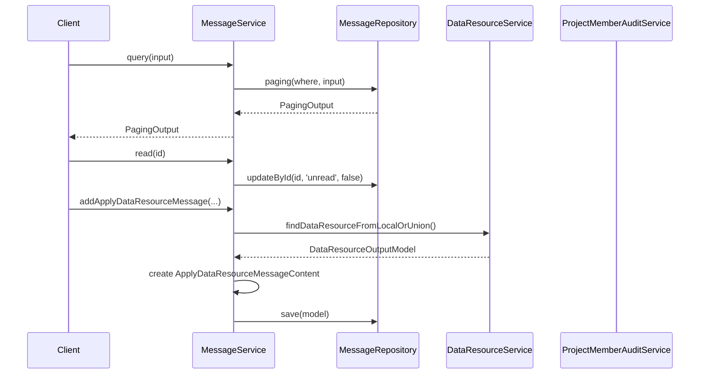

# 基础信息

|      |      |
|------|------|
| 名称 | MessageService |
| 编码语言 | .java |
| 代码路径 | WeFe/board/board-service/src/main/java/com/welab/wefe/board/service/service/MessageService.java |
| 包名 | com.welab.wefe.board.service.service |
| 依赖项 | ['com.welab.wefe.board.service.api.message.QueryApi', 'com.welab.wefe.board.service.database.entity.MessageMysqlModel', 'com.welab.wefe.board.service.database.entity.job.ProjectDataSetMySqlModel', 'com.welab.wefe.board.service.database.entity.job.ProjectMemberAuditMySqlModel', 'com.welab.wefe.board.service.database.entity.job.ProjectMySqlModel', 'com.welab.wefe.board.service.database.repository.MessageRepository', 'com.welab.wefe.board.service.dto.base.PagingOutput', 'com.welab.wefe.board.service.dto.entity.MessageOutputModel', 'com.welab.wefe.board.service.dto.entity.data_resource.output.DataResourceOutputModel', 'com.welab.wefe.board.service.dto.vo.message', 'com.welab.wefe.board.service.service.data_resource.DataResourceService', 'com.welab.wefe.common.data.mysql.Where', 'com.welab.wefe.common.exception.StatusCodeWithException', 'com.welab.wefe.common.util.StringUtil', 'com.welab.wefe.common.wefe.enums.AuditStatus', 'com.welab.wefe.common.wefe.enums.JobMemberRole', 'com.welab.wefe.common.wefe.enums.MessageEvent', 'com.welab.wefe.common.wefe.enums.ProducerType', 'org.springframework.beans.factory.annotation.Autowired', 'org.springframework.data.jpa.domain.Specification', 'org.springframework.stereotype.Service'] |
| 概述说明 | MessageService提供消息管理功能，包括查询、标记已读、添加消息及处理待办事项。支持多种消息类型和事件，如申请数据资源和加入项目，并处理相关审核流程。 |

# 说明

MessageService是一个消息管理服务类，继承自AbstractService。它通过MessageRepository进行数据操作，并依赖DataResourceService和ProjectMemberAuditService。主要功能包括：分页查询消息（支持按待办、完成状态、级别、未读状态和事件类型筛选）、标记消息为已读、添加各类消息（支持文本内容和抽象内容，可设置待办状态）。还提供了特定业务场景的消息处理，如申请数据资源消息、审核数据资源消息、申请加入项目消息和审核加入项目消息。这些消息处理会根据不同事件类型和审核状态生成相应内容，并设置相关属性如标题、级别、待办状态等。服务还包含完成特定待办事项的方法，如完成申请数据资源和加入项目的待办事项。

# 类列表 Class Summary

| 名称   | 类型  | 说明 |
|-------|------|-------------|
| MessageService | class | 消息服务类，提供消息查询、标记已读、添加消息功能，支持多种消息类型和事件处理，包括数据资源申请、项目加入审核等。 |

## 类 MessageService

|      |      |
|------|------|
| 访问范围 | @Service;public |
| 类型 | class |
| 名称 | MessageService |
| 说明 | 消息服务类，提供消息查询、标记已读、添加消息功能，支持多种消息类型和事件处理，包括数据资源申请、项目加入审核等。 |

### UML类图

```mermaid
classDiagram
    class MessageService {
        -MessageRepository messageRepository
        -DataResourceService dataResourceService
        -ProjectMemberAuditService projectMemberAuditService
        +PagingOutput~MessageOutputModel~ query(QueryApi$Input input)
        +void read(String id)
        +void add(MessageEvent event, String title, String content)
        +void add(MessageEvent event, AbstractMessageContent content)
        +void add(MessageEvent event, AbstractMessageContent content, boolean isTodo)
        +void add(MessageEvent event, String title, AbstractMessageContent content, Boolean isTodo)
        +void completeApplyDataResourceTodo(ProjectDataSetMySqlModel projectDataSet)
        +void completeApplyJoinProjectTodo(String projectId)
        +void addApplyDataResourceMessage(String fromMemberId, ProjectMySqlModel project, ProjectDataSetMySqlModel projectDataSet)
        +void addAuditDataResourceMessage(String fromMemberId, ProjectMySqlModel project, ProjectDataSetMySqlModel projectDataResource, AuditStatus auditStatus, String auditComment)
        +void addApplyJoinProjectMessage(String fromMemberId, String projectId, String projectName)
        +void addAuditJoinProjectMessage(String fromMemberId, ProjectMySqlModel project, AuditStatus auditStatus, String auditComment)
    }

    class AbstractService {
        <<Abstract>>
    }

    class MessageRepository {
        <<Interface>>
        +PagingOutput~T~ paging(Specification~T~ where, QueryApi$Input input, Class~T~ clazz)
        +void updateById(String id, String field, Object value, Class~T~ clazz)
        +void save(MessageMysqlModel model)
        +void completeApplyDataResourceTodo(String projectId, String dataSetId)
        +void completeApplyJoinProjectTodo(String projectId)
    }

    class DataResourceService {
        <<Interface>>
        +DataResourceOutputModel findDataResourceFromLocalOrUnion(ProjectDataSetMySqlModel projectDataSet)
    }

    class ProjectMemberAuditService {
        <<Interface>>
        +ProjectMemberAuditMySqlModel findOne(String projectId, String fromMemberId, String currentMemberId)
    }

    class AbstractMessageContent {
        <<Abstract>>
        +String getTitle()
        +String getRelatedId1()
        +String getRelatedId2()
    }

    class TextMessageContent {
        -String message
    }

    class ApplyDataResourceMessageContent {
        -String fromMemberId
        -String projectId
        -String projectName
        -String dataResourceName
        -String dataResourceType
        -String dataResourceId
        -Long sampleCount
    }

    class AuditApplyDataResourceMessageContent {
        -String fromMemberId
        -String projectId
        -String projectName
        -String dataResourceName
        -String dataResourceType
        -String dataResourceId
        -Long sampleCount
        -AuditStatus auditStatus
        -String auditComment
    }

    class ApplyJoinProjectMessageContent {
        -String fromMemberId
        -String projectId
        -String projectName
    }

    class AuditJoinProjectMessageContent {
        -String fromMemberId
        -String projectId
        -String projectName
        -AuditStatus auditStatus
        -String auditComment
    }

    AbstractService <|-- MessageService
    MessageService --> MessageRepository : 依赖
    MessageService --> DataResourceService : 依赖
    MessageService --> ProjectMemberAuditService : 依赖
    AbstractMessageContent <|-- TextMessageContent
    AbstractMessageContent <|-- ApplyDataResourceMessageContent
    AbstractMessageContent <|-- AuditApplyDataResourceMessageContent
    AbstractMessageContent <|-- ApplyJoinProjectMessageContent
    AbstractMessageContent <|-- AuditJoinProjectMessageContent
```

这段代码展示了一个消息服务系统，主要处理消息的查询、阅读、添加和完成等操作。MessageService继承自AbstractService，并依赖MessageRepository、DataResourceService和ProjectMemberAuditService三个接口。它提供了多种add方法重载，支持不同类型消息内容的处理，包括文本消息、申请数据资源消息、审核数据资源消息等。类图中清晰地展示了这些类之间的继承和依赖关系，以及各种消息内容类的层次结构。

### 内部方法调用关系图

```mermaid
graph TD
    A["MessageService"]
    B["依赖: MessageRepository"]
    C["依赖: DataResourceService"]
    D["依赖: ProjectMemberAuditService"]
    E["方法: query(QueryApi.Input)"]
    F["方法: read(String)"]
    G["方法: add(MessageEvent, String, String)"]
    H["方法: add(MessageEvent, AbstractMessageContent)"]
    I["方法: add(MessageEvent, AbstractMessageContent, boolean)"]
    J["核心方法: add(MessageEvent, String, AbstractMessageContent, Boolean)"]
    K["方法: completeApplyDataResourceTodo(ProjectDataSetMySqlModel)"]
    L["方法: completeApplyJoinProjectTodo(String)"]
    M["方法: addApplyDataResourceMessage(...)"]
    N["方法: addAuditDataResourceMessage(...)"]
    O["方法: addApplyJoinProjectMessage(...)"]
    P["方法: addAuditJoinProjectMessage(...)"]

    A --> B
    A --> C
    A --> D
    A --> E
    A --> F
    A --> G
    A --> H
    A --> I
    G --> J
    H --> J
    I --> J
    A --> K
    A --> L
    A --> M
    M --> C
    M --> J
    A --> N
    N --> C
    N --> J
    A --> O
    O --> J
    A --> P
    P --> D
    P --> J
```

该流程图展示了MessageService类的核心结构和调用关系，包含4个主要依赖组件和8个核心方法。时序图重点描述了query、read和addApplyDataResourceMessage三个典型方法的调用链，其中add方法作为核心方法被多个重载版本调用。类设计采用分层架构，通过Repository操作数据，依赖其他服务完成业务逻辑，符合Spring服务层的典型设计模式。消息处理流程包含参数校验、内容组装和持久化操作，支持多种消息事件类型和待办状态管理。

### 字段列表 Field List

| 名称  | 类型  | 说明 |
|-------|-------|------|
| messageRepository | MessageRepository | 自动注入消息存储库实例。 |
| dataResourceService | DataResourceService | 自动注入DataResourceService实例。 |
| projectMemberAuditService | ProjectMemberAuditService | 使用@Autowired自动注入ProjectMemberAuditService实例。 |

### 方法列表

| 名称  | 类型  | 说明 |
|-------|-------|------|
| addAuditDataResourceMessage | void | 方法`addAuditDataResourceMessage`用于添加审计数据资源消息。检查数据资源是否存在，若存在则创建消息内容并设置相关属性，根据审计状态触发同意或拒绝事件。 |
| completeApplyJoinProjectTodo | void | 完成申请加入项目的待办事项，调用消息仓库处理指定项目ID的任务。 |
| add | void | 方法add接收事件、标题和内容参数，创建文本消息对象并赋值内容，然后调用同名方法处理。 |
| add | void | 这是一个Java方法，用于添加消息事件，接收事件对象、消息内容和一个布尔值参数。方法内部调用了另一个重载方法。 |
| query | PagingOutput<MessageOutputModel> | 查询消息方法，根据输入条件（todo、完成状态、等级、未读状态、事件列表）筛选数据，返回分页结果。 |
| completeApplyDataResourceTodo | void | 该方法完成申请数据资源待办事项，接收项目数据集模型参数，从中提取项目ID和数据集ID，调用消息仓库完成相关操作。 |
| add | void | 该方法用于添加消息事件，检查标题有效性，设置消息模型属性并保存。若标题为空则抛出异常，未指定是否为待办时使用事件默认值。模型包含事件、生产者、级别、标题、内容等字段，最后保存到数据库。 |
| addApplyJoinProjectMessage | void | 方法addApplyJoinProjectMessage创建申请加入项目消息，设置成员ID、项目ID和名称，并触发消息事件。 |
| read | void | 方法read接收字符串id，调用messageRepository的updateById方法，将指定id的消息状态更新为已读。 |
| add | void | 方法add接收MessageEvent和AbstractMessageContent参数，调用重载方法并传入null值作为其他两个参数。 |
| addApplyDataResourceMessage | void | 该方法用于添加数据资源申请消息。检查项目和资源有效性后，构建消息内容并发送，包含成员ID、项目信息、资源详情等关键数据。 |
| addAuditJoinProjectMessage | void | 方法根据审核状态处理项目加入请求：同意时检查二次审核需求并提醒相关成员；拒绝或无需审核时通知发起人。最终生成相应消息事件。 |

