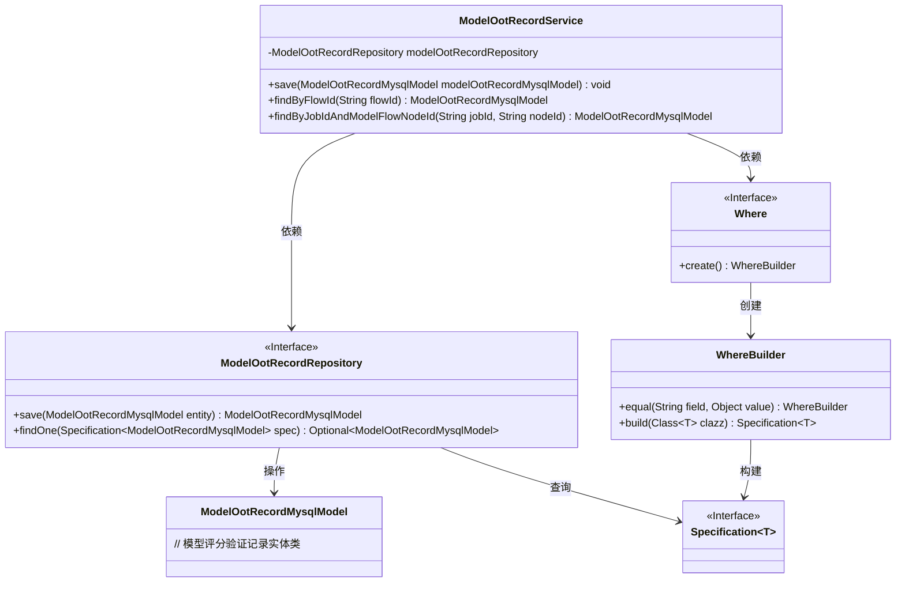
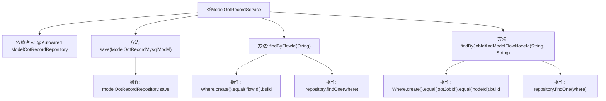

# 基础信息

|      |      |
|------|------|
| 名称 | ModelOotRecordService |
| 编码语言 | .java |
| 代码路径 | WeFe/board/board-service/src/main/java/com/welab/wefe/board/service/service/ModelOotRecordService.java |
| 包名 | com.welab.wefe.board.service.service |
| 依赖项 | ['com.welab.wefe.board.service.database.entity.job.ModelOotRecordMysqlModel', 'com.welab.wefe.board.service.database.repository.ModelOotRecordRepository', 'com.welab.wefe.common.data.mysql.Where', 'org.springframework.beans.factory.annotation.Autowired', 'org.springframework.data.jpa.domain.Specification', 'org.springframework.stereotype.Service'] |
| 概述说明 | ModelOotRecordService提供保存和查询功能，支持按流程ID或任务ID与节点ID组合查询模型评分验证记录。 |

# 说明

这是一个名为ModelOotRecordService的Spring服务类，主要用于管理模型评分验证记录。它通过自动装配的ModelOotRecordRepository与数据库交互。主要功能包括：保存ModelOotRecordMysqlModel记录；根据流程ID查询记录，使用Specification构建查询条件；根据任务ID和节点ID联合查询记录，同样使用Specification构建多条件查询。所有查询方法都返回单个记录或null。

# 类列表 Class Summary

| 名称   | 类型  | 说明 |
|-------|------|-------------|
| ModelOotRecordService | class | ModelOotRecordService提供保存和查询模型评分验证记录功能，支持按流程ID或任务ID与节点ID查询。 |

## 类 ModelOotRecordService

|      |      |
|------|------|
| 访问范围 | @Service;public |
| 类型 | class |
| 名称 | ModelOotRecordService |
| 说明 | ModelOotRecordService提供保存和查询模型评分验证记录功能，支持按流程ID或任务ID与节点ID查询。 |

### UML类图

这段代码描述了一个Spring服务类ModelOotRecordService，它通过ModelOotRecordRepository接口与数据库交互，主要功能包括保存模型评分验证记录、根据流程ID查询记录、以及根据任务ID和节点ID联合查询记录。服务类使用了Where构建器创建Specification查询条件，体现了Spring Data JPA的动态查询能力。类图清晰地展示了服务层与持久层的关系，以及查询条件构建的协作流程。

### 内部方法调用关系图

该流程图展示了ModelOotRecordService类的结构和主要方法调用关系。该类通过@Autowired注入ModelOotRecordRepository，提供三个核心方法：save()用于保存记录，findByFlowId()通过流程ID查询记录，findByJobIdAndModelFlowNodeId()通过任务ID和节点ID联合查询。每个查询方法都使用Where构建器创建查询条件，最终通过repository执行查询操作。流程图清晰呈现了从方法调用到数据库操作的全链路逻辑，体现了Spring Data JPA的典型使用模式。

### 字段列表 Field List

| 名称  | 类型  | 说明 |
|-------|-------|------|
| modelOotRecordRepository | ModelOotRecordRepository | 使用@Autowired自动注入ModelOotRecordRepository实例。 |

### 方法列表

| 名称  | 类型  | 说明 |
|-------|-------|------|
| save | void | 保存ModelOotRecordMysqlModel对象到数据库。 |
| findByFlowId | ModelOotRecordMysqlModel | 该方法通过flowId查询数据库记录，使用Specification构建查询条件，返回匹配的ModelOotRecordMysqlModel对象，若无结果则返回null。 |
| findByJobIdAndModelFlowNodeId | ModelOotRecordMysqlModel | 根据jobId和nodeId查询ModelOotRecordMysqlModel记录，无结果返回null。 |

