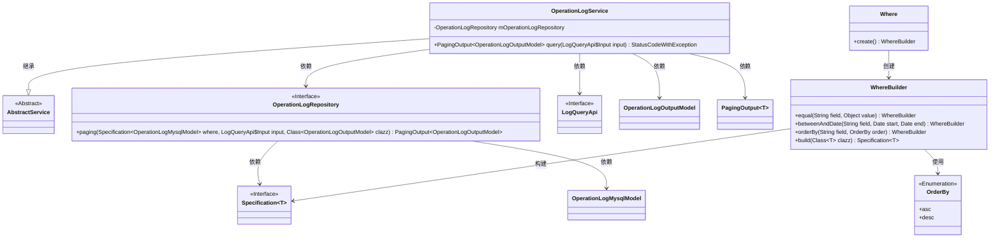

# 基础信息

|      |      |
|------|------|
| 名称 | OperationLogService |
| 编码语言 | .java |
| 代码路径 | WeFe/board/board-service/src/main/java/com/welab/wefe/board/service/service/OperationLogService.java |
| 包名 | com.welab.wefe.board.service.service |
| 依赖项 | ['com.welab.wefe.board.service.api.operation.LogQueryApi', 'com.welab.wefe.board.service.database.entity.OperationLogMysqlModel', 'com.welab.wefe.board.service.database.repository.OperationLogRepository', 'com.welab.wefe.board.service.dto.base.PagingOutput', 'com.welab.wefe.board.service.dto.entity.OperationLogOutputModel', 'com.welab.wefe.common.data.mysql.Where', 'com.welab.wefe.common.data.mysql.enums.OrderBy', 'com.welab.wefe.common.exception.StatusCodeWithException', 'org.springframework.beans.factory.annotation.Autowired', 'org.springframework.data.jpa.domain.Specification', 'org.springframework.stereotype.Service'] |
| 概述说明 | OperationLogService提供日志查询功能，支持按接口、操作者ID和时间范围筛选，并返回分页结果。 |

# 说明

OperationLogService是一个服务类，继承自AbstractService，用于处理操作日志查询。它通过Autowired注入OperationLogRepository依赖。主要方法query接收LogQueryApi.Input参数，返回分页的OperationLogOutputModel结果。查询条件包括logInterface和operatorId的精确匹配，createdTime的时间范围筛选，并按createdTime降序排序。最后调用mOperationLogRepository的paging方法执行分页查询。

# 类列表 Class Summary

| 名称   | 类型  | 说明 |
|-------|------|-------------|
| OperationLogService | class | OperationLogService提供分页查询操作日志功能，支持按接口、操作者ID和时间范围筛选，结果按创建时间降序排列。 |

## 类 OperationLogService

|      |      |
|------|------|
| 访问范围 | @Service;public |
| 类型 | class |
| 名称 | OperationLogService |
| 说明 | OperationLogService提供分页查询操作日志功能，支持按接口、操作者ID和时间范围筛选，结果按创建时间降序排列。 |

### UML类图

该类图展示了OperationLogService及其相关组件的结构关系。OperationLogService继承自AbstractService，依赖OperationLogRepository进行数据访问，使用Where构建查询条件，并通过PagingOutput返回分页结果。核心功能是通过动态条件查询操作日志，支持等值匹配、时间范围查询和排序。各组件职责明确，WhereBuilder提供流畅的查询条件构建接口，Repository处理具体数据访问逻辑。

### 内部方法调用关系图

该流程图展示了OperationLogService类的核心查询流程。从创建条件构造器开始，逐步添加字段匹配条件、时间范围筛选和排序规则，最终通过Repository执行分页查询。整个过程严格遵循条件构造模式，将输入参数转换为数据库查询规范，体现了清晰的链式调用结构和数据过滤逻辑。

### 字段列表 Field List

| 名称  | 类型  | 说明 |
|-------|-------|------|
| mOperationLogRepository | OperationLogRepository | 使用@Autowired自动注入OperationLogRepository实例。 |

### 方法列表

| 名称  | 类型  | 说明 |
|-------|-------|------|
| query | PagingOutput<OperationLogOutputModel> | 查询操作日志方法，根据接口、操作者ID和时间范围筛选，按创建时间降序分页返回结果。 |

