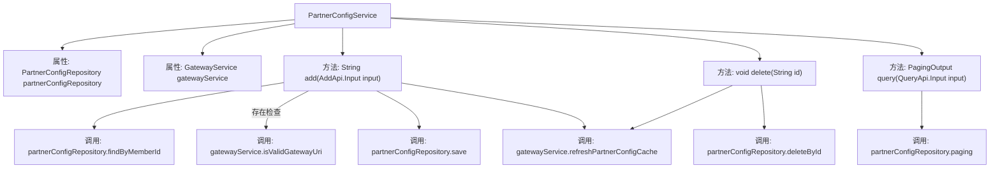

# 基础信息

|      |      |
|------|------|
| 名称 | PartnerConfigService |
| 编码语言 | .java |
| 代码路径 | WeFe/board/board-service/src/main/java/com/welab/wefe/board/service/service/PartnerConfigService.java |
| 包名 | com.welab.wefe.board.service.service |
| 依赖项 | ['org.springframework.beans.factory.annotation.Autowired', 'org.springframework.stereotype.Service', 'com.welab.wefe.board.service.api.partner_config.AddApi', 'com.welab.wefe.board.service.api.partner_config.QueryApi', 'com.welab.wefe.board.service.database.entity.PartnerConfigMysqlModel', 'com.welab.wefe.board.service.database.repository.PartnerConfigRepository', 'com.welab.wefe.board.service.dto.base.PagingOutput', 'com.welab.wefe.board.service.dto.entity.PartnerConfigOutputModel', 'com.welab.wefe.common.StatusCode', 'com.welab.wefe.common.data.mysql.Where', 'com.welab.wefe.common.exception.StatusCodeWithException'] |
| 概述说明 | PartnerConfigService服务类，提供添加、删除和查询合作伙伴配置功能。添加时校验成员ID和网关地址，操作后通知网关更新缓存。查询支持分页和条件过滤。 |

# 说明

PartnerConfigService是一个服务类，继承自AbstractService，用于管理合作伙伴配置。它通过PartnerConfigRepository操作数据库，并依赖GatewayService进行网关地址验证和缓存更新。主要功能包括：添加配置时检查成员ID是否已存在，验证网关地址合法性，保存配置并刷新网关缓存；删除配置时根据ID删除记录并刷新缓存；查询配置支持按网关地址和成员ID列表分页查询。所有操作均涉及数据库交互和网关缓存同步。

# 类列表 Class Summary

| 名称   | 类型  | 说明 |
|-------|------|-------------|
| PartnerConfigService | class | PartnerConfigService提供成员配置管理，包括添加（校验唯一性及网关地址）、删除和分页查询功能，操作后通知网关更新缓存。 |


## 类 PartnerConfigService

|      |      |
|------|------|
| 访问范围 | @Service;public |
| 类型 | class |
| 名称 | PartnerConfigService |
| 说明 | PartnerConfigService提供成员配置管理，包括添加（校验唯一性及网关地址）、删除和分页查询功能，操作后通知网关更新缓存。 |


### UML类图

```mermaid
classDiagram
    class AbstractService {
        <<abstract>>
    }

    class PartnerConfigService {
        -PartnerConfigRepository partnerConfigRepository
        -GatewayService gatewayService
        +String add(AddApi$Input input) StatusCodeWithException
        +void delete(String id) StatusCodeWithException
        +PagingOutput~PartnerConfigOutputModel~ query(QueryApi$Input input)
    }

    class PartnerConfigRepository {
        <<Interface>>
        +PartnerConfigMysqlModel findByMemberId(String memberId)
        +void save(PartnerConfigMysqlModel model)
        +void deleteById(String id)
        +PagingOutput~PartnerConfigOutputModel~ paging(Where where, QueryApi$Input input, Class~PartnerConfigOutputModel~ clazz)
    }

    class GatewayService {
        <<Interface>>
        +void isValidGatewayUri(String gatewayAddress)
        +void refreshPartnerConfigCache()
    }

    class PartnerConfigMysqlModel {
        -String id
        -String gatewayAddress
        -String memberId
        +String getId()
        +void setGatewayAddress(String gatewayAddress)
        +void setMemberId(String memberId)
    }

    class PartnerConfigOutputModel {
        // 输出模型类
    }

    class AddApi$Input {
        -String memberId
        -String gatewayAddress
    }

    class QueryApi$Input {
        -String gatewayAddress
        -List~String~ memberIdList
    }

    AbstractService <|-- PartnerConfigService
    PartnerConfigService --> PartnerConfigRepository : 依赖
    PartnerConfigService --> GatewayService : 依赖
    PartnerConfigRepository ..> PartnerConfigMysqlModel : 操作
    PartnerConfigRepository ..> PartnerConfigOutputModel : 映射
    PartnerConfigService ..> AddApi$Input : 使用
    PartnerConfigService ..> QueryApi$Input : 使用
```

这段代码描述了一个合作伙伴配置服务系统，主要包含PartnerConfigService服务类及其相关组件。该服务继承自AbstractService，通过PartnerConfigRepository进行数据持久化操作，并依赖GatewayService进行网关地址验证和缓存更新。核心功能包括添加配置（校验重复性）、删除配置和分页查询配置，涉及PartnerConfigMysqlModel和PartnerConfigOutputModel两种数据模型，以及AddApi.Input和QueryApi.Input两种输入参数结构。整个设计体现了清晰的职责划分和分层架构思想。


### 内部方法调用关系图



这段代码是PartnerConfigService类的实现，主要负责合作伙伴配置的增删查操作。流程图展示了类结构、属性依赖和方法调用关系。核心逻辑包括：添加配置时校验数据唯一性和网关地址有效性，删除时清理数据并刷新缓存，查询时支持分页和条件过滤。所有写操作都会触发网关缓存刷新，确保数据一致性。类通过Repository操作数据库，依赖GatewayService进行网关相关操作。

### 字段列表 Field List

| 名称  | 类型  | 说明 |
|-------|-------|------|
| partnerConfigRepository | PartnerConfigRepository | 自动注入PartnerConfigRepository实例。 |
| gatewayService | GatewayService | 自动注入网关服务实例。 |

### 方法列表

| 名称  | 类型  | 说明 |
|-------|-------|------|
| add | String | 方法`add`检查成员配置是否存在，验证网关地址，保存新配置并刷新网关缓存，返回配置ID。若配置已存在则抛出异常。 |
| query | PagingOutput<PartnerConfigOutputModel> | 方法query根据输入条件分页查询合作伙伴配置，支持网关地址模糊匹配和会员ID列表筛选，返回分页结果。 |
| delete | void | 删除指定ID的合作伙伴配置并刷新网关缓存。 |


