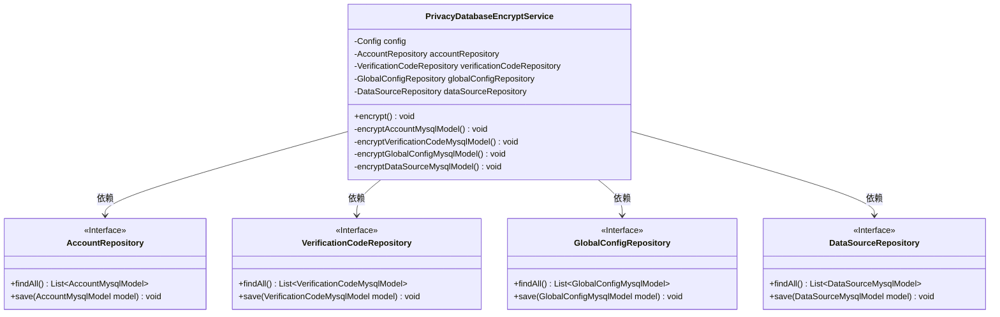
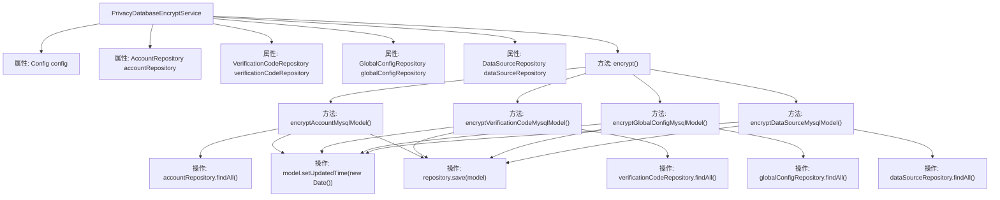

# 基础信息

|      |      |
|------|------|
| 名称 | PrivacyDatabaseEncryptService |
| 编码语言 | .java |
| 代码路径 | WeFe/board/board-service/src/main/java/com/welab/wefe/board/service/service/PrivacyDatabaseEncryptService.java |
| 包名 | com.welab.wefe.board.service.service |
| 依赖项 | ['com.welab.wefe.board.service.constant.Config', 'com.welab.wefe.board.service.database.entity.AccountMysqlModel', 'com.welab.wefe.board.service.database.entity.DataSourceMysqlModel', 'com.welab.wefe.board.service.database.entity.GlobalConfigMysqlModel', 'com.welab.wefe.board.service.database.entity.VerificationCodeMysqlModel', 'com.welab.wefe.board.service.database.repository.AccountRepository', 'com.welab.wefe.board.service.database.repository.DataSourceRepository', 'com.welab.wefe.board.service.database.repository.GlobalConfigRepository', 'com.welab.wefe.board.service.database.repository.VerificationCodeRepository', 'org.springframework.beans.factory.annotation.Autowired', 'org.springframework.stereotype.Service', 'org.springframework.transaction.annotation.Transactional', 'org.springframework.util.CollectionUtils', 'java.util.Date', 'java.util.List'] |
| 概述说明 | 该服务类用于加密数据库中的隐私数据，包括账户、验证码、全局配置和数据源信息，通过更新各模型的更新时间并保存实现加密操作。 |

# 说明

PrivacyDatabaseEncryptService是一个Spring服务类，负责对数据库中的隐私数据进行加密处理。它通过自动注入配置和多个仓库接口（AccountRepository、VerificationCodeRepository、GlobalConfigRepository、DataSourceRepository）来访问不同数据模型。核心方法encrypt()使用事务注解确保操作原子性，依次调用四个私有方法分别处理账户、验证码、全局配置和数据源模型的加密。每个加密方法会查询对应模型的所有记录，更新其最后修改时间为当前时间并保存回数据库。该服务通过统一入口集中管理各类隐私数据的加密流程。

# 类列表 Class Summary

| 名称   | 类型  | 说明 |
|-------|------|-------------|
| PrivacyDatabaseEncryptService | class | PrivacyDatabaseEncryptService类用于加密数据库隐私数据，包括账户、验证码、全局配置和数据源信息，更新时间为当前日期。 |

## 类 PrivacyDatabaseEncryptService

|      |      |
|------|------|
| 访问范围 | @Service;public |
| 类型 | class |
| 名称 | PrivacyDatabaseEncryptService |
| 说明 | PrivacyDatabaseEncryptService类用于加密数据库隐私数据，包括账户、验证码、全局配置和数据源信息，更新时间为当前日期。 |

### UML类图

这段代码展示了一个隐私数据加密服务类，通过四个私有方法分别处理不同数据模型的加密操作。类图中清晰地呈现了PrivacyDatabaseEncryptService与四个Repository接口的依赖关系，这些接口提供了数据访问的基础操作。每个加密方法遵循相似的流程：获取数据列表、更新修改时间、保存数据。值得注意的是所有操作都在@Transactional注解保护下，确保数据一致性。该设计体现了单一职责原则，将不同数据类型的加密逻辑分离到独立方法中，同时通过依赖注入实现松耦合架构。

### 内部方法调用关系图

这段代码展示了一个Spring服务类`PrivacyDatabaseEncryptService`，用于对数据库中的隐私数据进行加密操作。该服务通过四个私有方法分别处理不同类型的模型数据（账户、验证码、全局配置和数据源），每个方法都会从对应的Repository获取数据，更新模型的`updatedTime`字段，并保存回数据库。整个加密操作通过`encrypt()`方法统一调用，并添加了事务管理确保操作原子性。流程图清晰地展示了类结构、方法调用关系和数据操作流程。

### 字段列表 Field List

| 名称  | 类型  | 说明 |
|-------|-------|------|
| config | Config | 自动注入Config配置实例。 |
| globalConfigRepository | GlobalConfigRepository | 自动注入全局配置仓库实例。 |
| dataSourceRepository | DataSourceRepository | 代码片段使用@Autowired注解自动注入DataSourceRepository实例。 |
| verificationCodeRepository | VerificationCodeRepository | 自动注入验证码存储库实例。 |
| accountRepository | AccountRepository | 使用@Autowired自动注入AccountRepository实例。 |

### 方法列表

| 名称  | 类型  | 说明 |
|-------|-------|------|
| encrypt | void | 使用事务注解的方法，对账户、验证码、全局配置和数据源的隐私数据进行加密，异常时回滚。 |
| encryptDataSourceMysqlModel | void | 该方法用于加密MySQL数据源模型，遍历所有模型并更新时间为当前日期后保存。 |
| encryptAccountMysqlModel | void | 加密账户数据：遍历所有账户模型，更新时间为当前日期并保存。 |
| encryptGlobalConfigMysqlModel | void | 加密全局配置MySQL模型：查询所有配置，非空则遍历更新时间为当前并保存。 |
| encryptVerificationCodeMysqlModel | void | 该方法用于加密验证码数据：查询所有验证码记录，若非空则遍历更新每条记录的时间并保存。 |

