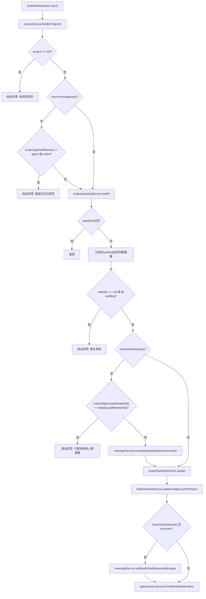

# 基础信息

|      |      |
|------|------|
| 名称 | ProjectDataSetAuditService |
| 编码语言 | .java |
| 代码路径 | WeFe/board/board-service/src/main/java/com/welab/wefe/board/service/service/ProjectDataSetAuditService.java |
| 包名 | com.welab.wefe.board.service.service |
| 依赖项 | ['com.welab.wefe.board.service.api.project.dataset.AuditDataSetApi', 'com.welab.wefe.board.service.api.project.dataset.AuditDataSetApi.Input', 'com.welab.wefe.board.service.database.entity.job.ProjectDataSetMySqlModel', 'com.welab.wefe.board.service.database.entity.job.ProjectMySqlModel', 'com.welab.wefe.board.service.service.data_resource.table_data_set.TableDataSetService', 'com.welab.wefe.common.StatusCode', 'com.welab.wefe.common.exception.StatusCodeWithException', 'com.welab.wefe.common.wefe.enums.AuditStatus', 'com.welab.wefe.common.wefe.enums.JobMemberRole', 'org.springframework.beans.factory.annotation.Autowired', 'org.springframework.stereotype.Service', 'org.springframework.transaction.annotation.Transactional', 'java.util.List'] |
| 概述说明 | ProjectDataSetAuditService类用于审核数据集，检查项目状态、成员权限，更新数据集审核状态，并同步消息和网关数据。 |

# 说明

ProjectDataSetAuditService是一个用于审核数据集的Spring服务类，继承自AbstractService。它依赖多个服务，包括ProjectService、ProjectMemberService等。核心方法auditDataSet通过输入参数验证项目状态、数据集状态及用户权限，执行审核操作并更新数据集状态。方法包含事务管理，异常时回滚。审核过程中会检查项目是否存在、用户是否为正式成员、数据集是否处于待审状态等条件。审核完成后更新数据集使用计数，并根据角色发送消息通知。方法支持网关调用和普通调用两种场景，确保数据一致性和权限控制。

# 类列表 Class Summary

| 名称   | 类型  | 说明 |
|-------|------|-------------|
| ProjectDataSetAuditService | class | ProjectDataSetAuditService用于审核数据集，检查项目状态、成员权限，更新数据集审核状态，并同步消息和网关数据。 |

## 类 ProjectDataSetAuditService

|      |      |
|------|------|
| 访问范围 | @Service;public |
| 类型 | class |
| 名称 | ProjectDataSetAuditService |
| 说明 | ProjectDataSetAuditService用于审核数据集，检查项目状态、成员权限，更新数据集审核状态，并同步消息和网关数据。 |

### UML类图

```mermaid
classDiagram
    class AbstractService {
        <<Abstract>>
    }

    class ProjectDataSetAuditService {
        -ProjectService projectService
        -ProjectMemberService projectMemberService
        -ProjectDataSetService projectDataSetService
        -MessageService messageService
        -TableDataSetService tableDataSetService
        +auditDataSet(Input input) void
    }

    class ProjectService {
        <<Interface>>
        +findByProjectId(String projectId) ProjectMySqlModel
    }

    class ProjectMemberService {
        <<Interface>>
    }

    class ProjectDataSetService {
        <<Interface>>
        +findAll(String projectId, String dataSetId) List~ProjectDataSetMySqlModel~
        +update(ProjectDataSetMySqlModel model, Consumer~ProjectDataSetMySqlModel~ updater) void
    }

    class MessageService {
        <<Interface>>
        +completeApplyDataResourceTodo(ProjectDataSetMySqlModel dataSet) void
        +addAuditDataResourceMessage(String memberId, ProjectMySqlModel project, ProjectDataSetMySqlModel dataSet, AuditStatus status, String comment) void
    }

    class TableDataSetService {
        <<Interface>>
        +updateUsageCountInProject(String dataSetId) void
    }

    class Input {
        +getProjectId() String
        +getDataSetId() String
        +getAuditStatus() AuditStatus
        +getAuditComment() String
        +fromGateway() boolean
        +callerMemberInfo MemberInfo
    }

    class ProjectMySqlModel {
        -String projectId
        -AuditStatus auditStatus
        -boolean exited
        -JobMemberRole myRole
        +getAuditStatus() AuditStatus
        +isExited() boolean
        +getMyRole() JobMemberRole
    }

    class ProjectDataSetMySqlModel {
        -String dataSetId
        -String memberId
        -AuditStatus auditStatus
        +getAuditStatus() AuditStatus
        +getMemberId() String
        +getDataSetId() String
    }

    class StatusCodeWithException {
        +StatusCodeWithException(StatusCode code, String message)
    }

    class AuditStatus {
        <<Enumeration>>
        +auditing
        +agree
    }

    class JobMemberRole {
        <<Enumeration>>
        +promoter
    }

    AbstractService <|-- ProjectDataSetAuditService
    ProjectDataSetAuditService --> ProjectService : 依赖
    ProjectDataSetAuditService --> ProjectMemberService : 依赖
    ProjectDataSetAuditService --> ProjectDataSetService : 依赖
    ProjectDataSetAuditService --> MessageService : 依赖
    ProjectDataSetAuditService --> TableDataSetService : 依赖
    ProjectDataSetAuditService ..> Input : 使用
    ProjectDataSetAuditService ..> ProjectMySqlModel : 使用
    ProjectDataSetAuditService ..> ProjectDataSetMySqlModel : 使用
    ProjectDataSetAuditService ..> StatusCodeWithException : 抛出
    Input ..> AuditStatus : 使用
    Input ..> MemberInfo : 包含
    ProjectMySqlModel ..> AuditStatus : 使用
    ProjectMySqlModel ..> JobMemberRole : 使用
    ProjectDataSetMySqlModel ..> AuditStatus : 使用
```

该代码是一个项目数据集审核服务，主要处理数据集的审核流程。ProjectDataSetAuditService继承自AbstractService，依赖多个服务接口（ProjectService、ProjectMemberService等），通过auditDataSet方法实现审核逻辑。方法中会检查项目状态、数据集状态、成员权限等，并通过MessageService发送通知消息。类图展示了服务类与各接口的依赖关系，以及核心模型类（如ProjectMySqlModel）和枚举类型（如AuditStatus）的使用关系。

### 内部方法调用关系图

流程图描述了`ProjectDataSetAuditService`类中`auditDataSet`方法的完整执行流程。该方法首先验证项目是否存在，然后检查调用方权限和数据集状态，接着执行数据集状态更新和用量统计，最后根据角色决定是否发送消息通知。流程包含10个条件分支和7个服务调用，严格遵循事务性和权限控制要求，确保数据集审核操作的完整性和安全性。

### 字段列表 Field List

| 名称  | 类型  | 说明 |
|-------|-------|------|
| projectDataSetService | ProjectDataSetService | 使用@Autowired自动注入ProjectDataSetService服务实例。 |
| messageService | MessageService | 使用@Autowired自动注入MessageService实例。 |
| tableDataSetService | TableDataSetService | 自动注入TableDataSetService实例。 |
| projectMemberService | ProjectMemberService | 自动注入项目成员服务实例。 |
| projectService | ProjectService | 使用@Autowired自动注入ProjectService实例。 |

### 方法列表

| 名称  | 类型  | 说明 |
|-------|-------|------|
| auditDataSet | void | 方法auditDataSet用于审核数据集，检查项目状态、数据集状态及权限，更新审核状态并同步信息。非网关请求需验证成员权限，网关请求则发送提醒消息。 |

