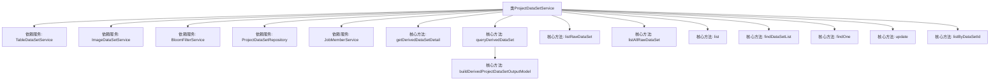
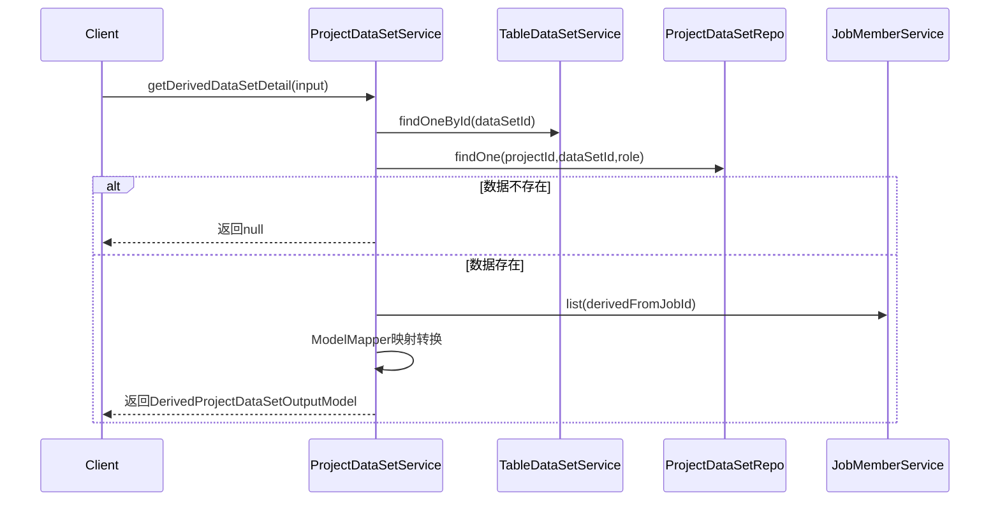

# 基础信息

|      |      |
|------|------|
| 名称 | ProjectDataSetService |
| 编码语言 | .java |
| 代码路径 | WeFe/board/board-service/src/main/java/com/welab/wefe/board/service/service/ProjectDataSetService.java |
| 包名 | com.welab.wefe.board.service.service |
| 依赖项 | ['com.alibaba.fastjson.JSONObject', 'com.welab.wefe.board.service.api.gateway.GetDerivedDataSetDetailApi', 'com.welab.wefe.board.service.api.project.dataset.QueryDerivedDataSetApi', 'com.welab.wefe.board.service.database.entity.data_resource.TableDataSetMysqlModel', 'com.welab.wefe.board.service.database.entity.job.ProjectDataSetMySqlModel', 'com.welab.wefe.board.service.database.repository.ProjectDataSetRepository', 'com.welab.wefe.board.service.dto.base.PagingOutput', 'com.welab.wefe.board.service.dto.entity.data_resource.output.DataResourceOutputModel', 'com.welab.wefe.board.service.dto.entity.data_resource.output.ImageDataSetOutputModel', 'com.welab.wefe.board.service.dto.entity.data_resource.output.TableDataSetOutputModel', 'com.welab.wefe.board.service.dto.entity.job.JobMemberOutputModel', 'com.welab.wefe.board.service.dto.entity.project.data_set.DerivedProjectDataSetOutputModel', 'com.welab.wefe.board.service.dto.entity.project.data_set.ProjectDataResourceOutputModel', 'com.welab.wefe.board.service.dto.vo.JobMemberWithDataSetOutputModel', 'com.welab.wefe.board.service.service.data_resource.bloom_filter.BloomFilterService', 'com.welab.wefe.board.service.service.data_resource.image_data_set.ImageDataSetService', 'com.welab.wefe.board.service.service.data_resource.table_data_set.TableDataSetService', 'com.welab.wefe.common.StatusCode', 'com.welab.wefe.common.data.mysql.Where', 'com.welab.wefe.common.data.mysql.enums.OrderBy', 'com.welab.wefe.common.exception.StatusCodeWithException', 'com.welab.wefe.common.util.JObject', 'com.welab.wefe.common.web.util.CurrentAccountUtil', 'com.welab.wefe.common.web.util.ModelMapper', 'com.welab.wefe.common.wefe.enums.DataResourceType', 'com.welab.wefe.common.wefe.enums.DeepLearningJobType', 'com.welab.wefe.common.wefe.enums.JobMemberRole', 'org.springframework.beans.BeanUtils', 'org.springframework.beans.factory.annotation.Autowired', 'org.springframework.data.jpa.domain.Specification', 'org.springframework.stereotype.Service', 'java.util.List', 'java.util.function.Consumer', 'java.util.stream.Collectors'] |
| 概述说明 | ProjectDataSetService提供项目数据集管理功能，包括查询衍生数据集详情、列表、原始数据集列表，支持按条件筛选和更新数据集。主要依赖TableDataSetService等组件处理数据资源。 |

# 说明

ProjectDataSetService是一个服务类，提供项目数据集相关操作。主要功能包括：获取衍生数据集详情，查询衍生数据集列表，列出原始数据集，按条件查询数据集列表，以及更新数据集信息。服务依赖多个组件如TableDataSetService、ImageDataSetService等。方法涵盖数据集的增删改查，支持按项目ID、成员ID、角色等条件筛选，并处理数据集类型转换和异常情况。

# 类列表 Class Summary

| 名称   | 类型  | 说明 |
|-------|------|-------------|
| ProjectDataSetService | class | ProjectDataSetService类提供项目数据集管理功能，包括查询衍生/原始数据集详情、列表及更新操作，支持多种数据类型（表、图像、布隆过滤器）和成员权限控制。 |

## 类 ProjectDataSetService

|      |      |
|------|------|
| 访问范围 | @Service;public |
| 类型 | class |
| 名称 | ProjectDataSetService |
| 说明 | ProjectDataSetService类提供项目数据集管理功能，包括查询衍生/原始数据集详情、列表及更新操作，支持多种数据类型（表、图像、布隆过滤器）和成员权限控制。 |

### UML类图

```mermaid
classDiagram
    class ProjectDataSetService {
        -TableDataSetService tableDataSetService
        -ImageDataSetService imageDataSetService
        -BloomFilterService bloomFilterService
        -ProjectDataSetRepository projectDataSetRepo
        -JobMemberService jobMemberService
        +getDerivedDataSetDetail(GetDerivedDataSetDetailApi$Input input) DerivedProjectDataSetOutputModel
        +queryDerivedDataSet(QueryDerivedDataSetApi$Input input) PagingOutput~DerivedProjectDataSetOutputModel~
        +listRawDataSet(String projectId, DataResourceType dataResourceType, String memberId, JobMemberRole memberRole, Boolean containsY) List~ProjectDataResourceOutputModel~
        +listRawDataSet(String projectId, DataResourceType dataResourceType, String dataResourceId, String memberId, JobMemberRole memberRole, Boolean containsY, DeepLearningJobType forJobType) List~ProjectDataResourceOutputModel~
        +listAllRawDataSet(String projectId, String memberId) List~ProjectDataSetMySqlModel~
        +list(String projectId, DataResourceType dataResourceType, String memberId) List~ProjectDataResourceOutputModel~
        +findDataSetList(String projectId, String memberId, JobMemberRole memberRole) List~ProjectDataSetMySqlModel~
        +findOne(String projectId, String dataSetId, JobMemberRole memberRole) ProjectDataSetMySqlModel
        +findOne(String projectId, String dataSetId) ProjectDataSetMySqlModel
        +findAll(String projectId, String dataSetId) List~ProjectDataSetMySqlModel~
        +update(ProjectDataSetMySqlModel dataSet, Consumer~ProjectDataSetMySqlModel~ func) void
        +listByDataSetId(String projectId, String dataSetId, JobMemberRole memberRole) List~ProjectDataSetMySqlModel~
        -buildDerivedProjectDataSetOutputModel(ProjectDataSetMySqlModel projectDataSet) DerivedProjectDataSetOutputModel
    }

    class TableDataSetService {
        +findOneById(String id) TableDataSetMysqlModel
        +findDataSetFromLocalOrUnion(String memberId, String dataSetId) TableDataSetOutputModel
    }

    class ImageDataSetService {
        +findDataSetFromLocalOrUnion(String memberId, String dataSetId) ImageDataSetOutputModel
    }

    class BloomFilterService {
        +findDataSetFromLocalOrUnion(String memberId, String dataSetId) DataResourceOutputModel
    }

    class ProjectDataSetRepository {
        +paging(Specification~ProjectDataSetMySqlModel~ spec, QueryDerivedDataSetApi$Input input) PagingOutput~ProjectDataSetMySqlModel~
        +findAll(Specification~ProjectDataSetMySqlModel~ spec) List~ProjectDataSetMySqlModel~
        +findOne(Specification~ProjectDataSetMySqlModel~ spec) Optional~ProjectDataSetMySqlModel~
        +save(ProjectDataSetMySqlModel entity) ProjectDataSetMySqlModel
    }

    class JobMemberService {
        +list(String jobId, Boolean includeDeleted) List~JobMemberOutputModel~
    }

    class AbstractService {
        <<Abstract>>
        +log(Exception e) void
    }

    ProjectDataSetService --> TableDataSetService : 依赖
    ProjectDataSetService --> ImageDataSetService : 依赖
    ProjectDataSetService --> BloomFilterService : 依赖
    ProjectDataSetService --> ProjectDataSetRepository : 依赖
    ProjectDataSetService --> JobMemberService : 依赖
    ProjectDataSetService --|> AbstractService : 继承
```

类图描述：该图展示了ProjectDataSetService作为核心服务类，通过继承AbstractService获得基础功能，并依赖多个服务类(TableDataSetService、ImageDataSetService等)和数据访问层(ProjectDataSetRepository)来实现数据集管理功能。主要功能包括衍生数据集查询、原始数据集列表获取、数据集详情查询等，通过组合多种服务完成复杂的数据集管理操作。

### 内部方法调用关系图

这段代码是ProjectDataSetService类的实现，主要处理项目中数据集相关的业务逻辑。流程图展示了类结构与核心方法调用关系，时序图重点描述了getDerivedDataSetDetail方法的执行流程。该类通过多个依赖服务实现对不同类型数据集(表格、图像、布隆过滤器)的CRUD操作，包含衍生数据集详情查询、原始数据集列表查询、条件查询等核心功能，并处理了数据权限校验和异常情况。

### 字段列表 Field List

| 名称  | 类型  | 说明 |
|-------|-------|------|
| projectDataSetRepo | ProjectDataSetRepository | 自动注入项目数据集仓库实例。 |
| jobMemberService | JobMemberService | 使用@Autowired自动注入JobMemberService实例。 |
| tableDataSetService | TableDataSetService | 自动注入TableDataSetService实例。 |
| imageDataSetService | ImageDataSetService | 自动注入ImageDataSetService实例。 |
| bloomFilterService | BloomFilterService | 使用@Autowired自动注入BloomFilterService实例。 |

### 方法列表

| 名称  | 类型  | 说明 |
|-------|-------|------|
| listRawDataSet | List<ProjectDataResourceOutputModel> | 方法根据项目ID、资源类型等条件查询数据集，处理不同类型资源并过滤结果，返回处理后的资源列表。 |
| list | List<ProjectDataResourceOutputModel> | 该方法根据项目ID、资源类型和成员ID查询项目数据集，转换为输出模型并填充关联数据资源，最后返回结果列表。 |
| buildDerivedProjectDataSetOutputModel | DerivedProjectDataSetOutputModel | 构建派生项目数据集输出模型，复制属性并查询相关数据集。若数据集存在，设置数据资源并处理成员特征列表，远程获取其他成员数据。最后返回派生数据集模型。 |
| findDataSetList | List<ProjectDataSetMySqlModel> | 根据项目ID、成员ID和角色查询数据集列表。 |
| findOne | ProjectDataSetMySqlModel | 根据项目ID、数据集ID和成员角色查询MySQL模型数据，无结果返回null。 |
| listAllRawDataSet | List<ProjectDataSetMySqlModel> | 方法listAllRawDataSet根据projectId和memberId查询原始数据集，排除sourceType非空记录，按createdTime降序返回结果列表。 |
| queryDerivedDataSet | PagingOutput<DerivedProjectDataSetOutputModel> | 方法queryDerivedDataSet根据输入条件查询派生数据集，构建where条件并分页返回结果。处理sourceType为空的情况，按创建时间降序排序，并行转换数据后返回分页输出。 |
| listRawDataSet | List<ProjectDataResourceOutputModel> | 这是一个Java方法，根据项目ID、数据类型、成员ID、角色和是否包含Y参数查询原始数据集列表，内部调用另一个重载方法。 |
| getDerivedDataSetDetail | DerivedProjectDataSetOutputModel | 方法根据输入获取衍生数据集详情，验证数据集和项目存在后，检查源类型非空，映射成员和数据资源信息后返回输出模型。若数据不存在返回null，源类型为空则抛出异常。 |
| findOne | ProjectDataSetMySqlModel | 查找指定项目ID和数据集ID的ProjectDataSetMySqlModel记录，未找到返回null。 |
| findAll | List<ProjectDataSetMySqlModel> | 查询指定项目ID和数据集ID的ProjectDataSetMySqlModel列表。 |
| update | void | 更新项目数据集方法：检查非空后执行回调，设置更新者并保存数据。 |
| listByDataSetId | List<ProjectDataSetMySqlModel> | 该方法根据项目ID、数据集ID和成员角色查询项目数据集列表，返回符合条件的MySQL模型集合。 |

