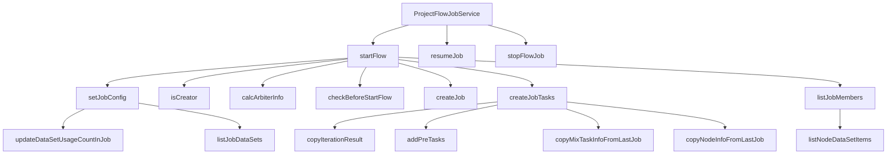

# 基础信息

|      |      |
|------|------|
| 名称 | ProjectFlowJobService |
| 编码语言 | .java |
| 代码路径 | WeFe/board/board-service/src/main/java/com/welab/wefe/board/service/service/ProjectFlowJobService.java |
| 包名 | com.welab.wefe.board.service.service |
| 依赖项 | ['com.alibaba.fastjson.JSONObject', 'com.welab.wefe.board.service.api.project.flow.StartFlowApi', 'com.welab.wefe.board.service.api.project.job.ResumeJobApi', 'com.welab.wefe.board.service.api.project.job.StopJobApi', 'com.welab.wefe.board.service.component.Components', 'com.welab.wefe.board.service.component.DataIOComponent', 'com.welab.wefe.board.service.component.OotComponent', 'com.welab.wefe.board.service.component.base.AbstractComponent', 'com.welab.wefe.board.service.component.base.dto.AbstractDataIOParam', 'com.welab.wefe.board.service.component.base.dto.AbstractDataSetItem', 'com.welab.wefe.board.service.database.entity.data_resource.TableDataSetMysqlModel', 'com.welab.wefe.board.service.database.entity.job', 'com.welab.wefe.board.service.database.repository', 'com.welab.wefe.board.service.dto.entity.data_resource.output.DataResourceOutputModel', 'com.welab.wefe.board.service.dto.entity.data_resource.output.TableDataSetOutputModel', 'com.welab.wefe.board.service.dto.kernel.Member', 'com.welab.wefe.board.service.dto.kernel.machine_learning.Env', 'com.welab.wefe.board.service.dto.kernel.machine_learning.JobDataSet', 'com.welab.wefe.board.service.dto.kernel.machine_learning.KernelJob', 'com.welab.wefe.board.service.dto.kernel.machine_learning.Project', 'com.welab.wefe.board.service.dto.vo.JobArbiterInfo', 'com.welab.wefe.board.service.exception.FlowNodeException', 'com.welab.wefe.board.service.model.FlowGraph', 'com.welab.wefe.board.service.model.FlowGraphNode', 'com.welab.wefe.board.service.model.JobBuilder', 'com.welab.wefe.board.service.service.data_resource.DataResourceService', 'com.welab.wefe.board.service.service.data_resource.table_data_set.TableDataSetService', 'com.welab.wefe.common.StatusCode', 'com.welab.wefe.common.exception.StatusCodeWithException', 'com.welab.wefe.common.util.DateUtil', 'com.welab.wefe.common.util.StringUtil', 'com.welab.wefe.common.web.util.CurrentAccountUtil', 'com.welab.wefe.common.wefe.checkpoint.dto.MemberAvailableCheckOutput', 'com.welab.wefe.common.wefe.enums', 'org.apache.commons.collections4.CollectionUtils', 'org.apache.commons.lang3.StringUtils', 'org.springframework.beans.BeanUtils', 'org.springframework.beans.factory.annotation.Autowired', 'org.springframework.stereotype.Service', 'org.springframework.transaction.annotation.Transactional', 'java.util', 'java.util.stream.Collectors'] |
| 概述说明 | ProjectFlowJobService是一个服务类，负责管理项目流程任务的启动、恢复和停止。它通过依赖注入多个服务类来处理任务、数据集、成员等操作，并包含事务处理和同步机制。主要功能包括启动流程、设置任务配置、检查任务有效性、复制任务信息等。 |

# 说明

ProjectFlowJobService是一个负责管理项目流程任务的Spring服务类，继承自AbstractService。它通过多个自动注入的依赖服务（如JobService、TaskService等）实现流程启动、恢复、停止等核心功能。主要方法包括startFlow（校验权限、初始化任务）、resumeJob（恢复中断任务）、stopFlowJob（停止任务）等。服务包含严格的权限控制（如仅创建者可启动任务）、联邦学习类型校验（横向/混合模式）、数据集有效性检查等逻辑，并通过事务管理确保操作原子性。内部通过FlowGraph管理任务节点关系，支持任务缓存复用和错误恢复机制。

# 类列表 Class Summary

| 名称   | 类型  | 说明 |
|-------|------|-------------|
| ProjectFlowJobService | class | ProjectFlowJobService类负责管理项目流程任务，包含启动、暂停、恢复任务等功能。通过依赖注入多个服务类，处理任务创建、成员管理、数据集验证等逻辑。主要方法包括startFlow启动流程、resumeJob恢复任务、stopFlowJob暂停任务，并确保数据一致性和权限控制。 |

## 类 ProjectFlowJobService

|      |      |
|------|------|
| 访问范围 | @Service;public |
| 类型 | class |
| 名称 | ProjectFlowJobService |
| 说明 | ProjectFlowJobService类负责管理项目流程任务，包含启动、暂停、恢复任务等功能。通过依赖注入多个服务类，处理任务创建、成员管理、数据集验证等逻辑。主要方法包括startFlow启动流程、resumeJob恢复任务、stopFlowJob暂停任务，并确保数据一致性和权限控制。 |

### UML类图

```mermaid
classDiagram
    class ProjectFlowJobService {
        +JobService jobService
        +JobRepository jobRepo
        +TaskResultService taskResultService
        +JobMemberRepository jobMemberRepo
        +TaskResultRepository taskResultRepository
        +TaskService taskService
        +FlowActionQueueService flowActionQueueService
        +GatewayService gatewayService
        +ProjectFlowRepository projectFlowRepo
        +ProjectFlowNodeService projectFlowNodeService
        +ProjectService projectService
        +DataResourceService dataResourceService
        +ProjectFlowService projectFlowService
        +TaskRepository taskRepository
        +ProjectDataSetService projectDataSetService
        +ServiceCheckService serviceCheckService
        +TableDataSetService tableDataSetService
        +int MIX_FLOW_PROMOTER_NUM
        +String startFlow(StartFlowApi.Input input) StatusCodeWithException
        +boolean isCreator(ProjectFlowMySqlModel flow, ProjectMySqlModel project)
        +JobArbiterInfo calcArbiterInfo(ProjectFlowMySqlModel flow, StartFlowApi.Input input, ProjectMySqlModel project)
        +void resumeJob(ResumeJobApi.Input input) StatusCodeWithException
        +void stopFlowJob(StopJobApi.Input input) StatusCodeWithException
        -void setJobConfig(StartFlowApi.Input input, JobMySqlModel job, FlowGraph graph, boolean isOotMode) StatusCodeWithException
        -void checkBeforeStartFlow(FlowGraph graph, ProjectMySqlModel project, boolean isOotMode) StatusCodeWithException
        -JobMySqlModel createJob(ProjectFlowMySqlModel flow, StartFlowApi.Input input, JobMemberRole myRole)
        -List~TaskMySqlModel~ createJobTasks(JobBuilder jobBuilder, ProjectMySqlModel project, FlowGraph graph, boolean useCache, String endNodeId, FederatedLearningType federatedLearningType) StatusCodeWithException
        -void updateDataSetUsageCountInJob(KernelJob kernelJob) StatusCodeWithException
        -void copyIterationResult(JobMySqlModel oldJob, JobMySqlModel newJob, FlowGraphNode node)
        -void addPreTasks(FlowGraphNode node, List~TaskMySqlModel~ tasks, List~TaskMySqlModel~ cacheTasks)
        -List~TaskMySqlModel~ copyMixTaskInfoFromLastJob(JobMySqlModel oldJob, JobMySqlModel newJob, FlowGraphNode node, boolean copyTask)
        -TaskMySqlModel copyNodeInfoFromLastJob(JobMySqlModel oldJob, JobMySqlModel newJob, FlowGraphNode node, boolean copyTask)
        -List~JobMemberMySqlModel~ listJobMembers(String projectId, String flowId, String jobId, JobArbiterInfo jobArbiterInfo, boolean isOotMode) StatusCodeWithException
        -List~AbstractDataSetItem~ listNodeDataSetItems(ProjectFlowNodeMySqlModel node) StatusCodeWithException
        -List~JobDataSet~ listJobDataSets(JobMySqlModel job, List~FlowGraphNode~ nodes) StatusCodeWithException
    }

    class AbstractService {
        <<Abstract>>
    }

    class JobService {
        +List~JobMySqlModel~ listByJobId(String jobId)
        +void updateJob(JobMySqlModel job, Function~JobMySqlModel, JobMySqlModel~ updater)
        +void setGraphHasCacheResult(FlowGraph graph, boolean useCache)
    }

    class JobRepository {
        +JobMySqlModel findOne(String field, Object value, Class~T~ clazz)
        +JobMySqlModel findLastByFlowId(String flowId, String role)
        +void save(JobMySqlModel job)
    }

    class TaskResultService {
        +List~TaskResultMySqlModel~ listAllResult(String taskId)
    }

    class JobMemberRepository {
        +void save(JobMemberMySqlModel jobMember)
    }

    class TaskResultRepository {
        +void save(TaskResultMySqlModel taskResult)
    }

    class TaskService {
        +List~TaskMySqlModel~ listByJobId(String jobId, JobMemberRole role)
        +TaskMySqlModel findOne(String jobId, String nodeId, JobMemberRole role)
        +List~TaskMySqlModel~ findAll(String jobId, String nodeId, JobMemberRole role)
    }

    class FlowActionQueueService {
        +void runJob(Object input, String jobId, ProjectType projectType)
        +void stopJob(Object input, String jobId, ProjectType projectType)
    }

    class GatewayService {
        +void syncToOtherJobMembers(String jobId, Object input, Class~T~ apiClass)
    }

    class ProjectFlowRepository {
        +ProjectFlowMySqlModel findOne(String field, Object value, Class~T~ clazz)
    }

    class ProjectFlowNodeService {
        +List~ProjectFlowNodeMySqlModel~ findNodesByFlowId(String flowId)
        +List~ProjectFlowNodeMySqlModel~ listAboutLoadDataSetNodes(String flowId)
    }

    class ProjectService {
        +ProjectMySqlModel findByProjectId(String projectId)
    }

    class DataResourceService {
        +DataResourceOutputModel findDataResourceFromLocalOrUnion(ProjectDataSetMySqlModel projectDataSet)
        +void usageCountInJobIncrement(String dataSetId)
    }

    class ProjectFlowService {
        +void updateFlowStatus(String flowId, ProjectFlowStatus status)
    }

    class ProjectDataSetService {
        +ProjectDataSetMySqlModel findOne(String projectId, String dataSetId, JobMemberRole role)
        +List~ProjectDataSetMySqlModel~ listByDataSetId(String projectId, String dataSetId, JobMemberRole role)
    }

    class ServiceCheckService {
        +MemberAvailableCheckOutput getMemberAvailableInfo(String memberId)
    }

    class TableDataSetService {
        +TableDataSetOutputModel findDataSetFromLocalOrUnion(String memberId, String dataSetId)
        +List~TableDataSetMysqlModel~ queryAll(String jobId, ComponentType componentType)
        +void save(TableDataSetMysqlModel dataSetModel)
    }

    class JobBuilder {
        <<Utility>>
    }

    class FlowGraph {
        +List~FlowGraphNode~ getStartNodes()
        +List~FlowGraphNode~ getJobSteps(String endNodeId)
        +List~JobMemberMySqlModel~ getMembers()
        +JobMySqlModel getJob()
        +JobMySqlModel getLastJob()
    }

    class FlowGraphNode {
        +String createTaskId(JobMySqlModel job)
        +String createTaskId(JobMySqlModel job, int count)
        +List~String~ createParentTaskIds(JobMySqlModel job)
        +List~String~ createParentTaskIds(JobMySqlModel job, int count)
    }

    class KernelJob {
        +List~JobDataSet~ getDataSets()
        +List~Member~ getMembers()
        +void setFederatedLearningType(FederatedLearningType type)
        +void setProject(Project project)
        +void setMembers(List~Member~ members)
        +void setEnv(Env env)
        +void setDataSets(List~JobDataSet~ dataSets)
        +void setFederatedLearningMode(FederatedLearningModel mode)
    }

    class JobDataSet {
        +List~Member~ members
    }

    class Member {
        +String getMemberId()
        +JobMemberRole getMemberRole()
    }

    class JobArbiterInfo {
        +boolean isHasArbiter()
        +void setHasArbiter(boolean hasArbiter)
        +String getArbiterMemberId()
    }

    ProjectFlowJobService --|> AbstractService
    ProjectFlowJobService --> JobService : 依赖
    ProjectFlowJobService --> JobRepository : 依赖
    ProjectFlowJobService --> TaskResultService : 依赖
    ProjectFlowJobService --> JobMemberRepository : 依赖
    ProjectFlowJobService --> TaskResultRepository : 依赖
    ProjectFlowJobService --> TaskService : 依赖
    ProjectFlowJobService --> FlowActionQueueService : 依赖
    ProjectFlowJobService --> GatewayService : 依赖
    ProjectFlowJobService --> ProjectFlowRepository : 依赖
    ProjectFlowJobService --> ProjectFlowNodeService : 依赖
    ProjectFlowJobService --> ProjectService : 依赖
    ProjectFlowJobService --> DataResourceService : 依赖
    ProjectFlowJobService --> ProjectFlowService : 依赖
    ProjectFlowJobService --> ProjectDataSetService : 依赖
    ProjectFlowJobService --> ServiceCheckService : 依赖
    ProjectFlowJobService --> TableDataSetService : 依赖
    ProjectFlowJobService --> JobBuilder : 依赖
    ProjectFlowJobService --> FlowGraph : 依赖
    ProjectFlowJobService --> KernelJob : 依赖
    ProjectFlowJobService --> JobArbiterInfo : 依赖
    FlowGraph --> FlowGraphNode : 包含
    KernelJob --> JobDataSet : 包含
    KernelJob --> Member : 包含
    JobDataSet --> Member : 包含
```

这段代码展示了一个复杂的联邦学习任务调度系统，主要类ProjectFlowJobService负责流程的启动、暂停和恢复，通过协调多个服务（如JobService、TaskService等）和组件（如FlowGraph、KernelJob等）来完成分布式任务的编排。系统支持多种联邦学习类型（横向、纵向、混合），包含严格的权限校验、任务状态管理和数据一致性保障机制，体现了高内聚低耦合的设计思想。

### 内部方法调用关系图

这段代码是ProjectFlowJobService类的实现，主要负责项目流程任务的管理，包括启动流程、恢复任务、停止任务等核心功能。通过流程图可以清晰地看到各个方法之间的调用关系，其中startFlow是核心入口方法，会调用多个子方法完成流程验证、任务创建、配置设置等工作。类中使用了大量服务注入（如jobService、taskService等）来处理任务和流程的持久化操作，体现了联邦学习场景下多角色协作的复杂业务逻辑。

### 字段列表 Field List

| 名称  | 类型  | 说明 |
|-------|-------|------|
| taskRepository | TaskRepository | 自动注入TaskRepository任务仓库实例。 |
| projectFlowService | ProjectFlowService | 使用@Autowired自动注入ProjectFlowService实例。 |
| projectFlowRepo | ProjectFlowRepository | 使用@Autowired自动注入ProjectFlowRepository实例projectFlowRepo。 |
| projectFlowNodeService | ProjectFlowNodeService | 使用@Autowired自动注入ProjectFlowNodeService实例。 |
| taskResultRepository | TaskResultRepository | 自动注入TaskResultRepository实例。 |
| jobService | JobService | 自动注入JobService实例。 |
| gatewayService | GatewayService | 自动注入GatewayService实例。 |
| jobMemberRepo | JobMemberRepository | 自动注入JobMemberRepository实例到jobMemberRepo变量。 |
| taskService | TaskService | 使用@Autowired自动注入TaskService实例。 |
| flowActionQueueService | FlowActionQueueService | 使用@Autowired自动注入FlowActionQueueService实例。 |
| projectDataSetService | ProjectDataSetService | 代码片段使用Spring的@Autowired注解自动注入ProjectDataSetService实例。 |
| dataResourceService | DataResourceService | 使用@Autowired自动注入DataResourceService实例。 |
| jobRepo | JobRepository | 自动注入JobRepository实例到jobRepo变量。 |
| projectService | ProjectService | 使用@Autowired自动注入ProjectService实例。 |
| tableDataSetService | TableDataSetService | 自动注入TableDataSetService实例。 |
| taskResultService | TaskResultService | 使用@Autowired自动注入TaskResultService实例。 |
| serviceCheckService | ServiceCheckService | 自动注入ServiceCheckService服务实例。 |
| MIX_FLOW_PROMOTER_NUM = 2 | int | 定义静态常量MIX_FLOW_PROMOTER_NUM，值为2。 |

### 方法列表

| 名称  | 类型  | 说明 |
|-------|-------|------|
| startFlow | String | 方法startFlow启动流程，检查权限、任务状态和数据集，创建任务并同步成员信息，更新流程状态。 |
| createJobTasks | List<TaskMySqlModel> | 方法创建任务列表，检查起始节点和缓存节点，处理仲裁者角色和混合联邦学习类型，验证参数并构建任务，最后处理建模节点的缓存结果。 |
| copyNodeInfoFromLastJob | TaskMySqlModel | 方法从旧任务复制节点信息到新任务，包括任务、结果和数据集，并保存到数据库。 |
| calcArbiterInfo | JobArbiterInfo | 方法calcArbiterInfo根据项目类型和联邦学习类型判断是否需要仲裁者。深度学习项目无需仲裁者；横向联邦学习中发起者需要仲裁者；混合联邦学习中非网关且为发起者时需要仲裁者。默认返回无仲裁者。 |
| setJobConfig | void | 该方法用于配置任务信息，包括创建KernelJob对象、设置项目、成员角色（如仲裁者、发起者）、数据集及联邦学习模式，最后更新任务配置和数据集使用情况。 |
| resumeJob | void | 事务方法resumeJob用于恢复任务：检查任务存在性、权限及状态；深度学习任务续跑需修改配置；更新任务状态为等待运行，同步通知成员。 |
| copyMixTaskInfoFromLastJob | List<TaskMySqlModel> | 该方法从旧任务复制任务信息到新任务，包括任务、任务结果和数据集。若新任务为空返回空，否则遍历旧任务，根据参数决定是否复制任务，并更新相关属性后保存。同时复制任务结果和数据集到新任务，最后返回新任务列表。 |
| listNodeDataSetItems | List<? extends AbstractDataSetItem> | 该方法根据节点类型获取数据集项列表。处理DataIO和ImageDataIO类型时直接返回参数中的数据集列表；处理Oot类型时检查jobId非空才返回数据集列表；其他类型抛出异常。最终返回数据集项列表或null。 |
| copyIterationResult | void | 方法`copyIterationResult`根据节点类型和联邦学习类型，从旧任务复制迭代结果到新任务。若非建模节点则直接返回；若为混合类型调用`copyMixTaskInfoFromLastJob`，否则调用`copyNodeInfoFromLastJob`。 |
| listJobMembers | List<JobMemberMySqlModel> | 方法listJobMembers根据项目ID、流程ID等参数，遍历节点数据集项生成任务成员列表，处理仲裁者逻辑并排序返回。 |
| createJob | JobMySqlModel | 创建JobMySqlModel实例，设置学习类型、角色、ID、创建者、名称、进度、状态、更新时间、项目ID、流程ID、流程图和备注，最后返回该实例。 |
| listJobDataSets | List<JobDataSet> | 方法遍历节点列表，筛选特定组件类型节点，提取数据集信息并构建JobDataSet列表返回。处理DataIO和Oot组件参数，包含成员ID、角色、数据集统计等。 |
| checkBeforeStartFlow | void | 检查流程启动条件：确保有起始节点且包含数据集加载组件；OOT模式仅允许单一组件；验证各成员服务可用性及数据集有效性，包括存在性、授权状态等。 |
| stopFlowJob | void | 使用事务和同步锁停止流程任务。检查任务是否存在及状态，非promoter无权操作。更新任务状态为等待停止，同步通知其他成员。 |
| addPreTasks | void | 方法`addPreTasks`将缓存任务中位置介于当前节点和任务列表末位之间的任务添加到任务列表。 |
| updateDataSetUsageCountInJob | void | 更新任务中数据集使用计数：遍历任务数据集成员ID，调用服务增加对应数据集的使用计数。 |
| isCreator | boolean | 检查当前用户是否为项目创建者：用户角色为发起人且账号与流程创建者匹配时返回真。 |

