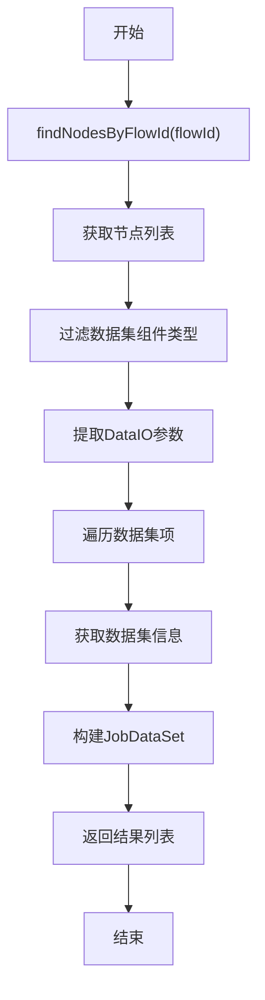
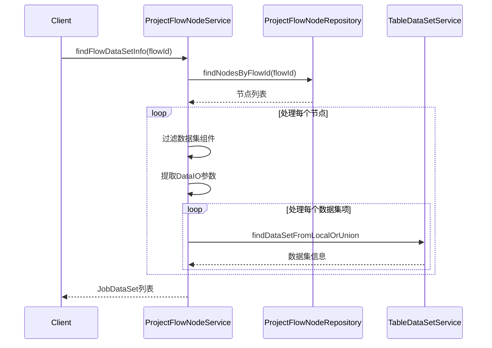
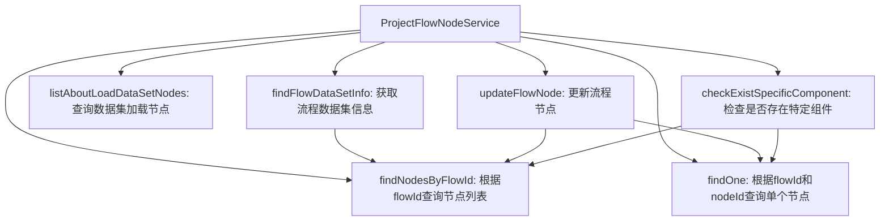
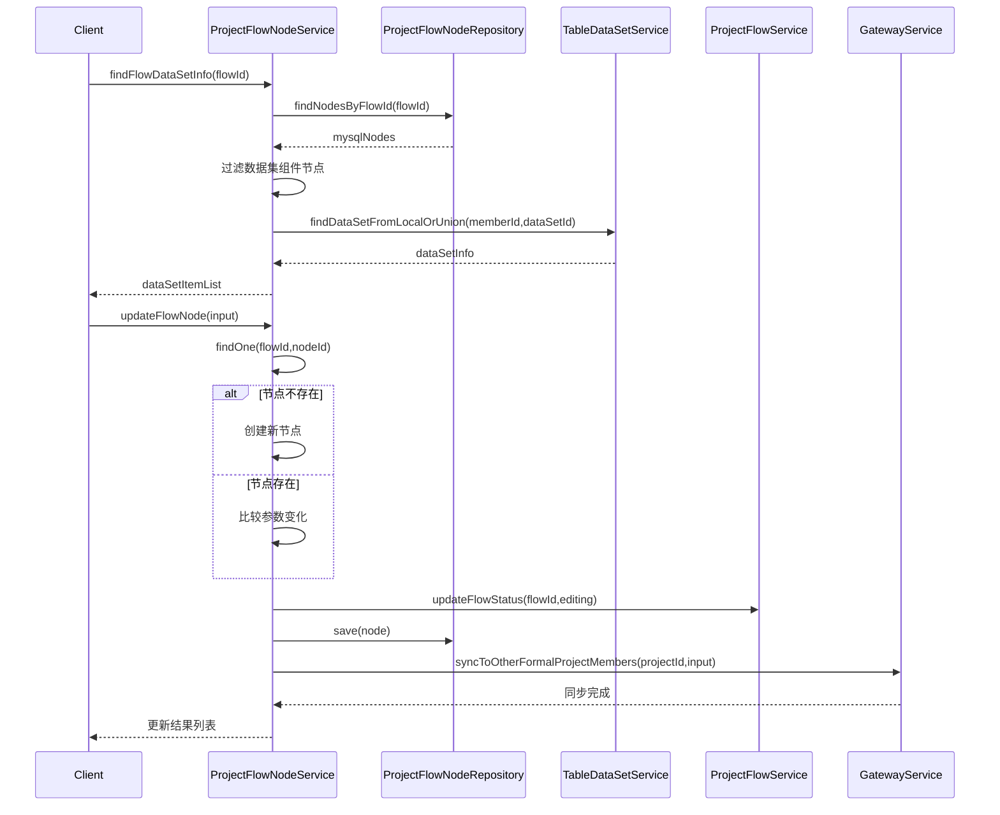

# 基础信息

|      |      |
|------|------|
| 名称 | ProjectFlowNodeService |
| 编码语言 | .java |
| 代码路径 | WeFe/board/board-service/src/main/java/com/welab/wefe/board/service/service/ProjectFlowNodeService.java |
| 包名 | com.welab.wefe.board.service.service |
| 依赖项 | ['com.alibaba.fastjson.JSON', 'com.welab.wefe.board.service.api.project.node.CheckExistEvaluationComponentApi', 'com.welab.wefe.board.service.api.project.node.UpdateApi', 'com.welab.wefe.board.service.component.Components', 'com.welab.wefe.board.service.component.DataIOComponent', 'com.welab.wefe.board.service.database.entity.job.JobMySqlModel', 'com.welab.wefe.board.service.database.entity.job.ProjectFlowMySqlModel', 'com.welab.wefe.board.service.database.entity.job.ProjectFlowNodeMySqlModel', 'com.welab.wefe.board.service.database.entity.job.TaskMySqlModel', 'com.welab.wefe.board.service.database.repository.ProjectFlowNodeRepository', 'com.welab.wefe.board.service.database.repository.ProjectFlowRepository', 'com.welab.wefe.board.service.dto.entity.data_resource.output.TableDataSetOutputModel', 'com.welab.wefe.board.service.dto.entity.job.ProjectFlowNodeOutputModel', 'com.welab.wefe.board.service.dto.kernel.machine_learning.JobDataSet', 'com.welab.wefe.board.service.model.FlowGraph', 'com.welab.wefe.board.service.model.FlowGraphNode', 'com.welab.wefe.board.service.service.data_resource.table_data_set.TableDataSetService', 'com.welab.wefe.common.StatusCode', 'com.welab.wefe.common.data.mysql.Where', 'com.welab.wefe.common.exception.StatusCodeWithException', 'com.welab.wefe.common.util.StringUtil', 'com.welab.wefe.common.web.util.CurrentAccountUtil', 'com.welab.wefe.common.web.util.ModelMapper', 'com.welab.wefe.common.wefe.enums.ComponentType', 'com.welab.wefe.common.wefe.enums.JobMemberRole', 'com.welab.wefe.common.wefe.enums.ProjectFlowStatus', 'org.apache.commons.collections4.CollectionUtils', 'org.springframework.beans.factory.annotation.Autowired', 'org.springframework.data.jpa.domain.Specification', 'org.springframework.stereotype.Service', 'org.springframework.transaction.annotation.Transactional', 'java.util.ArrayList', 'java.util.Arrays', 'java.util.List', 'java.util.stream.Collectors'] |
| 概述说明 | ProjectFlowNodeService类提供流程节点管理功能，包括查询节点、更新节点参数、检查特定组件存在性等操作。依赖多个服务如ProjectFlowNodeRepository、GatewayService等，支持事务处理和参数同步。 |

# 说明

ProjectFlowNodeService是一个服务类，负责管理项目流程节点相关操作。主要功能包括：根据流程ID查找节点，获取流程数据集信息，列出与数据集加载相关的节点，更新流程节点状态及参数，检查特定类型节点的存在性。该类通过多个自动装配的依赖服务（如ProjectFlowNodeRepository、GatewayService等）实现数据访问和业务逻辑处理，支持事务性操作和参数变更检测，确保数据一致性。

# 类列表 Class Summary

| 名称   | 类型  | 说明 |
|-------|------|-------------|
| ProjectFlowNodeService | class | ProjectFlowNodeService类提供流程节点管理功能，包括查询节点、更新节点参数、检查特定组件存在性等操作。通过依赖注入多个服务类实现数据交互，支持事务处理和参数同步。 |

## 类 ProjectFlowNodeService

|      |      |
|------|------|
| 访问范围 | @Service;public |
| 类型 | class |
| 名称 | ProjectFlowNodeService |
| 说明 | ProjectFlowNodeService类提供流程节点管理功能，包括查询节点、更新节点参数、检查特定组件存在性等操作。通过依赖注入多个服务类实现数据交互，支持事务处理和参数同步。 |

### UML类图

```mermaid
classDiagram
    class ProjectFlowNodeService {
        -ProjectFlowNodeRepository projectFlowNodeRepository
        -GatewayService gatewayService
        -ProjectFlowService projectFlowService
        -TableDataSetService tableDataSetService
        -ProjectFlowRepository projectFlowRepo
        -ProjectFlowNodeService projectFlowNodeService
        -JobService jobService
        -TaskService taskService
        +findNodesByFlowId(String flowId) List~ProjectFlowNodeMySqlModel~
        +findFlowDataSetInfo(String flowId) List~JobDataSet~
        +listAboutLoadDataSetNodes(String flowId) List~ProjectFlowNodeMySqlModel~
        +updateFlowNode(UpdateApi.Input input) List~ProjectFlowNodeOutputModel~
        +findOne(String flowId, String nodeId) ProjectFlowNodeMySqlModel
        +checkExistSpecificComponent(CheckExistEvaluationComponentApi.Input input, List~ComponentType~ targetComponentList) boolean
    }

    class ProjectFlowNodeRepository {
        <<Interface>>
        +findAll(Specification~T~ spec) List~T~
        +findOne(Specification~T~ spec) Optional~T~
        +save(T entity) T
    }

    class GatewayService {
        <<Interface>>
        +syncToOtherFormalProjectMembers(String projectId, Object input, Class~?~ apiClass) void
    }

    class ProjectFlowService {
        <<Interface>>
        +updateFlowStatus(String flowId, ProjectFlowStatus status) void
        +findOne(String flowId) ProjectFlowMySqlModel
    }

    class TableDataSetService {
        <<Interface>>
        +findDataSetFromLocalOrUnion(String memberId, String dataSetId) TableDataSetOutputModel
    }

    class JobService {
        <<Interface>>
        +createFlowGraph(String flowId) FlowGraph
        +findByJobId(String jobId, JobMemberRole role) JobMySqlModel
    }

    class TaskService {
        <<Interface>>
        +listByJobId(String jobId, JobMemberRole role) List~TaskMySqlModel~
        +findAll(String jobId, String nodeId, JobMemberRole role) List~TaskMySqlModel~
        +baseFindHomologousBranch(List~TaskMySqlModel~ totalTasks, String modelTaskId) List~TaskMySqlModel~
    }

    ProjectFlowNodeService --> ProjectFlowNodeRepository : 依赖
    ProjectFlowNodeService --> GatewayService : 依赖
    ProjectFlowNodeService --> ProjectFlowService : 依赖
    ProjectFlowNodeService --> TableDataSetService : 依赖
    ProjectFlowNodeService --> JobService : 依赖
    ProjectFlowNodeService --> TaskService : 依赖
```

类图描述：该图展示了ProjectFlowNodeService及其依赖的服务接口关系。ProjectFlowNodeService作为核心服务类，通过6个依赖接口实现流程节点管理功能，包括节点查询、数据集信息获取、流程更新等操作。类图清晰呈现了Spring依赖注入关系，其中Repository负责数据访问，各Service提供业务能力支持。

### 内部方法调用关系图

这段代码是ProjectFlowNodeService服务类，主要处理项目流程节点的增删改查和业务逻辑。包含6个核心方法：节点查询(findNodesByFlowId)、数据集信息获取(findFlowDataSetInfo)、数据集节点查询(listAboutLoadDataSetNodes)、节点更新(updateFlowNode)、单节点查询(findOne)和组件检查(checkExistSpecificComponent)。该类通过JPA仓库与数据库交互，并依赖多个其他服务完成业务流程，特别是updateFlowNode方法实现了复杂的节点更新逻辑和状态同步机制。

### 字段列表 Field List

| 名称  | 类型  | 说明 |
|-------|-------|------|
| gatewayService | GatewayService | 自动注入GatewayService实例。 |
| projectFlowNodeService | ProjectFlowNodeService | 自动注入ProjectFlowNodeService服务实例。 |
| jobService | JobService | 使用@Autowired自动注入JobService实例。 |
| projectFlowNodeRepository | ProjectFlowNodeRepository | 使用@Autowired自动注入ProjectFlowNodeRepository实例。 |
| taskService | TaskService | 自动注入TaskService实例。 |
| projectFlowRepo | ProjectFlowRepository | 自动注入ProjectFlowRepository实例，变量名为projectFlowRepo。 |
| tableDataSetService | TableDataSetService | 自动注入TableDataSetService实例。 |
| projectFlowService | ProjectFlowService | 自动注入ProjectFlowService实例。 |

### 方法列表

| 名称  | 类型  | 说明 |
|-------|-------|------|
| listAboutLoadDataSetNodes | List<ProjectFlowNodeMySqlModel> | 该方法通过flowId查询项目流程节点，筛选出组件类型为数据IO、图像数据IO、XGBoost和LR验证数据集加载器以及Oot类型的节点列表。 |
| findNodesByFlowId | List<ProjectFlowNodeMySqlModel> | 该方法通过flowId查询ProjectFlowNodeMySqlModel列表，使用条件构造器Where创建equal条件，并调用repository的findAll方法返回结果。 |
| checkExistSpecificComponent | boolean | 检查是否存在特定组件：根据输入模式（OOT或常规流程），验证目标组件列表中的组件是否存在。OOT模式下检查评估节点，常规流程下检查父节点类型。若数据不存在则抛出异常。 |
| findFlowDataSetInfo | List<JobDataSet> | 方法根据flowId查找节点，筛选特定组件类型，提取数据集参数并构建JobDataSet列表，包含成员角色和数据统计信息。 |
| updateFlowNode | List<ProjectFlowNodeOutputModel> | 更新流程节点方法，处理节点创建或参数更新，自动同步相关节点状态，并通知项目成员。包含参数变化检测及特定组件类型逻辑处理。 |
| findOne | ProjectFlowNodeMySqlModel | 该方法通过flowId和nodeId查询ProjectFlowNodeMySqlModel，使用条件构建器创建查询条件，返回匹配结果或null。 |

