# 基础信息

|      |      |
|------|------|
| 名称 | ProjectFlowService |
| 编码语言 | .java |
| 代码路径 | WeFe/board/board-service/src/main/java/com/welab/wefe/board/service/service/ProjectFlowService.java |
| 包名 | com.welab.wefe.board.service.service |
| 依赖项 | ['com.alibaba.fastjson.JSON', 'com.alibaba.fastjson.JSONArray', 'com.alibaba.fastjson.JSONObject', 'com.welab.wefe.board.service.api.project.flow', 'com.welab.wefe.board.service.api.project.job.OnJobFinishedApi', 'com.welab.wefe.board.service.api.project.modeling.DetailApi', 'com.welab.wefe.board.service.api.project.modeling.QueryApi', 'com.welab.wefe.board.service.api.project.node.UpdateApi', 'com.welab.wefe.board.service.component.Components', 'com.welab.wefe.board.service.database.entity.flow.FlowTemplateMySqlModel', 'com.welab.wefe.board.service.database.entity.job', 'com.welab.wefe.board.service.database.repository', 'com.welab.wefe.board.service.dto.base.PagingOutput', 'com.welab.wefe.board.service.dto.entity.job.ProjectFlowNodeOutputModel', 'com.welab.wefe.board.service.dto.entity.job.TaskResultOutputModel', 'com.welab.wefe.board.service.dto.entity.modeling_config.ModelingInfoOutputModel', 'com.welab.wefe.board.service.dto.entity.project.ProjectFlowListOutputModel', 'com.welab.wefe.board.service.dto.entity.project.ProjectFlowProgressOutputModel', 'com.welab.wefe.board.service.dto.kernel.machine_learning.TaskConfig', 'com.welab.wefe.board.service.onlinedemo.OnlineDemoBranchStrategy', 'com.welab.wefe.common.StatusCode', 'com.welab.wefe.common.data.mysql.Where', 'com.welab.wefe.common.data.mysql.enums.OrderBy', 'com.welab.wefe.common.exception.StatusCodeWithException', 'com.welab.wefe.common.util.DateUtil', 'com.welab.wefe.common.util.JObject', 'com.welab.wefe.common.util.StringUtil', 'com.welab.wefe.common.web.util.CurrentAccountUtil', 'com.welab.wefe.common.web.util.ModelMapper', 'com.welab.wefe.common.wefe.enums', 'org.apache.commons.collections4.CollectionUtils', 'org.apache.commons.lang3.StringUtils', 'org.slf4j.Logger', 'org.slf4j.LoggerFactory', 'org.springframework.beans.BeanUtils', 'org.springframework.beans.factory.annotation.Autowired', 'org.springframework.data.jpa.domain.Specification', 'org.springframework.stereotype.Service', 'org.springframework.transaction.annotation.Transactional', 'java.util', 'java.util.stream.Collectors'] |
| 概述说明 | ProjectFlowService提供项目流程管理功能，包括创建、删除、复制流程，更新流程信息和状态，处理节点参数及网格搜索任务，支持OOT流程和模型评估。 |

# 说明

ProjectFlowService是一个基于Spring框架的服务类，继承自AbstractService，负责管理项目流程的完整生命周期。该类通过多个自动装配的依赖服务（如FlowTemplateService、ProjectService等）和仓库（如ProjectFlowRepository）实现核心功能。主要功能包括：流程的增删改查（如delete、addFlow、updateFlowBaseInfo）、流程图的更新与同步（updateFlowGraph）、流程复制（copy）、状态管理（updateFlowStatus）、模型信息查询（queryModelingInfo）以及特殊操作如置顶（top）和OOT流程处理（addOotFlow）。服务方法均采用同步和事务保证数据一致性，并通过gatewayService实现跨成员协作。异常处理通过StatusCodeWithException返回状态码和错误信息。

# 类列表 Class Summary

| 名称   | 类型  | 说明 |
|-------|------|-------------|
| ProjectFlowService | class | ProjectFlowService提供流程管理功能，包括创建、删除、复制流程，更新流程信息和状态，处理网格搜索任务，以及查询流程节点和进度。支持权限校验和状态同步。 |

## 类 ProjectFlowService

|      |      |
|------|------|
| 访问范围 | @Service;public |
| 类型 | class |
| 名称 | ProjectFlowService |
| 说明 | ProjectFlowService提供流程管理功能，包括创建、删除、复制流程，更新流程信息和状态，处理网格搜索任务，以及查询流程节点和进度。支持权限校验和状态同步。 |

### UML类图

```mermaid
classDiagram
    class ProjectFlowService {
        -Logger LOG
        +delete(DeleteApi$Input input) void
        +addFlow(AddFlowApi$Input input) String
        +updateFlowBaseInfo(UpdateFlowBaseInfoApi$Input input) void
        +updateFlowGraph(UpdateFlowGraphApi$Input input) void
        +copy(CopyFlowApi$Input input) void
        +flowFinished(OnJobFinishedApi$Input input) void
        +updateFlowStatus(String flowId, ProjectFlowStatus status) void
        +queryModelingInfo(QueryApi$Input input) PagingOutput~ModelingInfoOutputModel~
        +findModelingResult(DetailApi$Input input) TaskResultOutputModel
        +getParamsIsNullFlowNodes(String flowId) List~ProjectFlowNodeOutputModel~
        +getProgress(List~String~ flowIds) List~ProjectFlowProgressOutputModel~
        +addOotFlow(AddOotFlowApi$Input input) AddOotFlowApi$Output
        +getFlowNodes(String flowId) List~ProjectFlowNodeOutputModel~
        +top(String flowId, boolean top) void
    }

    class AbstractService {
        <<Abstract>>
    }

    class FlowTemplateService {
        <<Interface>>
    }

    class ProjectService {
        <<Interface>>
    }

    class ProjectFlowNodeService {
        <<Interface>>
    }

    class JobService {
        <<Interface>>
    }

    class TaskService {
        <<Interface>>
    }

    class ProjectMemberService {
        <<Interface>>
    }

    class ProjectFlowRepository {
        <<Interface>>
    }

    class ProjectFlowNodeRepository {
        <<Interface>>
    }

    class JobRepository {
        <<Interface>>
    }

    class TaskResultRepository {
        <<Interface>>
    }

    class TaskResultService {
        <<Interface>>
    }

    class ModelOotRecordService {
        <<Interface>>
    }

    class TaskRepository {
        <<Interface>>
    }

    ProjectFlowService --> FlowTemplateService : 依赖
    ProjectFlowService --> ProjectService : 依赖
    ProjectFlowService --> ProjectFlowNodeService : 依赖
    ProjectFlowService --> JobService : 依赖
    ProjectFlowService --> TaskService : 依赖
    ProjectFlowService --> ProjectMemberService : 依赖
    ProjectFlowService --> ProjectFlowRepository : 依赖
    ProjectFlowService --> ProjectFlowNodeRepository : 依赖
    ProjectFlowService --> JobRepository : 依赖
    ProjectFlowService --> TaskResultRepository : 依赖
    ProjectFlowService --> TaskResultService : 依赖
    ProjectFlowService --> ModelOotRecordService : 依赖
    ProjectFlowService --> TaskRepository : 依赖
    ProjectFlowService --|> AbstractService : 继承
```

这段类图展示了ProjectFlowService的核心结构和依赖关系。作为工作流管理服务，它继承了AbstractService，并依赖12个不同的服务/仓储接口，包括流程模板服务、项目服务、节点服务、任务服务等。该服务提供了完整的流程生命周期管理功能，包含流程的创建、删除、更新、复制等核心操作，以及状态管理、参数处理和进度查询等辅助功能。通过丰富的接口方法，实现了对联邦学习工作流的全方位管理，支持从基础信息维护到复杂状态同步的各种业务场景。

### 内部方法调用关系图

```mermaid
graph TD
    A["ProjectFlowService"]
    B["delete流程"]
    C["addFlow创建流程"]
    D["updateFlowBaseInfo更新基本信息"]
    E["updateFlowGraph更新流程图"]
    F["copy复制流程"]
    G["flowFinished流程结束处理"]
    H["handleJobWithGridSearch网格搜索处理"]
    I["updateFlowStatus更新流程状态"]
    J["queryModelingInfo查询建模信息"]
    K["findModelingResult查询模型结果"]
    L["getParamsIsNullFlowNodes获取空参数节点"]
    M["getProgress获取流程进度"]
    N["addOotFlow添加OOT流程"]
    O["getFlowNodes获取流程节点"]
    P["top置顶流程"]

    A --> B
    A --> C
    A --> D
    A --> E
    A --> F
    A --> G
    G --> H
    A --> I
    A --> J
    A --> K
    A --> L
    A --> M
    A --> N
    A --> O
    A --> P

    B --> B1["校验权限"]
    B --> B2["标记删除"]
    B --> B3["同步状态"]
    C --> C1["校验权限"]
    C --> C2["创建流程"]
    C --> C3["同步模板"]
    E --> E1["解析流程图"]
    E --> E2["更新节点关系"]
    F --> F1["复制流程数据"]
    F --> F2["同步节点信息"]
    N --> N1["校验OOT模板"]
    N --> N2["创建记录"]
```

该流程图展示了ProjectFlowService的核心方法调用关系，主要包含流程的CRUD操作、状态管理、建模结果处理和特殊功能（如网格搜索/OOT流程）。服务通过事务管理和权限校验确保操作安全性，并通过gatewayService实现多节点同步。关键操作如流程图更新涉及复杂的数据结构解析和节点关系重建，建模相关功能则与任务执行结果深度集成。

### 字段列表 Field List

| 名称  | 类型  | 说明 |
|-------|-------|------|
| taskRepository | TaskRepository | 使用@Autowired自动注入TaskRepository实例。 |
| projectService | ProjectService | 使用@Autowired自动注入ProjectService实例。 |
| LOG = LoggerFactory.getLogger(this.getClass()) | Logger | 类中定义了一个受保护且不可变的日志记录器实例，用于当前类的日志输出。 |
| projectFlowRepo | ProjectFlowRepository | 自动注入ProjectFlowRepository实例，变量名为projectFlowRepo。 |
| projectMemberService | ProjectMemberService | 代码片段使用@Autowired注解自动注入ProjectMemberService实例。 |
| taskResultService | TaskResultService | 使用@Autowired自动注入TaskResultService实例。 |
| projectFlowNodeService | ProjectFlowNodeService | 代码片段使用@Autowired注解自动注入ProjectFlowNodeService服务实例。 |
| taskResultRepository | TaskResultRepository | 自动注入TaskResultRepository实例。 |
| jobService | JobService | 自动注入JobService实例。 |
| flowTemplateService | FlowTemplateService | 代码片段使用Spring的@Autowired注解自动注入FlowTemplateService实例。 |
| taskService | TaskService | 自动注入TaskService实例。 |
| jobRepository | JobRepository | 使用@Autowired自动注入JobRepository实例。 |
| modelOotRecordService | ModelOotRecordService | 代码片段使用@Autowired自动注入ModelOotRecordService实例。 |
| projectFlowNodeRepository | ProjectFlowNodeRepository | 自动注入项目流程节点仓库实例。 |

### 方法列表

| 名称  | 类型  | 说明 |
|-------|-------|------|
| updateFlowStatus | void | 更新流程状态方法：检查流程是否存在，更新状态、时间和操作人，保存并更新项目统计。若流程不存在则抛出异常。 |
| findOne | ProjectFlowMySqlModel | 查找指定流程ID的项目流程数据。 |
| delete | void | 该方法用于删除流程，包含权限校验和事务回滚。首先检查流程是否存在，然后验证操作权限（仅创建者可删除或通过网关调用）。更新流程为删除状态并保存，最后同步更新项目统计和网关成员信息。异常时回滚事务。 |
| getProgress | List<ProjectFlowProgressOutputModel> | 该方法根据流程ID列表查询项目流程进度，返回包含进度信息的输出模型列表。通过数据库查询获取每个流程的最新任务进度并映射到输出模型。 |
| addFlow | String | 方法addFlow用于创建流程，检查权限后生成流程ID，设置流程属性并保存。若非网关请求且使用模板，则更新流程图。最后同步信息并返回流程ID。 |
| isCalculateScoreDistribution | boolean | 检查任务是否存在训练验证指标结果，存在返回true，否则返回false。 |
| updateOldParams | void | 更新旧参数方法：两层循环遍历oldParams，跳过grid_search_param节点，用bestParams的值替换匹配的键值。非JSONObject直接更新，JSONObject则遍历内层键更新。 |
| handleJobWithGridSearch | void | 处理带网格搜索的任务，提取最优参数并更新任务配置和节点表单。遍历任务列表，获取训练结果，解析最优参数，更新任务配置和节点参数。 |
| query | PagingOutput<ProjectFlowListOutputModel> | 该方法根据输入条件查询项目流程列表，包括项目ID、删除状态、联邦学习类型等筛选条件，并按优先级、排序号和时间降序排列。查询结果补充了最新任务进度和创建者标识后返回分页数据。 |
| findFlowsByProjectId | List<ProjectFlowMySqlModel> | 方法通过项目ID查询流程列表，使用Specification构建查询条件，调用repository返回结果。 |
| getParamsIsNullFlowNodes | List<ProjectFlowNodeOutputModel> | 获取指定流程ID中参数为空的节点列表。若存在DataIO节点且其参数非空，则筛选出参数为空且可特征选择的节点，转换为输出模型返回；否则返回空列表。 |
| findModelingResult | TaskResultOutputModel | 该方法根据输入参数查找任务结果。若任务不存在返回null，否则优先查找评估类型任务结果，若无则返回原任务结果。结果包含任务配置信息。 |
| addOotFlow | AddOotFlowApi.Output | 该方法用于添加OOT流程，检查作业信息、模板和权限，创建流程并保存记录。若流程已存在则直接返回，否则新建流程并设置相关参数。 |
| updateFlowBaseInfo | void | 事务性同步方法，更新流程基础信息。检查流程存在性及训练类型一致性，更新流程名称和描述后保存，并同步通知其他项目成员。 |
| getFlowNodes | List<ProjectFlowNodeOutputModel> | 根据流程ID获取节点列表，若空返回空列表，否则映射为输出模型并返回。 |
| top | void | 方法top根据布尔参数top决定将指定flowId置顶或取消置顶，调用projectFlowRepo相应操作。 |
| queryModelingInfo | PagingOutput<ModelingInfoOutputModel> | 查询建模信息方法：根据输入条件筛选任务结果，分页返回建模信息。若需参数，解析任务配置填充。并行处理流名称和组件名称。 |
| graphNodeToFlowNode | ProjectFlowNodeMySqlModel | 将JSON节点转换为MySQL模型，处理新建或更新逻辑，排除系统类型节点，设置基础属性并标记为非起始节点。 |
| copy | void | 事务性复制流程方法，检查目标项目成员和流程信息，若本地无源流程则远程获取，复制流程及节点至目标项目，更新状态并通知成员同步。 |
| updateFlowGraph | void | 带事务和同步锁的流程更新方法，验证流程存在后更新图数据、状态和节点信息，同步变更至项目成员。 |
| flowFinished | void | 方法flowFinished处理任务完成流程：过滤非仲裁者角色任务，更新项目流程状态统计，处理含网格搜索的任务。 |

