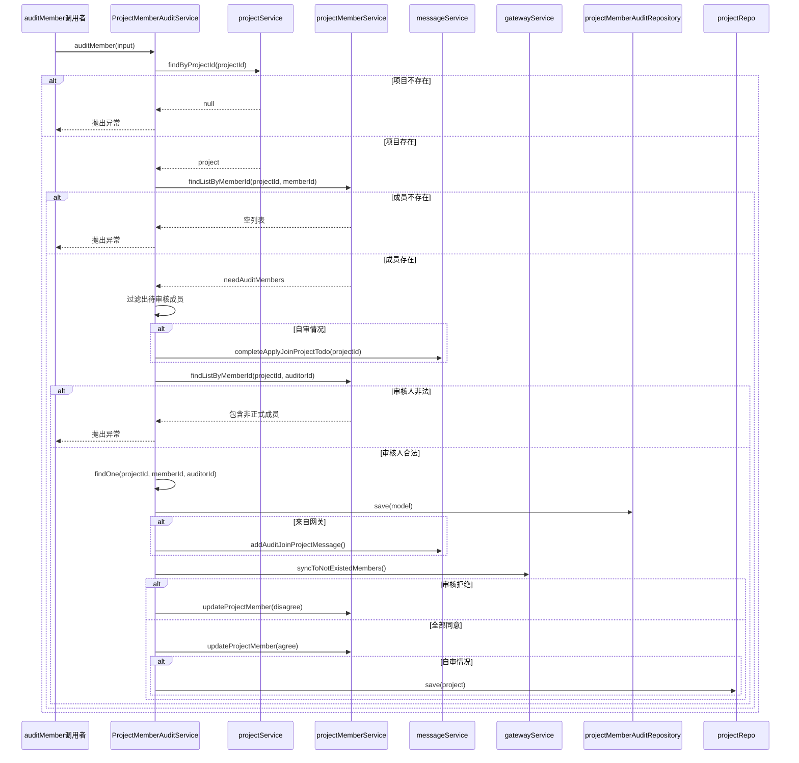

# 基础信息

|      |      |
|------|------|
| 名称 | ProjectMemberAuditService |
| 编码语言 | .java |
| 代码路径 | WeFe/board/board-service/src/main/java/com/welab/wefe/board/service/service/ProjectMemberAuditService.java |
| 包名 | com.welab.wefe.board.service.service |
| 依赖项 | ['com.welab.wefe.board.service.api.project.member.audit.AuditApi', 'com.welab.wefe.board.service.database.entity.job.ProjectMemberAuditMySqlModel', 'com.welab.wefe.board.service.database.entity.job.ProjectMemberMySqlModel', 'com.welab.wefe.board.service.database.entity.job.ProjectMySqlModel', 'com.welab.wefe.board.service.database.repository.ProjectDataSetRepository', 'com.welab.wefe.board.service.database.repository.ProjectMemberAuditRepository', 'com.welab.wefe.board.service.database.repository.ProjectMemberRepository', 'com.welab.wefe.board.service.database.repository.ProjectRepository', 'com.welab.wefe.common.StatusCode', 'com.welab.wefe.common.data.mysql.Where', 'com.welab.wefe.common.exception.StatusCodeWithException', 'com.welab.wefe.common.wefe.enums.AuditStatus', 'org.springframework.beans.factory.annotation.Autowired', 'org.springframework.data.jpa.domain.Specification', 'org.springframework.stereotype.Service', 'org.springframework.transaction.annotation.Transactional', 'java.util.Date', 'java.util.List'] |
| 概述说明 | ProjectMemberAuditService提供项目成员审核功能，包括查询审核记录、检查成员是否全部同意、审核新成员等操作，涉及项目、成员和数据集的增删改查。 |

# 说明

ProjectMemberAuditService是一个用于管理项目成员审核的服务类。它通过多个依赖服务如ProjectRepository、ProjectMemberRepository等实现功能。主要方法包括：findAllAuditList查询审核列表，allMemberAgreed检查所有正式成员是否同意添加新成员，auditMember处理成员审核请求并更新状态。审核过程中会验证项目、成员状态，处理自审情况，保存审核结果，并通过消息服务通知相关人员。审核结果包括同意或拒绝，拒绝会标记成员为退出状态，全部同意则更新成员和项目状态为通过。此外还提供findOne和listAll方法查询单个或全部审核记录。

# 类列表 Class Summary

| 名称   | 类型  | 说明 |
|-------|------|-------------|
| ProjectMemberAuditService | class | ProjectMemberAuditService类用于管理项目成员审核，包括查询审核记录、检查成员是否全部同意、审核新成员等功能。通过事务处理和同步机制确保数据一致性。 |

## 类 ProjectMemberAuditService

|      |      |
|------|------|
| 访问范围 | @Service;public |
| 类型 | class |
| 名称 | ProjectMemberAuditService |
| 说明 | ProjectMemberAuditService类用于管理项目成员审核，包括查询审核记录、检查成员是否全部同意、审核新成员等功能。通过事务处理和同步机制确保数据一致性。 |

### UML类图

```mermaid
classDiagram
    class ProjectMemberAuditService {
        -ProjectRepository projectRepo
        -ProjectService projectService
        -ProjectMemberRepository projectMemberRepo
        -ProjectMemberService projectMemberService
        -ProjectDataSetRepository projectDataSetRepo
        -ProjectDataSetService projectDataSetService
        -GatewayService gatewayService
        -MessageService messageService
        -ProjectMemberAuditRepository projectMemberAuditRepository
        +List~ProjectMemberAuditMySqlModel~ findAllAuditList(String projectId, String memberId)
        +boolean allMemberAgreed(String projectId, String memberId)
        +void auditMember(AuditApi.Input input) throws StatusCodeWithException
        +ProjectMemberAuditMySqlModel findOne(String projectId, String memberId, String auditorId)
        +List~ProjectMemberAuditMySqlModel~ listAll(String projectId, String memberId)
    }

    class ProjectMemberAuditMySqlModel {
        <<Entity>>
    }

    class ProjectMySqlModel {
        <<Entity>>
    }

    class ProjectMemberMySqlModel {
        <<Entity>>
    }

    class AuditApi {
        <<Interface>>
    }

    class Where {
        <<Builder>>
        +static Where create()
        +Where equal(String field, Object value)
        +Where notEqual(String field, Object value)
        +Specification~T~ build(Class~T~ clazz)
    }

    ProjectMemberAuditService --> ProjectRepository : 依赖
    ProjectMemberAuditService --> ProjectService : 依赖
    ProjectMemberAuditService --> ProjectMemberRepository : 依赖
    ProjectMemberAuditService --> ProjectMemberService : 依赖
    ProjectMemberAuditService --> ProjectDataSetRepository : 依赖
    ProjectMemberAuditService --> ProjectDataSetService : 依赖
    ProjectMemberAuditService --> GatewayService : 依赖
    ProjectMemberAuditService --> MessageService : 依赖
    ProjectMemberAuditService --> ProjectMemberAuditRepository : 依赖
    ProjectMemberAuditService --> Where : 使用条件构建
    ProjectMemberAuditService --> ProjectMemberAuditMySqlModel : 操作
    ProjectMemberAuditService --> ProjectMySqlModel : 操作
    ProjectMemberAuditService --> ProjectMemberMySqlModel : 操作
    ProjectMemberAuditService ..|> AuditApi : 实现接口
```

这段类图展示了ProjectMemberAuditService的核心结构和依赖关系。该类是一个Spring服务，主要负责项目成员审核相关的业务逻辑，包括查询审核记录、检查成员是否全部同意、执行成员审核操作等。它依赖了多个Repository和Service类来操作数据库和执行业务逻辑，同时使用了Where构建器来创建查询条件。该服务与ProjectMemberAuditMySqlModel、ProjectMySqlModel和ProjectMemberMySqlModel等实体类交互，并实现了AuditApi接口的部分功能。整体设计体现了清晰的职责划分和分层架构思想。

### 内部方法调用关系图

```mermaid
graph TD
    A["类ProjectMemberAuditService"]
    B["属性: ProjectRepository projectRepo"]
    C["属性: ProjectService projectService"]
    D["属性: ProjectMemberRepository projectMemberRepo"]
    E["属性: ProjectMemberService projectMemberService"]
    F["属性: ProjectDataSetRepository projectDataSetRepo"]
    G["属性: ProjectDataSetService projectDataSetService"]
    H["属性: GatewayService gatewayService"]
    I["属性: MessageService messageService"]
    J["属性: ProjectMemberAuditRepository projectMemberAuditRepository"]
    K["方法: List<ProjectMemberAuditMySqlModel> findAllAuditList"]
    L["方法: boolean allMemberAgreed"]
    M["方法: void auditMember"]
    N["方法: ProjectMemberAuditMySqlModel findOne"]
    O["方法: List<ProjectMemberAuditMySqlModel> listAll"]

    A --> B
    A --> C
    A --> D
    A --> E
    A --> F
    A --> G
    A --> H
    A --> I
    A --> J
    A --> K
    A --> L
    A --> M
    A --> N
    A --> O
```

这段代码是ProjectMemberAuditService类的实现，主要用于管理项目成员的审核流程。类中包含多个依赖的服务和仓库，提供了查找审核列表、检查所有成员是否同意、审核成员、查找单个审核记录和列出所有审核状态等方法。流程图展示了类结构和依赖关系，时序图详细描述了auditMember方法的执行流程，包括项目验证、成员检查、审核处理、消息通知和状态更新等关键步骤。

### 字段列表 Field List

| 名称  | 类型  | 说明 |
|-------|-------|------|
| projectDataSetService | ProjectDataSetService | 使用@Autowired自动注入ProjectDataSetService实例。 |
| projectMemberService | ProjectMemberService | 自动注入项目成员服务实例。 |
| projectMemberAuditRepository | ProjectMemberAuditRepository | 使用@Autowired自动注入ProjectMemberAuditRepository实例。 |
| gatewayService | GatewayService | 使用@Autowired自动注入GatewayService实例。 |
| projectMemberRepo | ProjectMemberRepository | 自动注入项目成员仓库实例。 |
| projectService | ProjectService | 自动注入ProjectService实例。 |
| projectDataSetRepo | ProjectDataSetRepository | 自动注入项目数据集仓库实例。 |
| messageService | MessageService | 使用@Autowired自动注入MessageService实例。 |
| projectRepo | ProjectRepository | 使用@Autowired自动注入ProjectRepository实例projectRepo。 |

### 方法列表

| 名称  | 类型  | 说明 |
|-------|-------|------|
| auditMember | void | 方法auditMember用于审核项目成员，检查项目和成员有效性，处理自审和他人审核，保存审核结果并更新成员状态，同步消息和网关数据。 |
| findAllAuditList | List<ProjectMemberAuditMySqlModel> | 该方法根据项目ID和成员ID查询审计列表，使用条件构造器创建查询条件，并通过仓库接口获取结果。 |
| listAll | List<ProjectMemberAuditMySqlModel> | 查询项目成员审计记录：根据项目ID和成员ID，从数据库获取所有匹配的审计数据。 |
| allMemberAgreed | boolean | 检查项目成员是否全部同意：通过项目ID和成员ID查询未同意的审核记录，若无记录则返回true。 |
| findOne | ProjectMemberAuditMySqlModel | 该方法通过项目ID、成员ID和审核人ID查询数据库，返回匹配的ProjectMemberAuditMySqlModel对象，若无结果则返回null。 |

