# 基础信息

|      |      |
|------|------|
| 名称 | ProjectMemberService |
| 编码语言 | .java |
| 代码路径 | WeFe/board/board-service/src/main/java/com/welab/wefe/board/service/service/ProjectMemberService.java |
| 包名 | com.welab.wefe.board.service.service |
| 依赖项 | ['com.welab.wefe.board.service.api.project.member.AddApi', 'com.welab.wefe.board.service.api.project.member.ListInProjectApi', 'com.welab.wefe.board.service.database.entity.job', 'com.welab.wefe.board.service.database.repository.ProjectMemberAuditRepository', 'com.welab.wefe.board.service.database.repository.ProjectMemberRepository', 'com.welab.wefe.board.service.dto.entity.ProjectMemberInput', 'com.welab.wefe.common.StatusCode', 'com.welab.wefe.common.data.mysql.Where', 'com.welab.wefe.common.data.mysql.enums.OrderBy', 'com.welab.wefe.common.exception.StatusCodeWithException', 'com.welab.wefe.common.util.StringUtil', 'com.welab.wefe.common.web.util.CurrentAccountUtil', 'com.welab.wefe.common.wefe.enums.AuditStatus', 'com.welab.wefe.common.wefe.enums.FederatedLearningType', 'com.welab.wefe.common.wefe.enums.JobMemberRole', 'org.apache.commons.collections4.CollectionUtils', 'org.slf4j.Logger', 'org.slf4j.LoggerFactory', 'org.springframework.beans.factory.annotation.Autowired', 'org.springframework.data.jpa.domain.Specification', 'org.springframework.stereotype.Service', 'org.springframework.transaction.annotation.Transactional', 'java.util.ArrayList', 'java.util.HashSet', 'java.util.List', 'java.util.Set', 'java.util.function.Consumer', 'java.util.function.Function', 'java.util.stream.Collectors'] |
| 概述说明 | ProjectMemberService类用于管理项目成员，提供添加成员、查询成员、更新成员状态等功能，支持不同角色（如promoter和provider）的成员操作，并处理审核状态和消息通知。 |

# 说明

ProjectMemberService是一个服务类，负责管理项目成员的相关操作。主要功能包括添加项目成员、检查成员是否存在、更新成员状态、查询成员列表等。该类通过多个自动注入的依赖服务（如ProjectMemberRepository、ProjectService等）实现功能。添加成员时，会根据成员角色（promoter或provider）进行不同处理，并更新审核状态和数据集状态。还包含成员列表查询、成员信息更新等方法，确保项目成员管理的完整性和一致性。

# 类列表 Class Summary

| 名称   | 类型  | 说明 |
|-------|------|-------------|
| ProjectMemberService | class | ProjectMemberService类用于管理项目成员，包括添加成员、检查成员存在性、更新成员状态及查询成员信息。支持不同角色（如promoter和provider）的成员操作，处理审核状态变更，并同步消息通知。 |


## 类 ProjectMemberService

|      |      |
|------|------|
| 访问范围 | @Service;public |
| 类型 | class |
| 名称 | ProjectMemberService |
| 说明 | ProjectMemberService类用于管理项目成员，包括添加成员、检查成员存在性、更新成员状态及查询成员信息。支持不同角色（如promoter和provider）的成员操作，处理审核状态变更，并同步消息通知。 |


### UML类图

```mermaid
classDiagram
    class ProjectMemberService {
        -Logger LOG
        -ProjectMemberRepository projectMemberRepo
        -ProjectService projectService
        -GatewayService gatewayService
        -ProjectDataSetService projectDataSetService
        -JobService jobService
        -JobMemberService jobMemberService
        -ProjectMemberAuditRepository projectMemberAuditRepository
        -MessageService messageService
        +addMember(AddApi$Input input) void
        -checkExistMember(String currentMemberId, List~ProjectMemberMySqlModel~ members) boolean
        -checkMembers(List~ProjectMemberMySqlModel~ members) boolean
        -addPromoterMember(AddApi$Input input, ProjectMemberInput item) void
        -addProviderMember(AddApi$Input input, ProjectMemberInput item) void
        +listFormalProjectMembers(String projectId) List~ProjectMemberMySqlModel~
        +findListByProjectId(String projectId) List~ProjectMemberMySqlModel~
        +findOneByMemberId(String projectId, String memberId, JobMemberRole role) ProjectMemberMySqlModel
        +findListByMemberId(String projectId, String memberId) List~ProjectMemberMySqlModel~
        +updateProjectMember(ProjectMemberMySqlModel projectMemberMySqlModel, Function~ProjectMemberMySqlModel, ProjectMemberMySqlModel~ func) ProjectMemberMySqlModel
        +update(ProjectMemberMySqlModel projectMemberMySqlModel, Consumer~ProjectMemberMySqlModel~ func) ProjectMemberMySqlModel
        +findList(ListInProjectApi$Input input) List~ProjectMemberMySqlModel~
        +listFormalProjectProviders(String projectId) List~ProjectMemberMySqlModel~
    }

    class ProjectMemberMySqlModel {
        <<Entity>>
        // 省略属性和方法
    }

    class ProjectMemberInput {
        <<DTO>>
        // 省略属性和方法
    }

    class AddApi$Input {
        <<DTO>>
        // 省略属性和方法
    }

    class ListInProjectApi$Input {
        <<DTO>>
        // 省略属性和方法
    }

    class JobMemberRole {
        <<Enum>>
        // 省略枚举值
    }

    class AuditStatus {
        <<Enum>>
        // 省略枚举值
    }

    ProjectMemberService --> ProjectMemberRepository : 依赖
    ProjectMemberService --> ProjectService : 依赖
    ProjectMemberService --> GatewayService : 依赖
    ProjectMemberService --> ProjectDataSetService : 依赖
    ProjectMemberService --> JobService : 依赖
    ProjectMemberService --> JobMemberService : 依赖
    ProjectMemberService --> ProjectMemberAuditRepository : 依赖
    ProjectMemberService --> MessageService : 依赖
    ProjectMemberService --> ProjectMemberMySqlModel : 操作
    ProjectMemberService --> ProjectMemberInput : 使用
    ProjectMemberService --> AddApi$Input : 使用
    ProjectMemberService --> ListInProjectApi$Input : 使用
    ProjectMemberService --> JobMemberRole : 使用
    ProjectMemberService --> AuditStatus : 使用
```

这段代码展示了一个项目管理服务类`ProjectMemberService`，它负责处理项目成员的添加、查询和更新等操作。该类通过多个依赖服务（如`ProjectService`、`GatewayService`等）协作完成功能，主要业务逻辑包括：验证成员是否已存在、添加不同角色的成员（发起者或提供者）、更新成员状态等。核心方法`addMember`实现了事务性的成员添加流程，包含权限校验和状态管理。类图中清晰地展示了服务间的依赖关系和主要的数据传输对象。


### 内部方法调用关系图

```mermaid
graph TD
    A["ProjectMemberService类"]
    B["属性: Logger LOG"]
    C["属性: ProjectMemberRepository projectMemberRepo"]
    D["属性: ProjectService projectService"]
    E["属性: GatewayService gatewayService"]
    F["属性: ProjectDataSetService projectDataSetService"]
    G["属性: JobService jobService"]
    H["属性: JobMemberService jobMemberService"]
    I["属性: ProjectMemberAuditRepository projectMemberAuditRepository"]
    J["属性: MessageService messageService"]
    K["方法: addMember(AddApi.Input input)"]
    L["方法: checkExistMember(String currentMemberId, List<ProjectMemberMySqlModel> members)"]
    M["方法: checkMembers(List<ProjectMemberMySqlModel> members)"]
    N["方法: addPromoterMember(AddApi.Input input, ProjectMemberInput item)"]
    O["方法: addProviderMember(AddApi.Input input, ProjectMemberInput item)"]
    P["方法: listFormalProjectMembers(String projectId)"]
    Q["方法: findListByProjectId(String projectId)"]
    R["方法: findOneByMemberId(String projectId, String memberId, JobMemberRole role)"]
    S["方法: findListByMemberId(String projectId, String memberId)"]
    T["方法: updateProjectMember(ProjectMemberMySqlModel projectMemberMySqlModel, Function<ProjectMemberMySqlModel, ProjectMemberMySqlModel> func)"]
    U["方法: update(ProjectMemberMySqlModel projectMemberMySqlModel, Consumer<ProjectMemberMySqlModel> func)"]
    V["方法: findList(ListInProjectApi.Input input)"]
    W["方法: listFormalProjectProviders(String projectId)"]

    A --> B
    A --> C
    A --> D
    A --> E
    A --> F
    A --> G
    A --> H
    A --> I
    A --> J
    A --> K
    A --> L
    A --> M
    A --> N
    A --> O
    A --> P
    A --> Q
    A --> R
    A --> S
    A --> T
    A --> U
    A --> V
    A --> W
```



这段代码是ProjectMemberService类的实现，主要用于管理项目成员的相关操作。该类通过多个自动装配的服务和仓库来实现功能，包括添加成员、检查成员是否存在、更新成员信息等。核心方法addMember负责处理添加成员的逻辑，根据成员角色（promoter或provider）调用不同的添加方法，并进行相关的数据验证和状态更新。其他方法提供了查询、更新和验证项目成员信息的功能，确保项目成员管理的完整性和一致性。

### 字段列表 Field List

| 名称  | 类型  | 说明 |
|-------|-------|------|
| projectService | ProjectService | 使用@Autowired自动注入ProjectService实例。 |
| projectMemberRepo | ProjectMemberRepository | 使用@Autowired自动注入ProjectMemberRepository实例，变量名为projectMemberRepo。 |
| messageService | MessageService | 自动注入MessageService实例。 |
| jobService | JobService | 自动注入JobService实例。 |
| projectMemberAuditRepository | ProjectMemberAuditRepository | 使用@Autowired自动注入ProjectMemberAuditRepository实例。 |
| jobMemberService | JobMemberService | 使用@Autowired自动注入JobMemberService实例。 |
| LOG = LoggerFactory.getLogger(this.getClass()) | Logger | 类中定义了一个受保护且不可变的日志记录器实例，用于当前类的日志输出。 |
| gatewayService | GatewayService | 自动注入GatewayService实例。 |
| projectDataSetService | ProjectDataSetService | 使用@Autowired自动注入ProjectDataSetService实例。 |

### 方法列表

| 名称  | 类型  | 说明 |
|-------|-------|------|
| listFormalProjectMembers | List<ProjectMemberMySqlModel> | 该方法查询指定项目的正式成员列表，条件包括项目ID匹配、审核状态为同意且未退出。返回符合条件的所有成员数据。 |
| findListByProjectId | List<ProjectMemberMySqlModel> | 该方法根据项目ID查询项目成员列表，按创建时间升序排列，返回符合条件的成员数据集合。 |
| updateProjectMember | ProjectMemberMySqlModel | 更新项目成员信息的方法：若输入为空则返回空，否则应用函数更新成员信息并设置更新者，最后保存并返回更新后的数据。 |
| addMember | void | 方法`addMember`用于添加项目成员，检查成员是否已存在，根据角色添加不同成员，清除历史审核记录，发送消息通知，并同步更新其他成员。 |
| findListByMemberId | List<ProjectMemberMySqlModel> | 该方法通过项目ID和成员ID查询项目成员列表，使用条件构建器筛选数据库记录并返回结果。 |
| checkExistMember | boolean | 检查成员存在性：过滤未退出的发起人，确保ID唯一且数量≥2时，若当前成员未退出则返回存在。 |
| update | ProjectMemberMySqlModel | 更新项目成员MySQL模型，若模型非空则执行自定义操作，设置更新者并保存。 |
| checkMembers | boolean | 检查项目成员有效性：过滤未退出且审核通过的成员，确保至少有2个发起人且成员ID无重复。 |
| addPromoterMember | void | 方法`addPromoterMember`用于添加项目发起人成员：检查成员是否存在，不存在则创建新成员并设置审核状态为"审核中"，更新数据集状态，若为被邀请成员则同步项目信息。 |
| findOneByMemberId | ProjectMemberMySqlModel | 该方法通过项目ID、成员ID和角色查询项目成员，返回匹配的数据库记录或null。 |
| addProviderMember | void | 方法`addProviderMember`用于添加项目成员。若成员不存在则新建，根据调用来源设置审核状态：网关调用时发起者自动通过，否则需审核。更新成员状态及数据集审核状态，若被邀请则同步项目信息。 |
| findList | List<ProjectMemberMySqlModel> | 方法根据项目ID查找成员列表，若输入包含原任务ID则进一步校验成员有效性。垂直联邦学习中退出成员禁止操作，最终返回有效成员列表。异常时抛出数据未找到错误。 |
| listFormalProjectProviders | List<ProjectMemberMySqlModel> | 方法列出项目正式供应商：根据项目ID筛选审核通过、未退出且角色为供应商的成员列表。 |


