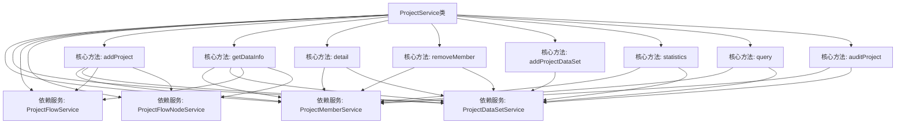
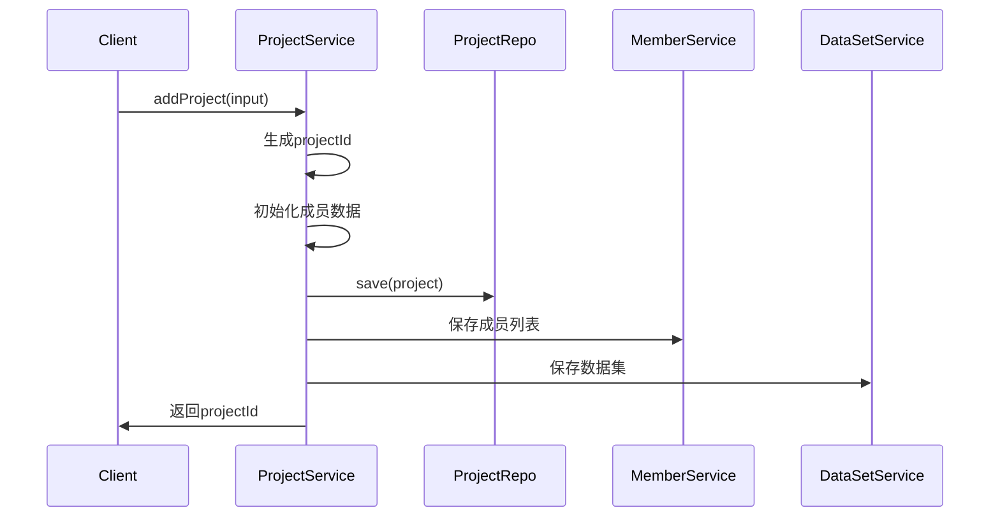

# 基础信息

|      |      |
|------|------|
| 名称 | ProjectService |
| 编码语言 | .java |
| 代码路径 | WeFe/board/board-service/src/main/java/com/welab/wefe/board/service/service/ProjectService.java |
| 包名 | com.welab.wefe.board.service.service |
| 依赖项 | ['com.welab.wefe.board.service.api.project.dataset.AddDataSetApi', 'com.welab.wefe.board.service.api.project.dataset.RemoveDataSetApi', 'com.welab.wefe.board.service.api.project.member.ExitProjectApi', 'com.welab.wefe.board.service.api.project.member.ListInProjectApi', 'com.welab.wefe.board.service.api.project.member.RemoveApi', 'com.welab.wefe.board.service.api.project.project', 'com.welab.wefe.board.service.database.entity.job', 'com.welab.wefe.board.service.database.repository', 'com.welab.wefe.board.service.dto.base.PagingOutput', 'com.welab.wefe.board.service.dto.entity.ProjectDataSetInput', 'com.welab.wefe.board.service.dto.entity.ProjectMemberInput', 'com.welab.wefe.board.service.dto.entity.project.ProjectDetailMemberOutputModel', 'com.welab.wefe.board.service.dto.entity.project.ProjectMemberOutputModel', 'com.welab.wefe.board.service.dto.entity.project.ProjectOutputModel', 'com.welab.wefe.board.service.dto.entity.project.ProjectQueryOutputModel', 'com.welab.wefe.board.service.dto.entity.project.data_set.ProjectDataResourceOutputModel', 'com.welab.wefe.board.service.dto.vo.AuditStatusCounts', 'com.welab.wefe.board.service.dto.vo.ProjectFlowStatisticsResult', 'com.welab.wefe.board.service.dto.vo.RoleCounts', 'com.welab.wefe.board.service.onlinedemo.OnlineDemoBranchStrategy', 'com.welab.wefe.board.service.service.account.AccountService', 'com.welab.wefe.board.service.service.data_resource.DataResourceService', 'com.welab.wefe.common.Convert', 'com.welab.wefe.common.StatusCode', 'com.welab.wefe.common.data.mysql.Where', 'com.welab.wefe.common.exception.StatusCodeWithException', 'com.welab.wefe.common.util.StringUtil', 'com.welab.wefe.common.util.ThreadUtil', 'com.welab.wefe.common.web.dto.AbstractApiInput', 'com.welab.wefe.common.web.util.CurrentAccountUtil', 'com.welab.wefe.common.web.util.ModelMapper', 'com.welab.wefe.common.wefe.enums.AuditStatus', 'com.welab.wefe.common.wefe.enums.FederatedLearningType', 'com.welab.wefe.common.wefe.enums.JobMemberRole', 'com.welab.wefe.common.wefe.enums.ProjectFlowStatus', 'org.apache.commons.collections4.CollectionUtils', 'org.apache.commons.lang3.StringUtils', 'org.springframework.beans.factory.annotation.Autowired', 'org.springframework.data.jpa.domain.Specification', 'org.springframework.stereotype.Service', 'org.springframework.transaction.annotation.Transactional', 'java.util', 'java.util.stream.Collectors'] |
| 概述说明 | ProjectService类是一个项目管理系统服务类，主要功能包括：创建项目、管理项目成员、数据集审核、项目状态更新、数据同步等。核心方法有addProject（新增项目）、auditProject（审核项目）、removeMember（移除成员）、addProjectDataSet（添加数据集）等。支持事务处理、权限校验、数据同步和消息通知。 |

# 说明

ProjectService是一个项目管理系统服务类，提供项目全生命周期管理功能。主要功能包括：项目创建、成员管理（添加/移除/审核）、数据集管理（添加/删除）、项目信息查询（详情/统计/分页）、项目状态管理（退出/关闭/置顶）等。服务通过@Transactional保证事务一致性，集成多个子服务（ProjectMemberService/ProjectDataSetService等）和仓储层（ProjectRepository等）实现业务逻辑。关键特性包括：多角色权限控制（promoter/provider）、审核流程管理（auditing/agree/disagree）、数据同步机制（gatewayService）和资源使用统计（updateUsageCountInProject）。系统支持项目流程状态跟踪、数据集审核和成员协作管理，并通过消息服务（messageService）实现操作通知。

# 类列表 Class Summary

| 名称   | 类型  | 说明 |
|-------|------|-------------|
| ProjectService | class | ProjectService类是一个Spring服务组件，提供项目管理功能，包括创建项目、添加/移除成员、数据集操作、审核流程、项目状态更新等。核心功能涉及事务处理、数据同步、权限控制和消息通知，支持多角色协作和审计跟踪。 |

## 类 ProjectService

|      |      |
|------|------|
| 访问范围 | @Service;public |
| 类型 | class |
| 名称 | ProjectService |
| 说明 | ProjectService类是一个Spring服务组件，提供项目管理功能，包括创建项目、添加/移除成员、数据集操作、审核流程、项目状态更新等。核心功能涉及事务处理、数据同步、权限控制和消息通知，支持多角色协作和审计跟踪。 |

### UML类图

```mermaid
classDiagram
    class ProjectService {
        <<Service>>
        -ProjectMemberService projectMemberService
        -ProjectDataSetService projectDataSetService
        -ProjectFlowService projectFlowService
        -ProjectFlowNodeService projectFlowNodeService
        -JobService jobService
        -ProjectService projectService
        -ProjectRepository projectRepo
        -ProjectMemberRepository projectMemberRepo
        -ProjectDataSetRepository projectDataSetRepo
        -ProjectMemberAuditRepository projectMemberAuditRepository
        -ProjectMemberAuditService projectMemberAuditService
        -ProjectFlowRepository projectFlowRepository
        -ProjectFlowNodeRepository projectFlowNodeRepository
        -DataResourceService dataResourceService
        -MessageService messageService
        -AccountService accountService
        +String addProject(AddApi.Input input) throws StatusCodeWithException
        +DataInfoApi.Output getDataInfo(DataInfoApi.Input input) throws StatusCodeWithException
        +ProjectOutputModel detail(String projectId) throws StatusCodeWithException
        +void removeMember(RemoveApi.Input input) throws StatusCodeWithException
        +ProjectMySqlModel addProjectDataSet(AddDataSetApi.Input input) throws StatusCodeWithException
        +void removeDataSet(RemoveDataSetApi.Input input) throws Exception
        +CountStatisticsApi.Output statistics(QueryApi.Input input)
        +PagingOutput~ProjectQueryOutputModel~ query(QueryApi.Input input)
        +void updateProject(UpdateProjectApi.Input input) throws StatusCodeWithException
        +ProjectMySqlModel findByProjectId(String projectId)
        +void auditProject(AuditApi.Input input) throws StatusCodeWithException
        +void syncAuditProjectInfo(String projectId, AuditApi.Input input) throws StatusCodeWithException
        +void pullNewestProjectInfo(AbstractApiInput input, String projectId, String callerMemberId, JobMemberRole myRole) throws StatusCodeWithException
        +DataInfoApi.Output getPromoterDataInfo(String projectId, String callerMemberId) throws StatusCodeWithException
        +void exitProject(ExitProjectApi.Input input) throws StatusCodeWithException
        +void closeProject(CloseProjectApi.Input input, boolean byScheduledJob) throws StatusCodeWithException
        +void updateFlowStatusStatistics(String projectId)
        +ProjectMySqlModel findProjectByJobId(String jobId)
        +void top(String projectId, boolean top)
    }

    class ProjectMemberService {
        <<Service>>
        +List~ProjectMemberMySqlModel~ findListByProjectId(String projectId)
        +ProjectMemberMySqlModel findOneByMemberId(String projectId, String memberId, JobMemberRole memberRole)
        +void updateProjectMember(ProjectMemberMySqlModel member, Function~ProjectMemberMySqlModel, ProjectMemberMySqlModel~ updater)
        +List~ProjectMemberMySqlModel~ listFormalProjectMembers(String projectId)
    }

    class ProjectDataSetService {
        <<Service>>
        +List~ProjectDataSetMySqlModel~ findDataSetList(String projectId, String memberId, JobMemberRole memberRole)
        +ProjectDataSetMySqlModel findOne(String projectId, String dataSetId, JobMemberRole memberRole)
        +List~ProjectDataSetMySqlModel~ listAllRawDataSet(String projectId, String memberId)
        +List~ProjectDataResourceOutputModel~ listRawDataSet(String projectId, String memberId, JobMemberRole memberRole, AuditStatus auditStatus, Boolean exited)
    }

    class ProjectFlowService {
        <<Service>>
        +List~ProjectFlowMySqlModel~ findFlowsByProjectId(String projectId)
        +ProjectFlowMySqlModel findOne(String flowId)
    }

    class ProjectFlowNodeService {
        <<Service>>
        +List~ProjectFlowNodeMySqlModel~ findNodesByFlowId(String flowId)
        +ProjectFlowNodeMySqlModel findOne(String flowId, String nodeId)
    }

    class JobService {
        <<Service>>
        +List~JobMySqlModel~ listByJobId(String jobId)
    }

    class MessageService {
        <<Service>>
        +void addApplyJoinProjectMessage(String memberId, String projectId, String projectName)
        +void addApplyDataResourceMessage(String memberId, ProjectMySqlModel project, ProjectDataSetMySqlModel dataSet)
        +void completeApplyJoinProjectTodo(String projectId)
        +void addAuditJoinProjectMessage(String memberId, ProjectMySqlModel project, AuditStatus auditStatus, String auditComment)
    }

    class DataResourceService {
        <<Service>>
        +void updateUsageCountInProject(String dataSetId)
        +void delete(String dataSetId, DataResourceType dataResourceType)
    }

    class AccountService {
        <<Service>>
    }

    class ProjectRepository {
        <<Repository>>
        +void save(ProjectMySqlModel project)
        +ProjectMySqlModel findOne(String field, Object value, Class~ProjectMySqlModel~ clazz)
        +List~Object[]~ query(String sql)
        +List~ProjectMySqlModel~ queryByClass(String sql, Class~ProjectMySqlModel~ clazz)
        +void updateById(String id, String field, Object value, Class~ProjectMySqlModel~ clazz)
        +void updateById(String id, Map~String, Object~ params, Class~ProjectMySqlModel~ clazz)
        +void top(String projectId)
        +void cancelTop(String projectId)
    }

    class ProjectMemberRepository {
        <<Repository>>
        +void save(ProjectMemberMySqlModel member)
        +void updateById(String id, Map~String, Object~ params, Class~ProjectMemberMySqlModel~ clazz)
    }

    class ProjectDataSetRepository {
        <<Repository>>
        +void save(ProjectDataSetMySqlModel dataSet)
        +void disableDataSetWhenMemberExist(String projectId, String memberId, String memberRole)
        +int queryNeedAuditDataSetCount(String projectId, String memberId)
        +void updateById(String id, Map~String, Object~ params, Class~ProjectDataSetMySqlModel~ clazz)
    }

    class ProjectMemberAuditRepository {
        <<Repository>>
        +List~ProjectMemberAuditMySqlModel~ findAll(Specification~ProjectMemberAuditMySqlModel~ spec)
        +void deleteAuditingRecord(String projectId, String memberId)
    }

    class ProjectFlowRepository {
        <<Repository>>
        +List~Object[]~ countProjectFlowStatus(String projectId)
        +void save(ProjectFlowMySqlModel flow)
    }

    class ProjectFlowNodeRepository {
        <<Repository>>
        +void save(ProjectFlowNodeMySqlModel node)
    }

    ProjectService --> ProjectMemberService : 依赖
    ProjectService --> ProjectDataSetService : 依赖
    ProjectService --> ProjectFlowService : 依赖
    ProjectService --> ProjectFlowNodeService : 依赖
    ProjectService --> JobService : 依赖
    ProjectService --> MessageService : 依赖
    ProjectService --> DataResourceService : 依赖
    ProjectService --> AccountService : 依赖
    ProjectService --> ProjectRepository : 依赖
    ProjectService --> ProjectMemberRepository : 依赖
    ProjectService --> ProjectDataSetRepository : 依赖
    ProjectService --> ProjectMemberAuditRepository : 依赖
    ProjectService --> ProjectFlowRepository : 依赖
    ProjectService --> ProjectFlowNodeRepository : 依赖
```

这段代码展示了一个复杂的项目管理服务系统，核心是ProjectService类，它负责处理项目的全生命周期管理，包括创建、查询、更新、删除项目，以及处理项目成员、数据集、工作流等相关操作。系统通过多个服务类和仓库类协同工作，实现了项目管理的核心业务逻辑，涉及权限控制、数据同步、状态管理等多个方面。类之间的关系清晰展示了系统的模块化设计，各司其职又相互配合。

### 内部方法调用关系图

该流程图展示了ProjectService的核心架构和主要方法调用关系。类图部分显示该类依赖多个子服务（如ProjectMemberService、ProjectDataSetService等）并包含7个核心业务方法。时序图重点描述了addProject方法的执行流程：客户端调用后，服务依次完成项目ID生成、数据初始化、数据库存储操作，最后返回结果。整个设计采用分层架构，业务逻辑清晰分离，通过依赖注入实现松耦合，关键操作都包含事务管理和异常处理机制。

### 字段列表 Field List

| 名称  | 类型  | 说明 |
|-------|-------|------|
| jobService | JobService | 使用@Autowired自动注入JobService实例。 |
| projectService | ProjectService | 使用@Autowired自动注入ProjectService实例。 |
| projectMemberAuditService | ProjectMemberAuditService | 使用@Autowired自动注入ProjectMemberAuditService服务实例。 |
| projectMemberRepo | ProjectMemberRepository | 自动注入项目成员仓库实例。 |
| projectDataSetService | ProjectDataSetService | 自动注入ProjectDataSetService实例。 |
| messageService | MessageService | 自动注入MessageService实例。 |
| projectRepo | ProjectRepository | 使用@Autowired自动注入ProjectRepository实例。 |
| projectFlowService | ProjectFlowService | 自动注入ProjectFlowService实例。 |
| projectDataSetRepo | ProjectDataSetRepository | 自动注入项目数据集仓库实例。 |
| accountService | AccountService | 使用@Autowired自动注入AccountService实例。 |
| projectFlowRepository | ProjectFlowRepository | 自动注入ProjectFlowRepository实例。 |
| dataResourceService | DataResourceService | 使用@Autowired自动注入DataResourceService实例。 |
| projectMemberService | ProjectMemberService | 自动注入ProjectMemberService服务实例。 |
| projectMemberAuditRepository | ProjectMemberAuditRepository | 使用@Autowired自动注入ProjectMemberAuditRepository实例。 |
| projectFlowNodeRepository | ProjectFlowNodeRepository | 自动注入项目流程节点仓库实例。 |
| projectFlowNodeService | ProjectFlowNodeService | 自动注入项目流程节点服务实例。 |

### 方法列表

| 名称  | 类型  | 说明 |
|-------|-------|------|
| updateProject | void | 事务性同步更新项目方法，检查权限后更新项目信息并同步至网关。 |
| removeDataSet | void | 该方法用于删除项目数据集，包含权限校验和数据源处理。若非网关请求需验证项目状态和用户角色，原始数据集仅允许创建者或promoter删除，衍生数据集仅promoter可删。删除后更新数据集使用计数并同步至其他成员。 |
| buildJobOutputModel | ProjectQueryOutputModel | 该方法将项目数据转换为输出模型，填充成员列表并设置发起人信息，同时统计需审核数据集数量。返回完整的项目查询输出模型。 |
| pullNewestProjectInfo | void | 方法pullNewestProjectInfo用于更新或创建项目信息。若项目不存在，则创建新项目、成员及数据集；若存在，则更新项目信息、成员状态及数据集审核状态。处理过程中涉及项目、成员和数据集的增删改查操作。 |
| statistics | CountStatisticsApi.Output | 该方法统计项目中不同角色和审核状态的数量。首先按角色分组统计，确保所有角色都有记录；然后按审核状态分组统计，同样确保所有状态都有记录；最后返回总数量及两个统计结果。 |
| addProject | String | 方法addProject用于创建项目，处理输入参数生成项目ID，设置成员角色和数据集，保存项目信息到数据库，并发送相关消息通知。若非网关请求，自动同意项目创建者，否则需审核。 |
| closeProject | void | 关闭项目方法：检查项目存在性及权限，设置关闭状态和时间，更新数据资源使用计数，并通知其他成员。定时任务关闭时操作者为管理员，否则为项目发起人。 |
| query | PagingOutput<ProjectQueryOutputModel> | 该方法执行项目查询，构建SQL语句并添加条件、排序和分页，返回分页结果。包含项目ID、状态、时间等字段，使用并行流处理数据。 |
| syncAuditProjectInfo | void | 该方法同步审核项目信息，包括成员、数据集和流程节点。检查发起人成员，调用外部服务获取数据，更新或插入成员、数据集状态，过滤并保存符合条件的流程和节点。 |
| getDataInfo | DataInfoApi.Output | 方法getDataInfo根据输入参数获取项目信息，包括项目成员、数据集、流程和节点。若项目不存在则抛出异常。返回包含所有相关数据的输出对象。 |
| getPromoterDataInfo | DataInfoApi.Output | 获取项目发起方数据信息：通过调用网关服务查找项目成员中的发起方，若存在则获取其数据信息，否则抛出异常。 |
| exitProject | void | 方法处理项目退出逻辑：检查项目存在性，验证角色权限，更新项目和成员状态，禁用相关数据集，删除待审记录，并更新数据集使用计数。 |
| buildQueryWhere | String | 该方法根据输入参数动态构建SQL查询条件，包括成员ID、角色、项目类型、名称、创建时间范围、状态等条件，并处理逻辑关系。 |
| removeMember | void | 带事务的同步方法removeMember，校验项目及权限后标记成员为已退出，处理相关数据集并同步网关。若移除自身则标记项目退出。 |
| detail | ProjectOutputModel | 该方法根据项目ID查询项目详情，包括成员列表和数据集，并区分发起者和提供者角色。若项目不存在则抛出异常，最终返回包含项目信息、成员角色及状态的输出模型。 |
| auditProject | void | 方法auditProject用于审核项目，检查项目状态和成员资格，更新审核状态，处理同意或拒绝情况，并同步信息。若成员同意且非创建者，需其他成员审核。最终更新项目和成员状态，并发送消息。 |
| addProjectDataSet | ProjectMySqlModel | 该方法为项目添加数据集，包含以下关键逻辑：检查项目有效性、验证成员权限、处理数据集审核状态（自动同意或待审）、更新数据集使用计数，并通过网关同步信息。异常时回滚事务。 |
| findByProjectId | ProjectMySqlModel | 该方法通过项目ID查询数据库中的项目记录，使用条件构造器创建查询条件，返回匹配记录或null。 |
| checkAuditingRecord | void | 检查项目成员审核记录，自动处理被移除成员的审核状态，更新相关成员和项目的审核状态为同意，并删除待审记录。 |
| updateFlowStatusStatistics | void | 该方法用于更新项目流程状态统计信息。首先查询项目流程状态数量，然后构建统计结果对象，最后更新项目数据库记录中的流程状态统计字段。 |
| findProjectByJobId | ProjectMySqlModel | 根据jobId查询项目：先通过jobId获取任务列表，若为空返回null，否则返回第一个任务对应的项目。 |
| top | void | 方法根据布尔值top决定置顶或取消置顶指定项目：true调用projectRepo.top，false调用projectRepo.cancelTop。 |

