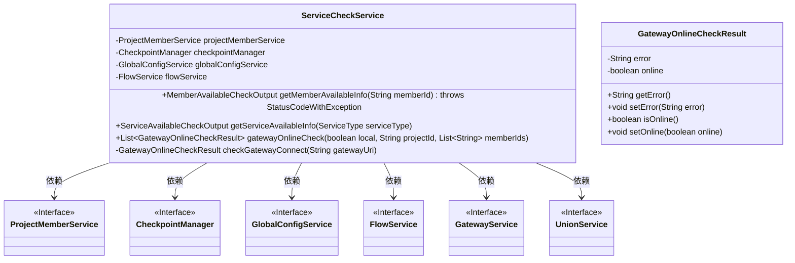
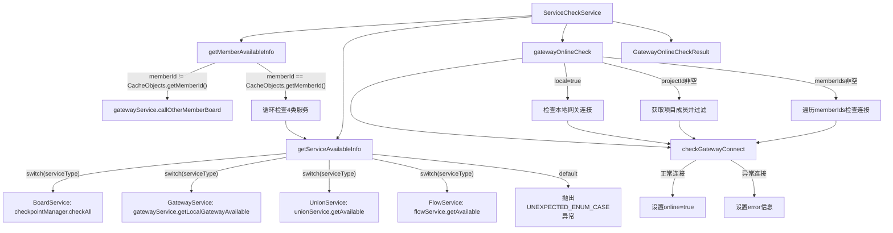

# 基础信息

|      |      |
|------|------|
| 名称 | ServiceCheckService |
| 编码语言 | .java |
| 代码路径 | WeFe/board/board-service/src/main/java/com/welab/wefe/board/service/service/ServiceCheckService.java |
| 包名 | com.welab.wefe.board.service.service |
| 依赖项 | ['com.welab.wefe.board.service.api.member.MemberAvailableCheckApi', 'com.welab.wefe.board.service.database.entity.job.ProjectMemberMySqlModel', 'com.welab.wefe.board.service.sdk.FlowService', 'com.welab.wefe.board.service.service.globalconfig.GlobalConfigService', 'com.welab.wefe.common.StatusCode', 'com.welab.wefe.common.exception.StatusCodeWithException', 'com.welab.wefe.common.util.StringUtil', 'com.welab.wefe.common.wefe.checkpoint.CheckpointManager', 'com.welab.wefe.common.wefe.checkpoint.dto.MemberAvailableCheckOutput', 'com.welab.wefe.common.wefe.checkpoint.dto.ServiceAvailableCheckOutput', 'com.welab.wefe.common.wefe.dto.global_config.GatewayConfigModel', 'com.welab.wefe.common.wefe.enums.ServiceType', 'org.apache.commons.collections4.CollectionUtils', 'org.springframework.beans.factory.annotation.Autowired', 'org.springframework.stereotype.Service', 'java.util.ArrayList', 'java.util.Arrays', 'java.util.List', 'java.util.stream.Collectors'] |
| 概述说明 | ServiceCheckService提供成员服务可用性检查功能，包括本地和远程服务状态查询，以及网关连通性检测。支持BoardService、UnionService、GatewayService和FlowService四种服务类型检查。 |

# 说明

ServiceCheckService是一个服务类，继承自AbstractService，用于检查成员服务可用性和网关连接状态。它依赖ProjectMemberService、CheckpointManager、GlobalConfigService和FlowService。主要功能包括：检查指定成员的服务可用性，若成员非自身则通过网关调用；检查BoardService、UnionService、GatewayService和FlowService的可用性；检查网关连接状态，支持本地和远程检测，返回包含错误信息和在线状态的GatewayOnlineCheckResult对象。

# 类列表 Class Summary

| 名称   | 类型  | 说明 |
|-------|------|-------------|
| ServiceCheckService | class | ServiceCheckService提供成员服务可用性检查功能，包括BoardService、UnionService等服务的状态查询，以及网关连通性检测。支持本地和远程成员检查，返回服务状态或错误信息。 |

## 类 ServiceCheckService

|      |      |
|------|------|
| 访问范围 | @Service;public |
| 类型 | class |
| 名称 | ServiceCheckService |
| 说明 | ServiceCheckService提供成员服务可用性检查功能，包括BoardService、UnionService等服务的状态查询，以及网关连通性检测。支持本地和远程成员检查，返回服务状态或错误信息。 |

### UML类图

该代码是一个服务检查类，主要功能包括检查成员服务可用性、获取服务可用性信息以及网关连通性检查。类图中展示了ServiceCheckService与多个接口的依赖关系，包括ProjectMemberService、CheckpointManager等，这些接口通过@Autowired注入。GatewayOnlineCheckResult作为内部类用于存储网关检查结果。整体设计采用依赖注入方式实现松耦合，通过枚举类型处理不同服务类型的检查逻辑。

### 内部方法调用关系图

该流程图展示了ServiceCheckService的核心逻辑流程。主要包含四个关键方法：成员可用性检查(getMemberAvailableInfo)会判断是否远程调用或本地检查4类服务状态；服务可用性检查(getServiceAvailableInfo)通过switch分发不同类型服务的检查请求；网关在线检查(gatewayOnlineCheck)处理本地/项目成员/指定成员的网关检测；底层连接检查(checkGatewayConnect)实际执行网关连通性测试并返回结果对象。整体采用分层设计，异常处理完善，支持多种服务状态检测场景。

### 字段列表 Field List

| 名称  | 类型  | 说明 |
|-------|-------|------|
| projectMemberService | ProjectMemberService | 使用@Autowired自动注入ProjectMemberService实例。 |
| flowService | FlowService | 使用@Autowired自动注入FlowService实例。 |
| checkpointManager | CheckpointManager | 代码中通过@Autowired自动注入CheckpointManager实例。 |
| globalConfigService | GlobalConfigService | 使用@Autowired自动注入GlobalConfigService实例。 |

### 方法列表

| 名称  | 类型  | 说明 |
|-------|-------|------|
| getMemberAvailableInfo | MemberAvailableCheckOutput | 方法检查会员服务可用性。若非本人则调用网关服务；否则检查BoardService、UnionService、GatewayService、FlowService四种服务的可用状态并返回结果。 |
| getServiceAvailableInfo | ServiceAvailableCheckOutput | 该方法根据传入的服务类型返回对应服务的可用性状态。针对不同服务类型调用不同检查方法，异常时返回失败信息。默认情况抛出未预期枚举异常。 |
| gatewayOnlineCheck | List<GatewayOnlineCheckResult> | 方法gatewayOnlineCheck检查网关连接状态。若local为true，检查内网网关；若projectId非空，检查项目成员网关；若memberIds非空，检查指定成员网关。返回检查结果列表。 |
| checkGatewayConnect | GatewayOnlineCheckResult | 检查网关连接状态的方法：正常则设在线为真，异常则记录错误信息。 |

