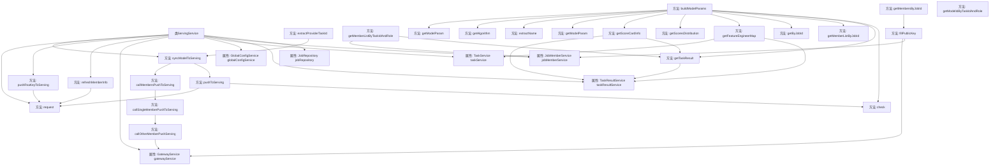

# 基础信息

|      |      |
|------|------|
| 名称 | ServingService |
| 编码语言 | .java |
| 代码路径 | WeFe/board/board-service/src/main/java/com/welab/wefe/board/service/service/ServingService.java |
| 包名 | com.welab.wefe.board.service.service |
| 依赖项 | ['com.alibaba.fastjson.JSON', 'com.alibaba.fastjson.JSONObject', 'com.welab.wefe.board.service.api.data_output_info.PushModelToServingByProviderApi', 'com.welab.wefe.board.service.component.EvaluationComponent', 'com.welab.wefe.board.service.component.modeling.ScoreCardComponent', 'com.welab.wefe.board.service.database.entity.job.JobMySqlModel', 'com.welab.wefe.board.service.database.entity.job.TaskMySqlModel', 'com.welab.wefe.board.service.database.entity.job.TaskResultMySqlModel', 'com.welab.wefe.board.service.database.repository.JobRepository', 'com.welab.wefe.board.service.dto.entity.job.JobMemberOutputModel', 'com.welab.wefe.board.service.dto.serving.ProviderModelPushResult', 'com.welab.wefe.board.service.service.globalconfig.GlobalConfigService', 'com.welab.wefe.common.StatusCode', 'com.welab.wefe.common.constant.SecretKeyType', 'com.welab.wefe.common.exception.StatusCodeWithException', 'com.welab.wefe.common.http.HttpRequest', 'com.welab.wefe.common.http.HttpResponse', 'com.welab.wefe.common.util.JObject', 'com.welab.wefe.common.util.RSAUtil', 'com.welab.wefe.common.util.SignUtil', 'com.welab.wefe.common.util.StringUtil', 'com.welab.wefe.common.wefe.dto.global_config.MemberInfoModel', 'com.welab.wefe.common.wefe.dto.global_config.ServingConfigModel', 'com.welab.wefe.common.wefe.enums.Algorithm', 'com.welab.wefe.common.wefe.enums.ComponentType', 'com.welab.wefe.common.wefe.enums.JobMemberRole', 'com.welab.wefe.common.wefe.enums.TaskResultType', 'org.springframework.beans.factory.annotation.Autowired', 'org.springframework.stereotype.Service', 'java.util.List', 'java.util.Map', 'java.util.TreeMap', 'java.util.stream.Collectors'] |
| 概述说明 | ServingService类提供模型同步与全局配置更新功能，包含成员信息刷新、RSA密钥推送、模型参数构建及请求处理逻辑，支持联合训练任务协调。 |

# 说明

ServingService是一个服务类，继承自AbstractService，主要用于处理与Serving服务相关的操作。它通过多个自动注入的服务（如JobRepository、JobMemberService等）实现功能。主要方法包括refreshMemberInfo用于更新成员信息，pushRsaKeyToServing推送RSA密钥，request处理服务请求并支持签名验证。syncModelToServing用于模型同步，涉及任务和角色处理，调用成员推送模型。还包括构建模型参数、检查任务、获取成员列表等功能。类中还定义了多个辅助方法，如获取算法类型、模型参数等，确保与Serving服务的交互和数据处理的正确性。

# 类列表 Class Summary

| 名称   | 类型  | 说明 |
|-------|------|-------------|
| ServingService | class | ServingService类提供成员信息更新、RSA密钥推送及模型同步功能，通过HTTP请求与Serving服务交互，支持签名验证和错误处理。 |

## 类 ServingService

|      |      |
|------|------|
| 访问范围 | @Service;public |
| 类型 | class |
| 名称 | ServingService |
| 说明 | ServingService类提供成员信息更新、RSA密钥推送及模型同步功能，通过HTTP请求与Serving服务交互，支持签名验证和错误处理。 |

### UML类图

```mermaid
classDiagram
    class ServingService {
        -JobRepository jobRepository
        -JobMemberService jobMemberService
        -TaskResultService taskResultService
        -TaskService taskService
        -GlobalConfigService globalConfigService
        -GatewayService gatewayService
        +refreshMemberInfo(MemberInfoModel model, String unionBaseUrl) void
        +pushRsaKeyToServing() void
        -request(String api, TreeMap~String, Object~ params) JSONObject
        -request(String api, TreeMap~String, Object~ params, Boolean needSign) JSONObject
        +syncModelToServing(String taskId, JobMemberRole role) Object
        -pushToServing(String taskId, JobMemberRole role) void
        -check(String taskId, JobMemberRole role) void
        -callMembersPushToServing(String taskId, JobMemberRole role) List~ProviderModelPushResult~
        -callSingleMemberPushToServing(String taskId, JobMemberOutputModel member) ProviderModelPushResult
        -extractProviderTaskId(String taskId) String
        -getMemberListByTaskIdAndRole(String taskId, JobMemberRole role) List~JobMemberOutputModel~
        -getMemberListByJobId(String jobId) List~JobMemberOutputModel~
        -getMembersByJobId(String jobId) List~JSONObject~
        -callOtherMemberPushServing(String memberId, String taskId, JobMemberRole role) void
        +buildModelParams(String taskId, JobMemberRole role) TreeMap~String, Object~
        -getScoresDistribution(TaskResultMySqlModel taskResult) Object
        -getScoreCardInfo(TaskResultMySqlModel taskResult) Object
        -getModelParam(TaskResultMySqlModel taskResult) JObject
        -extractName(JobMySqlModel job) String
        -getFeatureEngineerMap(String taskId, JobMemberRole role) Map~Integer, Object~
        -getByJobId(String jobId, JobMemberRole role) JobMySqlModel
        -fillPublicKey(List~JobMemberOutputModel~ memberList) List~JSONObject~
        -getModelIdByTaskIdAndRole(String taskId, JobMemberRole role) String
        -getTaskResult(String taskId, JobMemberRole role) TaskResultMySqlModel
        -getAlgorithm(ComponentType componentType) Algorithm
        -getModelParam(String taskResult) String
    }

    class AbstractService {
        <<Abstract>>
    }

    class JobRepository {
        <<Interface>>
    }

    class JobMemberService {
        <<Interface>>
    }

    class TaskResultService {
        <<Interface>>
    }

    class TaskService {
        <<Interface>>
    }

    class GlobalConfigService {
        <<Interface>>
    }

    class GatewayService {
        <<Interface>>
    }

    class MemberInfoModel {
        +String memberId
        +String memberName
        +String rsaPrivateKey
        +String rsaPublicKey
        +SecretKeyType secretKeyType
    }

    class ProviderModelPushResult {
        +String memberId
        +String memberName
        +Boolean success
        +create(String memberId, String memberName, Boolean success) ProviderModelPushResult
    }

    class JobMemberOutputModel {
        +String memberId
        +String memberName
        +JobMemberRole jobRole
    }

    class TaskResultMySqlModel {
        +String jobId
        +String taskId
        +String modelId
        +String role
        +String result
        +String componentType
        +String name
    }

    class JobMySqlModel {
        +String jobId
        +String name
        +FederatedLearningType federatedLearningType
    }

    class PushModelToServingByProviderApi {
        <<Interface>>
        +Input of(String taskId, JobMemberRole role) Input
    }

    class JObject {
        +create() JObject
        +create(String json) JObject
        +put(String key, Object value) void
        +getString(String key) String
        +getJObjectByPath(String path) JObject
    }

    ServingService --|> AbstractService : 继承
    ServingService --> JobRepository : 依赖
    ServingService --> JobMemberService : 依赖
    ServingService --> TaskResultService : 依赖
    ServingService --> TaskService : 依赖
    ServingService --> GlobalConfigService : 依赖
    ServingService --> GatewayService : 依赖
    ServingService --> MemberInfoModel : 依赖
    ServingService --> ProviderModelPushResult : 依赖
    ServingService --> JobMemberOutputModel : 依赖
    ServingService --> TaskResultMySqlModel : 依赖
    ServingService --> JobMySqlModel : 依赖
    ServingService --> PushModelToServingByProviderApi : 依赖
    ServingService --> JObject : 依赖
```

这段代码描述了一个名为`ServingService`的服务类，主要用于处理与模型服务相关的操作，包括刷新成员信息、推送RSA密钥、同步模型到服务端等。该类继承自`AbstractService`，并依赖多个其他服务接口如`JobRepository`、`JobMemberService`等。`ServingService`通过构建参数、调用API请求等方式与后端服务交互，处理模型同步、成员信息更新等业务逻辑。代码中使用了多种数据结构如`TreeMap`、`JSONObject`等来管理请求参数和响应数据，同时通过异常处理机制确保操作的可靠性。

### 内部方法调用关系图

这段代码是一个名为ServingService的服务类，主要用于处理与模型服务相关的操作。它包含了多个方法，如refreshMemberInfo用于更新成员信息，pushRsaKeyToServing用于推送RSA密钥，syncModelToServing用于同步模型到服务端等。类中通过多个Autowired注入其他服务，如JobRepository、JobMemberService等，以实现数据的获取和处理。方法之间通过调用关系形成复杂的业务流程，例如syncModelToServing会调用pushToServing和callMembersPushToServing，而后者又会进一步调用callSingleMemberPushToServing和callOtherMemberPushServing。整体设计体现了分层和模块化的思想，各方法职责明确，协同完成模型服务的核心功能。

### 字段列表 Field List

| 名称  | 类型  | 说明 |
|-------|-------|------|
| jobRepository | JobRepository | 使用@Autowired自动注入JobRepository实例。 |
| globalConfigService | GlobalConfigService | 代码片段使用@Autowired注解自动注入GlobalConfigService实例。 |
| taskService | TaskService | 自动注入TaskService实例。 |
| taskResultService | TaskResultService | 自动注入TaskResultService服务实例。 |
| jobMemberService | JobMemberService | 使用@Autowired自动注入JobMemberService实例。 |
| gatewayService | GatewayService | 使用@Autowired自动注入GatewayService实例。 |

### 方法列表

| 名称  | 类型  | 说明 |
|-------|-------|------|
| getScoreCardInfo | Object | 方法`getScoreCardInfo`根据任务结果获取评分卡和分箱信息。若找不到评分卡任务返回null，否则创建包含评分卡数据和分箱结果的JSON对象并返回。 |
| callSingleMemberPushToServing | ProviderModelPushResult | 方法调用单个成员推送服务，成功返回成员ID、名称及true；失败记录日志并返回false。 |
| extractName | String | 提取JobMySqlModel对象名称和ID拼接成字符串。 |
| main | void | Java代码创建ProviderModelPushResult对象并输出JSON字符串。对象包含mem、name和false参数。 |
| callMembersPushToServing | List<ProviderModelPushResult> | 该方法根据任务ID和角色获取成员列表，过滤非当前成员及非提供者角色，逐个调用推送服务并返回结果列表。 |
| buildModelParams | TreeMap<String, Object> | 该方法构建模型参数：检查任务和角色，获取任务结果、成员、任务信息及特征工程数据，填充参数如角色、模型ID、算法等，最终返回TreeMap格式的参数集合。 |
| pushRsaKeyToServing | void | 方法pushRsaKeyToServing将RSA密钥对存入TreeMap，调用接口更新服务端密钥。可能抛出StatusCodeWithException异常。 |
| getScoresDistribution | Object | 方法获取任务评分分布：根据任务ID、角色和类型查询任务结果，若存在则从结果中提取指定键名的评分分布数据。 |
| extractProviderTaskId | String | 该方法将字符串taskId中的"promoter"替换为"provider"后返回。 |
| callOtherMemberPushServing | void | 该方法调用网关服务推送任务至指定成员，参数包括成员ID、任务ID和角色，可能抛出异常。 |
| request | JSONObject | 该方法用于发送带签名的JSON请求。若需签名，使用私钥生成签名并封装请求体。检查服务地址后发送请求，处理响应状态码和错误信息，成功返回JSON结果。 |
| request | JSONObject | 私有方法request接收API和有序参数表，调用重载方法并默认启用校验，可能抛出状态码异常。 |
| getMemberListByJobId | List<JobMemberOutputModel> | 获取指定任务ID的成员列表，调用jobMemberService的list方法，不包含已删除成员。 |
| getMembersByJobId | List<JSONObject> | 根据任务ID获取成员列表并填充公钥信息。 |
| getModelParam | JObject | 该方法从任务结果中提取模型参数，包含原始结果和评分卡信息。 |
| check | void | 检查任务权限，本地任务禁止推送或导出。 |
| refreshMemberInfo | void | 刷新会员信息方法，接收会员模型和联盟基础URL，构建包含会员ID、名称、RSA密钥等参数的TreeMap，向指定接口发送请求。 |
| getMemberListByTaskIdAndRole | List<JobMemberOutputModel> | 方法通过任务ID和角色获取任务结果，再根据任务结果的作业ID查询成员列表，返回非删除状态的成员列表。 |
| getFeatureEngineerMap | Map<Integer, Object> | 该方法根据任务ID和角色获取特征工程结果，返回按任务位置排序的映射。若任务不存在则抛出异常。 |
| pushToServing | void | 推送任务到服务端，构建参数后发起请求。 |
| getByJobId | JobMySqlModel | 根据jobId和角色从jobRepository查询JobMySqlModel数据。 |
| fillPublicKey | List<JSONObject> | 方法将成员列表转换为JSON对象列表，包含成员ID、角色、公钥、URL和密钥类型等信息，异常时记录日志。 |
| getModelIdByTaskIdAndRole | String | 根据任务ID和角色获取模型ID，调用任务结果返回对应模型ID。 |
| getTaskResult | TaskResultMySqlModel | 获取任务结果：根据任务ID、角色查询模型训练类型的任务结果。 |
| getAlgorithm | Algorithm | 根据组件类型返回对应算法：HorzLR/VertLR/MixLR返回LogisticRegression，HorzSecureBoost/VertSecureBoost/MixSecureBoost返回XGBoost，其他类型抛出异常。 |
| getModelParam | String | 提取模型参数：从taskResult中解析并返回model_param字段值。 |
| syncModelToServing | Object | 方法syncModelToServing将任务数据推送到服务端，若角色为发起者则调用成员推送，成功返回"同步成功"，异常时抛出StatusCodeWithException。 |

