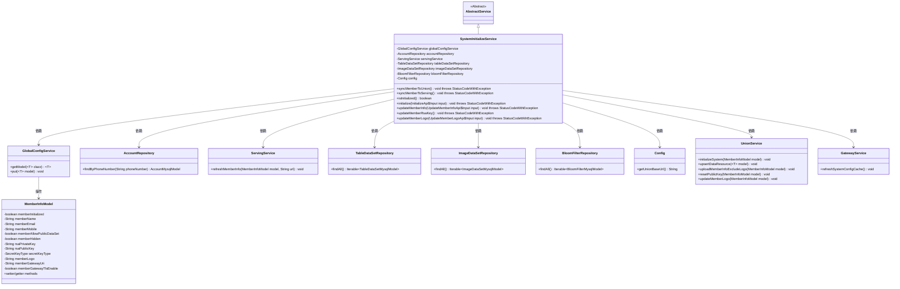
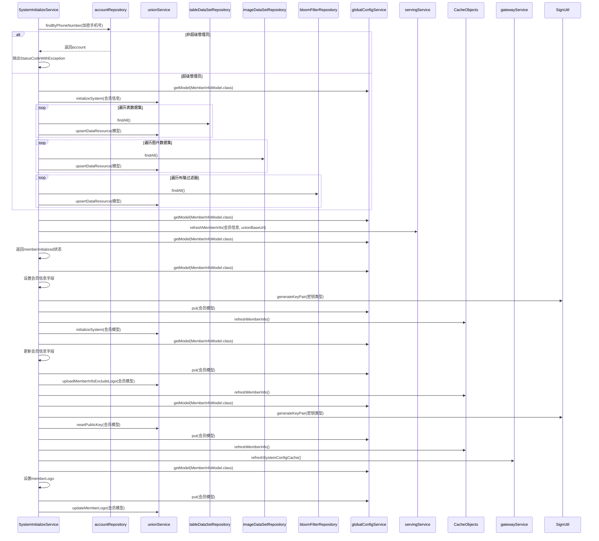

# 基础信息

|      |      |
|------|------|
| 名称 | SystemInitializeService |
| 编码语言 | .java |
| 代码路径 | WeFe/board/board-service/src/main/java/com/welab/wefe/board/service/service/SystemInitializeService.java |
| 包名 | com.welab.wefe.board.service.service |
| 依赖项 | ['com.welab.wefe.board.service.api.member.InitializeApi', 'com.welab.wefe.board.service.api.member.UpdateMemberInfoApi', 'com.welab.wefe.board.service.api.member.UpdateMemberLogoApi', 'com.welab.wefe.board.service.constant.Config', 'com.welab.wefe.board.service.database.entity.AccountMysqlModel', 'com.welab.wefe.board.service.database.entity.data_resource.BloomFilterMysqlModel', 'com.welab.wefe.board.service.database.entity.data_resource.ImageDataSetMysqlModel', 'com.welab.wefe.board.service.database.entity.data_resource.TableDataSetMysqlModel', 'com.welab.wefe.board.service.database.repository.AccountRepository', 'com.welab.wefe.board.service.database.repository.data_resource.BloomFilterRepository', 'com.welab.wefe.board.service.database.repository.data_resource.ImageDataSetRepository', 'com.welab.wefe.board.service.database.repository.data_resource.TableDataSetRepository', 'com.welab.wefe.board.service.service.globalconfig.GlobalConfigService', 'com.welab.wefe.common.StatusCode', 'com.welab.wefe.common.constant.SecretKeyType', 'com.welab.wefe.common.exception.StatusCodeWithException', 'com.welab.wefe.common.util.SignUtil', 'com.welab.wefe.common.web.util.CurrentAccountUtil', 'com.welab.wefe.common.web.util.DatabaseEncryptUtil', 'com.welab.wefe.common.wefe.dto.global_config.MemberInfoModel', 'org.springframework.beans.factory.annotation.Autowired', 'org.springframework.stereotype.Service', 'org.springframework.transaction.annotation.Transactional', 'java.security.NoSuchAlgorithmException'] |
| 概述说明 | SystemInitializeService提供系统初始化、成员信息同步及更新功能，包括数据资源同步、密钥更新和成员信息管理，仅超级管理员可操作。 |

# 说明

SystemInitializeService是一个系统初始化服务类，继承自AbstractService。它通过多个自动装配的依赖项（如GlobalConfigService、AccountRepository等）提供系统初始化、成员信息同步和更新功能。主要方法包括syncMemberToUnion和syncMemberToServing用于同步成员信息到联盟和服务节点，initialize用于系统初始化，updateMemberInfo和updateMemberLogo用于更新成员信息和徽标，updateMemberRsaKey用于更新RSA密钥。所有操作均进行权限校验和事务管理，确保数据一致性。

# 类列表 Class Summary

| 名称   | 类型  | 说明 |
|-------|------|-------------|
| SystemInitializeService | class | SystemInitializeService提供系统初始化及成员信息同步功能，包括数据资源同步、密钥更新、成员信息维护等操作，需超级管理员权限。 |

## 类 SystemInitializeService

|      |      |
|------|------|
| 访问范围 | @Service;public |
| 类型 | class |
| 名称 | SystemInitializeService |
| 说明 | SystemInitializeService提供系统初始化及成员信息同步功能，包括数据资源同步、密钥更新、成员信息维护等操作，需超级管理员权限。 |

### UML类图

该类图展示了SystemInitializeService的核心结构和依赖关系。作为继承AbstractService的Spring服务类，它通过7个依赖组件实现系统初始化、成员信息同步、密钥更新等功能。关键功能包括：1) 通过GlobalConfigService管理MemberInfoModel配置；2) 使用多个Repository同步数据到UnionService；3) 事务性操作成员信息、密钥和Logo。类图清晰呈现了该服务与数据层、配置层、外部服务间的协作关系，特别是对MemberInfoModel状态的核心管理逻辑。

### 内部方法调用关系图

```mermaid
graph TD
    A["类SystemInitializeService"]
    B["属性: GlobalConfigService globalConfigService"]
    C["属性: AccountRepository accountRepository"]
    D["属性: ServingService servingService"]
    E["属性: TableDataSetRepository tableDataSetRepository"]
    F["属性: ImageDataSetRepository imageDataSetRepository"]
    G["属性: BloomFilterRepository bloomFilterRepository"]
    H["属性: Config config"]
    I["方法: syncMemberToUnion"]
    J["方法: syncMemberToServing"]
    K["方法: isInitialized"]
    L["方法: initialize"]
    M["方法: updateMemberInfo"]
    N["方法: updateMemberRsaKey"]
    O["方法: updateMemberLogo"]

    A --> B
    A --> C
    A --> D
    A --> E
    A --> F
    A --> G
    A --> H
    A --> I
    A --> J
    A --> K
    A --> L
    A --> M
    A --> N
    A --> O
```

该流程图展示了SystemInitializeService类的结构和主要方法调用关系，包含7个依赖注入属性和6个核心方法。时序图详细描述了syncMemberToUnion等关键方法的执行流程，包括权限验证、数据同步、密钥生成和缓存刷新等操作，体现了系统初始化、会员信息同步和密钥更新的完整处理链条，涉及10个不同组件的交互。

### 字段列表 Field List

| 名称  | 类型  | 说明 |
|-------|-------|------|
| bloomFilterRepository | BloomFilterRepository | 代码片段使用@Autowired自动注入BloomFilterRepository实例。 |
| imageDataSetRepository | ImageDataSetRepository | 使用@Autowired自动注入ImageDataSetRepository实例。 |
| config | Config | 自动注入Config配置对象实例。 |
| servingService | ServingService | 使用@Autowired自动注入ServingService服务实例。 |
| globalConfigService | GlobalConfigService | 使用@Autowired自动注入GlobalConfigService实例。 |
| tableDataSetRepository | TableDataSetRepository | 使用@Autowired自动注入TableDataSetRepository实例。 |
| accountRepository | AccountRepository | 自动注入AccountRepository实例。 |

### 方法列表

| 名称  | 类型  | 说明 |
|-------|-------|------|
| initialize | void | 初始化系统方法，检查是否已初始化，设置成员信息并生成密钥对，最后刷新缓存和初始化联合服务。 |
| updateMemberRsaKey | void | 方法updateMemberRsaKey用于更新成员RSA密钥：生成新密钥对并更新模型，异常时回滚；通知关联服务重置公钥、刷新缓存及网关配置。 |
| syncMemberToUnion | void | 同步成员到联盟系统：检查超级管理员权限，初始化系统并更新所有表数据、图像数据和布隆过滤器资源。无权限则抛出异常。 |
| syncMemberToServing | void | 同步方法syncMemberToServing调用servingService刷新成员信息，使用MemberInfoModel和UnionBaseUrl配置，可能抛出StatusCodeWithException异常。 |
| updateMemberLogo | void | 使用事务注解的方法更新会员Logo，捕获异常回滚，调用全局配置服务和联合服务完成操作。 |
| updateMemberInfo | void | 方法updateMemberInfo用于更新会员信息，包含名称、邮箱、手机等字段，支持事务回滚，异常时抛出StatusCodeWithException。更新后同步至unionService并刷新缓存。 |
| isInitialized | boolean | 检查成员信息是否已初始化，返回布尔值。 |

