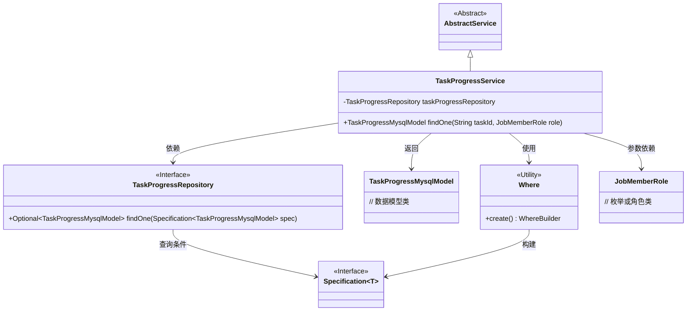
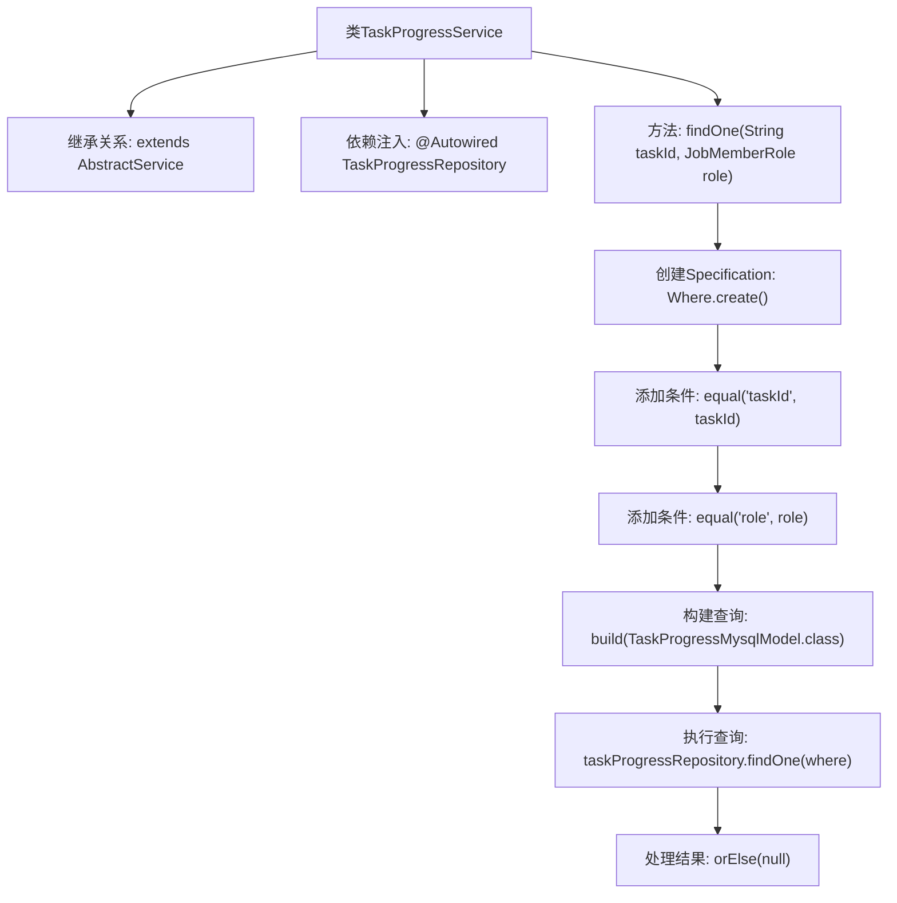

# 基础信息

|      |      |
|------|------|
| 名称 | TaskProgressService |
| 编码语言 | .java |
| 代码路径 | WeFe/board/board-service/src/main/java/com/welab/wefe/board/service/service/TaskProgressService.java |
| 包名 | com.welab.wefe.board.service.service |
| 依赖项 | ['com.welab.wefe.board.service.database.entity.job.TaskProgressMysqlModel', 'com.welab.wefe.board.service.database.repository.TaskProgressRepository', 'com.welab.wefe.common.data.mysql.Where', 'com.welab.wefe.common.wefe.enums.JobMemberRole', 'org.springframework.beans.factory.annotation.Autowired', 'org.springframework.data.jpa.domain.Specification', 'org.springframework.stereotype.Service'] |
| 概述说明 | TaskProgressService通过taskProgressRepository根据taskId和role查询TaskProgressMysqlModel数据。 |

# 说明

TaskProgressService是一个继承自AbstractService的服务类，通过@Autowired注入TaskProgressRepository。它提供了findOne方法，根据taskId和role参数查询TaskProgressMysqlModel数据。查询条件通过Where工具类构建，包含taskId和role的等值匹配。若未找到数据则返回null。

# 类列表 Class Summary

| 名称   | 类型  | 说明 |
|-------|------|-------------|
| TaskProgressService | class | TaskProgressService通过taskProgressRepository按taskId和role查询TaskProgressMysqlModel数据。 |

## 类 TaskProgressService

|      |      |
|------|------|
| 访问范围 | @Service;public |
| 类型 | class |
| 名称 | TaskProgressService |
| 说明 | TaskProgressService通过taskProgressRepository按taskId和role查询TaskProgressMysqlModel数据。 |

### UML类图

这段代码展示了一个基于Spring的服务类TaskProgressService，它继承自AbstractService，通过TaskProgressRepository进行数据库查询。核心功能是通过任务ID和角色查找任务进度记录，使用Where工具类构建JPA Specification查询条件。类图清晰地呈现了服务层与持久层的关系，以及工具类、模型类和接口之间的协作方式，体现了Spring依赖注入和JPA规范查询的典型应用场景。

### 内部方法调用关系图

该流程图展示了TaskProgressService类的核心结构和工作流程。类继承AbstractService并通过依赖注入获得TaskProgressRepository实例。主要方法findOne通过链式调用构建查询条件（包括taskId和role匹配），使用JPA Specification构建查询后执行数据库操作，最后对Optional结果进行空值处理。整个过程体现了Spring Data JPA的动态查询和结果处理的典型模式。

### 字段列表 Field List

| 名称  | 类型  | 说明 |
|-------|-------|------|
| taskProgressRepository | TaskProgressRepository | 自动注入TaskProgressRepository实例。 |

### 方法列表

| 名称  | 类型  | 说明 |
|-------|-------|------|
| findOne | TaskProgressMysqlModel | 查找指定任务ID和角色的任务进度记录，无结果返回null。 |

