# 基础信息

|      |      |
|------|------|
| 名称 | TaskResultService |
| 编码语言 | .java |
| 代码路径 | WeFe/board/board-service/src/main/java/com/welab/wefe/board/service/service/TaskResultService.java |
| 包名 | com.welab.wefe.board.service.service |
| 依赖项 | ['com.alibaba.fastjson.JSON', 'com.alibaba.fastjson.JSONObject', 'com.welab.wefe.board.service.api.data_resource.table_data_set.DetailApi', 'com.welab.wefe.board.service.api.project.job.task.GetFeatureApi', 'com.welab.wefe.board.service.component.DataIOComponent', 'com.welab.wefe.board.service.component.base.io.Names', 'com.welab.wefe.board.service.component.base.io.NodeOutputItem', 'com.welab.wefe.board.service.component.feature.FeatureSelectionComponent', 'com.welab.wefe.board.service.component.feature.HorzOneHotComponent', 'com.welab.wefe.board.service.component.feature.HorzOneHotComponent.Params.MemberInfoModel', 'com.welab.wefe.board.service.database.entity.data_resource.TableDataSetMysqlModel', 'com.welab.wefe.board.service.database.entity.job.TaskMySqlModel', 'com.welab.wefe.board.service.database.entity.job.TaskResultMySqlModel', 'com.welab.wefe.board.service.database.repository.TaskRepository', 'com.welab.wefe.board.service.database.repository.TaskResultRepository', 'com.welab.wefe.board.service.dto.entity.MemberFeatureInfoModel', 'com.welab.wefe.board.service.dto.entity.data_resource.output.TableDataSetOutputModel', 'com.welab.wefe.board.service.exception.FlowNodeException', 'com.welab.wefe.board.service.exception.MemberGatewayException', 'com.welab.wefe.board.service.model.FlowGraph', 'com.welab.wefe.board.service.model.FlowGraphNode', 'com.welab.wefe.board.service.service.data_resource.table_data_set.TableDataSetService', 'com.welab.wefe.common.StatusCode', 'com.welab.wefe.common.data.mysql.Where', 'com.welab.wefe.common.exception.StatusCodeWithException', 'com.welab.wefe.common.util.JObject', 'com.welab.wefe.common.web.util.CurrentAccountUtil', 'com.welab.wefe.common.wefe.enums.ComponentType', 'com.welab.wefe.common.wefe.enums.JobMemberRole', 'com.welab.wefe.common.wefe.enums.TaskResultType', 'org.apache.commons.collections.CollectionUtils', 'org.springframework.beans.factory.annotation.Autowired', 'org.springframework.data.jpa.domain.Specification', 'org.springframework.stereotype.Service', 'java.util.ArrayList', 'java.util.Arrays', 'java.util.List', 'java.util.Set'] |
| 概述说明 | TaskResultService提供任务结果查询与处理功能，包括按条件查找结果、解析分箱结果、获取特征列表及统计信息，支持特征选择、缺失率、CV/IV计算等功能。 |

# 说明

TaskResultService是一个服务类，继承自AbstractService，主要用于管理和查询任务结果数据。它通过多个自动注入的依赖服务（如TaskResultRepository、ProjectFlowNodeService等）实现功能。主要方法包括：根据jobId、nodeId等条件查询任务结果列表或单个结果；处理特征分箱结果；获取特征列表并支持CV/IV过滤和缺失率统计；从不同组件（如DataIO、FeatureSelection等）获取特征列信息；以及中断推理任务等操作。该类还包含多个辅助方法用于解析和处理任务结果数据。

# 类列表 Class Summary

| 名称   | 类型  | 说明 |
|-------|------|-------------|
| TaskResultService | class | TaskResultService是一个服务类，提供任务结果查询和管理功能，包括按条件查找任务结果、解析分箱结果、获取特征列表、处理特征统计和分箱信息等。 |

## 类 TaskResultService

|      |      |
|------|------|
| 访问范围 | @Service;public |
| 类型 | class |
| 名称 | TaskResultService |
| 说明 | TaskResultService是一个服务类，提供任务结果查询和管理功能，包括按条件查找任务结果、解析分箱结果、获取特征列表、处理特征统计和分箱信息等。 |

### UML类图

```mermaid
classDiagram
    class TaskResultService {
        -TaskResultRepository taskResultRepository
        -ProjectFlowNodeService projectFlowNodeService
        -TaskRepository taskRepository
        -ProjectMemberService projectMemberService
        -JobService jobService
        -ProjectService projectService
        -TableDataSetService tableDataSetService
        -GatewayService gatewayService
        -TaskService taskService
        +findList(String jobId, String nodeId, JobMemberRole role, String type) List~TaskResultMySqlModel~
        +findOne(String jobId, String nodeId, JobMemberRole role, String type) TaskResultMySqlModel
        +listAllResult(String taskId) List~TaskResultMySqlModel~
        +findByTaskIdAndType(String taskId, String type) TaskResultMySqlModel
        +getResultFeature(GetFeatureApi.Input input) GetFeatureApi.Output
        +getMemberFeatures(FlowGraph graph, FlowGraphNode node) List~MemberFeatureInfoModel~
        +getDataIOFeature(FlowGraphNode node) List~MemberFeatureInfoModel~
        +getFeatureSelectFeature(FlowGraphNode node, FlowGraph flowGraph) List~MemberFeatureInfoModel~
        +getBinningResultFeature(TaskMySqlModel task) List~MemberFeatureInfoModel~
        +findByTaskIdAndTypeAndRole(String taskId, String type, JobMemberRole role) TaskResultMySqlModel
        +findByTaskIdAndRoleNotEqualType(String taskId, String type, JobMemberRole role) List~TaskResultMySqlModel~
        +findModelByJobIdAndNodeIdAndRole(String jobId, String flowNodeId, JobMemberRole role) TaskResultMySqlModel
        +stopDeepLearningInfer(String taskId) void
        +findByJobIdAndComponentTypeAndType(String jobId, ComponentType componentType, TaskResultType type, JobMemberRole role) TaskResultMySqlModel
        +findModelByJobIdAndTypeAndRole(String jobId, String type, JobMemberRole role) List~TaskResultMySqlModel~
        -parseBinningResult(TaskResultMySqlModel featureBinningTaskResult) List~JObject~
        -setCvIvMissingRate(GetFeatureApi.Output out, FlowGraph graph, FlowGraphNode node) void
        -setInfoAboutBinning(GetFeatureApi.Output out, FlowGraph graph, FlowGraphNode node) void
        -setInfoAboutStatistic(GetFeatureApi.Output out, FlowGraph graph, FlowGraphNode node) void
        -getOneHotFeature(FlowGraphNode node, FlowGraph flowGraph) List~MemberFeatureInfoModel~
        -parserBinningResult(JObject result) MemberFeatureInfoModel
    }

    class TaskResultMySqlModel {
        // 数据模型类
    }

    class MemberFeatureInfoModel {
        // 成员特征信息模型
    }

    class FlowGraph {
        // 流程图模型
    }

    class FlowGraphNode {
        // 流程图节点模型
    }

    class GetFeatureApi {
        <<Interface>>
        // 特征获取接口
    }

    class Where {
        <<Interface>>
        // 条件构建接口
    }

    TaskResultService --> TaskResultRepository : 依赖
    TaskResultService --> ProjectFlowNodeService : 依赖
    TaskResultService --> TaskRepository : 依赖
    TaskResultService --> ProjectMemberService : 依赖
    TaskResultService --> JobService : 依赖
    TaskResultService --> ProjectService : 依赖
    TaskResultService --> TableDataSetService : 依赖
    TaskResultService --> GatewayService : 依赖
    TaskResultService --> TaskService : 依赖
    TaskResultService --> TaskResultMySqlModel : 操作
    TaskResultService --> MemberFeatureInfoModel : 操作
    TaskResultService --> FlowGraph : 操作
    TaskResultService --> FlowGraphNode : 操作
    TaskResultService --> GetFeatureApi : 实现
    TaskResultService --> Where : 使用
```

该类图展示了TaskResultService的核心结构和关系。TaskResultService是一个服务类，主要负责处理任务结果相关的业务逻辑，包括查询任务结果、获取特征信息、解析分箱结果等。它依赖于多个Repository和Service类，如TaskResultRepository、JobService等，用于数据访问和其他业务操作。同时，它操作多个模型类如TaskResultMySqlModel、MemberFeatureInfoModel等，并实现了GetFeatureApi接口的功能。类图清晰地展示了这些类之间的依赖和关联关系，体现了该服务的复杂功能和丰富的业务逻辑。

### 内部方法调用关系图

```mermaid
graph TD
    A["类TaskResultService"]
    B["依赖注入: TaskResultRepository"]
    C["依赖注入: ProjectFlowNodeService"]
    D["依赖注入: TaskRepository"]
    E["依赖注入: ProjectMemberService"]
    F["依赖注入: JobService"]
    G["依赖注入: ProjectService"]
    H["依赖注入: TableDataSetService"]
    I["依赖注入: GatewayService"]
    J["依赖注入: TaskService"]
    K["方法: findList(jobId,nodeId,role,type)"]
    L["方法: findOne(jobId,nodeId,role,type)"]
    M["方法: listAllResult(taskId)"]
    N["方法: findByTaskIdAndType(taskId,type)"]
    O["方法: parseBinningResult(featureBinningTaskResult)"]
    P["方法: getResultFeature(input)"]
    Q["方法: setCvIvMissingRate(out,graph,node)"]
    R["方法: setInfoAboutBinning(out,graph,node)"]
    S["方法: setInfoAboutStatistic(out,graph,node)"]
    T["方法: getMemberFeatures(graph,node)"]
    U["方法: getOneHotFeature(node,flowGraph)"]
    V["方法: getDataIOFeature(node)"]
    W["方法: getFeatureSelectFeature(node,flowGraph)"]
    X["方法: getBinningResultFeature(task)"]
    Y["方法: parserBinningResult(result)"]
    Z["方法: findByTaskIdAndTypeAndRole(taskId,type,role)"]
    AA["方法: findByTaskIdAndRoleNotEqualType(taskId,type,role)"]
    AB["方法: findModelByJobIdAndNodeIdAndRole(jobId,flowNodeId,role)"]
    AC["方法: stopDeepLearningInfer(taskId)"]
    AD["方法: findByJobIdAndComponentTypeAndType(jobId,componentType,type,role)"]
    AE["方法: findModelByJobIdAndTypeAndRole(jobId,type,role)"]

    A --> B
    A --> C
    A --> D
    A --> E
    A --> F
    A --> G
    A --> H
    A --> I
    A --> J
    A --> K
    A --> L
    A --> M
    A --> N
    A --> O
    A --> P
    P --> Q
    Q --> R
    Q --> S
    P --> T
    T --> U
    T --> V
    T --> W
    A --> X
    X --> Y
    A --> Z
    A --> AA
    A --> AB
    A --> AC
    A --> AD
    A --> AE
```

这段代码是TaskResultService类的实现，主要用于处理任务结果相关的业务逻辑。它通过多个依赖注入的服务与数据库交互，提供了查询任务结果、解析分箱结果、获取特征列表等功能。核心方法包括findList、findOne等基础查询方法，以及getResultFeature等业务方法，后者会调用setCvIvMissingRate来设置特征的CV/IV值和缺失率。类中还包含多个辅助方法如parseBinningResult用于解析分箱结果，getMemberFeatures用于获取成员特征信息等。整体设计采用了分层架构，通过Repository访问数据库，Service处理业务逻辑。

### 字段列表 Field List

| 名称  | 类型  | 说明 |
|-------|-------|------|
| projectFlowNodeService | ProjectFlowNodeService | 自动注入项目流程节点服务实例。 |
| jobService | JobService | 使用@Autowired自动注入JobService实例。 |
| tableDataSetService | TableDataSetService | 使用@Autowired自动注入TableDataSetService实例。 |
| taskResultRepository | TaskResultRepository | 自动注入TaskResultRepository实例。 |
| taskService | TaskService | 使用@Autowired自动注入TaskService实例。 |
| projectService | ProjectService | 使用@Autowired自动注入ProjectService实例。 |
| gatewayService | GatewayService | 使用@Autowired自动注入GatewayService实例。 |
| taskRepository | TaskRepository | 自动注入TaskRepository实例。 |
| projectMemberService | ProjectMemberService | 自动注入ProjectMemberService服务实例。 |

### 方法列表

| 名称  | 类型  | 说明 |
|-------|-------|------|
| parserBinningResult | MemberFeatureInfoModel | 解析JSON结果构建会员特征信息模型，包含会员ID、角色及特征列表，特征名取自binningResult键集合，最后设置会员名称并返回模型。 |
| findModelByJobIdAndNodeIdAndRole | TaskResultMySqlModel | 该方法通过jobId、flowNodeId和role查询符合条件的TaskResultMySqlModel，返回首个匹配结果或null。查询条件包括servingModel为true。 |
| findByTaskIdAndType | TaskResultMySqlModel | 该方法通过任务ID和类型查询数据库，返回匹配的TaskResultMySqlModel对象，若无结果则返回null。 |
| getBinningResultFeature | List<MemberFeatureInfoModel> | 该方法根据任务ID获取分箱结果特征。若任务结果不存在，返回空列表。解析模型参数中的分箱结果和提供方结果，分别分析特征后汇总返回。 |
| getFeatureSelectFeature | List<MemberFeatureInfoModel> | 方法getFeatureSelectFeature根据节点和流程图获取特征选择信息。解析节点参数和数据IO参数，匹配成员角色和ID，设置数据集ID后返回成员列表。 |
| findByTaskIdAndTypeAndRole | TaskResultMySqlModel | 根据任务ID、类型和角色查询MySQL任务结果，返回匹配结果或null。 |
| getOneHotFeature | List<MemberFeatureInfoModel> | 方法getOneHotFeature从FlowGraph节点提取成员特征信息。首先获取DataIO组件参数，筛选符合条件的成员特征。若参数为空则返回默认特征。遍历成员与数据集匹配项，构建特征列表。若有上次任务记录，则通过网关服务更新特征列表，处理新旧特征合并。最终返回成员特征信息列表。 |
| setInfoAboutStatistic | void | 方法设置特征统计信息：检查节点统计类型，查询任务结果，若无则返回。若有，设置统计标志，遍历结果成员，计算缺失率和变异系数并存储。 |
| setInfoAboutBinning | void | 方法`setInfoAboutBinning`处理特征分箱结果：获取任务ID，查找分箱节点，若无则返回；查询分箱结果数据，解析并遍历结果，提取特征IV值存入输出对象。 |
| getDataIOFeature | List<MemberFeatureInfoModel> | 该方法从FlowGraphNode提取数据IO特征，遍历数据集项，为每个成员创建特征信息模型，包含成员ID、角色、特征列表和数据集ID，最后返回成员特征信息列表。 |
| listAllResult | List<TaskResultMySqlModel> | 该方法通过任务ID查询数据库，返回匹配的所有任务结果列表。使用条件构造器创建查询条件，调用仓库接口执行查询。 |
| stopDeepLearningInfer | void | 停止指定ID的深度学习推理任务，检查任务存在性并更新状态为已停止。 |
| findByJobIdAndComponentTypeAndType | TaskResultMySqlModel | 该方法通过任务ID、组件类型、结果类型和角色查询MySQL任务结果，使用条件构建器生成查询条件，返回匹配结果或null。 |
| findModelByJobIdAndTypeAndRole | List<TaskResultMySqlModel> | 该方法通过任务ID、类型和角色查询数据库，返回符合条件的TaskResultMySqlModel列表。使用Where构建查询条件，调用repository执行查询。 |
| getMemberFeatures | List<MemberFeatureInfoModel> | 方法getMemberFeatures获取成员特征信息，通过遍历输入节点查找训练数据集，根据组件类型调用不同方法处理数据IO、特征选择或独热编码，未找到时递归查找父节点。 |
| parseBinningResult | List<JObject> | 解析分箱结果：从任务结果提取模型参数中的分箱结果和提供者结果，合并后返回列表。 |
| findList | List<TaskResultMySqlModel> | 该方法根据任务ID、节点ID、角色和类型查询任务结果列表，使用条件构建器生成查询条件并返回结果。 |
| getResultFeature | GetFeatureApi.Output | 该方法根据输入获取特征结果，返回包含特征列表的输出。若节点为特征选择组件且存在历史任务，则补充特征的CV、IV和缺失率信息。 |
| findByTaskIdAndRoleNotEqualType | List<TaskResultMySqlModel> | 该方法通过条件查询数据库，返回符合任务ID、非指定类型、指定角色且服务模型为真的任务结果列表。 |
| findOne | TaskResultMySqlModel | 该方法通过jobId、nodeId、role和type查询TaskResultMySqlModel，返回匹配结果或null。 |
| setCvIvMissingRate | void | 该方法设置CV和IV缺失率信息，包括统计信息和分箱信息。 |

