# 基础信息

|      |      |
|------|------|
| 名称 | TaskService |
| 编码语言 | .java |
| 代码路径 | WeFe/board/board-service/src/main/java/com/welab/wefe/board/service/service/TaskService.java |
| 包名 | com.welab.wefe.board.service.service |
| 依赖项 | ['com.welab.wefe.board.service.api.project.flow.QueryDataIoTaskConfigApi', 'com.welab.wefe.board.service.api.project.flow.QueryDataIoTaskFeaturesApi', 'com.welab.wefe.board.service.api.project.job.task.DetailApi', 'com.welab.wefe.board.service.component.OotComponent', 'com.welab.wefe.board.service.database.entity.job', 'com.welab.wefe.board.service.database.repository.JobRepository', 'com.welab.wefe.board.service.database.repository.TaskRepository', 'com.welab.wefe.board.service.dto.entity.DataIoTaskFeatureInfoOutputModel', 'com.welab.wefe.common.StatusCode', 'com.welab.wefe.common.data.mysql.Where', 'com.welab.wefe.common.data.mysql.enums.OrderBy', 'com.welab.wefe.common.exception.StatusCodeWithException', 'com.welab.wefe.common.util.JObject', 'com.welab.wefe.common.util.StringUtil', 'com.welab.wefe.common.web.util.CurrentAccountUtil', 'com.welab.wefe.common.wefe.enums.ComponentType', 'com.welab.wefe.common.wefe.enums.JobMemberRole', 'com.welab.wefe.common.wefe.enums.TaskStatus', 'org.apache.commons.collections4.CollectionUtils', 'org.slf4j.Logger', 'org.slf4j.LoggerFactory', 'org.springframework.beans.factory.annotation.Autowired', 'org.springframework.data.jpa.domain.Specification', 'org.springframework.stereotype.Service', 'java.util.ArrayList', 'java.util.Arrays', 'java.util.Collections', 'java.util.List', 'java.util.function.Function', 'java.util.stream.Collectors', 'java.util.stream.Stream'] |
| 概述说明 | TaskService是一个服务类，提供任务管理功能，包括查询任务历史、更新任务、查找同分支节点等。依赖多个服务如TaskRepository、ProjectService等，支持网格搜索模型结果查询、DataIO任务配置获取等操作。 |

# 说明

TaskService是一个Spring服务类，主要用于管理与任务相关的业务逻辑。它通过自动注入多个依赖服务（如TaskRepository、ProjectService、JobService等）来执行各种任务操作。主要功能包括：查询包含网格搜索的模型结果、查询节点的执行记录、根据条件查找任务、更新任务信息、查找数据IO任务配置及特征信息等。该类还提供了处理任务分支和父子关系的方法，支持OOT和非OOT模式下的数据IO特征查询。通过多种查询条件和排序方式，灵活获取任务数据，并处理异常情况。

# 类列表 Class Summary

| 名称   | 类型  | 说明 |
|-------|------|-------------|
| TaskService | class | TaskService提供任务管理功能，包括查询任务历史、查找任务详情、更新任务及处理数据IO任务配置。支持网格搜索查询、分支节点查找及特征信息获取。 |

## 类 TaskService

|      |      |
|------|------|
| 访问范围 | @Service;public |
| 类型 | class |
| 名称 | TaskService |
| 说明 | TaskService提供任务管理功能，包括查询任务历史、查找任务详情、更新任务及处理数据IO任务配置。支持网格搜索查询、分支节点查找及特征信息获取。 |

### UML类图

```mermaid
classDiagram
    class TaskService {
        -Logger LOG
        +TaskRepository taskRepo
        +ProjectService projectService
        +JobService jobService
        +JobMemberService jobMemberService
        +GatewayService gatewayService
        +ProjectFlowService projectFlowService
        +ProjectFlowNodeService projectFlowNodeService
        +JobRepository jobRepository
        +List~TaskMySqlModel~ listTaskWithGridSearch(String jobId)
        +List~TaskMySqlModel~ findTaskHistory(String flowId, String flowNodeId, JobMemberRole role)
        +TaskMySqlModel findOne(DetailApi.Input input) throws StatusCodeWithException
        +List~TaskMySqlModel~ findAll(DetailApi.Input input)
        +TaskMySqlModel findOne(String taskId)
        +TaskMySqlModel findOne(String jobId, String flowNodeId, JobMemberRole role)
        +List~TaskMySqlModel~ findAll(String jobId, String flowNodeId, JobMemberRole role)
        +List~TaskMySqlModel~ findAll(String jobId, String flowNodeId)
        +List~TaskMySqlModel~ listByJobId(String jobId, JobMemberRole role)
        +TaskMySqlModel updateTask(TaskMySqlModel model, Function~TaskMySqlModel,TaskMySqlModel~ func)
        +TaskMySqlModel findByParentTaskId(String parentTaskId)
        +List~TaskMySqlModel~ findAll(String jobId, String flowId, ComponentType componentType)
        +JObject findDataIoTaskConfig(QueryDataIoTaskConfigApi.Input input)
        +TaskMySqlModel findDataIoTask(String jobId, JobMemberRole role)
        +List~TaskMySqlModel~ findHomologousBranchByJobId(String jobId, JobMemberRole role, String taskId) throws StatusCodeWithException
        +List~TaskMySqlModel~ baseFindHomologousBranch(List~TaskMySqlModel~ totalTaskList, String taskId)
        +List~DataIoTaskFeatureInfoOutputModel~ findDataIoTaskFeatures(QueryDataIoTaskFeaturesApi.Input input) throws StatusCodeWithException
        -List~DataIoTaskFeatureInfoOutputModel~ findDataIoTaskFeaturesWithOot(QueryDataIoTaskFeaturesApi.Input input) throws StatusCodeWithException
        -List~DataIoTaskFeatureInfoOutputModel~ findDataIoTaskFeaturesWithNonOot(QueryDataIoTaskFeaturesApi.Input input) throws StatusCodeWithException
        -void findTotalSubTaskMysqlModelList(List~TaskMySqlModel~ resultList, List~TaskMySqlModel~ totalTaskList, String startTaskId)
        -void findTotalParentTaskMysqlModelList(List~TaskMySqlModel~ resultList, List~TaskMySqlModel~ totalTaskList, String startTaskIds)
    }

    class TaskRepository {
        <<Interface>>
        +List~TaskMySqlModel~ findTaskWithGridSearch(String jobId)
        +List~TaskMySqlModel~ findAll(Specification~TaskMySqlModel~ where)
        +Optional~TaskMySqlModel~ findOne(Specification~TaskMySqlModel~ where)
        +TaskMySqlModel save(TaskMySqlModel model)
        +TaskMySqlModel findOne(String field, String value, Class~TaskMySqlModel~ clazz)
    }

    class ProjectService {
        <<Interface>>
        +ProjectMySqlModel findByProjectId(String projectId)
        +ProjectMySqlModel findProjectByJobId(String jobId)
    }

    class JobService {
        <<Interface>>
        +JobMySqlModel findByJobId(String jobId, JobMemberRole role)
    }

    class JobMemberService {
        <<Interface>>
        +List~JobMemberMySqlModel~ findListByJobId(String jobId)
    }

    class GatewayService {
        <<Interface>>
        +Object callOtherMemberBoard(String memberId, JobMemberRole role, Class~?~ apiClass, Object input, Class~?~ returnType)
    }

    class ProjectFlowService {
        <<Interface>>
        +ProjectFlowMySqlModel findOne(String flowNodeId)
    }

    class ProjectFlowNodeService {
        <<Interface>>
        +List~ProjectFlowNodeMySqlModel~ findNodesByFlowId(String flowId)
    }

    class JobRepository {
        <<Interface>>
        +JobMySqlModel findLastByFlowId(String flowId, String role)
    }

    TaskService --> TaskRepository : 依赖
    TaskService --> ProjectService : 依赖
    TaskService --> JobService : 依赖
    TaskService --> JobMemberService : 依赖
    TaskService --> GatewayService : 依赖
    TaskService --> ProjectFlowService : 依赖
    TaskService --> ProjectFlowNodeService : 依赖
    TaskService --> JobRepository : 依赖
```

这段类图展示了TaskService的核心结构和依赖关系。TaskService是一个Spring服务类，包含8个依赖注入的组件（如TaskRepository、ProjectService等），提供了20+个公共方法用于任务管理。主要功能包括：任务查询（findOne/findAll）、任务更新（updateTask）、任务历史记录查询（findTaskHistory）、数据IO任务配置查询（findDataIoTaskConfig）以及复杂的同源分支查询（findHomologousBranchByJobId）。类图清晰地展示了服务层与持久层、其他服务模块之间的协作关系，体现了任务管理模块在系统中的核心地位。

### 内部方法调用关系图

```mermaid
graph TD
    A["类TaskService"]
    B["属性: Logger LOG"]
    C["属性: TaskRepository taskRepo"]
    D["属性: ProjectService projectService"]
    E["属性: JobService jobService"]
    F["属性: JobMemberService jobMemberService"]
    G["属性: GatewayService gatewayService"]
    H["属性: ProjectFlowService projectFlowService"]
    I["属性: ProjectFlowNodeService projectFlowNodeService"]
    J["属性: JobRepository jobRepository"]

    K["方法: listTaskWithGridSearch(String jobId)"]
    L["方法: findTaskHistory(String flowId, String flowNodeId, JobMemberRole role)"]
    M["方法: findOne(DetailApi.Input input)"]
    N["方法: findAll(DetailApi.Input input)"]
    O["方法: findOne(String taskId)"]
    P["方法: findOne(String jobId, String flowNodeId, JobMemberRole role)"]
    Q["方法: findAll(String jobId, String flowNodeId, JobMemberRole role)"]
    R["方法: findAll(String jobId, String flowNodeId)"]
    S["方法: listByJobId(String jobId, JobMemberRole role)"]
    T["方法: updateTask(TaskMySqlModel model, Function<TaskMySqlModel, TaskMySqlModel> func)"]
    U["方法: findByParentTaskId(String parentTaskId)"]
    V["方法: findAll(String jobId, String flowId, ComponentType componentType)"]
    W["方法: findDataIoTaskConfig(QueryDataIoTaskConfigApi.Input input)"]
    X["方法: findDataIoTask(String jobId, JobMemberRole role)"]
    Y["方法: findHomologousBranchByJobId(String jobId, JobMemberRole role, String taskId)"]
    Z["方法: baseFindHomologousBranch(List<TaskMySqlModel> totalTaskList, String taskId)"]
    AA["方法: findDataIoTaskFeatures(QueryDataIoTaskFeaturesApi.Input input)"]
    AB["方法: findDataIoTaskFeaturesWithOot(QueryDataIoTaskFeaturesApi.Input input)"]
    AC["方法: findDataIoTaskFeaturesWithNonOot(QueryDataIoTaskFeaturesApi.Input input)"]
    AD["方法: findTotalSubTaskMysqlModelList(List<TaskMySqlModel> resultList, List<TaskMySqlModel> totalTaskList, String startTaskId)"]
    AE["方法: findTotalParentTaskMysqlModelList(List<TaskMySqlModel> resultList, List<TaskMySqlModel> totalTaskList, String startTaskIds)"]

    A --> B
    A --> C
    A --> D
    A --> E
    A --> F
    A --> G
    A --> H
    A --> I
    A --> J
    A --> K
    A --> L
    A --> M
    A --> N
    A --> O
    A --> P
    A --> Q
    A --> R
    A --> S
    A --> T
    A --> U
    A --> V
    A --> W
    A --> X
    A --> Y
    Y --> Z
    A --> AA
    AA --> AB
    AA --> AC
    Z --> AD
    Z --> AE
```

这段代码是一个Spring服务类TaskService，主要负责处理与任务相关的业务逻辑。它通过多个自动注入的依赖服务（如TaskRepository、ProjectService等）实现了丰富的功能，包括任务查询（如按jobId查询、按条件筛选）、任务更新、数据IO任务配置获取、特征信息查询等。特别值得注意的是它处理了两种模式（OOT和非OOT）下的数据IO特征查询，并提供了递归方法用于查询任务节点的父子关系。类中的方法大多围绕TaskMySqlModel展开，通过不同的查询条件组合实现了灵活的任务管理能力。

### 字段列表 Field List

| 名称  | 类型  | 说明 |
|-------|-------|------|
| jobService | JobService | 使用@Autowired自动注入JobService实例。 |
| gatewayService | GatewayService | 自动注入GatewayService实例。 |
| jobMemberService | JobMemberService | 使用@Autowired自动注入JobMemberService实例。 |
| jobRepository | JobRepository | 使用@Autowired自动注入JobRepository实例。 |
| taskRepo | TaskRepository | 使用@Autowired自动注入TaskRepository实例taskRepo。 |
| projectFlowService | ProjectFlowService | 使用@Autowired自动注入ProjectFlowService实例。 |
| LOG = LoggerFactory.getLogger(this.getClass()) | Logger | 声明一个受保护的final日志对象LOG，使用当前类名初始化。 |
| projectFlowNodeService | ProjectFlowNodeService | 自动注入项目流程节点服务实例。 |
| projectService | ProjectService | 使用@Autowired自动注入ProjectService实例。 |

### 方法列表

| 名称  | 类型  | 说明 |
|-------|-------|------|
| findDataIoTask | TaskMySqlModel | 该方法通过jobId和role查询任务列表，若无结果返回null，否则筛选出DATA_IO类型的首个任务返回。 |
| listByJobId | List<TaskMySqlModel> | 该方法根据任务ID和角色查询任务列表，并按position升序排序返回结果。 |
| findHomologousBranchByJobId | List<TaskMySqlModel> | 该方法通过任务ID和角色查询关联任务列表，若任务不存在则抛出异常，最终返回同源分支任务列表。 |
| findAll | List<TaskMySqlModel> | 查询指定jobId和flowNodeId的任务列表。 |
| findOne | TaskMySqlModel | 查找指定taskId且role不为仲裁者的任务，无结果返回null。 |
| findOne | TaskMySqlModel | 查询任务数据：根据jobId、flowNodeId和role条件从taskRepo中查找匹配的TaskMySqlModel记录，未找到则返回null。 |
| findAll | List<TaskMySqlModel> | 该方法根据输入参数查找项目，若项目不存在返回null，否则返回指定任务列表。 |
| listTaskWithGridSearch | List<TaskMySqlModel> | 列出指定jobId的任务列表，使用网格搜索查询数据库。 |
| baseFindHomologousBranch | List<TaskMySqlModel> | 查找同分支节点：先获取指定任务ID的所有子节点，再逆向查找父节点列表并反转结果。 |
| findOne | TaskMySqlModel | 方法根据输入参数查询任务：若taskId存在则直接查询；否则通过jobId或flowNodeId获取关联项目及任务，校验参数后返回对应任务，无结果返回null。 |
| findDataIoTaskFeaturesWithOot | List<DataIoTaskFeatureInfoOutputModel> | 该方法查询指定任务的数据IO特征信息。首先验证任务和成员存在，过滤仲裁者角色，按成员ID筛选。对于发起者直接查询本地配置，对于提供者通过网关请求对方获取特征列。异常时记录日志并抛出状态码异常。最终返回包含成员ID、角色、数据集ID和特征列的列表。 |
| updateTask | TaskMySqlModel | 更新任务方法：检查模型非空后，应用函数修改模型并设置更新人，最后保存返回。 |
| findAll | List<TaskMySqlModel> | 查找符合jobId、flowNodeId和role条件的TaskMySqlModel列表。 |
| findAll | List<TaskMySqlModel> | 该方法根据jobId、flowId和componentType查询TaskMySqlModel列表，并按createdTime降序排序。 |
| findByParentTaskId | TaskMySqlModel | 根据父任务ID查询任务，返回匹配的TaskMySqlModel对象。 |
| findTaskHistory | List<TaskMySqlModel> | 根据flowId、flowNodeId和role查询任务历史，排除wait_run状态，按createdTime降序排序。 |
| findDataIoTaskConfig | JObject | 该方法根据输入参数查询数据IO任务配置，若未找到对应任务则返回空对象，否则返回任务配置信息。 |
| findDataIoTaskFeatures | List<DataIoTaskFeatureInfoOutputModel> | 方法根据输入判断是否为OOT模式，调用不同方法查询数据IO任务特征。 |
| findDataIoTaskFeaturesWithNonOot | List<DataIoTaskFeatureInfoOutputModel> | 该方法查询数据IO任务特征信息。首先检查流程和节点是否存在，然后筛选数据IO节点并验证参数。遍历数据集列表，忽略仲裁者角色，根据成员ID过滤结果，最后返回特征信息列表。 |
| findTotalSubTaskMysqlModelList | void | 递归查找MySQL模型中指定起始ID的所有子任务，并将结果存入列表。 |
| findTotalParentTaskMysqlModelList | void | 递归查找所有父任务：根据起始任务ID筛选任务，收集父任务ID并递归查询，直到无父任务为止。 |

