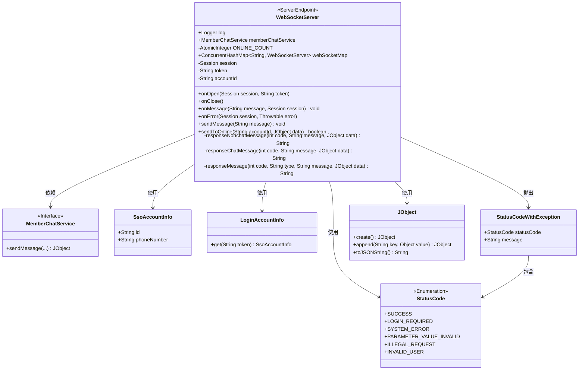
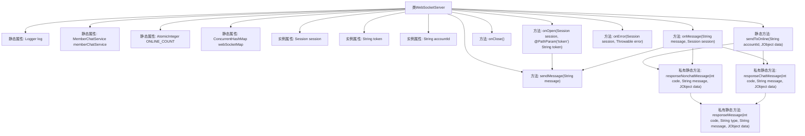
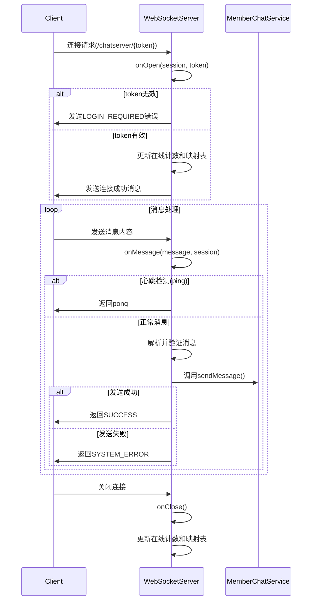

# 基础信息

|      |      |
|------|------|
| 名称 | WebSocketServer |
| 编码语言 | .java |
| 代码路径 | WeFe/board/board-service/src/main/java/com/welab/wefe/board/service/service/WebSocketServer.java |
| 包名 | com.welab.wefe.board.service.service |
| 依赖项 | ['com.alibaba.fastjson.JSON', 'com.alibaba.fastjson.JSONObject', 'com.welab.wefe.board.service.base.LoginAccountInfo', 'com.welab.wefe.board.service.constant.ChatConstant', 'com.welab.wefe.common.StatusCode', 'com.welab.wefe.common.exception.StatusCodeWithException', 'com.welab.wefe.common.util.JObject', 'com.welab.wefe.common.util.StringUtil', 'com.welab.wefe.common.web.service.account.SsoAccountInfo', 'org.slf4j.Logger', 'org.slf4j.LoggerFactory', 'org.springframework.stereotype.Component', 'javax.websocket', 'javax.websocket.server.PathParam', 'javax.websocket.server.ServerEndpoint', 'java.io.IOException', 'java.util.concurrent.ConcurrentHashMap', 'java.util.concurrent.atomic.AtomicInteger'] |
| 概述说明 | WebSocket服务器端点，处理用户连接、消息收发及在线状态管理，支持心跳检测和消息推送。 |

# 说明

该代码实现了一个基于WebSocket的聊天服务器端点，包含连接管理、消息处理和状态推送功能。主要功能包括：通过token验证用户身份，维护在线用户列表和连接数统计；处理客户端发送的消息，支持心跳检测（ping/pong）和消息转发；提供主动推送消息给在线用户的能力；封装了标准响应消息格式，包含状态码、类型和业务数据。系统使用并发容器管理连接，记录详细日志，并处理各种异常情况。

# 类列表 Class Summary

| 名称   | 类型  | 说明 |
|-------|------|-------------|
| WebSocketServer | class | WebSocket服务器类，处理用户连接、消息收发及在线状态管理，支持心跳检测和消息推送。 |

## 类 WebSocketServer

|      |      |
|------|------|
| 访问范围 | @ServerEndpoint("/chatserver/{token}");@Component;public |
| 类型 | class |
| 名称 | WebSocketServer |
| 说明 | WebSocket服务器类，处理用户连接、消息收发及在线状态管理，支持心跳检测和消息推送。 |

### UML类图

这段代码实现了一个基于WebSocket的聊天服务器，主要功能包括：管理客户端连接（通过token验证）、维护在线用户列表、处理消息收发（支持心跳检测和业务消息）以及错误处理。核心类WebSocketServer使用注解实现WebSocket端点，通过静态变量维护在线状态，依赖MemberChatService处理业务逻辑，并与前端通过JSON格式交互。系统通过ConcurrentHashMap管理活跃连接，提供消息推送和状态码响应机制，具有完整的异常处理流程。

### 内部方法调用关系图

该流程图展示了WebSocketServer类的结构和主要方法调用关系，包含静态属性、实例属性和关键方法。时序图描述了客户端连接、消息处理和断开连接的完整流程，包括token验证、心跳检测、消息转发等关键交互步骤。这是一个典型的WebSocket服务端实现，用于处理实时聊天场景中的连接管理、消息路由和状态维护。

### 字段列表 Field List

| 名称  | 类型  | 说明 |
|-------|-------|------|
| log = LoggerFactory.getLogger(WebSocketServer.class) | Logger | 定义静态日志记录器，关联WebSocketServer类。 |
| webSocketMap = new ConcurrentHashMap<>() | ConcurrentHashMap<String, WebSocketServer> | 静态并发哈希表，存储字符串到WebSocket服务器的映射，线程安全。 |
| session | Session | 私有会话对象session |
| memberChatService | MemberChatService | 静态成员变量memberChatService，类型为MemberChatService。 |
| token = "" | String | 私有字符串变量token初始化为空字符串。 |
| accountId | String | 私有字符串类型变量accountId，用于存储账户ID。 |
| ONLINE_COUNT = new AtomicInteger(0) | AtomicInteger | 定义一个私有静态不可变原子整型变量ONLINE_COUNT，初始值为0，用于线程安全地统计在线数量。 |

### 方法列表

| 名称  | 类型  | 说明 |
|-------|-------|------|
| onOpen | void | 方法处理WebSocket连接：验证token有效性，无效则返回错误；有效则记录用户信息并更新在线人数，最后返回连接成功或错误信息。 |
| sendToOnline | boolean | 方法sendToOnline检查用户是否在线，若在线则发送消息并返回成功，否则记录日志并返回失败。异常时记录错误日志。 |
| responseNonchatMessage | String | 这是一个私有静态方法，用于生成非聊天消息的响应。它接收状态码、消息和JSON数据作为参数，调用responseMessage方法返回格式化响应。 |
| onClose | void | 方法`onClose`处理WebSocket关闭：若`accountId`非空且存在于`webSocketMap`中，则移除并减少在线计数；记录用户退出信息及当前在线人数。 |
| responseChatMessage | String | 该方法用于生成聊天消息响应，接收状态码、消息内容和数据对象，调用通用响应方法返回格式化结果。 |
| responseMessage | String | 静态方法生成JSON响应，包含状态码、类型、消息和数据（为空时初始化）。返回拼接后的JSON字符串。 |
| onError | void | Java方法：处理会话错误，记录错误日志，包含令牌和异常信息。 |
| sendMessage | void | Java方法：通过WebSocket会话发送文本消息，可能抛出IO异常。 |
| onMessage | void | 处理WebSocket消息：验证token和消息有效性，解析JSON数据，检查发送/接收方信息，发送消息并返回结果或错误。 |

