# 基础信息

|      |      |
|------|------|
| 名称 | service |
| 编码语言 | .java |
| 代码路径 | WeFe/board/board-service/src/main/java/com/welab/wefe/board/service/service |
| 包名 | docs.board.board-service.src.main.java.com.welab.wefe.board.service.service |
| 概述说明 | AccountService提供账户管理功能，依赖多个服务，支持查询、筛选、登录等操作。GlobalConfigService管理全局配置，确保安全性和一致性。ProjectService管理项目全生命周期，包括成员、数据集和状态。GatewayService处理消息同步和网关通信。DataResourceService统一管理各类数据集CRUD操作。Fusion模块处理数据融合任务生命周期。ModelExport实现多语言模型代码生成。Checkpoint模块检查服务健康状态。其他服务包括消息、聊天、任务、证书等管理功能。 |

# 说明

## 概述  
该模块是联邦学习平台BoardService的核心服务集合，主要职责为统一管理账户、数据资源、项目流程和多方安全计算任务，类似企业级AI协作中枢。接口规范涵盖CRUD操作（如AccountService）、健康检查（ServiceCheckService）、模型导出（ModelExportService）等，形成完整的RESTful/JNI/gRPC混合调用体系。  

关键数据结构包括抽象基类（AbstractManifest）、枚举类型（MainfestType）、任务模型（FusionResultExportProgress）及跨节点通信对象（GatewayOnlineCheckResult）。外部依赖涉及GatewayService、GlobalConfigService、PersistentStorage等基础设施，以及RSA加密、PMML 4.3等标准组件。例如数据融合模块依赖WEFE_DATA库存储中间结果，模型导出服务支持14种语言代码生成。  

## 主要业务场景  
模块支持三类典型流程：1）数据生命周期管理（上传→解析→存储），例如ImageDataSetParser转换图像为PASCAL VOC格式；2）联邦任务协同（创建→审核→执行），如FusionTaskService协调RSA-PSI算法跨节点对齐；3）项目全周期管控（成员/流程/数据集），类似工作流引擎，ProjectService通过事务管理成员状态变更。  

功能完整性体现在多维度支持：账户SSO登录（AccountService）、健康检查点模式（AbstractCheckpoint）、实时通信（WebSocketServer）等。交互模式包含服务调用（如DataResourceService更新计数）、异步任务（FlowJobService进度回调）和网关同步（GatewayService消息广播）。例如XGBoost模型导出时动态选择语言适配器，聊天服务通过双工WebSocket维护在线状态。

### 包内部结构视图

```mermaid
graph TD
    service --> account
    service --> init
    service --> data_resource
    service --> checkpoint
    service --> globalconfig
    service --> verificationcode
    service --> fusion
    service --> modelexport
    service --> ProjectMemberService.java
    service --> FlowActionQueueService.java
    service --> TaskService.java
    service --> ProjectFlowNodeService.java
    service --> SystemInitializeService.java
    service --> FlowTemplateService.java
    service --> ProjectFlowService.java
    service --> ProjectDataSetService.java
    service --> ServingService.java
    service --> AbstractService.java
    service --> EmailService.java
    service --> PartnerConfigService.java
    service --> GatewayService.java
    service --> ChatUnreadMessageService.java
    service --> DataSetColumnService.java
    service --> MessageService.java
    service --> ChatLastAccountService.java
    service --> ModelOotRecordService.java
    service --> ProjectService.java
    service --> MemberChatService.java
    service --> BlacklistService.java
    service --> JobService.java
    service --> TaskResultService.java
    service --> DataSetStorageService.java
    service --> CertOperationService.java
    service --> FlowJobService.java
    service --> ServiceCheckService.java
    service --> CacheObjects.java
    service --> PrivacyDatabaseEncryptService.java
    service --> TaskProgressService.java
    service --> ProjectDataSetAuditService.java
    service --> FeatureDataOutputInfoService.java
    service --> DataSourceService.java
    service --> JobMemberService.java
    service --> BaseGatewayService.java
    service --> WebSocketServer.java
    service --> OperationLogService.java
    service --> ProjectFlowJobService.java
    service --> ProjectMemberAuditService.java

    account --> AccountService.java
    init --> MainfestType.java
    init --> AbstractManifest.java
    data_resource --> table_data_set
    data_resource --> bloom_filter
    data_resource --> add
    data_resource --> image_data_set
    data_resource --> DataResourceUploadTaskService.java
    data_resource --> AbstractDataResourceService.java
    data_resource --> DataResourceService.java
    table_data_set --> TableDataSetService.java
    bloom_filter --> BloomFilterTaskService.java
    bloom_filter --> BloomFilterStorageService.java
    bloom_filter --> BloomFilterService.java
    bloom_filter --> BloomFilterColumnService.java
    add --> BloomFilterAddServiceDataRowConsumer.java
    add --> TableDataSetAddServiceDataRowConsumer.java
    add --> ImageDataSetAddService.java
    add --> BloomFilterAddService.java
    add --> TableDataSetAddService.java
    add --> AbstractDataResourceAddService.java
    image_data_set --> data_set_parser
    image_data_set --> ImageDataSetSampleService.java
    image_data_set --> ImageDataSetService.java
    data_set_parser --> AbstractImageDataSetParser.java
    data_set_parser --> DetectionImageDataSetParser.java
    data_set_parser --> ClassifyImageDataSetParser.java
    checkpoint --> UnionConnectionCheckpoint.java
    checkpoint --> GatewayInternetCheckpoint.java
    checkpoint --> GatewayIntranetCheckpoint.java
    checkpoint --> StorageCheckpoint.java
    checkpoint --> FlowCheckpoint.java
    globalconfig --> GlobalConfigService.java
    globalconfig --> BaseGlobalConfigService.java
    verificationcode --> VerificationCodeService.java
    fusion --> ExportProgressService.java
    fusion --> FieldInfoService.java
    fusion --> CallbackService.java
    fusion --> FusionResultStorageService.java
    fusion --> FusionTaskService.java
    fusion --> ThirdPartyService.java
    fusion --> FusionResultService.java
    modelexport --> XgboostJavaLanguage.java
    modelexport --> LogisticRegressionJavaScriptLanguage.java
    modelexport --> Node.java
    modelexport --> LogisticRegressionLanguageSelector.java
    modelexport --> XgboostPmmlLanguage.java
    modelexport --> XgboostPythonLanguage.java
    modelexport --> BaseXgboostLanguage.java
    modelexport --> XgboostCSharpLanguage.java
    modelexport --> XgboostHaskellLanguage.java
    modelexport --> XgboostRLanguage.java
    modelexport --> LogisticRegressionPythonLanguage.java
    modelexport --> ModelExportService.java
    modelexport --> LogisticRegressionModelExportService.java
    modelexport --> XgboostRubyLanguage.java
    modelexport --> BaseLogisticRegressionLanguage.java
    modelexport --> LogisticRegressionRubyLanguage.java
    modelexport --> LogisticRegressionCSharpLanguage.java
    modelexport --> LogisticRegressionRLanguage.java
    modelexport --> XgboostVisualBasicLanguage.java
    modelexport --> XgboostPowerShellLanguage.java
    modelexport --> LogisticRegressionCLanguage.java
    modelexport --> LogisticRegressionVisualBasicLanguage.java
    modelexport --> LogisticRegressionGoLanguage.java
    modelexport --> XgboostLanguageSelector.java
    modelexport --> XgboostDartLanguage.java
    modelexport --> XgboostPhpLanguage.java
    modelexport --> LogisticRegressionJavaLanguage.java
    modelexport --> LogisticRegressionPowerShellLanguage.java
    modelexport --> XgboostJavaScriptLanguage.java
    modelexport --> LogisticRegressionHaskellLanguage.java
    modelexport --> LogisticRegressionPmmlLanguage.java
    modelexport --> XgboostModelExportService.java
    modelexport --> XgboostGoLanguage.java
    modelexport --> LogisticRegressionPhpLanguage.java
    modelexport --> XgboostCLanguage.java
    modelexport --> LogisticRegressionDartLanguage.java
```

该流程图展示了WeFe项目中board-service模块的完整服务层结构，包含12个主要服务目录和50多个具体服务类文件。核心结构以service为根节点，向下延伸出account、data_resource、modelexport等关键子模块，其中data_resource模块进一步细分为table_data_set、bloom_filter等数据处理组件，modelexport模块则包含Xgboost和LogisticRegression两种机器学习模型的多语言导出实现。整体呈现了清晰的层级关系和模块化设计。

# 文件列表

| 名称   | 类型  | 说明 |
|-------|------|-------------|
| [ProjectMemberService.java](ProjectMemberService.md) | file | ProjectMemberService类用于管理项目成员，提供添加成员、查询成员、更新成员状态等功能，支持不同角色（如promoter和provider）的成员操作，并处理审核状态和消息通知。 |
| [FlowActionQueueService.java](FlowActionQueueService.md) | file | FlowActionQueueService提供运行和停止任务功能，根据项目类型设置参数，并通过notifyFlow方法将操作消息发送至流服务。 |
| [TaskService.java](TaskService.md) | file | TaskService是一个服务类，提供任务管理功能，包括查询任务历史、更新任务、查找同分支节点等。依赖多个服务如TaskRepository、ProjectService等，支持网格搜索模型结果查询、DataIO任务配置获取等操作。 |
| [ProjectFlowNodeService.java](ProjectFlowNodeService.md) | file | ProjectFlowNodeService类提供流程节点管理功能，包括查询节点、更新节点参数、检查特定组件存在性等操作。依赖多个服务如ProjectFlowNodeRepository、GatewayService等，支持事务处理和参数同步。 |
| [SystemInitializeService.java](SystemInitializeService.md) | file | SystemInitializeService提供系统初始化、成员信息同步及更新功能，包括数据资源同步、密钥更新和成员信息管理，仅超级管理员可操作。 |
| [FlowTemplateService.java](FlowTemplateService.md) | file | FlowTemplateService提供流程模板的增删改查功能，包括保存、查询、按ID查找及添加模板，使用FlowTemplateRepository操作数据库。 |
| [ProjectFlowService.java](ProjectFlowService.md) | file | ProjectFlowService提供项目流程管理功能，包括创建、删除、复制流程，更新流程信息和状态，处理节点参数及网格搜索任务，支持OOT流程和模型评估。 |
| [ProjectDataSetService.java](ProjectDataSetService.md) | file | ProjectDataSetService提供项目数据集管理功能，包括查询衍生数据集详情、列表、原始数据集列表，支持按条件筛选和更新数据集。主要依赖TableDataSetService等组件处理数据资源。 |
| [ServingService.java](ServingService.md) | file | ServingService类提供模型同步与全局配置更新功能，包含成员信息刷新、RSA密钥推送、模型参数构建及请求处理逻辑，支持联合训练任务协调。 |
| [AbstractService.java](AbstractService.md) | file | 抽象服务类包含日志工具和四个自动注入的服务组件，提供异常日志记录方法。 |
| [EmailService.java](EmailService.md) | file | EmailService类提供邮件发送功能，支持批量发送审批通知邮件，处理无效地址重试，并记录发送失败信息。依赖全局配置获取SMTP参数，包含超时和编码设置。 |
| [PartnerConfigService.java](PartnerConfigService.md) | file | PartnerConfigService服务类，提供添加、删除和查询合作伙伴配置功能。添加时校验成员ID和网关地址，操作后通知网关更新缓存。查询支持分页和条件过滤。 |
| [GatewayService.java](GatewayService.md) | file | GatewayService类提供消息同步功能，支持向项目成员或任务成员广播消息，包含黑名单检查、通信状态验证及多种缓存刷新操作。 |
| [ChatUnreadMessageService.java](ChatUnreadMessageService.md) | file | ChatUnreadMessageService服务类，通过chatUnreadMessageRepository操作未读消息数据。addChatUnreadMessage方法新增或累加未读消息数，delete方法删除指定发送接收账号的未读消息记录。 |
| [DataSetColumnService.java](DataSetColumnService.md) | file | DataSetColumnService提供数据集特征列表查询、分页查询和更新功能。通过gateway调用其他成员特征列表，检查数据集状态后返回特征数据。支持按数据集ID分页查询字段，并允许更新数据集字段信息。 |
| [MessageService.java](MessageService.md) | file | MessageService提供消息管理功能，包括查询、标记已读、添加消息及处理待办事项。支持多种消息类型和事件，如申请数据资源和加入项目，并处理相关审核流程。 |
| [ChatLastAccountService.java](ChatLastAccountService.md) | file | ChatLastAccountService提供查询、添加和删除最近聊天账号功能，并关联未读消息数。查询时按更新时间排序，添加时更新或新建记录，删除时根据账号ID和联系人ID操作。包含刷新登录用户缓存逻辑。 |
| [ModelOotRecordService.java](ModelOotRecordService.md) | file | ModelOotRecordService提供保存和查询功能，支持按流程ID或任务ID与节点ID组合查询模型评分验证记录。 |
| [ProjectService.java](ProjectService.md) | file | ProjectService类是一个项目管理系统服务类，主要功能包括：创建项目、管理项目成员、数据集审核、项目状态更新、数据同步等。核心方法有addProject（新增项目）、auditProject（审核项目）、removeMember（移除成员）、addProjectDataSet（添加数据集）等。支持事务处理、权限校验、数据同步和消息通知。 |
| [MemberChatService.java](MemberChatService.md) | file | MemberChatService处理成员间消息发送、接收、重发及状态更新。包含发送消息、查询聊天详情、处理未读消息等功能，通过gatewayService转发消息，支持事务回滚。 |
| [BlacklistService.java](BlacklistService.md) | file | BlacklistService提供黑名单管理功能，包括分页查询黑名单、添加成员到黑名单、从黑名单删除成员及查询黑名单成员信息。操作后更新缓存并通知网关刷新。 |
| [JobService.java](JobService.md) | file | JobService类提供任务管理功能，包括更新任务状态、按ID查询任务、创建流程图及设置缓存结果。依赖多个Repository和服务类，支持任务状态变更、缓存检查及运行中任务计数。 |
| [TaskResultService.java](TaskResultService.md) | file | TaskResultService提供任务结果查询与处理功能，包括按条件查找结果、解析分箱结果、获取特征列表及统计信息，支持特征选择、缺失率、CV/IV计算等功能。 |
| [DataSetStorageService.java](DataSetStorageService.md) | file | DataSetStorageService提供数据集存储管理功能，包括初始化存储、检查键存在、删除数据集、保存和读取数据行、分页查询及数据预览等操作，支持ClickHouse存储类型。 |
| [CertOperationService.java](CertOperationService.md) | file | CertOperationService类提供证书管理功能，包括更新状态、保存证书信息、导出证书、查询证书和私钥、创建证书请求等操作。 |
| [FlowJobService.java](FlowJobService.md) | file | FlowJobService提供流作业管理功能：分页查询执行历史(query)、获取作业详情(detail)和进度(getProgress)。依赖多个服务与仓库，通过条件筛选、状态判断返回对应数据模型。 |
| [ServiceCheckService.java](ServiceCheckService.md) | file | ServiceCheckService提供成员服务可用性检查功能，包括本地和远程服务状态查询，以及网关连通性检测。支持BoardService、UnionService、GatewayService和FlowService四种服务类型检查。 |
| [CacheObjects.java](CacheObjects.md) | file | CacheObjects类管理缓存数据，包括成员信息、账户映射、数据资源标签和黑名单。提供刷新和获取方法，确保数据一致性。关键功能包括成员验证、标签统计和账户管理。 |
| [PrivacyDatabaseEncryptService.java](PrivacyDatabaseEncryptService.md) | file | 该服务类用于加密数据库中的隐私数据，包括账户、验证码、全局配置和数据源信息，通过更新各模型的更新时间并保存实现加密操作。 |
| [TaskProgressService.java](TaskProgressService.md) | file | TaskProgressService通过taskProgressRepository根据taskId和role查询TaskProgressMysqlModel数据。 |
| [ProjectDataSetAuditService.java](ProjectDataSetAuditService.md) | file | ProjectDataSetAuditService类用于审核数据集，检查项目状态、成员权限，更新数据集审核状态，并同步消息和网关数据。 |
| [FeatureDataOutputInfoService.java](FeatureDataOutputInfoService.md) | file | FeatureDataOutputInfoService类继承AbstractService，包含任务查询和结果封装功能。通过JobRepository等依赖实现任务模糊匹配，wrapModelResult方法封装模型元数据和参数。 |
| [DataSourceService.java](DataSourceService.md) | file | DataSourceService提供数据源管理功能，包括添加（校验名称唯一性、测试连接）、删除和分页查询数据源，以及测试数据库连接。 |
| [JobMemberService.java](JobMemberService.md) | file | JobMemberService提供任务成员查询功能，包括按任务ID获取成员列表、排除仲裁者、条件组合查询及本地任务判断。 |
| [BaseGatewayService.java](BaseGatewayService.md) | file | BaseGatewayService类提供网关消息发送功能，支持向自身或对方网关发送消息，处理权限验证、异常处理和GRPC通信。包含地址校验、元数据构建和SSL通道创建等方法。 |
| [WebSocketServer.java](WebSocketServer.md) | file | WebSocket服务器端点，处理用户连接、消息收发及在线状态管理，支持心跳检测和消息推送。 |
| [OperationLogService.java](OperationLogService.md) | file | OperationLogService提供日志查询功能，支持按接口、操作者ID和时间范围筛选，并返回分页结果。 |
| [ProjectFlowJobService.java](ProjectFlowJobService.md) | file | ProjectFlowJobService是一个服务类，负责管理项目流程任务的启动、恢复和停止。它通过依赖注入多个服务类来处理任务、数据集、成员等操作，并包含事务处理和同步机制。主要功能包括启动流程、设置任务配置、检查任务有效性、复制任务信息等。 |
| [ProjectMemberAuditService.java](ProjectMemberAuditService.md) | file | ProjectMemberAuditService提供项目成员审核功能，包括查询审核记录、检查成员是否全部同意、审核新成员等操作，涉及项目、成员和数据集的增删改查。 |
| [modelexport](modelexport/_module.md) | package | 多个Java类实现XGBoost和逻辑回归模型的多语言代码生成，包括Java、Python、C#、R等，支持二分类和多分类，提供节点处理、方法签名生成和结果计算功能。 |
| [fusion](fusion/_module.md) | package | ExportProgressService管理导出进度，与数据库交互。FieldInfoService处理字段信息，提供查询和保存功能。CallbackService处理回调逻辑，支持审计和RSA-PSI算法。FusionResultStorageService管理数据集存储，支持增删查改。FusionTaskService管理融合任务，处理状态更新和算法逻辑。ThirdPartyService通过网关与其他成员交互。FusionResultService提供数据导出功能，支持多线程处理。 |
| [verificationcode](verificationcode/_module.md) | package | VerificationCodeService类提供验证码服务，包括手机号校验、邮件/SMS配置检查、验证码发送记录保存及参数构建功能。 |
| [globalconfig](globalconfig/_module.md) | package | GlobalConfigService继承BaseGlobalConfigService，管理全局配置，依赖多个服务，功能包括更新配置、IP白名单管理和配置初始化。BaseGlobalConfigService提供配置增删改查，支持批量操作、类型转换和字段加密，确保操作可追溯。 |
| [checkpoint](checkpoint/_module.md) | package | UnionConnectionCheckpoint获取联合连接URL。GatewayInternetCheckpoint检查公网连通性。GatewayIntranetCheckpoint检查内网连通性。StorageCheckpoint测试存储访问。FlowCheckpoint检查flow服务连通性。 |
| [data_resource](data_resource/_module.md) | package | TableDataSetService管理表格数据集，支持文件上传、删除、查询等功能。BloomFilter模块处理任务状态、数据存储及列配置。数据资源添加模块处理表格、图像等数据导入。图像数据集模块管理分类/检测任务数据。上传任务服务管理上传进度和状态。DataResourceService管理各类数据集的使用计数和查询。 |
| [init](init/_module.md) | package | MainfestType枚举定义三种类型：list、data_set、project。AbstractManifest是基类，含type字段。用于区分清单类型。 |
| [account](account/_module.md) | package | AccountService提供账户管理功能，包括查询所有账户、分页查询、检查手机号是否存在、SSO登录及更新UI配置。支持敏感信息过滤和跨成员查询。 |

