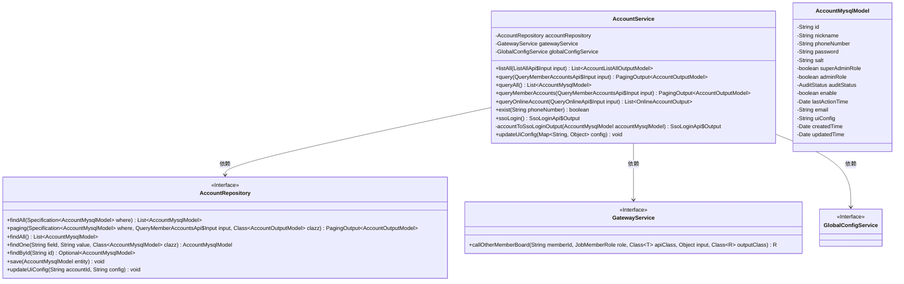
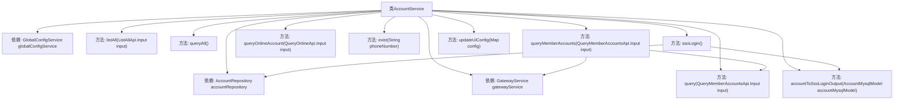

# 基础信息

|      |      |
|------|------|
| 名称 | AccountService |
| 编码语言 | .java |
| 代码路径 | WeFe/board/board-service/src/main/java/com/welab/wefe/board/service/service/account/AccountService.java |
| 包名 | com.welab.wefe.board.service.service.account |
| 依赖项 | ['com.alibaba.fastjson.JSON', 'com.welab.wefe.board.service.api.account.ListAllApi', 'com.welab.wefe.board.service.api.account.QueryMemberAccountsApi', 'com.welab.wefe.board.service.api.account.QueryOnlineApi', 'com.welab.wefe.board.service.api.account.SsoLoginApi', 'com.welab.wefe.board.service.base.LoginAccountInfo', 'com.welab.wefe.board.service.database.entity.AccountMysqlModel', 'com.welab.wefe.board.service.database.repository.AccountRepository', 'com.welab.wefe.board.service.dto.base.PagingOutput', 'com.welab.wefe.board.service.dto.entity.AccountListAllOutputModel', 'com.welab.wefe.board.service.dto.entity.AccountOutputModel', 'com.welab.wefe.board.service.dto.vo.OnlineAccountOutput', 'com.welab.wefe.board.service.service.CacheObjects', 'com.welab.wefe.board.service.service.GatewayService', 'com.welab.wefe.board.service.service.WebSocketServer', 'com.welab.wefe.board.service.service.globalconfig.GlobalConfigService', 'com.welab.wefe.common.SecurityUtil', 'com.welab.wefe.common.StatusCode', 'com.welab.wefe.common.data.mysql.Where', 'com.welab.wefe.common.data.mysql.enums.OrderBy', 'com.welab.wefe.common.exception.StatusCodeWithException', 'com.welab.wefe.common.util.JObject', 'com.welab.wefe.common.util.Sha1', 'com.welab.wefe.common.util.StringUtil', 'com.welab.wefe.common.web.service.account.SsoAccountInfo', 'com.welab.wefe.common.web.util.CurrentAccountUtil', 'com.welab.wefe.common.web.util.DatabaseEncryptUtil', 'com.welab.wefe.common.web.util.ModelMapper', 'com.welab.wefe.common.wefe.enums.AuditStatus', 'com.welab.wefe.common.wefe.enums.JobMemberRole', 'org.apache.commons.collections4.CollectionUtils', 'org.springframework.beans.factory.annotation.Autowired', 'org.springframework.data.jpa.domain.Specification', 'org.springframework.stereotype.Service', 'java.util'] |
| 概述说明 | AccountService提供账户管理功能，包括查询所有账户、分页查询、检查手机号是否存在、SSO登录及更新UI配置。支持敏感信息过滤和跨成员查询。 |

# 说明

AccountService是一个服务类，提供账户管理功能。它依赖AccountRepository、GatewayService和GlobalConfigService。主要功能包括：查询所有账户列表，支持按昵称筛选；分页查询账户，可按手机号、审核状态和昵称筛选；查询指定会员的账户信息，会过滤敏感数据；查询在线账户，支持按账户ID筛选；检查手机号是否存在；SSO登录处理，包括账户创建或更新；生成SSO登录输出信息；更新用户界面配置。服务涉及数据加密、缓存操作和跨会员网关调用。

# 类列表 Class Summary

| 名称   | 类型  | 说明 |
|-------|------|-------------|
| AccountService | class | AccountService提供账户管理功能，包括查询、分页、在线状态检查、SSO登录和UI配置更新。支持条件筛选、敏感信息过滤和跨成员数据访问。 |

## 类 AccountService

|      |      |
|------|------|
| 访问范围 | @Service;public |
| 类型 | class |
| 名称 | AccountService |
| 说明 | AccountService提供账户管理功能，包括查询、分页、在线状态检查、SSO登录和UI配置更新。支持条件筛选、敏感信息过滤和跨成员数据访问。 |

### UML类图

类图描述：该图展示了AccountService及其依赖关系。AccountService通过AccountRepository进行数据持久化操作，依赖GatewayService进行跨服务调用，并使用GlobalConfigService获取全局配置。核心功能包括账户查询、分页处理、在线状态检查、SSO登录等，涉及多种输入输出模型转换和敏感信息过滤。

### 内部方法调用关系图

这段代码是AccountService类的实现，主要处理账户相关的业务逻辑。它包含多个方法，如查询账户列表、分页查询账户、查询在线账户、检查手机号是否存在、SSO登录等。类中注入了AccountRepository、GatewayService和GlobalConfigService等依赖，通过这些依赖与数据库和外部服务交互。方法之间有一定的调用关系，如queryMemberAccounts会调用query方法或通过gatewayService调用其他服务。整体流程清晰，涵盖了账户管理的核心功能。

### 字段列表 Field List

| 名称  | 类型  | 说明 |
|-------|-------|------|
| gatewayService | GatewayService | 使用@Autowired自动注入GatewayService实例。 |
| accountRepository | AccountRepository | 使用@Autowired自动注入AccountRepository实例。 |
| globalConfigService | GlobalConfigService | 使用@Autowired自动注入GlobalConfigService实例。 |

### 方法列表

| 名称  | 类型  | 说明 |
|-------|-------|------|
| queryOnlineAccount | List<OnlineAccountOutput> | 查询在线账户方法，根据输入参数检查成员ID或网关来源，直接返回本地在线账户列表；否则通过网关服务调用其他成员数据，异常时抛出系统错误。 |
| queryAll | List<AccountMysqlModel> | 查询所有账户数据并返回列表。 |
| query | PagingOutput<AccountOutputModel> | 该方法根据输入条件查询会员账户，支持模糊匹配手机号、昵称和精确匹配审核状态，并按创建时间降序分页返回结果。 |
| queryMemberAccounts | PagingOutput<AccountOutputModel> | 方法查询会员账户信息，若为当前会员则直接查询，否则调用网关服务。处理结果时移除敏感信息并返回分页数据。 |
| exist | boolean | 检查手机号是否存在：通过加密查询数据库，返回是否存在对应账户记录。 |
| listAll | List<AccountListAllOutputModel> | 该方法根据输入参数中的昵称筛选账户，查询数据库并返回映射后的输出模型列表。 |
| ssoLogin | SsoLoginApi.Output | 方法ssoLogin处理SSO登录：若账户不存在则创建新账户并设置随机密码和盐值，赋予管理员权限；若存在则更新昵称、手机号和邮箱信息。最后缓存账户信息并返回登录结果。 |
| accountToSsoLoginOutput | SsoLoginApi.Output | 将AccountMysqlModel转换为SsoLoginApi.Output，设置ID、token、手机号、昵称、角色、UI配置及会员信息。 |
| updateUiConfig | void | 更新UI配置方法：调用账户仓库更新当前账户ID对应的UI配置，参数为JSON字符串化的配置映射。 |

