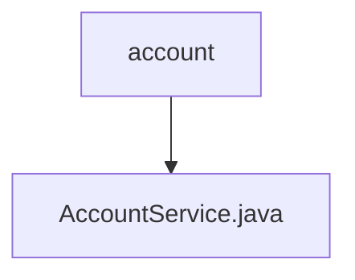

# 基础信息

|      |      |
|------|------|
| 名称 | account |
| 编码语言 | .java |
| 代码路径 | WeFe/board/board-service/src/main/java/com/welab/wefe/board/service/service/account |
| 包名 | docs.board.board-service.src.main.java.com.welab.wefe.board.service.service.account |
| 概述说明 | AccountService提供账户管理功能，包括查询所有账户、分页查询、检查手机号是否存在、SSO登录及更新UI配置。支持敏感信息过滤和跨成员查询。 |

# 说明

AccountService是一个服务类，提供账户管理功能。它依赖AccountRepository、GatewayService和GlobalConfigService。主要功能包括：查询所有账户列表，支持按昵称筛选；分页查询账户，可按手机号、审核状态和昵称筛选；查询指定会员的账户信息，会过滤敏感数据；查询在线账户，支持按账户ID筛选；检查手机号是否存在；SSO登录处理，包括账户创建或更新；生成SSO登录输出信息；更新用户界面配置。服务涉及数据加密、缓存操作和跨会员网关调用。

### 包内部结构视图

该流程图展示了WeFe项目中account目录与AccountService.java文件的层级关系。account作为父目录包含AccountService.java服务类文件，体现了Java项目中典型的分层结构设计模式。这种结构有利于代码的组织和维护，符合常见的业务逻辑与数据访问分离原则。

# 文件列表

| 名称   | 类型  | 说明 |
|-------|------|-------------|
| [AccountService.java](AccountService.md) | file | AccountService提供账户管理功能，包括查询所有账户、分页查询、检查手机号是否存在、SSO登录及更新UI配置。支持敏感信息过滤和跨成员查询。 |

