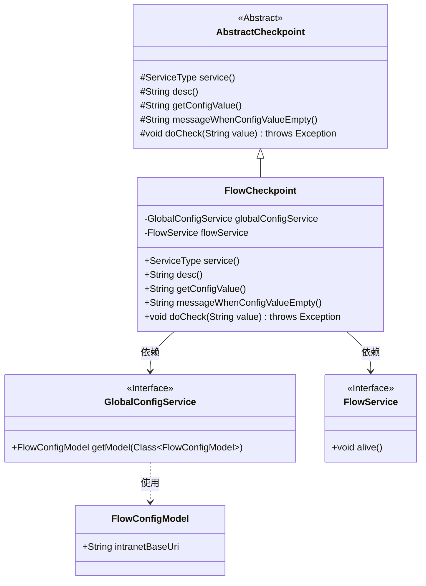
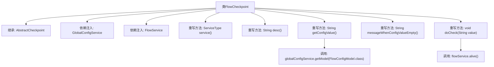

# 基础信息

|      |      |
|------|------|
| 名称 | FlowCheckpoint |
| 编码语言 | .java |
| 代码路径 | WeFe/board/board-service/src/main/java/com/welab/wefe/board/service/service/checkpoint/FlowCheckpoint.java |
| 包名 | com.welab.wefe.board.service.service.checkpoint |
| 依赖项 | ['com.welab.wefe.board.service.sdk.FlowService', 'com.welab.wefe.board.service.service.globalconfig.GlobalConfigService', 'com.welab.wefe.common.wefe.checkpoint.AbstractCheckpoint', 'com.welab.wefe.common.wefe.dto.global_config.FlowConfigModel', 'com.welab.wefe.common.wefe.enums.ServiceType', 'org.springframework.beans.factory.annotation.Autowired', 'org.springframework.stereotype.Service'] |
| 概述说明 | FlowCheckpoint类继承AbstractCheckpoint，检查Flow服务连通性，依赖GlobalConfigService和FlowService，配置缺失时提示设置内网地址。 |

# 说明

该代码定义了一个名为FlowCheckpoint的服务类，继承自AbstractCheckpoint。它通过注入GlobalConfigService和FlowService实现功能。主要职责是检查与flow服务的连通性，属于FlowService类型。通过获取FlowConfigModel配置检查内网地址是否设置，未设置时提示用户进行配置。实际检查操作通过调用flowService的alive方法完成。

# 类列表 Class Summary

| 名称   | 类型  | 说明 |
|-------|------|-------------|
| FlowCheckpoint | class | FlowCheckpoint类继承AbstractCheckpoint，用于检查flow服务连通性。通过globalConfigService获取配置，调用flowService.alive()进行检测。配置为空时提示设置内网地址。 |

## 类 FlowCheckpoint

|      |      |
|------|------|
| 访问范围 | @Service;public |
| 类型 | class |
| 名称 | FlowCheckpoint |
| 说明 | FlowCheckpoint类继承AbstractCheckpoint，用于检查flow服务连通性。通过globalConfigService获取配置，调用flowService.alive()进行检测。配置为空时提示设置内网地址。 |

### UML类图

这段类图展示了FlowCheckpoint继承自AbstractCheckpoint抽象类，并实现了其中的抽象方法。FlowCheckpoint依赖于GlobalConfigService和FlowService两个接口，其中GlobalConfigService接口使用FlowConfigModel数据模型。整体结构体现了Spring服务层的依赖注入和抽象类模板方法的设计模式，用于实现服务连通性检查功能。

### 内部方法调用关系图

这段代码是FlowCheckpoint类的实现，继承自AbstractCheckpoint抽象类，主要用于检查与flow服务的连通性。通过依赖注入GlobalConfigService和FlowService，重写了父类的多个方法，包括获取服务类型、描述信息、配置值、空配置提示信息以及执行检查的具体逻辑。在获取配置值时调用globalConfigService获取FlowConfigModel，执行检查时调用flowService的alive方法验证服务是否存活。整体流程清晰，职责明确，是一个典型的基础设施健康检查实现。

### 字段列表 Field List

| 名称  | 类型  | 说明 |
|-------|-------|------|
| flowService | FlowService | 使用@Autowired自动注入FlowService实例。 |
| globalConfigService | GlobalConfigService | 使用@Autowired自动注入GlobalConfigService实例。 |

### 方法列表

| 名称  | 类型  | 说明 |
|-------|-------|------|
| getConfigValue | String | 方法重写，获取FlowConfigModel配置值，若为空返回null，否则返回intranetBaseUri。 |
| desc | String | 检查与flow服务的连通性。 |
| service | ServiceType | 该方法重写父类方法，返回服务类型为FlowService。 |
| messageWhenConfigValueEmpty | String | 方法返回提示：需在全局设置的系统设置中配置flow内网地址。 |
| doCheck | void | 检查服务存活状态，调用flowService的alive方法。 |

