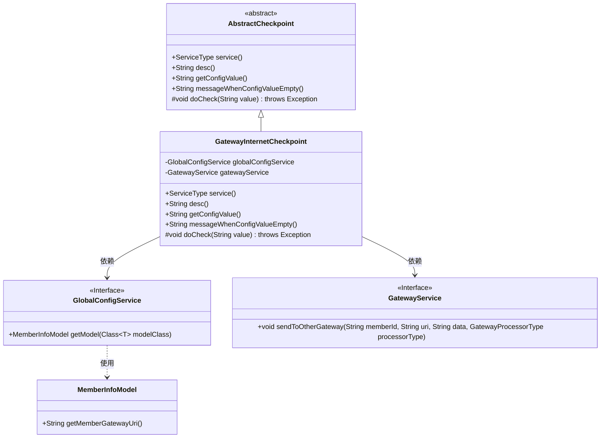
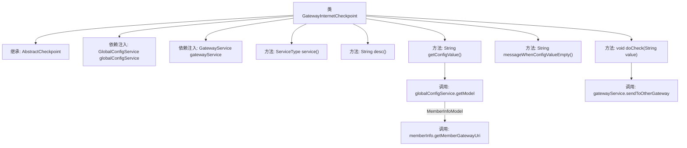

# 基础信息

|      |      |
|------|------|
| 名称 | GatewayInternetCheckpoint |
| 编码语言 | .java |
| 代码路径 | WeFe/board/board-service/src/main/java/com/welab/wefe/board/service/service/checkpoint/GatewayInternetCheckpoint.java |
| 包名 | com.welab.wefe.board.service.service.checkpoint |
| 依赖项 | ['com.welab.wefe.board.service.service.CacheObjects', 'com.welab.wefe.board.service.service.GatewayService', 'com.welab.wefe.board.service.service.globalconfig.GlobalConfigService', 'com.welab.wefe.common.util.JObject', 'com.welab.wefe.common.wefe.checkpoint.AbstractCheckpoint', 'com.welab.wefe.common.wefe.dto.global_config.MemberInfoModel', 'com.welab.wefe.common.wefe.enums.GatewayProcessorType', 'com.welab.wefe.common.wefe.enums.ServiceType', 'org.springframework.beans.factory.annotation.Autowired', 'org.springframework.stereotype.Service'] |
| 概述说明 | GatewayInternetCheckpoint类继承AbstractCheckpoint，用于检查公网连通性，通过globalConfigService获取配置，调用gatewayService发送请求。 |

# 说明

这是一个名为GatewayInternetCheckpoint的Spring服务类，继承自AbstractCheckpoint。它通过GatewayService和GlobalConfigService检查board与gateway服务在公网的连通性。主要功能包括：返回服务类型为GatewayService，描述为检查公网连通性；从全局配置获取成员网关地址，若未设置则提示需在成员设置中配置；实际检查时通过gatewayService向其他网关发送存活检测请求。

# 类列表 Class Summary

| 名称   | 类型  | 说明 |
|-------|------|-------------|
| GatewayInternetCheckpoint | class | GatewayInternetCheckpoint类继承AbstractCheckpoint，检查公网连通性，通过globalConfigService获取配置，调用gatewayService发送请求。 |

## 类 GatewayInternetCheckpoint

|      |      |
|------|------|
| 访问范围 | @Service;public |
| 类型 | class |
| 名称 | GatewayInternetCheckpoint |
| 说明 | GatewayInternetCheckpoint类继承AbstractCheckpoint，检查公网连通性，通过globalConfigService获取配置，调用gatewayService发送请求。 |

### UML类图

该图展示了GatewayInternetCheckpoint类继承自AbstractCheckpoint抽象类，并依赖GlobalConfigService和GatewayService两个接口。GlobalConfigService接口使用MemberInfoModel类获取网关URI。GatewayInternetCheckpoint实现了检查网关公网连通性的功能，通过调用gatewayService发送测试请求来验证连接。整体结构体现了Spring服务的依赖注入和抽象模板方法模式的应用。

### 内部方法调用关系图

这段代码展示了一个Spring服务类`GatewayInternetCheckpoint`，它继承自`AbstractCheckpoint`并实现了多个检查点相关的方法。主要功能包括获取网关配置信息、检查公网连通性，并通过`GatewayService`发送心跳检测。流程图清晰地呈现了类结构、依赖关系和方法调用链，特别是`getConfigValue()`通过`GlobalConfigService`获取成员网关URI，以及`doCheck()`调用网关服务发送检测请求的关键流程。

### 字段列表 Field List

| 名称  | 类型  | 说明 |
|-------|-------|------|
| globalConfigService | GlobalConfigService | 自动注入全局配置服务实例。 |
| gatewayService | GatewayService | 使用@Autowired自动注入GatewayService实例。 |

### 方法列表

| 名称  | 类型  | 说明 |
|-------|-------|------|
| getConfigValue | String | 该方法获取成员信息配置值：调用全局配置服务获取MemberInfoModel实例，若为空则返回null，否则返回其成员网关URI。 |
| desc | String | 检查board与gateway服务的公网连通性 |
| service | ServiceType | 重写service方法，返回GatewayService类型。 |
| messageWhenConfigValueEmpty | String | 当配置值为空时提示用户前往全局设置的成员设置中配置gateway通信地址。 |
| doCheck | void | 方法doCheck发送成员ID和值到其他网关，使用gatewayAliveProcessor处理。 |

