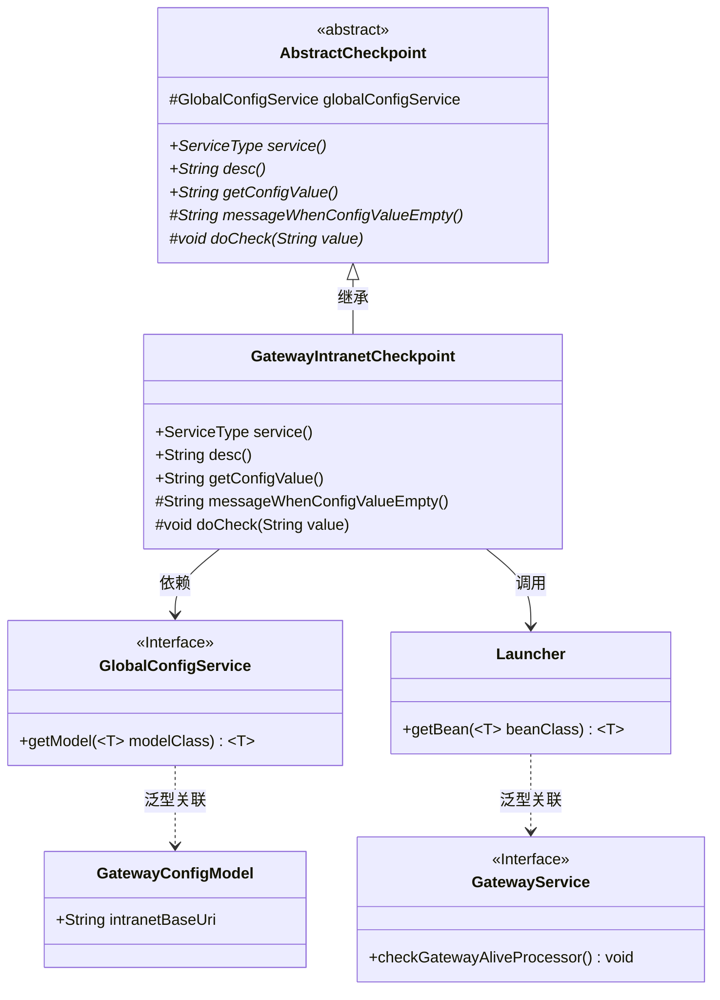
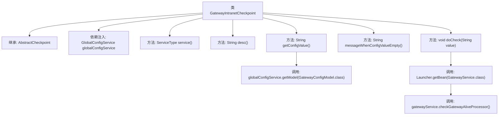

# 基础信息

|      |      |
|------|------|
| 名称 | GatewayIntranetCheckpoint |
| 编码语言 | .java |
| 代码路径 | WeFe/board/board-service/src/main/java/com/welab/wefe/board/service/service/checkpoint/GatewayIntranetCheckpoint.java |
| 包名 | com.welab.wefe.board.service.service.checkpoint |
| 依赖项 | ['com.welab.wefe.board.service.service.GatewayService', 'com.welab.wefe.board.service.service.globalconfig.GlobalConfigService', 'com.welab.wefe.common.web.Launcher', 'com.welab.wefe.common.wefe.checkpoint.AbstractCheckpoint', 'com.welab.wefe.common.wefe.dto.global_config.GatewayConfigModel', 'com.welab.wefe.common.wefe.enums.ServiceType', 'org.springframework.beans.factory.annotation.Autowired', 'org.springframework.stereotype.Service'] |
| 概述说明 | GatewayIntranetCheckpoint类继承AbstractCheckpoint，检查board与gateway内网连通性，依赖globalConfigService获取配置，未配置时提示设置内网地址，通过GatewayService检查存活状态。 |

# 说明

该代码定义了一个名为GatewayIntranetCheckpoint的服务类，继承自AbstractCheckpoint。它通过GlobalConfigService获取网关内网基础URI配置，用于检查board与gateway服务在内网的连通性。当配置值为空时提示用户设置网关内网地址。具体检查逻辑通过调用GatewayService的checkGatewayAliveProcessor方法实现。该检查点关联GatewayService服务类型。

# 类列表 Class Summary

| 名称   | 类型  | 说明 |
|-------|------|-------------|
| GatewayIntranetCheckpoint | class | GatewayIntranetCheckpoint类用于检查board与gateway服务的内网连通性，通过globalConfigService获取配置，若配置为空则提示设置内网地址，检查时调用GatewayService的存活检测方法。 |

## 类 GatewayIntranetCheckpoint

|      |      |
|------|------|
| 访问范围 | @Service;public |
| 类型 | class |
| 名称 | GatewayIntranetCheckpoint |
| 说明 | GatewayIntranetCheckpoint类用于检查board与gateway服务的内网连通性，通过globalConfigService获取配置，若配置为空则提示设置内网地址，检查时调用GatewayService的存活检测方法。 |

### UML类图

这段类图展示了网关内网检查点(GatewayIntranetCheckpoint)的核心结构及其关联关系。该类继承自抽象检查点(AbstractCheckpoint)，实现了服务类型描述、配置值获取等抽象方法。通过依赖GlobalConfigService获取网关配置模型(GatewayConfigModel)中的内网地址，并利用Launcher获取GatewayService实例进行连通性检查。整体设计体现了依赖注入和模板方法模式的应用，实现了可扩展的检查点机制。

### 内部方法调用关系图

该流程图展示了GatewayIntranetCheckpoint类的结构及其方法调用关系。该类继承自AbstractCheckpoint，通过GlobalConfigService获取配置信息，主要功能是检查board与gateway服务的内网连通性。核心方法doCheck通过Launcher获取GatewayService实例并调用其健康检查处理器，整个过程体现了配置获取、服务定位和健康检查的完整流程。

### 字段列表 Field List

| 名称  | 类型  | 说明 |
|-------|-------|------|
| globalConfigService | GlobalConfigService | 代码片段使用@Autowired注解自动注入GlobalConfigService实例，用于全局配置管理。 |

### 方法列表

| 名称  | 类型  | 说明 |
|-------|-------|------|
| messageWhenConfigValueEmpty | String | 方法重写，返回配置值为空时的提示信息，内容为需在全局设置的系统设置中配置gateway内网地址。 |
| getConfigValue | String | 重写方法getConfigValue，返回全局配置中GatewayConfigModel类的intranetBaseUri值。 |
| service | ServiceType | 该方法重写并返回服务类型为GatewayService。 |
| desc | String | 检查board与gateway服务的内网连通性。 |
| doCheck | void | 检查网关存活状态的代码片段，通过GatewayService调用checkGatewayAliveProcessor方法。 |

